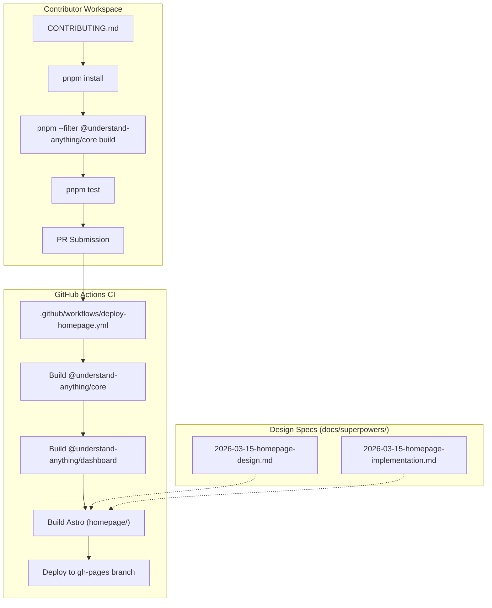

# Contributing & Community

<details>
<summary>Relevant source files</summary>

The following files were used as context for generating this wiki page:

- [.github/FUNDING.yml](.github/FUNDING.yml)
- [.github/ISSUE_TEMPLATE/bug_report.yml](.github/ISSUE_TEMPLATE/bug_report.yml)
- [.github/ISSUE_TEMPLATE/config.yml](.github/ISSUE_TEMPLATE/config.yml)
- [.github/ISSUE_TEMPLATE/feature_request.yml](.github/ISSUE_TEMPLATE/feature_request.yml)
- [.github/ISSUE_TEMPLATE/question.yml](.github/ISSUE_TEMPLATE/question.yml)
- [.github/PULL_REQUEST_TEMPLATE.md](.github/PULL_REQUEST_TEMPLATE.md)
- [.github/workflows/deploy-homepage.yml](.github/workflows/deploy-homepage.yml)
- [CODE_OF_CONDUCT.md](CODE_OF_CONDUCT.md)
- [CONTRIBUTING.md](CONTRIBUTING.md)
- [SECURITY.md](SECURITY.md)
- [docs/superpowers/plans/2026-03-14-phase1-implementation.md](docs/superpowers/plans/2026-03-14-phase1-implementation.md)
- [docs/superpowers/plans/2026-03-14-phase2-implementation.md](docs/superpowers/plans/2026-03-14-phase2-implementation.md)
- [docs/superpowers/plans/2026-03-14-phase3-implementation.md](docs/superpowers/plans/2026-03-14-phase3-implementation.md)
- [docs/superpowers/plans/2026-03-14-phase4-implementation.md](docs/superpowers/plans/2026-03-14-phase4-implementation.md)
- [docs/superpowers/plans/2026-03-15-homepage-implementation.md](docs/superpowers/plans/2026-03-15-homepage-implementation.md)
- [docs/superpowers/plans/2026-03-18-multi-platform-simple-implementation.md](docs/superpowers/plans/2026-03-18-multi-platform-simple-implementation.md)
- [docs/superpowers/plans/2026-03-21-language-agnostic-plan.md](docs/superpowers/plans/2026-03-21-language-agnostic-plan.md)
- [docs/superpowers/plans/2026-03-25-dashboard-robustness-impl.md](docs/superpowers/plans/2026-03-25-dashboard-robustness-impl.md)
- [docs/superpowers/plans/2026-03-25-dashboard-robustness-plan.md](docs/superpowers/plans/2026-03-25-dashboard-robustness-plan.md)
- [docs/superpowers/plans/2026-03-26-theme-system-implementation.md](docs/superpowers/plans/2026-03-26-theme-system-implementation.md)
- [docs/superpowers/plans/2026-03-27-token-reduction-impl.md](docs/superpowers/plans/2026-03-27-token-reduction-impl.md)
- [docs/superpowers/specs/2026-03-15-homepage-design.md](docs/superpowers/specs/2026-03-15-homepage-design.md)
- [homepage/public/images/overview-domain.gif](homepage/public/images/overview-domain.gif)
- [homepage/public/images/overview-structural.gif](homepage/public/images/overview-structural.gif)

</details>


This page outlines the contribution workflow, community standards, and the historical design documentation for the Understand Anything project. As a local-only static analysis tool, the project relies on a multi-agent pipeline and a shared core library to maintain its functionality across different platforms like Claude Code and Cursor.

## Contribution Workflow

The project follows a standard GitHub-based workflow utilizing `pnpm` workspaces for monorepo management [CONTRIBUTING.md:18-19]().

### Getting Started
To contribute, developers must have Node.js >= 22 and pnpm >= 10 installed [CONTRIBUTING.md:17-18](). The initial setup involves cloning the repository and building the core analysis engine before running tests [CONTRIBUTING.md:25-43]().

```bash
# Core build requirement for all contributions
pnpm install
pnpm --filter @understand-anything/core build
pnpm test
```

### Development Cycle
1.  **Branching**: Use prefixes like `feat/`, `fix/`, `docs/`, or `refactor/` [CONTRIBUTING.md:56-59]().
2.  **Testing**: New functionality requires Vitest suites placed in `__tests__` directories [CONTRIBUTING.md:115-116]().
3.  **Versioning**: If a user-visible behavior change is introduced, the version must be bumped in all five manifests as per project guidelines [.github/PULL_REQUEST_TEMPLATE.md:21-23]().
4.  **Linting**: Run `pnpm lint` to ensure adherence to the project's strict TypeScript mode and 2-space indentation style [CONTRIBUTING.md:76-164]().

### Pull Request (PR) Requirements
The PR template requires a summary of changes, links to related issues, and a description of concrete testing steps (e.g., verifying graph output on a specific large-scale repository) [.github/PULL_REQUEST_TEMPLATE.md:1-12]().

**Sources:** [CONTRIBUTING.md:1-178](), [.github/PULL_REQUEST_TEMPLATE.md:1-27]()

## Issue Management & Community Standards

The project uses structured GitHub Issue Templates to streamline communication and debugging.

### Issue Templates
*   **Bug Reports**: Requires the analyzed project's primary language, approximate file count, and platform (e.g., Claude Code CLI, Cursor) [.github/ISSUE_TEMPLATE/bug_report.yml:42-76]().
*   **Feature Requests**: Focused on describing "user pain" or workflow gaps rather than just technical implementation [.github/ISSUE_TEMPLATE/feature_request.yml:9-14]().
*   **Questions**: Directed toward GitHub Discussions for open-ended design proposals [.github/ISSUE_TEMPLATE/config.yml:6-8]().

### Code of Conduct
The community adheres to a "Be Respectful" policy, emphasizing constructive critique of ideas rather than individuals [CODE_OF_CONDUCT.md:9-11](). Sustained disruption or posting private information is strictly prohibited [CODE_OF_CONDUCT.md:16-17]().

### Security Model
Understand Anything is a **local-only** tool. It does not "phone home," and the dashboard's file-access endpoints are protected by an access token and a path allowlist derived from the graph [SECURITY.md:31-35]().

**Sources:** [.github/ISSUE_TEMPLATE/bug_report.yml:1-86](), [CODE_OF_CONDUCT.md:1-34](), [SECURITY.md:1-54]()

## Project Architecture & Design Docs

The `docs/superpowers/` directory contains design specifications and implementation plans that serve as the "source of truth" for past architectural decisions. These documents bridge the gap between high-level requirements and the specific code entities.

### Homepage & Deployment Infrastructure
The project homepage is built using Astro and deployed via GitHub Actions. The deployment pipeline builds the `@understand-anything/core` and `@understand-anything/dashboard` packages before merging the dashboard demo into the homepage output [.github/workflows/deploy-homepage.yml:43-54]().

**Natural Language to Code Entity Mapping: Homepage Pipeline**

| Concept | Code Entity / File Path | Role |
| :--- | :--- | :--- |
| Build Pipeline | `.github/workflows/deploy-homepage.yml` | Orchestrates multi-package build and GH Pages deployment |
| Design Token | `homepage/src/styles/global.css` | Defines `--accent`, `--surface`, and `--bg` matching dashboard [docs/superpowers/specs/2026-03-15-homepage-design.md:62-68]() |
| Layout System | `homepage/src/layouts/Layout.astro` | Base HTML wrapper with `IntersectionObserver` logic [docs/superpowers/plans/2026-03-15-homepage-implementation.md:218-246]() |
| Static Site Config | `homepage/astro.config.mjs` | Configures `site` and `base` URL for GitHub Pages [docs/superpowers/plans/2026-03-15-homepage-implementation.md:41-47]() |

### Implementation Reference Diagram
The following diagram illustrates how the contribution guidelines and design specs translate into the physical repository structure and the CI/CD flow.

**Contribution and Deployment Flow**


**Sources:** [.github/workflows/deploy-homepage.yml:1-69](), [docs/superpowers/specs/2026-03-15-homepage-design.md:1-84](), [docs/superpowers/plans/2026-03-15-homepage-implementation.md:1-250]()

## Funding & Recognition
The project is maintained by `Lum1104` and accepts funding via Patreon [.github/FUNDING.yml:1](). Contributors are recognized in the GitHub contributors list and project documentation [CONTRIBUTING.md:267-268]().

**Sources:** [.github/FUNDING.yml:1-2](), [CONTRIBUTING.md:265-269]()
