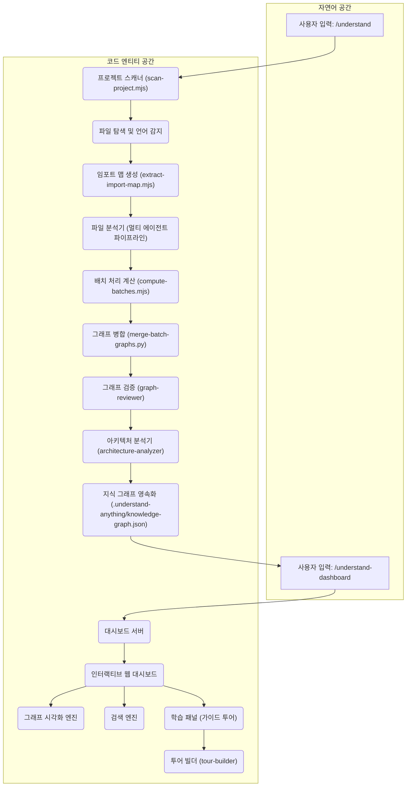
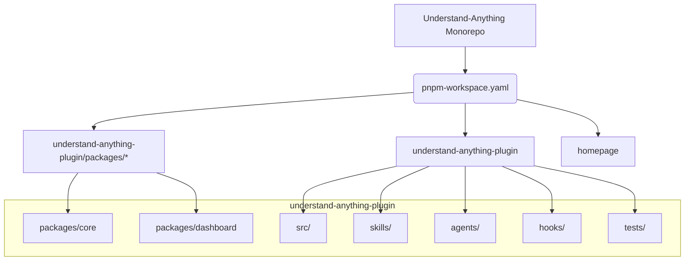

# Understand Anything 종합 가이드

Understand Anything은 코드베이스, 지식 베이스 또는 문서를 인터랙티브한 지식 그래프로 변환해주는 AI 기반 플러그인입니다. 이 가이드는 제공된 문서를 바탕으로 아키텍처 개요, 설치 방법, 레포지토리 구조, 그리고 사용 가능한 명령어(스킬)들의 상세 구현 메커니즘을 쉽게 이해할 수 있도록 정리한 문서입니다.

---

## 1. 개요 (Overview)

Understand Anything은 멀티 에이전트 파이프라인을 사용하여 프로젝트를 분석하고 파일, 함수, 클래스, 의존성 관계를 촘촘히 엮은 지식 그래프를 생성합니다. 분석 결과물은 웹 기반 대시보드를 통해 비주얼하게 탐색하고 검색할 수 있습니다.

### 엔드투엔드 워크플로우

1. 사용자가 `/understand` 명령어를 실행하여 분석을 트리거합니다.
2. 프로젝트 스캐너가 소스 코드를 탐색하고 파일과 사용 언어를 식별합니다.
3. Tree-sitter를 기반으로 파일 간 임포트 맵을 생성합니다.
4. 파일을 적절한 크기의 배치로 나눈 뒤, 멀티 에이전트 파이프라인을 병렬 가동하여 구문 분석(추상 구문 트리 분석) 및 LLM을 활용한 의미론적 요약(Semantic Summary) 작업을 진행합니다.
5. 중간 배치 결과들을 하나의 온전한 그래프 파일(`.understand-anything/knowledge-graph.json`)로 병합합니다.
6. 구조 검증, 아키텍처 레이어 분석 및 투어 빌딩(학습 가이드 제작) 단계를 거쳐 최종 지식 그래프를 완성합니다.
7. 사용자가 `/understand-dashboard` 명령어를 통해 로컬 웹 대시보드 서버를 실행하여 브라우저에서 그래프를 시각적으로 탐색합니다.

### 전체 파이프라인 실행 흐름



---

## 2. 시작하기 및 설치 (Getting Started & Installation)

Understand Anything은 Claude Code, Cursor, VS Code (GitHub Copilot) 등 다양한 AI 코딩 환경 및 명령줄 도구(CLI)를 지원합니다.

### 플랫폼별 설치 방법

#### macOS 및 Linux (Bash)
단 한 줄의 스크립트 실행으로 설치가 가능합니다. 스크립트는 원격 레포지토리를 사용자의 홈 디렉토리(`~/.understand-anything/repo`)로 클론하고 플랫폼에 부합하는 심볼릭 링크를 자동 구성합니다.

```bash
curl -fsSL https://raw.githubusercontent.com/Lum1104/Understand-Anything/main/install.sh | bash
```

특정 플랫폼(예: `codex`)을 명시하여 설치할 수도 있습니다.
```bash
curl -fsSL https://raw.githubusercontent.com/Lum1104/Understand-Anything/main/install.sh | bash -s codex
```

제공되는 주요 플래그:
* `--update`: 이미 설치된 레포지토리를 최신 버전으로 업데이트합니다.
* `--uninstall <platform>`: 특정 플랫폼에 설정된 심볼릭 링크를 제거합니다.

#### Windows (PowerShell)
윈도우 환경에서는 PowerShell 스크립트를 사용하여 동일한 방식으로 설치합니다.
```powershell
iwr -useb https://raw.githubusercontent.com/Lum1104/Understand-Anything/main/install.ps1 | iex
```

### 플랫폼 지원 및 플러그인 설정

각 플랫폼은 루트 디렉토리의 설정 파일(`plugin.json`)을 읽어 플러그인을 자동으로 감지합니다.

| 플랫폼 | 설정 파일 경로 | 동작 방식 |
| :--- | :--- | :--- |
| Claude Code | `.claude-plugin/plugin.json` | 플러그인 마켓플레이스를 통한 설치 및 버전 관리 지원 |
| Cursor | `.cursor-plugin/plugin.json` | 프로젝트 폴더가 열릴 때 자동으로 탐지됨 |
| VS Code + Copilot | `.copilot-plugin/plugin.json` | VS Code 실행 시 Copilot 확장 기능에 의해 자동 등록 |
| Copilot CLI | `.copilot-plugin/plugin.json` | Copilot CLI 플러그인 등록용 설정 파일로 공유 |

#### 대표적인 plugin.json 예시
```json
{
  "name": "understand-anything",
  "description": "AI-powered codebase understanding — analyze, visualize, and explain any project",
  "version": "2.7.6",
  "author": {
    "name": "Lum1104"
  },
  "homepage": "https://github.com/Lum1104/Understand-Anything",
  "repository": "https://github.com/Lum1104/Understand-Anything",
  "license": "MIT",
  "keywords": [
    "codebase-analysis",
    "knowledge-graph",
    "architecture",
    "onboarding",
    "dashboard"
  ],
  "skills": "./understand-anything-plugin/skills/",
  "agents": "./understand-anything-plugin/agents/"
}
```

### 최초 분석 시작
설치 완료 후 코드베이스 루트 경로에서 다음 명령어를 실행하여 분석을 진행합니다.
```bash
/understand
```
* 최초 실행 시 사용자의 CLI 언어 환경을 파악하여 영어가 아닌 경우 확인 프롬프트를 띄우고 선택 결과를 `.understand-anything/config.json`에 저장합니다.
* 특정 언어 결과 출력을 원할 경우 `--language` 플래그를 제공합니다. (예: `/understand --language ko`)

---

## 3. 레포지토리 구조 및 모노레포 레이아웃

Understand Anything은 모노레포 구성을 관리하기 위해 `pnpm` 워크스페이스를 사용합니다. 이를 통해 상호 의존적인 패키지들을 하나의 저장소 내에서 안정적으로 빌드하고 유지할 수 있습니다.

### 모노레포 워크스페이스 구조 (`pnpm-workspace.yaml`)
```yaml
packages:
  - 'understand-anything-plugin/packages/*'
  - 'understand-anything-plugin'
  - 'homepage'
```

### 모노레포 디렉토리 레이아웃



### 주요 디렉토리 및 패키지 설명

* **`packages/core` (`@understand-anything/core`)**: TypeScript로 구성된 공통 비즈니스 로직 라이브러리입니다. 핵심 인터페이스 정의, 지식 그래프 빌더(`GraphBuilder` 클래스), 검색 엔진, 저장소 관리 구조 등을 구현하고 있어 다른 패키지들의 기본 토대가 됩니다.
* **`packages/dashboard` (`@understand-anything/dashboard`)**: 분석된 그래프 데이터를 시각적으로 표현하는 React 애플리케이션입니다. Vite 개발 서버와 데이터를 송수신할 수 있는 API 미들웨어를 내장하고 있습니다.
* **`src/`**: 스킬 실행 시 필요한 컨텍스트를 구성하기 위한 모듈들(`context-builder`, `diff-analyzer`, `explain-builder`)이 구현되어 있습니다.
* **`skills/`**: 플러그인의 다양한 슬래시 명령어(Slash Commands) 스크립트들이 상주하는 디렉토리입니다.
* **`agents/`**: 프로젝트를 상세히 구조 분석하고 요약하는 백그라운드 에이전트(예: `project-scanner`, `file-analyzer`)들의 동작 정의가 모여 있습니다.
* **`hooks/`**: 특정 명령 사용 후에 트리거되는 액션(`PostToolUse`, `SessionStart`)을 정의하고 자동 업데이트 기능을 보조합니다.

### 빌드 및 개발 명령어
* `pnpm prepare`: 패키지 설치 완료 후 자동으로 호출되며, 의존성 관계의 핵심인 `@understand-anything/core` 패키지를 먼저 빌드합니다.
* `pnpm build`: 워크스페이스의 모든 패키지 빌드 스크립트를 재귀적으로 호출하여 전체 프로젝트를 완성합니다.
* `pnpm dev:dashboard`: 대시보드 로컬 개발 서버를 구동합니다.

---

## 4. 스킬 레퍼런스 및 동작 원리 (Skills Reference)

각 명령어들의 인자(Arguments), 플래그(Flags) 정보와 동작 시 내부에서 데이터가 어떻게 흘러가는지 정리한 레퍼런스입니다.

### `/understand`
프로젝트를 정밀 분석하여 지식 그래프를 구성하는 메인 스킬입니다.

#### 플래그 리스트
* `[path]` (선택): 분석을 수행할 대상 디렉토리 경로 (기본값: 현재 작업 디렉토리)
* `--full`: 기존 캐시된 그래프 데이터를 모두 무시하고 처음부터 전면 재분석을 강제합니다.
* `--auto-update` / `--no-auto-update`: 커밋 등이 일어날 때 그래프를 자동 갱신할지 여부를 설정합니다.
* `--review`: 규칙 기반의 고정식 검증 대신 LLM을 통한 정밀 그래프 검증(`graph-reviewer`)을 작동시킵니다.
* `--language <lang>`: 요약 설명, 태그, 제목 등을 대상 언어로 번역 생성합니다. (ko, en, zh, ja 등 지원)

#### 5단계 상세 실행 단계 (Phase 0 ~ Phase 5)

##### Phase 0: 사전 확인 (Pre-flight)
* 대상 경로를 절대 경로로 확인합니다. 이때 현재 경로가 Git Worktree 내부인지 검증합니다. Worktree 내부일 경우 일시적인 그래프 데이터 유실을 막기 위해 본래의 메인 Git 저장소 루트 경로로 대상을 자동 전환합니다.
* `@understand-anything/core` 패키지가 정상 빌드되어 빌드 산출물이 있는지 확인하고, 필요시 즉시 빌드를 유도합니다.

##### Phase 1: 스캔 및 파일 발견 (Project Scanning & File Discovery)
* `scan-project.mjs`가 가동되어 프로젝트 내 분석 대상을 식별하고 파일 확장자별 프로그래밍 언어를 판별하며, `.understandignore` 파일 규칙을 적용합니다.
* `extract-import-map.mjs` 파일이 실행되어 코드 내부에서 임포트하는 파일 간 연결 정보를 Tree-sitter 구문 분석 엔진으로 추출합니다.

##### Phase 2: 배치 처리 및 파일 분석 (File Analysis & Batch Processing)
* 발견된 파일 개수와 토큰 제한을 감안해 연산 대상 파일들을 여러 개의 배치로 쪼갭니다.
* 각각의 배치별 파일들은 개별 파일 분석기 에이전트(`file-analyzer`)에게 전달됩니다.
* 에이전트는 파일의 AST 구조를 파싱(deterministic 분석)하고, 이어 LLM을 통해 의미론적인 요약문, 태그, 인접 코드에 근거한 상호 호출 관계를 산출합니다.
* 분석이 완료된 배치별 그래프 파일 조각들은 `merge-batch-graphs.py`에 의해 아이디 정규화 및 중복 제거 작업을 거쳐 병합됩니다.

##### Phase 3: 최종 검증 (Graph Assembly & Validation)
* 완성된 통합 그래프에 대해 구조적 결함이나 미연결 엣지 등 논리적 오류가 없는지 `graph-reviewer` 에이전트가 무결성 검증을 마칩니다.

##### Phase 4: 아키텍처 분석 및 투어 빌드 (Architecture Analysis & Tour Building)
* `architecture-analyzer`가 컴포넌트 간 밀도 분석 및 의존성 분석을 통해 소스 코드들을 기능별 아키텍처 레이어로 묶어 지정합니다.
* `tour-builder` 에이전트가 최초 진입 경로 분석(BFS 방식과 진입차수 활용)을 통해 신규 입사자나 처음 보는 개발자가 순차적으로 코드를 훑어볼 수 있도록 돕는 학습 투어 가이드를 그래프에 장착합니다.

##### Phase 5: 최종화 (Finalization)
* 도메인 스캔 등 부가 경로에서 나온 지식 그래프를 병합해 최종 `.understand-anything/knowledge-graph.json`을 저장하고 마칩니다.

---

### `/understand-dashboard`
분석 완료 후 시각화 웹 화면을 기동시킵니다. 인자 없이 즉각 실행하며, 내장된 React 대시보드 화면을 기본 브라우저에 띄워 줍니다.

---

### `/understand-chat`
자연어 질문을 통해 지식 그래프 정보를 빠르게 질의하고 답변을 구합니다.

#### 실행 논리 및 데이터 흐름

```mermaid
graph TD
    A[사용자 질문 입력: /understand-chat] --> B{knowledge-graph.json 존재 여부 확인}
    B -- 없음 --> C[먼저 /understand 명령을 실행하도록 안내]
    B -- 있음 --> D[프로젝트 메타데이터 추출]

    D --> E[질문 키워드로 노드 검색 (이름, 요약, 태그 검색)]
    E --> F{매칭된 노드 ID 목록 확보}
    F --> G[엣지 목록에서 대상 노드의 1-hop 연결 관계 추출]
    G --> H[인접 연결 노드 정보 획득]
    H --> I[소속 아키텍처 레이어 정보 확보]

    I --> J[추출된 서브그래프 정보와 레이어를 가공해 프롬프트 맥락 생성]
    J --> K[사용자에게 정확한 근거 및 파일 경로를 기재한 자연어 답변 출력]
```

---

### `/understand-diff`
작업 중인 변경 사항이나 특정 브랜치, PR 단위의 코드 변화가 시스템 전반에 끼치는 영향(Blast Radius)을 분석하고 발생할 수 있는 위험도를 평가합니다.

#### 주요 출력 정보
* **수정된 컴포넌트**: 직접 변경된 파일, 클래스, 함수의 목록과 간략 요약
* **영향을 받는 대상**: 수정된 컴포넌트와 직접 의존성으로 연결된 1-hop 범위 안의 다른 구성 요소들
* **영향 범위 레이어**: 변화가 발생한 아키텍처 레이어 정보
* **위험도 등급 평가 (Risk Assessment)**: 복잡도와 호출 관계, 레이어 경계를 가로지르는 비정상 의존 관계를 합산해 종합 등급 평가
* **대시보드 표시용 데이터**: 분석된 변경 영향도 스냅샷을 `.understand-anything/diff-overlay.json`으로 출력하여 대시보드 시각화 레이어로 중첩 표시 가능하게 합니다.

---

### `/understand-explain`
파일 경로나 특정 함수 명칭을 인자로 넘겨 해당 소스 코드 요소의 동작 양상과 설계 의도를 심층적으로 확인합니다.
* 대상 코드 요소의 상하위 호출 정보(1-hop Subgraph)와 실제 파일의 원시 코드를 함께 긁어옵니다.
* 아키텍처 상의 역할 배치, 데이터 흐름, 설계 패턴 및 주의해야 할 복잡도 지점을 한 번에 해설하여 줍니다.

---

### `/understand-domain`
코드베이스로부터 순수 비즈니스 시나리오와 도메인 플로우(도메인, 프로세스, 세부 단계)를 추출해 냅니다.
* 이미 빌드된 `knowledge-graph.json`이 있다면 해당 관계망 속에서 비즈니스 패턴을 추출하여 빠르게 생성합니다.
* 그래프가 없거나 `--full`이 전달되면, 파일 스케일의 부담을 줄이기 위해 프로젝트의 주요 진입점(Entry Points)과 특징적 파일만을 선별 수집하는 경량 분석 엔진(`extract-domain-context.py`)을 활용하여 분석 맥락을 마련한 뒤 에이전트 요약 작업을 실행합니다.
* 결과물은 `.understand-anything/domain-graph.json`에 영속화되어 대시보드 내 비즈니스 도메인 흐름 맵 형태로 렌더링됩니다.

---

### `/understand-onboard`
새로운 팀원을 위한 고품질의 온보딩 마크다운 가이드를 자동 제작합니다.
* 전체 아키텍처 구조도, 핵심 아키텍처 레이어 설명서, 순차적으로 코드를 파악할 수 있는 아키텍처 투어 코스, 시스템의 주요 복잡도 지점(Complexity Hotspots)을 일목요연하게 짚어 줍니다.
* 사용자의 승인 하에 생성 가이드를 `docs/ONBOARDING.md`에 영구 기록하며, 프로젝트 형상 관리에 올리도록 권장합니다.

---

## 5. 핵심 구현 클래스: `GraphBuilder`

`GraphBuilder` 클래스는 `@understand-anything/core` 패키지 내부에서 노드와 엣지를 논리적으로 취합하고 상태를 안전하게 적재하기 위해 사용되는 중추적 도구입니다.

### 제공 주요 API 명세

* `addFile(filePath, meta)`: 파일 하나에 해당하는 개별 노드를 선언하고 파일 기본 정보를 입력합니다.
* `addFileWithAnalysis(filePath, analysis, meta)`: 파일을 분석한 구조 분석 데이터(함수 목록, 선언된 클래스, 이들의 호출 관계 등)를 넘겨받아 해당 파일 노드와 더불어 그 하위에 포함된 내부 함수/클래스들을 자동으로 트래킹하여 구조화합니다. 이 과정에서 각 하위 항목과 상위 파일 사이에 `contains`(포함 관계) 관계의 엣지가 형성됩니다.
* `addImportEdge(fromFile, toFile)`: 두 파일 사이의 코드 의존 임포트 관계에 따라 `imports` 엣지를 추가합니다.
* `addCallEdge(callerFile, callerFunc, calleeFile, calleeFunc)`: 특정 파일의 함수가 다른 파일의 특정 함수를 호출하는 양상을 확인해 `calls` 엣지를 생성합니다.
* `addNonCodeFile(filePath, meta)`: 설정 파일이나 배포 스크립트 등 코드가 아닌 문서 파일을 노드로 지정합니다.
* `addNonCodeFileWithAnalysis(filePath, meta)`: 비코드 파일들의 내부 속성(API 서비스 정의, 구성 템플릿 단계, 환경 변수 리소스 명세 등)을 상세 파싱하여 포함 관계로 트리 구조화합니다.
