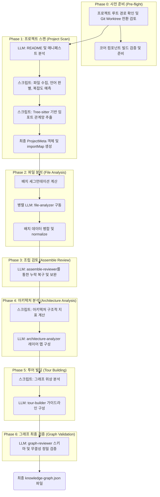
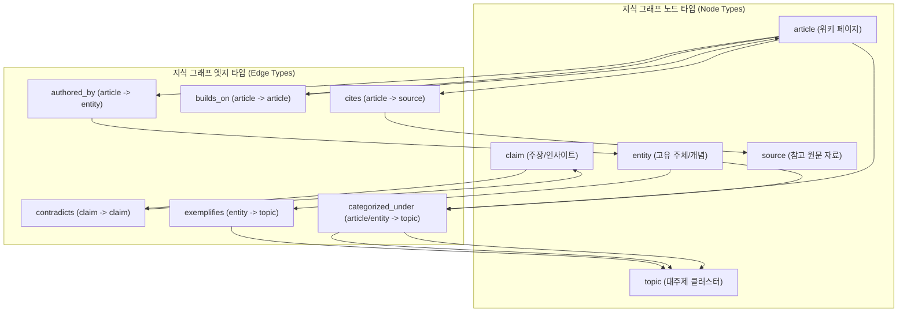

# Understand Anything 분석 파이프라인 및 특화 스킬 상세 가이드

Understand Anything 플러그인은 정밀한 **정적 분석 엔진과 대규모 언어 모델(LLM)을 유기적으로 결합**하여 코드베이스 및 지식 체계를 구조화된 지식 그래프로 변환합니다. 이 문서는 분석 파이프라인의 핵심 7단계 동작 방식과 각 에이전트의 역할, 비즈니스 도메인 추출 및 위키 문서 파싱 기술을 깊이 있게 정리한 가이드입니다.

---

## 1. 분석 파이프라인 아키텍처 및 에이전트 역할

Understand Anything은 결정론적 정적 분석(Deterministic)과 대규모 언어 모델(LLM)의 강점을 조화롭게 융합한 하이브리드 아키텍처를 채택하고 있습니다.

### 아키텍처 설계 원칙

* **결정론적 단계 (Deterministic Steps)**: 정확도와 연산 속도, 일관성이 중요한 작업에 적용됩니다. 파일 목록 Enumeration, 확장자 기반 언어 판별, Tree-sitter를 이용한 구문 AST 분석, 임포트 맵 작성, 최종 그래프의 중복 제거 및 단순 병합 등은 Node.js 및 Python 스크립트로 신속하게 처리합니다.
* **LLM 구동 단계 (LLM-Driven Steps)**: 고수준의 의미론적 분석, 자연어 요약, 아키텍처 계층 식별, 학습용 시나리오 설계 등 정적인 코드 분석만으로 달성하기 어려운 영역에는 전문화된 AI 에이전트를 배치하여 해답을 도출합니다.

### 7단계 파이프라인 개요



### 파이프라인 참가 에이전트 목록

* **`project-scanner`**: 파일 목록 수집, 언어 감지, 임포트 의존성 맵(`importMap`) 구성을 담당합니다.
* **`file-analyzer`**: 대량의 소스 코드를 나누어 병렬로 소화하며, Tree-sitter 파싱 결과물에 기반해 고수준 의미 요약 및 세부 엣지를 추출합니다.
* **`assemble-reviewer`**: 단순 스크립트 병합본에서 소실된 관계나 불일치 노드를 LLM 시각에서 수정 복구합니다.
* **`architecture-analyzer`**: 파일들의 임포트 밀도 분석과 디렉토리 관례를 바탕으로 프로젝트의 아키텍처 레이어를 배정합니다.
* **`tour-builder`**: 지식 그래프 상에서 의미 있는 진입 지점을 찾아 초심자용 5~15단계 가이드 학습 시나리오를 엮어냅니다.
* **`graph-reviewer`**: 가공이 끝난 전체 그래프가 규칙 스키마에 부합하는지 최종 게이트 검증을 거칩니다.
* **`domain-analyzer`**: 도메인 특화 비즈니스 시나리오 및 기능 흐름을 따로 분석해 냅니다.
* **`article-analyzer`**: 위키 성격의 텍스트 콘텐츠 문서를 분석해 엔티티, 클레임 관계를 복원합니다.

---

## 2. 프로젝트 스캔 및 파일 발견 (Phase 0 ~ Phase 1)

프로젝트 스캔 단계는 분석의 바탕이 되는 파일 목록과 이들의 정적 의존 관계인 임포트 맵을 선행 구축합니다.

### `scan-project.mjs`에 의한 파일 수집
* Git 저장소 환경인 경우 우선적으로 `git ls-files` 명령을 실행해 대상을 고속 수집하고, 아닌 경우 재귀 디렉토리 순회 방식으로 백업 작동합니다.
* **`.understandignore` 필터링**: 사용자 정의 제외 조건 및 기본 VCS 제외 폴더 패턴을 정교하게 판정하는 `createIgnoreFilter` 모듈을 연동하여 불필요한 노이즈 파일을 사전에 차단합니다.
* **언어 및 카테고리 감지**: 파일 확장자 사전 및 정밀 네이밍 규칙(예: `Dockerfile` 등)에 기반하여 해당 파일의 카테고리를 `code`, `config`, `docs`, `infra`, `data`, `script`, `markup` 중 하나로 정의합니다.

### `extract-import-map.mjs`를 통한 임포트 분석
* 각 파일들을 핵심 코어 모듈의 `PluginRegistry`에 연결된 `TreeSitterPlugin` 구문 파서에 전달해 코드 구문 분석(AST)을 수행합니다.
* 각 언어 사양에 부합하는 분석기(ESM, CommonJS, Rust, Go 등)를 활성화해 로컬 임포트 문과 Require 문의 실제 소스 위치를 추적합니다.
* TypeScript의 `tsconfig.json` 별칭 경로(Aliases), `package.json`의 내보내기 필드, 디렉토리 인덱스 탐색 규칙(`./foo`를 `foo/index.ts` 등으로 추적)을 지원하며 외부 서드파티 라이브러리(`node_modules` 등)는 필터링하여 순수 로컬 종속 관계만 담은 `importMap`을 최종 조립합니다.

---

## 3. 파일 분석 및 배치 분할 (Phase 2)

코드베이스 크기에 관계없이 LLM의 입력 및 출력 토큰 제약 요건에 구애받지 않고 유연하게 정밀 분석을 완료하기 위해 배치 분할 아키텍처를 운용합니다.

### `compute-batches.mjs` 분할 조건
* 소스 파일의 가중치(파일 크기, 라인 개수)를 환산하여 하나의 배치가 수용할 수 있는 최적의 파일 세트를 설계합니다.
* 언어 동질성과 함께, 파일 간 결합도를 고려해 되도록 서로 임포트하는 연관 코드군이 동일 배치에 배정될 수 있게 알고리즘을 최적화합니다.

### `extract-structure.mjs` 및 의미 추출
* 각 배치별로 병렬 소환된 `file-analyzer`는 배치 대상 코드들에 대해 먼저 정적 파서인 `extract-structure.mjs`를 기동합니다.
* 이 단계에서 추상 구문 트리 기반으로 클래스 선언, 내보낸 함수, 내부 메소드 호출 체인을 정밀하게 캐치하여 뼈대 정보(JSON)를 선출합니다.
* 뒤이어 LLM이 뼈대 데이터와 소스 파일들의 컨텍스트를 기반으로 코드의 목적 요약서, 연관 핵심 키워드 태그, 코드 복잡도 판정(simple, moderate, complex)을 진행하고 일반적인 임포트를 넘어선 실제 흐름 중심의 논리적 엣지(예: `calls`, `inherits`, `implements` 등)를 식별합니다. 이 과정에서 cross-batch 의존성을 매핑하기 위해 인접 연결 컨텍스트 맵(`neighborMap`) 정보를 교차 참고합니다.

### LLM 토큰 수용한계를 넘기 위한 멀티 파트 출력 및 병합
* 하나의 배치 연산 결과의 텍스트 분량이 클 경우에 대비하여 출력 프로토콜은 자동으로 파일을 인덱스 세그먼트 형태(예: `batch-<batchIndex>-<partIndex>.json`)로 나누어 보관할 수 있게 설계되었습니다.
* 각 배치별 작업이 종료되면 Python으로 구현된 `merge-batch-graphs.py`가 중간 파트 파일들을 순회 로드하며 중복된 노드를 유기적으로 봉합하고 ID 체계를 아래 규칙에 의거해 통일 및 정교화합니다.

#### ID 및 복잡도 정규화 (Normalization)
* 중복 접두어 제거 (예: `file:file:src/`를 `file:src/`로 전환)
* 고유 저장소 네이밍 접두어 분리거세 및 일관화
* 레거시 표현 포맷 변경 (예: `func:`를 `function:`으로 canonicalize)
* 복잡도 용어 정규화 (예: `low`, `easy` 등의 유사 표현을 일괄 `simple`로 맵핑)
* 상호 호출 관계를 제외하고 연결 고리가 완전히 사라진 고립된 Dangling Edge 제거

---

## 4. 그래프 조립, 검증 및 아키텍처 분류 (Phase 3 ~ Phase 4)

조립된 결합 그래프의 품질을 확보하기 위해 논리적 복구 작업과 엄격한 제약조건 검증을 함께 실행합니다.

### `tested_by` 관계의 지능적 복원
* 스크립트 결합 시점에 소스 파일과 테스트 파일 간의 연결 관계를 파일명 접미사 및 디렉토리 미러링 규칙을 기반으로 자동 발견합니다.
* 예를 들어, `src/components/button.ts`와 `tests/components/button.test.ts` 또는 `button_test.py` 등 다양한 언어별 테스트 작성 양식을 대조하여 `tested_by` 엣지를 그래프상에 가설 형성하여 연결해 줍니다.

### `assemble-reviewer` 및 `graph-reviewer` 무결성 검증
* **의미 복구 (Semantic Recovery)**: `assemble-reviewer` LLM 에이전트가 로드되어 기계적인 병합 처리 중 유실되었을 수 있는 구조적 갭을 복구합니다.
* **엄격한 스키마 및 위상 제약 조건**: `graph-reviewer` 에이전트가 기동하여 9개 영역에 걸쳐 무결성 규칙을 강제 검증합니다.
  1. 노드 필수 프로퍼티 유효성 검사 (ID, 명칭, 태그, complexity 포함 여부)
  2. 노드 타입 16가지 준수 여부
  3. 에지의 시작점(source) 및 목적지(target) 노드가 그래프상에 실제로 존재하는지 판별 (Referential Integrity)
  4. 지식 투어 및 레이어 맵 내 할당 노드의 실존 검증
  5. 적어도 하나 이상의 노드와 엣지 존재 여부 체크
  6. 아키텍처 분석 대상 구조인 경우, 모든 파일 노드가 누락 없이 단 하나의 레이어에 배정되었는지 대조
  7. 노드 ID 중복 생성 제한 체크
  8. 가이드 투어 순서 번호의 일관성 및 단계 범위 (5-15개 사이 구성) 검증
  9. 자가 순환 루프 엣지 배제 및 빈 내용 요약 적발 등 품질 세부 확인

### 아키텍처 레이어 계산
* `architecture-analyzer`가 코드베이스의 구조적 밀도를 분석해 논리 레이어(예: UI Layer, Service Layer, DB Layer 등)로 범주화합니다.
* 먼저 분석 스크립트를 사용해 그룹 간 종속 빈도 행렬을 구성하고 각 디렉토리별 내부 호출 응집 지표(Intra-Group Import Density) 및 디렉토리 고유 접미사 식별 관례를 계측합니다.
* 도출된 수치를 LLM 에이전트에 공급하여 최종 3~10개의 계층형 레이어를 명문화하고 각 레이어에 상응하는 소스 코드 파일 노드 리스트를 배치합니다.

---

## 5. 학습용 가이드 투어 생성 (Phase 5)

새로운 개발자가 복잡한 아키텍처에 매몰되지 않고 최적의 로드맵으로 코드의 흐름을 이해할 수 있도록 교육적 목적의 탐색 경로인 가이드 투어를 설계합니다.

### 위상 데이터 추출을 활용한 순서 설계
* `tour-builder` 에이전트는 결합된 그래프의 Topological 구조 분석에 돌입합니다.
* **Fan-In (진입도) 분석**: 시스템 내에서 가장 널리 인입 참조되고 있는 클래스 및 인터페이스 상위 20개를 추출하여 기본 기반 지식으로 지정합니다.
* **Fan-Out (진출도) 분석**: 반대로 넓은 영역을 모듈화해서 참조하는 메인 진입점들을 분석해 전체 윤곽을 파악하기에 좋은 지점으로 목록화합니다.
* **진입점 후보 선별**: 파일명 패턴 및 의존 관계 흐름에 입각해 최초 기동 파일(예: `index.ts`, `main.py`) 및 프로젝트 최상위의 `README.md`를 기점으로 삼습니다.
* **BFS Dependency Chain 설계**: 선택된 주요 진입 코드 노드로부터 임포트 및 함수 호출 경로를 너비 우선 탐색(BFS) 방식으로 확장하여 사용자가 논리 흐름을 따라가는 "독해 순서"를 배정합니다.
* LLM 에이전트가 이 정렬 맥락을 학습용 시나리오로 변환해 각각 제목, 내용 설명, 하이라이트할 핵심 노드가 지정된 5~15단계 수준의 대화형 가이드 투어 단계를 구성합니다.

---

## 6. 도메인 추출 및 위키 문서 분석 특화 스킬

일반 구조 분석 스킬 외에도 비즈니스 및 지식 체계의 시각화를 지원하기 위한 전용 스킬이 탑재되어 있습니다.

### `/understand-domain` (비즈니스 도메인 지식 시각화)
* 개발된 코드의 결합 논리를 거슬러 올라가 가치가 높은 도메인 모델, 비즈니스 흐름, 상세 구현 단계를 정제합니다.
* 캐시된 그래프가 없는 경우 경량 전처리 스캐너인 `extract-domain-context.py`가 작동하여, 과다한 전체 토큰 부담을 막기 위해 핵심 경로 패턴(HTTP 라우터 파일, cron 작업, 이벤트 핸들러 등) 위주로 소량 검출하고 `.gitignore` 제외를 준수한 간략 구조 데이터인 `domain-context.json`을 준비합니다.
* 이를 활용해 `domain-analyzer` 에이전트가 `DomainMeta` 규격에 맞는 비즈니스 연결 고리를 확립하고 `.understand-anything/domain-graph.json`으로 출력합니다.

#### DomainMeta 인터페이스 명세
```typescript
export interface DomainMeta {
  description?: string; // 도메인/프로세스 흐름 세부 설명
  flowType?: "sequential" | "parallel" | "conditional"; // 비즈니스 흐름의 성격 (순차식, 병렬식, 조건식)
  order?: number; // 프로세스 내부 단계 순서
  inputs?: string[]; // 해당 단계 입력값 데이터 구조 목록
  outputs?: string[]; // 해당 단계 출력 및 변환 결과 데이터 구조 목록
  triggers?: string[]; // 프로세스를 활성화시키는 트리거 요인 정보
  involvedActors?: string[]; // 주도적으로 가담하는 시스템 주체 또는 액터 목록
}
```

### `/understand-knowledge` (Karpathy-pattern Wiki 지식 파싱)
* Andrej Karpathy LLM 위키 구조를 차용하여 정적으로 작성된 문서 지식 디렉토리(Immutable 소스, wikilink 구조의 마크다운 파일군, `index.md` 및 `log.md`)를 분석해 지식 그래프로 정렬합니다.
* `parse-knowledge-base.py`를 가동하여 마크다운 YAML frontmatter, `[[대상|설명]]` 형태의 위키 링크 구문, 문서 제목, 본문 첫 단락을 파싱해 연결 구조를 구성합니다.
* LLM 기반의 `article-analyzer` 배치가 구동되어 개념 간 숨겨진 참조 관계, 특정 주장(claims)의 상반 관계 등을 추가 추출합니다.
* 이후 `merge-knowledge-graph.py`에 의해 동일 의미의 엔티티 단어들(예: "Andrej Karpathy"와 "A. Karpathy"의 명칭 일관화)을 Deduplication하고 최종 위키 그래프를 생성합니다.

#### 지식 그래프 모델 설계 및 대시보드 시각화

지식 그래프는 전용 노드와 엣지 타입을 활용하여 일반 코드 아키텍처용 트리 레이아웃 대신 유연한 포스 디렉티드(Force-Directed) 레이아웃으로 시각화합니다.



* 대시보드의 `KnowledgeGraphView.tsx`는 ReactFlow 모듈을 로드하여 이를 시각화합니다. 
* 위키 전용 엣지 스타일을 다르게 렌더링하고, 사용자의 검색 필터 상태에 맞춰 노드를 역동적으로 필터링하며 가이드 투어 시퀀스 단계에 해당하는 노드들을 브라우저 화면 중심에 강조해 줍니다.
