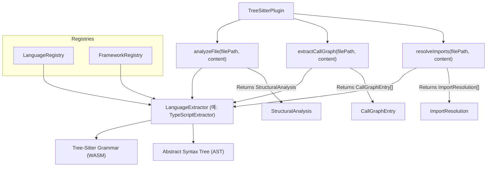

# Understand Anything 코어 라이브러리 상세 가이드

`@understand-anything/core`는 시스템 전반의 기반이 되는 TypeScript 공통 라이브러리입니다. 본 가이드는 지식 그래프의 자료구조 형식, 데이터 정규화 및 검증 검사, 정적 Tree-sitter 구문 분석 메커니즘, 12가지 비코드 문서 해석기, 증분 업데이트 엔진, 그리고 플러그인 레지스트리의 구조를 상세히 이해할 수 있도록 재정리한 문서입니다.

---

## 1. 지식 그래프 데이터 모델 및 검증 파이프라인

Understand Anything의 모든 구성 요소는 표준화된 지식 그래프 스키마 규격을 공유합니다.

### 데이터 모델 주요 프로퍼티 및 형식

* **NodeType (21가지)**:
  * 코드 엔티티: `file`, `function`, `class`, `module`, `concept`
  * 비코드 엔티티: `config`, `document`, `service`, `table`, `endpoint`, `pipeline`, `schema`, `resource`
  * 비즈니스 도메인: `domain`, `flow`, `step`
  * 위키 지식: `article`, `entity`, `topic`, `claim`, `source`
* **EdgeType (35가지)**:
  * 구조 관계: `imports`, `exports`, `contains`, `inherits`, `implements`
  * 동작 관계: `calls`, `subscribes`, `publishes`, `middleware`
  * 데이터 흐름: `reads_from`, `writes_to`, `transforms`, `validates`
  * 의존성 관계: `depends_on`, `tested_by`, `configures`
  * 의미론 관계: `related`, `similar_to`
  * 인프라 구성: `deploys`, `serves`, `provisions`, `triggers`
  * 스키마 구성: `migrates`, `documents`, `routes`, `defines_schema`
  * 비즈니스 도메인: `contains_flow`, `flow_step`, `cross_domain`
  * 지식 연결: `cites`, `contradicts`, `builds_on`, `exemplifies`, `categorized_under`, `authored_by`

### 검증 파이프라인 수명 주기 (Schema Validation Pipeline)

불완전하거나 예외가 있는 입력 JSON 데이터를 강인하게 복구하기 위해 Zod 스키마 엔진 전처리 단계를 수행합니다.

1. **`sanitizeGraph`**: 입력값의 널(Null) 처리를 조율하고 누락된 배열 필드를 기본 할당하는 등 구조 분석 준비 단계를 거칩니다.
2. **`autoFixGraph`**: 복잡도, 포트 가중치 등 범위를 초과하는 수치 형식을 안전하게 보정(Clamp)하고 기본값을 부여합니다. 텍스트 에일리어스 테이블을 조회해 정형화되지 않은 표현들을 canonical 형식으로 매핑합니다.
   * 복잡도 매핑 예시: `low`, `easy` -> `simple`
   * 노드 타입 에일리어스 예시: `func`, `fn` -> `function` / `doc`, `readme` -> `document` / `interface`, `struct` -> `class`
   * 엣지 타입 에일리어스 예시: `extends` -> `inherits` / `invokes` -> `calls`
3. **`normalizeGraph`**: 중복 노드 및 에지를 제거하고 노드 고유 ID를 `type:filepath:name` 표준 형태로 canonicalize합니다. 소속 파일이나 관계 노드가 존재하지 않는 dangling edge를 사전에 추적해 자동 제거합니다.
4. **`validateGraph`**: 최종 정규화가 완료된 구조를 Zod 스키마 검사를 기동시켜 형식 적합성 여부를 판단하고 예외 리스트를 반환합니다.

---

## 2. 파일 영속화 및 보안 관리 (Persistence & Sanitization)

생성된 데이터 파일들은 프로젝트 루트 경로의 `.understand-anything/` 디렉토리에 정돈되어 보관됩니다.

### 저장 파일 구성 목록
* `knowledge-graph.json`: 코드베이스 통합 지식 그래프
* `domain-graph.json`: 비즈니스 시나리오 및 도메인 지식 그래프
* `meta.json`: 최종 코드 분석 이력 (Git Commit 해시, 분석 시각 등)
* `fingerprints.json`: 증분 빌드 비교를 위한 각 소스 파일들의 구조적 지문 데이터
* `config.json`: 자동 업데이트 여부 등 프로젝트 개별 옵션

### 개인정보 보안 강화를 위한 경로 필터링 (`sanitiseFilePaths`)
분석 결과를 저장할 때 절대경로를 그대로 노출할 경우 개발자의 로컬 디렉토리 환경(예: `/Users/username/private/project/...`)이 유출될 소지가 있습니다. 
* 저장 과정에서 `sanitiseFilePaths` 모듈이 작동해 프로젝트 루트 내부는 상대 경로로 강제 환산합니다.
* 프로젝트 루트 범위 밖의 외부 경로는 단지 파일 이름(basename)만을 추출하고 상위 절대 경로를 마스킹하여 영속화합니다.

---

## 3. `GraphBuilder` 및 LLM 분석 엔진

`GraphBuilder` 클래스는 메모리 상에서 점진적으로 데이터 망을 구축하고 빌드 메타데이터를 통합하여 완성된 `KnowledgeGraph` 인스턴스를 제공합니다.

### 제공 기능 상세

* **`addFile`**: 소스 파일을 탐색하여 언어를 매칭하고 `file` 타입의 기본 노드를 적재합니다.
* **`addFileWithAnalysis`**: Tree-sitter 등이 분석한 세부 구문 요소(함수 및 클래스 목록)를 결합하여 개별 노드들을 추가하고 상위 파일과 `contains` 엣지로 연관 짓습니다.
* **`addNonCodeFileWithAnalysis`**: 설정 파일의 상세 내용(테이블 스키마, 엔드포인트 명세 등)을 종류별로 노드로 나누어 포함 엣지와 함께 취합합니다.
* **`build`**: 수집된 노드, 에지, 언어 세트, Git 커밋 해시 등을 취합해 하나의 형식을 갖춘 `KnowledgeGraph` 인스턴스로 결합 출력합니다.

### LLM 연계 분석 모듈

* **아키텍처 레이어 식별 (`layer-detector.ts`)**: `buildLayerDetectionPrompt`가 그래프 전체 노드 및 엣지 지표를 LLM에 전송하고, 반환되는 레이어 JSON 구조를 분석 및 정규화하여 `applyLLMLayers` 메서드로 영속화합니다. Django의 `layer:api`, `layer:data` 등 관례적 레이어 분류 addendum을 탑재하고 있습니다.
* **가이드 투어 설계 (`tour-generator.ts`)**: 너비 우선 탐색(BFS) 체인 및 입출력 위상 랭킹을 통해 교육에 필수적인 5~15개 핵심 노드를 순차 연결한 Tour 시나리오 객체를 도출합니다.
* **언어 교육 교안 (`language-lesson.ts`)**: 대상 소스 노드의 세부 문맥을 결합하여, 사용된 언어적 특징(예: 비동기 async/await 패턴, 데코레이터 등)에 대한 학습 요약문(`languageNotes`)과 개념 지식 리스트를 보강하여 제공합니다.

---

## 4. Tree-Sitter 기반 정적 다국어 구문 분석

정밀한 코드 분석의 첫 관문인 구문 분석 엔진은 WASM 형식의 Tree-sitter 문법을 활용합니다.

### `TreeSitterPlugin` 동작
* **비동기 초기화 (`init`)**: 구동 전 `web-tree-sitter` 엔진 모듈과 언어별 문법 WASM 바이너리를 미리 비동기로 메모리에 할당해 둡니다.
* **구조 및 호출 체인 추출**: 파일 유형을 감지하여 알맞은 구문 분석기(`LanguageExtractor`)를 소환, AST를 횡단 탐색하여 선언된 함수/클래스, 호출 지점(`calls` 관계와 소스 라인)을 deterministic 방식으로 검출합니다.
* **임포트 경로 명확화**: 상대 경로 또는 타 모듈 별칭을 해석해 실제 프로젝트 내 유일 타겟 파일 위치로 임포트 구문을 매핑하여 결과를 반환합니다.

### 지원 언어 분석기 (`LanguageExtractor`) 목록
* **TypeScript/JavaScript**: 함수 파라미터 및 반환형, TSX 구문 분석, 클래스 내부의 멤버 및 접근 제한 지표 등을 정밀 파악합니다.
* **Python**: 데코레이터 선언문, `import ... from ...` 구조 추출, 탑재된 스크립트 기반 호출 추적을 제공합니다.
* **Go**: 구조체(struct), 인터페이스 정의부, 캐스팅 명칭 대소문자(Capitalized) 규칙을 이용한 export 노출 여부를 정의합니다.
* **Rust**: `impl_item` 블록 구별, Enum 정의부 검출, `pub` 키워드를 기준한 내보내기 분석을 수행합니다.
* **Java / C#**: 클래스, 인터페이스, 열거형(Enum) 및 어노테이션 지표 분석, 가시성 지시자에 따른 외부 노출 관계를 분류합니다.
* **C++**: namespace 스페이스 구별, include 헤더 매칭, public/private/protected 범위 식별을 담당합니다.
* **Ruby / PHP**: 모듈 및 require 의존성 처리, PHP의 네임스페이스 및 `$` 접두사 변수 해석 등을 수행합니다.

### 레지스트리 (Registry) 싱글톤 도구
* **`LanguageRegistry`**: 확장자 및 칭호 별칭 사전을 참조해 입력 파일이 어떤 언어 규격에 속하는지 식별합니다. (C, Lua 등 12가지 이상 언어 지원)
* **`FrameworkRegistry`**: 각 웹/애플리케이션 프레임워크(Next.js, Express, Django, Rails 등)의 정적 구성 흔적을 대조해 프로젝트 적용 기술들을 자동 탐색해 냅니다.

---

## 5. 12가지 비코드 파일 분석기 (Non-Code Parsers)

비코드 파일 분석기들은 공통 `AnalyzerPlugin` 인터페이스를 계승하여 구현되었으며, 정형/비정형 설정 문서에서 핵심 엔티티를 파싱해 냅니다.

| 분석 대상 포맷 | 주요 추출 기능 및 범위 | 매핑 노드/에지 종류 |
| :--- | :--- | :--- |
| **Markdown** | 코드 블록 내부의 헤딩을 제외한 헤딩 목록 파싱, 상대 경로 문서 링크 및 미디어 참조 감지 | `Section` 노드 / `references` 에지 |
| **YAML** | 계층형 키 구조 해석, 도커 컴포즈 서비스 정의부 분석, 배열 구성 항목 명칭 라벨링 | `Section` 노드 |
| **JSON / JSONC** | 한 줄/여러 줄 주석 및 트레일링 콤마 제거 전처리, OpenAPI `$ref` 내부 참조 추적 | `Section` 노드 / `references` 에지 |
| **TOML** | 테이블 및 섹션 키 목록 추출 | `Section` 노드 |
| **Dockerfile** | AS 별칭 지정을 지원하는 빌드 스테이지 분석, 노출 포트 수집, RUN/COPY 단계 추적 | `Service` 노드 / `Step` 노드 |
| **SQL** | CREATE 문 해석을 기반으로 데이터 스키마 범위 확보 | `Table`, `View`, `Function` 노드 |
| **GraphQL** | Query, Mutation, Subscription 및 스키마 오브젝트 정보 획득 | `Type`, `Query`, `Mutation` 노드 |
| **Protobuf** | Message 및 Enum 사양서, Service 및 내부 RPC 규격 추출 | `Message`, `Enum` 노드 / `Endpoint` 에지 |
| **Terraform** | resource, data, module 블록 속성 수집, 변수 및 출력 정보 식별 | `Resource`, `Variable`, `Output` 노드 |
| **Makefile** | PHONY 제외 빌드 타겟 목록 추적 | `Step` 노드 |
| **Shell Script** | 내부 함수 선언부 및 source 명령 파일 병합 관계 수집 | `Function` 노드 / `references` 에지 |
| **Env** | 주석을 생략한 유효 KEY=value 선언 수집 | `Variable` 노드 |

---

## 6. 증분 빌드 및 변경 분석 제어 (Incremental Updates)

프로젝트 코드 변경 시 전체를 다시 연산하는 비용을 방지하고 빠른 빌드 유지를 위해 정적 지문 기반 증분 업데이트를 운영합니다.

### Staleness 감지 및 `auto-update-prompt.md` 흐름
* **Staleness 감지**: `SessionStart` 또는 `PostToolUse` 시점에 현재 Git 커밋 해시와 저장된 메타데이터의 `gitCommitHash` 값을 대조하여 만료 여부를 판별합니다.
* **업데이트 동작 흐름**:
  1. `git diff`를 실행하여 최종 분석 이후 바뀐 소스 목록을 조회합니다.
  2. 대상 목록을 `.understandignore` 설정 규칙에 맞게 1차 걸러냅니다.
  3. 필터링된 파일의 SHA-256 해시를 산출하여 지문 이력과 대조합니다.
  4. 내용 변화가 감지된 경우 정적 분석기로 상세 클래스/함수 선언을 추출한 후 지문 이력의 선언 목록과 비교하여 `NONE`, `COSMETIC`, `STRUCTURAL` 중 하나로 수준을 평가합니다.
  5. 평가된 내용을 취합하여 최적의 `UpdateDecision`을 산정합니다.

### `classifyUpdate` 의사결정 매트릭스
* **`SKIP`**: 구조 변경이 없는 단순 주석 및 포맷 수정만 발생한 경우 (`NONE`, `COSMETIC` 만 존재)
* **`PARTIAL_UPDATE`**: 수정 범위가 10개 파일 이내이며 디렉토리 구조 변화가 없이 기능 내부 로직만 변경된 경우 (해당 파일만 부분 재분석 후 병합)
* **`ARCHITECTURE_UPDATE`**: 새로운 디렉토리가 감지되거나 변경된 파일이 10개 초과 30개 이하인 경우 (레이어 분류 및 투어 가이드를 함께 재생성)
* **`FULL_UPDATE`**: 전체 소스의 50%를 초과하여 대대적으로 바뀌었거나 변경 파일이 30개를 초과하는 경우 (전체 풀 빌드 재분석 수행)

---

## 7. 플러그인 레지스트리 및 자동 디스커버리 (Plugin Discovery)

확장성이 뛰어난 개방형 플러그인 생태계를 위해 `PluginRegistry` 허브를 구현했습니다.

### `PluginRegistry` 클래스 설계
* 분석에 참가하는 다양한 `AnalyzerPlugin` 인터페이스 구현체를 중앙에서 등록(`register`)하고 관리합니다.
* 파일 경로가 들어오면 내부 `LanguageRegistry`를 참조해 소스 형식을 특정하고, 이에 부합하는 플러그인에 `analyzeFile`, `resolveImports`, `extractCallGraph` 구현 메서드 호출을 순차 위임합니다.
* 중복 지원 언어가 있을 경우, 나중에 등록된 플러그인 구현체의 바인딩 우선순위가 더 높게 적용됩니다.

### 플러그인 설정 및 직렬화 (`discovery.ts`)
* `PluginConfig` JSON 형식을 제어하여 어떤 플러그인을 활성화시킬지 설정 파일로 관리합니다.
* **`parsePluginConfig`**: 입력된 설정 구문을 해독하여 포맷 결함을 다듬고 유효하지 않은 항목은 생략한 후, 설정이 없거나 문제시 기본 사전 정의된 `DEFAULT_PLUGIN_CONFIG` 객체로 안전하게 세팅합니다.
* **`serializePluginConfig`**: 설정된 플러그인 구성을 정돈된 JSON 문자열 포맷으로 변환해 디스크에 보관할 수 있도록 제공합니다.
