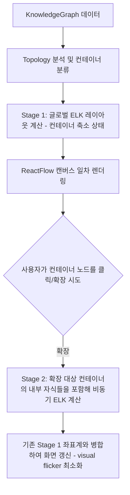

# Understand Anything 대시보드 상세 가이드

`@understand-anything/dashboard` 패키지는 분석 파이프라인이 생성한 지식 그래프를 웹 화면 상에서 인터랙티브하게 탐색할 수 있도록 돕는 React 및 Vite 기반 싱글 페이지 애플리케이션(SPA)입니다. 이 가이드는 대시보드의 서버 보안 파이프라인, 그래프 렌더링 물리 엔진, 상태 관리 스토어, 개별 컴포넌트, 그리고 테마/다국어 지원 체계를 설명합니다.

---

## 1. 대시보드 아키텍처 및 데이터 API 서버

대시보드는 경량 프론트엔드와 로컬 파일 시스템 리소스를 바인딩하기 위해 Vite 개발 서버 위에 커스텀 API 미들웨어를 얹어 REST API 서버 형태로 작동합니다.

### 제공 주요 API 엔드포인트
* `/knowledge-graph.json`: 코드베이스 통합 지식 그래프 로드
* `/domain-graph.json`: 비즈니스 도메인 지식 그래프 로드
* `/diff-overlay.json`: Git 변경 사항 하이라이트 레이어용 오버레이 로드
* `/file-content.json`: 소스 코드 파일 뷰어용 원시 소스 파일 읽기
* `/config.json`: 자동 업데이트 선호도 등 기본 환경 설정 로드

### ACCESS_TOKEN 보안 검증 모델
코드 분석 결과와 소스 코드 본문은 외부로 노출되어서는 안 되는 보안 항목입니다.
* 서버 기동 시 `UNDERSTAND_ACCESS_TOKEN` 환경 변수가 설정되어 있지 않으면 Node.js의 `crypto` 라이브러리를 통해 16바이트의 고유한 무작위 hex 토큰을 매 세션마다 신규 생성합니다.
* 클라이언트 브라우저는 최초 접속 시 URL 쿼리 파라미터(`?token=...`) 형식으로 토큰을 인입하여 인증 절차를 거치며, 토큰이 누락되거나 불일치할 경우 API 서버는 즉각 HTTP 403 Forbidden 상태코드를 리턴해 파일 조회를 차단합니다.

### 10단계 소스 파일 보안 파이프라인 (`readSourceFile`)
`/file-content.json?path=...` 형태로 로컬 소스 코드 요청을 수신할 때 임의의 디렉토리 탈출 공격(Directory Traversal)이나 시스템 파일 반환을 철저히 차단하기 위해 엄격한 검사 파이프라인을 거칩니다.

1. **인자 검증**: 요청 파라미터 내 `path` 쿼리가 없거나 널(Null) 바이트가 포함된 경우 즉시 반환을 거부합니다.
2. **절대경로 차단**: absolute path 형식으로 입력된 요청은 즉각 차단합니다.
3. **경로 정형화**: Node.js `path.normalize`를 사용해 상대 경로 형식을 표준화합니다.
4. **상위 디렉토리 순회 차단**: 정규화된 경로가 `.`, `..` 또는 `../`로 시작하여 상위 경로 탈출을 시도하면 즉시 거절합니다.
5. **분석 그래프 확인**: 해당 프로젝트 폴더 내 `knowledge-graph.json`이 실제로 로드되어 있는지 대조합니다.
6. **루트 바인딩**: 승인된 프로젝트 루트 경로 내부에만 머무르도록 대상 경로를 해석합니다.
7. **재안전 검사**: 바인딩 완료 후에도 최종 경로가 루트 경로의 바깥에 위치하거나 상위로 거슬러 올라가는지 재검증합니다.
8. **그래프 노드 포함 검증**: 가공된 상대 경로가 앞서 생성된 지식 그래프 노드 내 `filePath` 항목에 실제로 등록되어 있는 검증 파일인지 대조합니다. 이를 통해 그래프 분석에 포함되지 않은 엉뚱한 로컬 시스템 파일 유출을 방지합니다.
9. **크기 한계 검사**: preview 크기 한계를 고려해 파일 크기가 1MB를 초과하는 파일은 인입을 배제합니다.
10. **바이너리 판별**: 파일 내용 버퍼에 null 바이트가 검출되면 바이너리 파일로 보아 코드 뷰어 전송을 거부합니다.

---

## 2. 그래프 시각화 및 레이아웃 엔진

대시보드는 웹 캔버스 렌더러인 ReactFlow (`@xyflow/react`)와 Eclipse Layout Kernel (ELK) 레이아웃 라이브러리를 비동기 결합하여 동작합니다.

### Topology Derivation (컨테이너 그룹 형성)
* 지식 그래프 소스를 읽고 `deriveContainers` 유틸이 노드의 파일 경로상 Longest Common Prefix (LCP)를 찾아내어 폴더별로 노드들을 그룹화(Container)합니다.
* 만약 특정 한 폴더에 모든 파일이 쏠려 있거나 컨테이너 분할이 비정상적으로 치우칠 경우, 네트워크 결합 강도를 계산하는 Louvain community detection 알고리즘을 구동시켜 논리적 클러스터 단위로 컨테이너를 가설 수집합니다. 자식이 단 하나만 속한 미세 컨테이너는 제거하여 평탄화합니다.

### 2단계 ELK 레이아웃 수명 주기 (Two-Stage Layout Lifecycle)

### 엣지 축소 및 포탈 노드 연출 (Edge Aggregation)
* 수천 개의 파일 사이의 모든 임포트/호출 연결선을 그대로 노출하면 스파게티 얽힘 현상이 일어나 아키텍처 해석이 불가능해집니다.
* **컨테이너 내부**: 세부 엣지를 풀 렌더링하여 흐름을 명확히 제공합니다.
* **컨테이너 외부**: 동일한 컨테이너 쌍을 횡단하는 복수 엣지들은 하나의 대표 엣지(Inter-container edge)로 합산 집계하고, 내부 연결 엣지 수량 및 관계 유형을 설명 툴팁에 압축 제공합니다.
* **포탈 노드 (PortalNode)**: 레이어 경계 또는 컨테이너 경계를 넘는 주요 매개 코드 노드를 포탈로 별도 분류하여 시각적 직관성을 향상시킵니다.

### 뷰포트 고정 및 피팅 효과 (Viewport control)
* **`TourFitView`**: 아키텍처 학습 투어 가이드를 이용할 때 활성화되는 뷰포트 효과입니다. lazy expansion으로 인해 캔버스 내부 요소의 크기 측정이 완료될 때까지 `requestAnimationFrame`을 통해 측정 완료 여부를 폴링 검증하며, 준비가 끝난 즉시 대상 투어 노드들이 화면에 꽉 차도록 부드럽게 줌/포커스 처리를 가합니다.
* **`SelectedNodeFitView`**: 사용자가 특정 노드를 클릭하면 해당 노드가 화면 중심으로 스무스하게 이동하여 집중할 수 있도록 안내합니다.

---

## 3. 도메인 그래프 및 물리 시뮬레이션 레이아웃

비즈니스 도메인에 특화된 스킬 결과물(`/understand-domain`)을 시각화하는 영역으로, `DomainGraphView` 컴포넌트가 담당합니다.

### 도메인 전용 노드 구조
* **`DomainClusterNode`**: 도메인 범위 및 속한 엔티티, 규칙 등을 담은 카드 노드입니다. 더블클릭 시 해당 도메인의 상세 프로세스 흐름으로 진입합니다.
* **`FlowNode`**: 도메인 안에서 수행되는 구체적인 단일 비즈니스 시나리오를 표시합니다.
* **`StepNode`**: 시나리오 내부의 처리 순서 및 연결된 실제 소스 파일 정보를 표현하는 단위 노드입니다.

### D3 Force 물리 레이아웃 (`applyForceLayout`)
도메인 데이터는 위상 결합도에 따라 유기적으로 어우러지도록 D3 force-directed layout 물리 모델을 사용해 배치합니다.
* **Link Force**: 엣지로 이어진 도메인/시나리오 노드가 적정 거리를 두도록 당겨 줍니다.
* **Charge Force**: 노드 상호 간 밀쳐내는 반발력을 두어 겹치지 않게 합니다.
* **Centering Force**: 흩어지지 않고 화면 중심으로 노드 무리가 모이도록 유도합니다.
* **Collide Force**: 노드의 실제 렌더링 면적(Width/Height)에 기반해 겹침 현상을 물리적으로 완전 차단합니다.
* **Community Clustering Force**: 동일 비즈니스 도메인 및 그룹에 속한 요소들끼리 서로 강하게 인력을 작용시켜 화면상에 원형 세그먼트 형태로 보기 좋게 무리를 지어 분산되게 조율합니다.
* 지정된 틱(100~300 Ticks)만큼 물리 연산을 동기식으로 빠르게 수렴시킨 후, 캔버스 좌상단 정렬 좌표계로 보정하여 ReactFlow에 최종 전달합니다.

---

## 4. Zustand 기반 대시보드 상태 관리

대시보드는 전역 반응형 상태를 관리하고 컴포넌트 간 연동을 원활히 하기 위해 Zustand 라이브러리를 사용해 단일 스토어(`useDashboardStore`)를 운용합니다.

### Zustand 스토어 내 핵심 상태 및 함수

* **캐시 지표 재구성 (`setGraph`)**: 그래프 파일 수신 즉시 O(1) 탐색을 보장하는 Map 컬렉션(`nodesById`), 해당 노드가 어떤 아키텍처 레이어에 귀속되는지 빠르게 확인하는 계층 캐시(`nodeIdToLayerId`, `nodeIdToLayerIds`)를 실시간 재구축합니다.
* **조작 액션 리스트**:
  * `selectNode(nodeId)`: 특정 노드를 클릭 시 방문 이력 스택(`nodeHistory`, 최대 50개 제한 보관)에 push하고 포커스를 기록합니다.
  * `drillIntoLayer(layerId)`: 특정 아키텍처 레이어만 상세히 훑어보는 `layer-detail` 렌더링 모드로 즉시 변경합니다.
  * `setSearchQuery(query)` / `setSearchMode(mode)`: 검색어가 갱신되면 탑재된 Fuse.js fuzzy 매칭 인스턴스 또는 임베딩 코사인 유사도 연산 기반의 `SemanticSearchEngine`을 구동하여 일치하는 노드 리스트를 `searchResults` 상태에 업데이트합니다.
  * `detailLevel`: 사용자가 '파일 단계'로 구조를 볼 것인지, 더 깊은 '클래스/함수 단계'까지 펼쳐볼 것인지에 맞춰 렌더링 범위를 조율합니다.
  * `persona`: 사용자의 역량 단계(`non-technical`, `junior`, `experienced`)를 설정하여, 복잡한 코드나 인프라 엣지 노출 빈도를 동적 필터링합니다.

---

## 5. UI 컴포넌트 배치 및 Lazy Loading 전략

대시보드는 풍부한 유저 경험을 제공하기 위해 다양한 오버레이 패널과 시각 보조 도구를 지원합니다.

### 지연 로딩 (Lazy Loading) 및 번들 최적화
초기 페이지 로드 용량의 과다 증가를 막기 위해, 상시 렌더링될 필요가 없거나 리소스가 큰 컴포넌트들은 React `lazy` 및 `Suspense` 구조를 적용해 비동기로 로드합니다.
* **`LearnPanel`**: 아키텍처 가이드 투어 가이드를 화면에 노출하고 설명 스텝을 넘기는 패널입니다.
* **`CodeViewer`**: 1MB 이하의 소스 코드를 불러와 구문 강조(Syntax Highlighting) 및 대상 라인 스크롤 하이라이트를 실행해 주는 코드 뷰어입니다.
* **`PathFinderModal`**: 시작 노드와 끝 노드 사이의 최단 의존 경로 및 개념 관계를 계산하고 캔버스에 표시해 주는 팝업입니다.
* **`OnboardingOverlay`**: 신규 방문자에게 인터페이스 사용법을 번역 지원된 마이크다운 카드로 안내해 주는 가이드 오버레이입니다.

### 상시 구동 주요 컴포넌트
* **`SearchBar`**: 상단 검색바로서 검색 모드(Fuzzy/Semantic) 스위칭 및 결과 선택 이동을 중재합니다.
* **`NodeInfo`**: 사이드바 영역에 현재 선택 노드의 태그, 복잡도 지표, 연결된 위키 문서, 상하위 종속 파일 목록을 링크와 함께 표기합니다.
* **`ExportMenu`**: 현재 뷰포트에 띄워진 지식 그래프를 SVG 선감지 수작업 드로잉을 거쳐 SVG 포맷으로 다운로드하거나, 캔버스 래스터화를 거쳐 PNG로 다운로드하고, 필터가 먹힌 상태 그대로의 JSON으로 추출하도록 지원합니다.
* **`FilterPanel`**: 노드 종류, 에지 유형, 복잡도 단계별 노출 여부를 체크박스로 빠르게 끄고 켤 수 있게 합니다.

---

## 6. 테마 엔진 및 다국어 지원 (Theming & i18n)

세련되고 눈이 편안한 개발자 UI 디자인을 위해 고유한 컬러 스타일 엔진과 다국어 지원 리소스를 내장하고 있습니다.

### CSS Custom Properties 동적 제어 (`theme-engine.ts`)
* `ThemeProvider`가 구동되며 사용자가 저장한 테마 정보가 `localStorage`에 `"ua-theme"` 키로 영속 보관됩니다.
* Preset 변경 또는 Accent 색상 버튼 클릭 시 `theme-engine.ts`가 작동해 `<html>` 최상위 노드에 정의된 CSS 변수들(--color-root, --color-surface, --color-accent 등)을 동적으로 덮어씁니다.
* 지정된 Accent hex 컬러 코드를 RGB로 변환하고 0.1~0.8 오퍼시티 투명도를 조합 연산하여, 테마 preset의 밝기(Light/Dark) 조건에 맞추어 스무스한 세미 투명 유리 효과(Glassmorphism) 변수인 `--glass-bg`, `--glass-border` 등을 실시간 생성해 줍니다.
* 제공 프리셋: `dark-gold` (warm 골드 포인트), `dark-ocean` (cool 블루 포인트), `dark-forest` (green 포인트), `light-minimal` (깔끔한 밝은 화이트 테마)

### 다국어 지원 i18n 인프라
* 한국어(`ko`), 영어(`en`), 일본어(`ja`), 중국어 간체(`zh`), 중국어 번체(`zh-TW`), 러시아어(`ru`)의 번역 정보 파일을 보유하고 있습니다.
* `I18nContext` 및 `useI18n()` 훅을 소환해 컴포넌트 텍스트를 출력합니다.
* 브라우저의 기본 언어 명칭 설정이나 사용자의 강제 셋팅 헤더값을 감지했을 때, `resolveLocaleKey` 함수가 작동해 canonical locale key 중 하나로 안전하게 표준 매핑하여 올바른 다국어 리소스를 반환해 줍니다.
