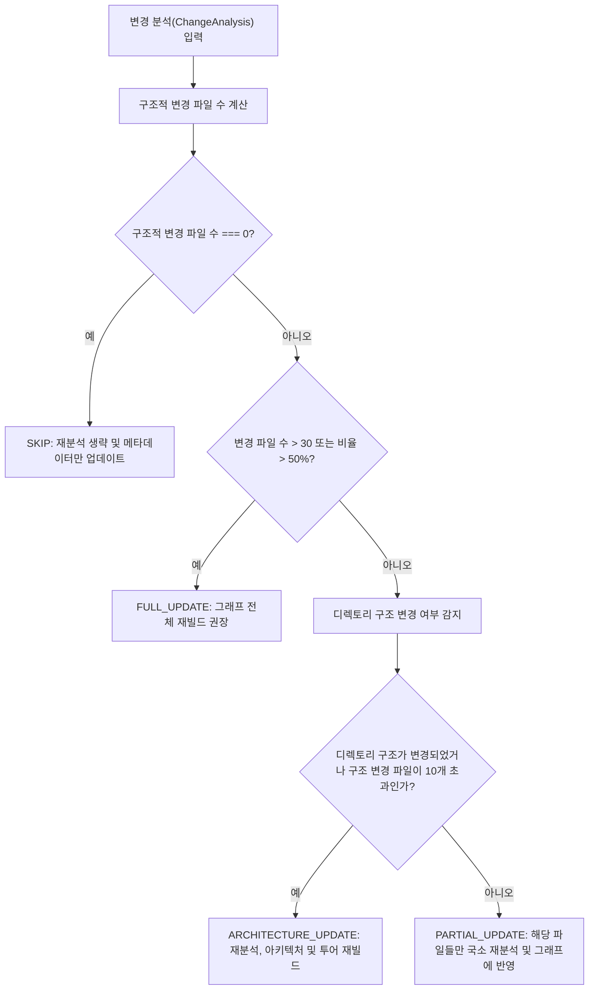
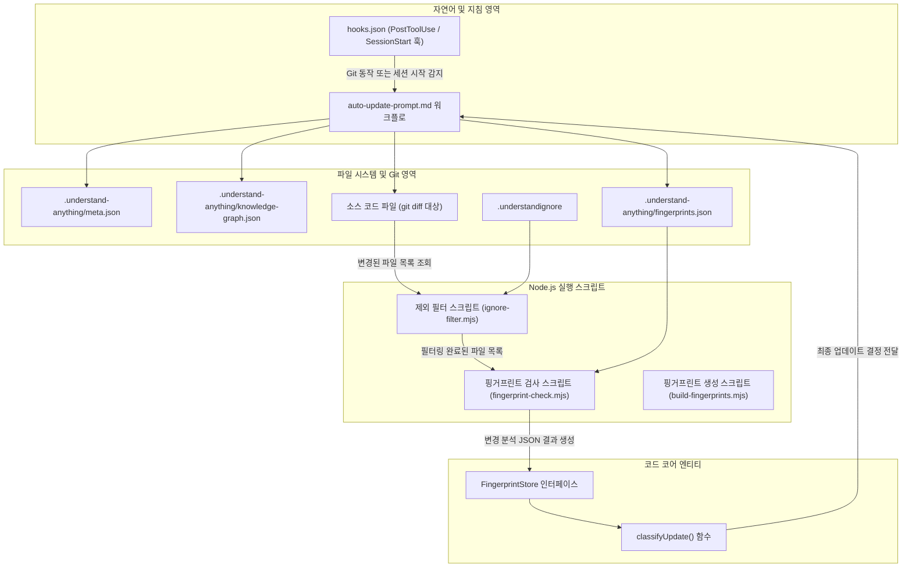

# 자동 업데이트 및 훅 시스템 (Auto-Update & Hooks)

이 문서는 Understand Anything의 자동 업데이트 및 훅(Hooks) 하위 시스템에 대해 설명합니다. [hooks.json](file:///Users/kkh/Desktop/oss-analysis/artifacts/Understand-Anything/understand-anything-plugin/hooks/hooks.json)에 정의된 훅 시스템, [auto-update-prompt.md](file:///Users/kkh/Desktop/oss-analysis/artifacts/Understand-Anything/understand-anything-plugin/hooks/auto-update-prompt.md) 스크립트에 의해 구동되는 점진적 자동 업데이트 워크플로, 핑거프린트 기반 변경 감지 메커니즘, 그리고 지식 그래프에 대한 점진적 업데이트 작업을 결정하는 `classifyUpdate` 의사결정 매트릭스를 다룹니다.

---

## 1. 훅 시스템 개요 (Hooks System Overview)

Understand Anything은 코딩 세션 진행 중 또는 도구 실행 후에 발생하는 외부 이벤트에 의해 트리거되는 작업을 자동화하기 위해 훅 시스템을 사용합니다. 이 시스템은 다음 파일에 설정되어 있습니다.

* [hooks.json](file:///Users/kkh/Desktop/oss-analysis/artifacts/Understand-Anything/understand-anything-plugin/hooks/hooks.json)

### 훅 유형 (Hook Types)

주요 훅 유형은 다음과 같습니다.

* **PostToolUse**: 특정 CLI 도구 또는 명령어가 실행된 후에 트리거됩니다.
* **SessionStart**: 사용자 세션이 시작될 때 트리거됩니다.

### 자동 업데이트를 위한 훅 명령어 (Hook Commands for Auto-Update)

이 훅 내부의 조건부 Bash 명령어는 Git 커밋(commit, merge, cherry-pick, rebase)이 발생했거나, 세션 시작 시 지식 그래프가 최신 상태가 아님을 감지합니다. `.understand-anything/config.json` 파일에 `"autoUpdate": true`가 설정되어 있고 지식 그래프 메타데이터 파일들이 존재하면, 사용자 확인 없이 내부 자동 업데이트 메커니즘이 실행됩니다.

* **PostToolUse 훅**: 실행된 도구의 입력에 Git 작업이 포함되어 있는지 확인하고 다음 조건이 충족되면 자동 업데이트 프롬프트를 호출합니다.
  * `.understand-anything/config.json` 파일이 존재하고 `"autoUpdate": true` 설정이 포함되어 있음.
  * `.understand-anything/knowledge-graph.json` 파일이 존재함.
* **SessionStart 훅**: 현재 Git HEAD 커밋 해시와 `.understand-anything/meta.json`에 저장된 해시를 비교합니다. 해시가 다르면 지식 그래프가 만료된 것으로 판단하여 자동 업데이트 프롬프트를 실행하고 점진적 업데이트를 수행하도록 유도합니다.

 두 경우 모두 명령어는 플러그인이 [auto-update-prompt.md](file:///Users/kkh/Desktop/oss-analysis/artifacts/Understand-Anything/understand-anything-plugin/hooks/auto-update-prompt.md) 내의 지침을 읽고 실행하도록 메시지를 출력하며, 사용자에게 확인을 요청하지 않고 자동으로 업데이트를 수행합니다.

---

## 2. 자동 업데이트 점진적 워크플로 (Auto-Update Incremental Workflow)

지식 그래프에 대한 점진적 업데이트를 수행하는 실제 로직은 사용자가 직접 보지 않는 내부 스크립트 파일에 작성되어 있습니다.

* [auto-update-prompt.md](file:///Users/kkh/Desktop/oss-analysis/artifacts/Understand-Anything/understand-anything-plugin/hooks/auto-update-prompt.md)

이 스크립트는 위의 훅들에 의해 트리거됩니다. 이 시스템의 목표는 코드의 구조적 변경 사항을 결정론적으로 감지하고, 필요한 경우에만 LLM 분석을 실행하여 값비싼 LLM 토큰 사용을 최소화하는 것입니다.

### 핵심 원칙 (Key Principles)

* **비용 효율성**: 단순한 포맷 변경이나 내부 로직 변경 등 구조적 변화가 없는 경우(Cosmetic Change), LLM 토큰을 사용하지 않고 건너뜁니다.
* **결정론적 구조적 핑거프린팅**: 함수, 클래스, 임포트, 익스포트 등의 코드 구조적 변경을 정확하게 탐지합니다.
* **점진적 업데이트 결정**: 변경 분류 매트릭스를 사용하여 업데이트를 건너뛸지(Skip), 부분 업데이트할지(Partial Update), 또는 전체 재빌드할지(Full Rebuild) 결정합니다.
* **사용자 확인 생략**: 업데이트 프로세스는 사용자의 작업 흐름을 방해하지 않고 백그라운드에서 자동으로 실행됩니다.

### 워크플로 단계 (Workflow Phases)

#### Phase 0 — 사전 검사 (Pre-Flight Checks) (토큰 비용 없음)

1. 필수 파일 존재 여부 확인: 지식 그래프(`knowledge-graph.json`) 및 메타데이터(`meta.json`) 파일이 있는지 검증합니다.
2. 현재 Git HEAD 커밋 확인: 마지막 분석 이후 변경 사항이 없고 `--force` 플래그가 없으면 즉시 종료합니다.
3. 마지막 분석된 커밋과 HEAD 사이의 변경된 파일을 감지합니다. 변경된 파일이 없으면 새 커밋 해시로 `meta.json`을 업데이트하고 종료합니다.
4. 변경된 파일 중 지원되는 소스 파일 확장자만 필터링합니다. 대상 파일이 없으면 `meta.json`을 업데이트하고 종료합니다.
5. `.understandignore` 제외 규칙을 적용하여 불필요한 업데이트 트리거를 방지합니다. 이 과정에는 플러그인 내부의 ignore 로직을 가져와 처리하는 `ignore-filter.mjs` 유틸리티 스크립트가 사용되며, 모든 변경 파일이 제외 대상이면 메타데이터 업데이트 후 종료합니다.
6. 임시 데이터를 저장하기 위해 `.understand-anything/intermediate` 경로에 중간 디렉토리를 생성합니다.

#### Phase 1 — 구조적 핑거프린트 검사 (Structural Fingerprint Check) (LLM 토큰 사용 안 함)

결정론적인 Node.js 스크립트인 `fingerprint-check.mjs`가 실행되어 다음 작업을 수행합니다.

1. `.understand-anything/fingerprints.json`에서 저장된 이전 핑거프린트를 읽어옵니다.
2. 변경된 각 소스 파일에 대하여:
   * 현재 파일 내용을 읽고 SHA-256 해시를 계산합니다.
   * 해시가 변경되지 않았다면 `NONE`으로 분류합니다.
   * 해시가 변경되었다면 정규식을 사용해 구조적 요소(함수, 클래스, 임포트, 익스포트)를 추출한 후 이전 핑거프린트와 비교합니다.
     * 구조적 요소들이 일치하면 코드 포맷만 바뀐 것으로 판단하여 `COSMETIC`으로 분류합니다.
     * 구조적 요소에 변화가 있다면 `STRUCTURAL`로 분류합니다.
3. 새롭게 추가되거나 삭제된 파일은 자동으로 `STRUCTURAL`로 분류됩니다.
4. 파일별 분류 결과를 기반으로 프로젝트 전체의 업데이트 액션을 최종 결정합니다:
   * 결정 유형: `SKIP`, `PARTIAL_UPDATE`, `ARCHITECTURE_UPDATE`, `FULL_UPDATE`
5. 상세 분석 결과 요약을 `.understand-anything/intermediate/change-analysis.json` 파일에 저장합니다.

#### Phase 2 — 업데이트 액션 결정 및 보고 (Update Action Decision & Reporting)

생성된 변경 분석 JSON 파일을 읽고 아래의 의사결정 매트릭스를 적용합니다.

| 결정 유형 (Action) | 동작 내용 (Behavior) |
| :--- | :--- |
| `SKIP` | 메타데이터의 커밋 해시만 갱신하고 "토큰 소모 없음"을 보고한 뒤 종료합니다. |
| `FULL_UPDATE` | 대규모 구조 변경을 보고하고, 전체 재빌드 명령인 `/understand --full` 실행을 권장한 후 종료합니다. |
| `ARCHITECTURE_UPDATE` | 아키텍처 수준의 재분석을 실행하고 아키텍처 투어(Tours)를 재빌드한 후 메타데이터를 갱신합니다. |
| `PARTIAL_UPDATE` | 변경된 파일만 부분적으로 재분석하여 지식 그래프를 업데이트하고, 전체 아키텍처 정보 및 투어는 유지합니다. |

`SKIP`을 제외한 모든 케이스에서 파이프라인은 변경 범위에 맞게 지식 그래프를 증분 업데이트합니다.

---

## 3. 핑거프린트 기반 변경 탐지 (Fingerprint-Based Change Detection)

점진적 업데이트의 핵심은 소스 파일의 구조적 정보를 추출하여 핑거프린트(지문) 형태로 비교하는 것입니다.

### 핑거프린트 관련 타입 (Fingerprint Types)

이 시스템은 코어 패키지 내에 다음 타입들을 구현하고 있습니다.

* `FileFingerprint`: 파일 경로, 전체 콘텐츠의 해시값, 그리고 함수, 클래스, 임포트, 익스포트 등의 구조적 요소를 포함합니다.
* `FunctionFingerprint`, `ClassFingerprint`, `ImportFingerprint`: 각 구조적 요소의 세부 메타데이터를 나타냅니다.
* `ChangeLevel`: 변경 강도를 구분하는 열거형 타입으로 `"NONE" | "COSMETIC" | "STRUCTURAL"` 값을 가집니다.

### 핑거프린트 추출 (Fingerprint Extraction)

`extractFileFingerprint` 함수는 다음 방식으로 핑거프린트를 생성합니다.

1. 파일 내용의 전체 SHA-256 해시를 계산합니다.
2. 파서 및 언어 추출기에서 반환된 구조적 분석 결과를 바탕으로 함수 시그니처, 클래스 정의, 임포트 구문, 익스포트 선언을 기록합니다.
3. 각 구조적 요소의 라인 수(Line Count) 정보를 함께 저장합니다.

### 핑거프린트 비교 (Fingerprint Comparison)

`compareFingerprints` 함수는 이전 및 신규 `FileFingerprint`를 비교하여 변경 사항의 성격을 판단합니다.

```typescript
type ChangeLevel = "NONE" | "COSMETIC" | "STRUCTURAL";

function compareFingerprints(oldFp: FileFingerprint, newFp: FileFingerprint): FileChangeResult;
```

* **결과 값 기준**:
  * `NONE`: 파일의 콘텐츠 해시가 완전히 동일한 경우.
  * `COSMETIC`: 파일 콘텐츠는 달라졌지만 함수, 클래스, 임포트, 익스포트 등 구조적 메타데이터는 동일한 경우.
  * `STRUCTURAL`: 함수/클래스가 추가 또는 제거되었거나, 시그니처가 변경되었거나, 임포트/익스포트 구문이 수정되었거나, 의미 있는 라인 수 차이가 발생하는 경우.

이 비교 로직은 구조적 데이터가 유실되거나 비교하기 모호한 경우 변경 사항을 놓치지 않기 위해 보수적으로 작동하여 `STRUCTURAL`로 분류합니다.

---

## 4. 업데이트 결정 매트릭스 (classifyUpdate)

변경 분석 결과를 바탕으로 지식 그래프를 업데이트하는 최종 전략은 다음 파일에 구현되어 있습니다.

* [change-classifier.ts](file:///Users/kkh/Desktop/oss-analysis/artifacts/Understand-Anything/understand-anything-plugin/packages/core/src/change-classifier.ts)

### `classifyUpdate` 함수 구조

```typescript
export function classifyUpdate(
  analysis: ChangeAnalysis,
  totalFilesInGraph: number,
  allKnownFiles: string[] = []
): UpdateDecision;
```

### 의사결정 매트릭스 조건 요약 (Decision Matrix)

| 조건 (Condition) | 결정 유형 (Action) | 세부 재분석 범위 | 아키텍처 재빌드 여부 | 투어 재빌드 여부 | 결정 사유 (Reason) |
| :--- | :--- | :--- | :--- | :--- | :--- |
| 구조적 변경 없음 (단순 포맷 변경 또는 수정 없음) | `SKIP` | 없음 | 미수행 | 미수행 | 구조적 영향이 없음 |
| 구조적 변경 파일 수가 30개 초과이거나, 전체 파일의 50% 초과인 경우 | `FULL_UPDATE` | 변경 및 신규 파일 전체 | 수행 | 수행 | 대규모 구조 변경 발생으로 전체 재빌드 필요 |
| 구조적 변경이 디렉토리 구조 변경을 유발했거나 10개 초과 파일인 경우 | `ARCHITECTURE_UPDATE` | 변경 및 신규 파일 전체 | 수행 | 수행 | 디렉토리 구조가 변경되어 아키텍처 및 경로 수준 재해석 필요 |
| 동일 디렉토리 내의 10개 이하 파일에 대한 구조적 변경 | `PARTIAL_UPDATE` | 변경 및 신규 파일만 재분석 | 미수행 | 미수행 | 국소적 변경이므로 부분 증분 업데이트 가능 |

### 디렉토리 구조 변경 감지 (Directory Structure Change Detection)

* `detectDirectoryChanges` 헬퍼 함수를 통해 추가되거나 삭제된 파일들이 기존 최상위 소스 디렉토리 구조에 영향을 주었는지 확인합니다.
* 최상위 디렉토리는 루트 디렉토리 직하의 첫 번째 경로 세그먼트를 기준으로 합니다.
* 기준에 없는 새로운 디렉토리에 파일이 생성되거나 기존 디렉토리가 사라진 경우, 아키텍처 수준의 업데이트(`ARCHITECTURE_UPDATE`)를 트리거합니다.

### 출력 데이터 구조: `UpdateDecision`

```typescript
interface UpdateDecision {
  action: "SKIP" | "PARTIAL_UPDATE" | "ARCHITECTURE_UPDATE" | "FULL_UPDATE";
  filesToReanalyze: string[]; // 부분 업데이트 시 재분석할 파일 목록
  rerunArchitecture: boolean;
  rerunTour: boolean;
  reason: string; // 의사결정에 대한 사람이 읽을 수 있는 설명
}
```

### 의사결정 흐름도 (Decision Flow)



---

## 5. 데이터 흐름 및 실행 다이어그램 (Data Flow and Execution Diagram)

Git 커밋 감지 훅 실행부터 파일 필터링, 핑거프린트 비교를 거쳐 증분 업데이트 전략이 실행되는 전체 파이프라인의 데이터 흐름입니다.



---

## 6. 주요 클래스 및 함수 요약 (Key Classes and Functions)

* **`classifyUpdate`**:
  * 역할: 종합적인 구조적 변경 분석 정보와 프로젝트 컨텍스트를 활용하여 적합한 업데이트 전략을 판단합니다.
  * 입력: `ChangeAnalysis`(파일 단위 변경 상세), 그래프 내 총 파일 수, 알려진 전체 파일 경로 목록.
  * 출력: 업데이트 전략명 및 대상 파일 목록을 포함하는 `UpdateDecision`.
* **핑거프린트 추출 및 비교 (Fingerprint Extraction & Comparison)**:
  * `extractFileFingerprint(filePath, content, analysis)`: 구문 분석 결과를 가볍고 비교하기 쉬운 핑거프린트 객체로 변환합니다.
  * `compareFingerprints(oldFingerprint, newFingerprint)`: 이전과 새 핑거프린트를 직접 대조하여 상세 변경 정보와 수준을 판단합니다.
* **핑거프린트 저장소 (Fingerprint Store)**:
  * `FingerprintStore`: 각 파일별 구조적 핑거프린트 정보와 Git 커밋 해시 등의 메타데이터를 보관합니다.
  * 저장 경로: `.understand-anything/fingerprints.json`
  * 생성 시점: `/understand` 명령어가 완전히 실행되는 전체 빌드 과정에서 `build-fingerprints.mjs` 스크립트를 통해 생성되며, `TreeSitterPlugin` 및 `PluginRegistry`를 호출하여 전체 소스 파일을 파싱합니다.

---

## 참고 문헌 및 소스 코드 (References & Sources)

* [hooks.json](file:///Users/kkh/Desktop/oss-analysis/artifacts/Understand-Anything/understand-anything-plugin/hooks/hooks.json)
* [auto-update-prompt.md](file:///Users/kkh/Desktop/oss-analysis/artifacts/Understand-Anything/understand-anything-plugin/hooks/auto-update-prompt.md)
* [change-classifier.ts](file:///Users/kkh/Desktop/oss-analysis/artifacts/Understand-Anything/understand-anything-plugin/packages/core/src/change-classifier.ts)
* [change-classifier.test.ts](file:///Users/kkh/Desktop/oss-analysis/artifacts/Understand-Anything/understand-anything-plugin/packages/core/src/__tests__/change-classifier.test.ts)
* [fingerprint.ts](file:///Users/kkh/Desktop/oss-analysis/artifacts/Understand-Anything/understand-anything-plugin/packages/core/src/fingerprint.ts)
* [build-fingerprints.mjs](file:///Users/kkh/Desktop/oss-analysis/artifacts/Understand-Anything/understand-anything-plugin/skills/understand/build-fingerprints.mjs)
