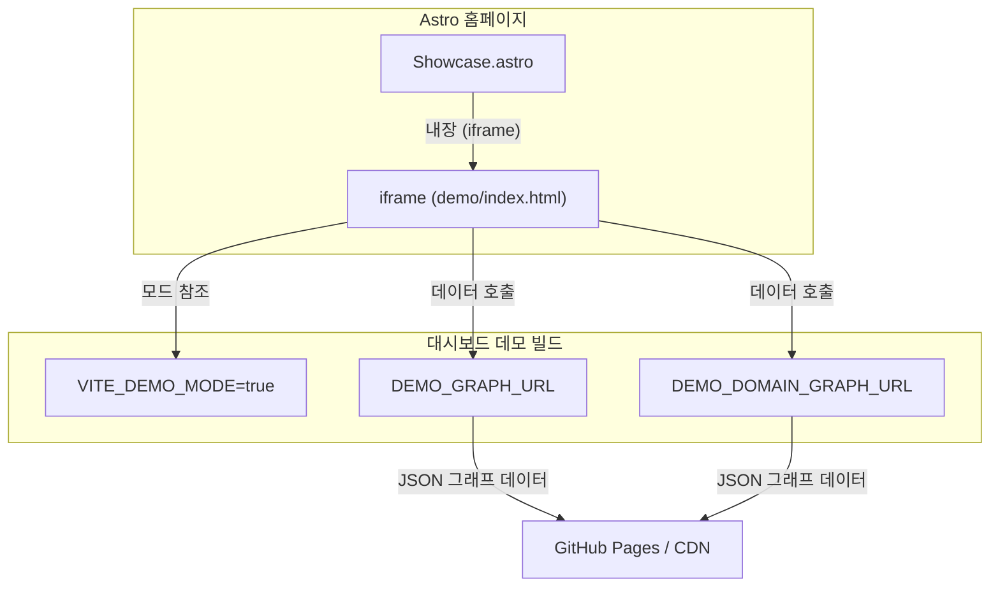
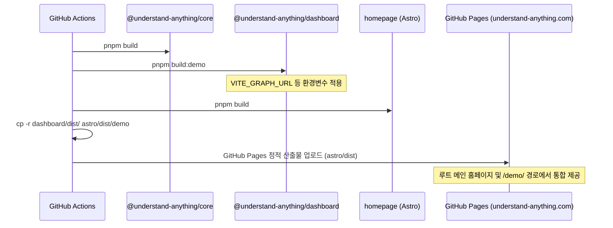

# 홈페이지 및 마케팅 사이트 (Homepage & Marketing Site)

Understand Anything의 마케팅 사이트 및 홈페이지는 **Astro** 프레임워크를 기반으로 구축되었으며, `homepage/` 디렉토리에 위치해 있습니다. 이 사이트는 사용자가 시스템의 핵심 기능과 작동 방식을 한눈에 파악하고, 라이브 인터랙티브 데모를 체험하며, 설치 방법을 확인하는 기본 진입점입니다.

---

## 1. 아키텍처 및 컴포넌트 구조 (Architecture & Component Structure)

홈페이지는 Astro를 통해 빌드된 정적 웹 사이트로, 마케팅 페이지의 다양한 구역을 관리하기 위해 컴포넌트 기반 아키텍처를 채택하고 있습니다.

### 1.1 페이지 레이아웃 (Page Layout)
메인 진입점 파일은 [index.astro](file:///Users/kkh/Desktop/oss-analysis/artifacts/Understand-Anything/homepage/src/pages/index.astro)입니다. 여러 개의 특화된 컴포넌트를 조합하여 레이아웃을 형성합니다. 또한 브라우저 상의 스크롤에 맞추어 요소들이 나타나는 페이드인 애니메이션(scroll-reveal)을 구현하기 위해, `IntersectionObserver` 스크립트를 내장하여 화면에 나타나는 `.reveal` 클래스 요소에 `.visible` 클래스를 추가합니다.

### 1.2 핵심 컴포넌트 목록 (Core Components)

| 컴포넌트 | 역할 | 주요 기능 및 특징 |
| :--- | :--- | :--- |
| [Hero.astro](file:///Users/kkh/Desktop/oss-analysis/artifacts/Understand-Anything/homepage/src/components/Hero.astro) | 페이지 상단 배너 | 강력한 첫인상 유도, 서비스 배지 및 GitHub, Discord, Substack 링크 등 CTA 버튼 배치 |
| [Showcase.astro](file:///Users/kkh/Desktop/oss-analysis/artifacts/Understand-Anything/homepage/src/components/Showcase.astro) | 인터랙티브 데모 임베딩 | 대시보드 데모 페이지를 `iframe`을 이용해 내장함 |
| [Features.astro](file:///Users/kkh/Desktop/oss-analysis/artifacts/Understand-Anything/homepage/src/components/Features.astro) | 핵심 가치 및 특징 그리드 | 특장점 배열 데이터를 순회하며 카드 인터페이스 형태로 렌더링 |
| [Install.astro](file:///Users/kkh/Desktop/oss-analysis/artifacts/Understand-Anything/homepage/src/components/Install.astro) | 빠른 설치 방법 안내 | 설치 및 설정 실행 스크립트 제공 및 클립보드 복사 기능을 제공하는 JS 포함 |
| [CommunityVideo.astro](file:///Users/kkh/Desktop/oss-analysis/artifacts/Understand-Anything/homepage/src/components/CommunityVideo.astro) | 동영상 분석 튜토리얼 | 유튜브에 게재된 주요 사용법 가이드 동영상을 연동함 |
| [Footer.astro](file:///Users/kkh/Desktop/oss-analysis/artifacts/Understand-Anything/homepage/src/components/Footer.astro) | 하단 푸터 영역 | 라이선스, 연락처 및 소셜 아이콘 링크들로 구성된 푸터 |

### 1.3 글로벌 스타일 (Global Styling)
스타일 관리는 [global.css](file:///Users/kkh/Desktop/oss-analysis/artifacts/Understand-Anything/homepage/src/styles/global.css) 파일에서 담당합니다. 사이트 전반에 걸쳐 사용되는 "Dark Gold"(어두운 황금색) 톤의 디자인 토큰을 정의하며, 자가 호스팅 폰트(Inter, DM Serif Display, JetBrains Mono) 설정 및 백그라운드 그라디언트 스윕 효과가 들어있습니다.

---

## 2. 라이브 데모 연동 (Live Demo Integration)

웹 홈페이지에 삽입된 "Live Demo" 기능은 `@understand-anything/dashboard` 패키지의 특수 데모 빌드를 기반으로 동작합니다.

### 2.1 데모 빌드 설정 (Demo Build Configuration)
대시보드를 홈페이지 배포용으로 빌드할 때 [vite.config.demo.ts](file:///Users/kkh/Desktop/oss-analysis/artifacts/Understand-Anything/understand-anything-plugin/packages/dashboard/vite.config.demo.ts) 설정을 따릅니다. 이 설정은 서비스의 베이스 경로를 알맞게 조정하고 `VITE_DEMO_MODE`를 `true`로 지정합니다. 데모 모드가 켜지면 개발 환경 등에서 쓰이는 로컬 파일 시스템 제어 API 호출을 무력화하고, 대신 GitHub Pages 등 외부 CDN에 업로드된 정적 JSON 지식 그래프 데이터를 읽어와 렌더링을 처리하도록 전환됩니다.

### 2.2 데모 데이터 흐름 (Data Flow for Demo)

---

## 3. 배포 파이프라인 (Deployment Pipeline)

마케팅 사이트 및 홈페이지는 GitHub Actions 워크플로인 [deploy-homepage.yml](file:///Users/kkh/Desktop/oss-analysis/artifacts/Understand-Anything/.github/workflows/deploy-homepage.yml) 파일을 통해 GitHub Pages로 자동 배포됩니다.

### 3.1 빌드 및 병합 전략 (Build & Merge Strategy)
배포 파이프라인은 세 개의 개별 빌드 과정을 순차적으로 진행하고, 생성된 결과물들을 단일 배포용 정적 디렉토리에 통합합니다.

1. **코어 라이브러리 빌드**: 종속 패키지인 `@understand-anything/core`를 빌드합니다.
2. **대시보드 빌드**: `build:demo` 스크립트를 작동시켜, CDN용 데이터를 가져올 수 있도록 구성된 라이브 데모용 정적 파일을 뽑아냅니다.
3. **홈페이지 빌드**: Astro 빌드 명령을 실행해 메인 웰컴 페이지 정적 웹 리소스를 생성합니다.
4. **병합 (Merge)**: 생성된 대시보드 데모 `dist` 디렉토리를 홈페이지 빌드 산출물이 들어가는 `homepage/dist/demo` 아래에 통째로 복사합니다. 이를 통해 웹 사이트 상에서 도메인 하위 `/demo/` 경로로 데모 페이지를 매끄럽게 연결하고 호스팅할 수 있게 만듭니다.

### 3.2 배포 시퀀스 다이어그램 (Deployment Diagram)

---

## 4. 설정 및 검색엔진 최적화 (Configuration & SEO)

* **CNAME**: [CNAME](file:///Users/kkh/Desktop/oss-analysis/artifacts/Understand-Anything/homepage/public/CNAME) 설정 파일이 들어가 있어서 커스텀 도메인인 `understand-anything.com` 주소로 연동을 제어합니다.
* **Astro 설정**: [astro.config.mjs](file:///Users/kkh/Desktop/oss-analysis/artifacts/Understand-Anything/homepage/astro.config.mjs)에서 통합 플러그인 빌드 및 최종 정적 산출물 생성 규칙을 구성합니다.
* **다국어 마케팅 문서**: 메인 정적 홈페이지는 영어 기반으로 작성되어 있으나, [README.ru-RU.md](file:///Users/kkh/Desktop/oss-analysis/artifacts/Understand-Anything/READMEs/README.ru-RU.md) 등을 제공하여 다른 언어 권역의 사용자들에게도 동일한 가치 제안 및 아키텍처 정보를 전달할 수 있도록 구성되어 있습니다.

---

## 참고 문헌 및 소스 코드 (References & Sources)

* [deploy-homepage.yml](file:///Users/kkh/Desktop/oss-analysis/artifacts/Understand-Anything/.github/workflows/deploy-homepage.yml)
* [index.astro](file:///Users/kkh/Desktop/oss-analysis/artifacts/Understand-Anything/homepage/src/pages/index.astro)
* [Hero.astro](file:///Users/kkh/Desktop/oss-analysis/artifacts/Understand-Anything/homepage/src/components/Hero.astro)
* [Showcase.astro](file:///Users/kkh/Desktop/oss-analysis/artifacts/Understand-Anything/homepage/src/components/Showcase.astro)
* [vite.config.demo.ts](file:///Users/kkh/Desktop/oss-analysis/artifacts/Understand-Anything/understand-anything-plugin/packages/dashboard/vite.config.demo.ts)
* [global.css](file:///Users/kkh/Desktop/oss-analysis/artifacts/Understand-Anything/homepage/src/styles/global.css)
* [CNAME](file:///Users/kkh/Desktop/oss-analysis/artifacts/Understand-Anything/homepage/public/CNAME)
* [astro.config.mjs](file:///Users/kkh/Desktop/oss-analysis/artifacts/Understand-Anything/homepage/astro.config.mjs)
