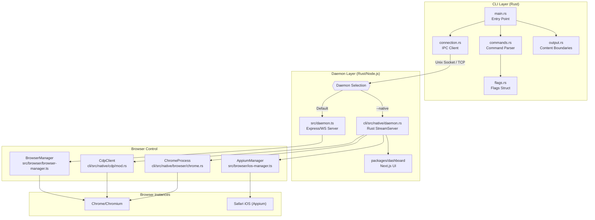

# Overview

Relevant source files

The following files were used as context for generating this wiki page:

- [CHANGELOG.md](CHANGELOG.md)
- [README.md](README.md)
- [cli/Cargo.lock](cli/Cargo.lock)
- [cli/Cargo.toml](cli/Cargo.toml)
- [cli/src/output.rs](cli/src/output.rs)
- [package.json](package.json)

## Purpose and Scope

`agent-browser` is a high-performance browser automation CLI designed specifically for AI agents. It provides a deterministic, ref-based interaction model that eliminates the brittleness of traditional CSS selectors, making it ideal for LLM-driven web navigation, data extraction, and automated testing. [package.json:2-4](), [README.md:3-4]()

The tool bridges the gap between high-level AI reasoning and low-level browser control by providing a persistent background daemon that maintains browser state across multiple CLI invocations. This architecture significantly reduces latency by eliminating the overhead of browser startup and context initialization for every command. [CHANGELOG.md:15-16](), [README.md:77]()

---

## What is agent-browser?

`agent-browser` is optimized for agents that need to "see" a page and "act" on it dynamically. Unlike standard automation tools built for human developers, it prioritizes accessibility trees and stable references over visual coordinates or complex DOM selectors. [README.md:85](), [README.md:138]()

**Core Design Principles:**

| Principle | Implementation |
|-----------|----------------|
| **AI-First** | The `snapshot` command generates accessibility trees with stable element references (`@e1`, `@e2`). [README.md:85](), [README.md:138]() |
| **Deterministic** | Interactions use these `@refs` which map directly to an internal `RefMap` generated during the last snapshot. [README.md:86-88](), [CHANGELOG.md:9]() |
| **Performance** | A native Rust CLI connects to a persistent background daemon. Warm command latency is optimized to ~1ms. [README.md:3-4](), [CHANGELOG.md:15-16]() |
| **Safety** | Built-in domain allowlists, action policies, and CSPRNG-based content boundaries protect against malicious page content. [cli/src/output.rs:8-17](), [CHANGELOG.md:45]() |

**Sources:** [README.md:1-5](), [package.json:4](), [cli/src/output.rs:8-17](), [CHANGELOG.md:15-16]()

---

## System Architecture

The system utilizes a client-daemon-browser architecture. The CLI acts as a lightweight frontend, while the daemon manages the browser lifecycle, maintains state (cookies, tabs), and handles element reference mapping. [CHANGELOG.md:69](), [CHANGELOG.md:76-77]()

### Code Entity Space Mapping

The following diagram maps high-level system components to their specific implementation files and modules within the codebase.

**Key Components:**

| Component | Responsibility |
|-----------|----------------|
| **Rust CLI** | Entry point for all user commands, handling parsing and output formatting. [cli/Cargo.toml:2-5]() |
| **Command Parser** | Maps CLI strings to structured command variants. [README.md:108-148]() |
| **IPC Client** | Manages the connection to the daemon via `UnixStream` or `TcpStream`. [cli/src/output.rs:4]() |
| **Content Boundaries**| Implements `BOUNDARY_NONCE` and `truncate_if_needed` for secure output. [cli/src/output.rs:11-17]() |
| **ChromeProcess** | Manages the OS-level browser process lifecycle and discovery. [README.md:77]() |
| **CdpClient** | Low-level Chrome DevTools Protocol implementation for direct browser control. [README.md:159]() |

**Sources:** [cli/src/output.rs:1-60](), [README.md:77-80](), [cli/Cargo.toml:1-40]()

---

## Command Execution Flow

When an agent issues a command (e.g., `agent-browser click @e1`), it follows a validated path from terminal input to browser execution.

```mermaid
graph LR
    subgraph "CLI Process (Rust)"
        ARGS["Argv Strings"]
        PARSE["commands::parse"]
        MERGE["flags::merge_config"]
        SEND["connection::send_command"]
    end
    
    subgraph "Daemon Process"
        RECV["Socket Listener"]
        VALIDATE["serde / protocol.ts<br/>Schema Validation"]
        ACTION["actions.ts / interaction.rs<br/>execute_command"]
        POLICY["policy.ts / policy.rs<br/>Security Check"]
    end
    
    subgraph "Browser Execution"
        EXEC["BrowserManager / CdpClient"]
        REFS["RefMap Resolution"]
    end
    
    ARGS --> PARSE
    PARSE --> MERGE
    MERGE --> SEND
    
    SEND -->|"JSON over IPC"| RECV
    RECV --> VALIDATE
    VALIDATE --> POLICY
    POLICY --> ACTION
    
    ACTION --> EXEC
    EXEC --> REFS
```

**Execution Stages:**
1. **Parsing**: Arguments are parsed into a structured command object. [README.md:112-148]()
2. **Merging**: Environment variables, CLI flags, and config files (`agent-browser.json`) are merged into the final `OutputOptions` or `Flags`. [cli/src/output.rs:27-33]()
3. **Validation**: The daemon validates the incoming JSON request against expected `Request` and `Response` structs. [cli/src/output.rs:4]()
4. **Policy Enforcement**: Before execution, the daemon verifies if the action is allowed (e.g., domain allowlists). [CHANGELOG.md:45-46]()
5. **Ref Resolution**: If a ref (like `@e1`) is used, the daemon looks up the actual element internal ID in the `RefMap` generated during the last `snapshot`. [README.md:85-86]()

**Sources:** [cli/src/output.rs:26-34](), [README.md:81-91](), [CHANGELOG.md:8-11]()

---

## Key Features

### 1. The Snapshot-Ref Workflow
The primary interaction method for AI. Instead of fragile CSS selectors, agents use `snapshot` to get an accessibility tree where interactive elements are assigned temporary IDs (e.g., `@e1`). [README.md:85](), [README.md:138]()

### 2. Persistent Daemon & Sessions
The daemon allows browser state (cookies, tabs, localStorage) to persist across multiple CLI calls. Named sessions enable isolation and the use of the `--state` flag to load saved profiles. [CHANGELOG.md:76-77](), [README.md:144-145]()

### 3. Security & Boundaries
Designed for untrusted environments where an agent might visit malicious sites:
- **Content Boundaries**: Uses a `BOUNDARY_NONCE` (CSPRNG) to wrap page content in CLI output, preventing prompt injection from spoofing the end of a command's output. [cli/src/output.rs:8-17]()
- **Output Truncation**: Prevents LLM context overflow by truncating large page outputs via `truncate_if_needed`. [cli/src/output.rs:36-59]()
- **Domain Allowlists**: Restricts navigation to approved domains via `AGENT_BROWSER_ALLOWED_DOMAINS`. [CHANGELOG.md:46]()

### 4. Advanced Introspection & Dashboard
- **React Introspection**: First-class React DevTools integration with commands like `react tree` and `react inspect <fiberId>` for full component-tree visibility. [CHANGELOG.md:42]()
- **Observability Dashboard**: A Next.js web UI for live session viewing and interactive debugging. [package.json:31](), [CHANGELOG.md:48]()
- **Web Vitals**: Reporting of Core Web Vitals (LCP, CLS, TTFB, FCP, INP) via the `vitals` command. [CHANGELOG.md:43](), [cli/src/output.rs:161-184]()

---

## Typical Interaction Sequence

```mermaid
sequenceDiagram
    participant A as AI Agent
    participant C as CLI (Rust)
    participant D as Daemon
    participant B as Browser (Chrome)
    
    A->>C: open "https://example.com"
    C->>D: navigate(url)
    D->>B: CDP: Page.navigate
    B-->>D: Load Event
    D-->>C: Response(Success)
    C-->>A: "Done"
    
    A->>C: snapshot
    C->>D: get_snapshot()
    D->>B: CDP: Accessibility.getFullAXTree
    B-->>D: AXTree Data
    D->>D: Map Interactive Elements to @e1, @e2...
    D-->>C: AXTree Text + RefMap
    C-->>A: "@e1 [button] 'Submit'"
    
    A->>C: click @e1
    C->>D: click(ref="@e1")
    D->>D: Resolve @e1 in RefMap
    D->>B: CDP: Input.dispatchMouseEvent
    B-->>D: Click Executed
    D-->>C: Response(Success)
    C-->>A: "Done"
```

**Sources:** [README.md:83-91](), [cli/src/output.rs:4-6](), [CHANGELOG.md:8-11]()

---

## Technical Stack Summary

| Layer | Technology | Key Code Entities |
|-------|------------|-------------------|
| **CLI** | Rust | `main.rs`, `commands.rs`, `flags.rs`, `output.rs` |
| **Daemon** | Rust / Node.js | `daemon.rs` (native), `daemon.ts`, `StreamServer` |
| **Automation** | CDP / Playwright | `CdpClient`, `BrowserManager`, `ChromeProcess` |
| **IPC** | Unix Sockets / TCP | `UnixStream`, `TcpStream`, `Response` [cli/src/output.rs:4]() |
| **Security** | AES-256-GCM / CSPRNG | `aes-gcm`, `BOUNDARY_NONCE` [cli/src/output.rs:6-12]() |
| **UI** | Next.js | `packages/dashboard` [package.json:31]() |

**Sources:** [cli/src/output.rs:1-60](), [CHANGELOG.md:42-48](), [package.json:1-32]()
