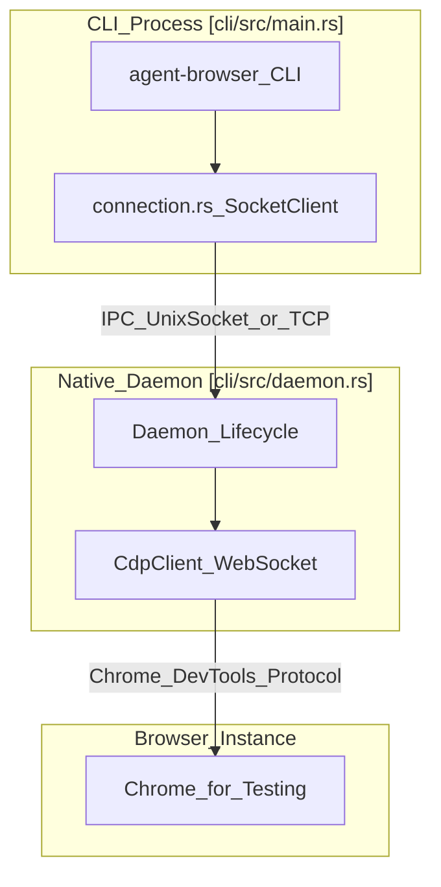
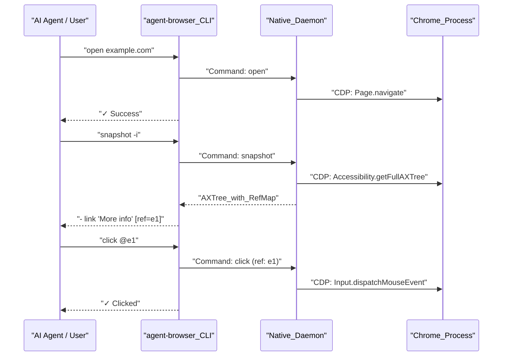

# Getting Started

<details>
<summary>Relevant source files</summary>

The following files were used as context for generating this wiki page:

- [.gitignore](.gitignore)
- [agent-browser.schema.json](agent-browser.schema.json)
- [bin/agent-browser.js](bin/agent-browser.js)
- [cli/src/install.rs](cli/src/install.rs)
- [cli/src/upgrade.rs](cli/src/upgrade.rs)
- [docs/src/app/configuration/page.mdx](docs/src/app/configuration/page.mdx)
- [pnpm-lock.yaml](pnpm-lock.yaml)
- [scripts/postinstall.js](scripts/postinstall.js)

</details>


This guide walks you through installing `agent-browser`, understanding its architecture, and executing your first commands. You will learn the core workflow pattern (open → snapshot → interact) and how to configure the tool for your needs.

For detailed installation instructions including platform-specific dependencies, see [Installation](#2.1). For an in-depth walkthrough of the recommended interaction pattern, see [Quick Start](#2.2). For configuration file syntax and precedence rules, see [Configuration](#2.3).

---

## Installation Overview

`agent-browser` is distributed as an npm package containing a native Rust CLI and daemon. The architecture is designed for maximum performance with minimal resource overhead [docs/src/app/page.mdx:1-4]().

**Quick Installation:**

```bash
# Global installation (recommended)
npm install -g agent-browser
agent-browser install  # Downloads Chromium (Chrome for Testing)
```

The installation process uses a `postinstall.js` script to detect your platform and download the appropriate native binary (e.g., `agent-browser-linux-x64`, `agent-browser-darwin-arm64`) [scripts/postinstall.js:34-39](). On global installs, it patches npm's bin entry to invoke the native binary directly for zero-overhead execution [scripts/postinstall.js:7-10](). If a system Chrome is already present, the tool will detect it automatically [scripts/postinstall.js:192-198]().

| Metric | Node.js (Legacy) | Rust (Current) | Improvement |
|------|-----------|-----------|-----------|
| Cold start | ~1000ms | ~600ms | ~1.6x faster |
| Daemon memory | ~140 MB | ~7-8 MB | ~18x less |
| Install size | ~700 MB | ~7 MB | 100x smaller |

For complete installation instructions including Chromium setup and system dependencies, see [Installation](#2.1).

**Sources:** [docs/src/app/installation/page.mdx:1-44](), [scripts/postinstall.js:1-50](), [scripts/postinstall.js:192-198](), [docs/src/app/page.mdx:1-26](), [bin/agent-browser.js:1-15]()

---

## Architecture: CLI, Daemon, and Browser

`agent-browser` uses a client-daemon architecture. The Rust CLI communicates with a persistent native Rust daemon that manages the browser via direct Chrome DevTools Protocol (CDP) [docs/src/app/page.mdx:54-61]().

**System Components:**



**Process Flow:**

1. **CLI Execution**: The user runs a command. The CLI parses flags and determines the session using the configuration hierarchy [docs/src/app/configuration/page.mdx:13-21]().
2. **Daemon Connectivity**: The CLI checks if a daemon is already running for the session. If not, it is spawned automatically [docs/src/app/page.mdx:61-61]().
3. **IPC Communication**: Commands are sent as JSON-based protocol messages over sockets. The Node.js wrapper `bin/agent-browser.js` handles spawning the native binary with inherited stdio if the native path is not directly called [bin/agent-browser.js:104-108]().
4. **Direct CDP**: The daemon communicates with Chrome using the Chrome DevTools Protocol, allowing for fine-grained control and efficient snapshotting [docs/src/app/page.mdx:59-59]().

**Sources:** [docs/src/app/page.mdx:54-61](), [bin/agent-browser.js:1-121](), [cli/src/install.rs:17-35](), [docs/src/app/configuration/page.mdx:9-21]()

---

## The Snapshot-Ref Workflow

The tool is optimized for AI agents using a **snapshot-ref pattern**. Instead of fragile CSS selectors, you take a snapshot of the accessibility tree which assigns temporary references (`@e1`, `@e2`) to interactive elements [docs/src/app/page.mdx:44-53]().

**Core Workflow Diagram:**



**Why Refs?**
- **Token Efficiency**: Compact text snapshots use ~200-400 tokens vs. thousands for raw HTML [docs/src/app/page.mdx:49-49]().
- **Determinism**: The AI refers to `@e1` rather than guessing a selector.
- **AI-friendly**: LLMs parse text output naturally, avoiding the complexity of DOM trees [docs/src/app/page.mdx:52-52]().

**Sources:** [docs/src/app/page.mdx:27-53](), [docs/src/app/installation/page.mdx:168-172]()

---

## Your First Session

**Step 1: Navigate**
```bash
agent-browser open https://example.com
```
This launches the browser and navigates. The session persists in the background [docs/src/app/page.mdx:31-31]().

**Step 2: Snapshot**
```bash
agent-browser snapshot -i
```
The `-i` (interactive) flag filters for interactive elements [docs/src/app/page.mdx:32-32](). You will see output like:
`- link "More information..." [ref=e1]`

**Step 3: Interact**
```bash
agent-browser click @e1
```
Use the `@` prefix to specify a reference from the previous snapshot [docs/src/app/page.mdx:39-39]().

**Step 4: Close**
```bash
agent-browser close
```
Shuts down the browser and the daemon for the current session [docs/src/app/page.mdx:41-41]().

**Sources:** [docs/src/app/page.mdx:27-42](), [docs/src/app/installation/page.mdx:168-172]()

---

## Configuration and Environment

`agent-browser` looks for configuration in `agent-browser.json`, global config files, or via environment variables prefixed with `AGENT_BROWSER_` [docs/src/app/configuration/page.mdx:7-19]().

| Priority | Source | Example |
|----------|--------|---------|
| 1 (High) | CLI Flags | `--headed`, `--session my-task` |
| 2 | Env Vars | `AGENT_BROWSER_SESSION=agent1` |
| 3 | Project Config | `./agent-browser.json` |
| 4 | Global Config | `~/.agent-browser/config.json` |

**Common Options:**
- `headed`: Show browser window instead of running headless [agent-browser.schema.json:7-10]().
- `sessionName`: Auto-save/load state persistence name [agent-browser.schema.json:23-26]().
- `executablePath`: Path to a custom browser executable [agent-browser.schema.json:27-30]().
- `allowedDomains`: Allowed domain patterns for security allowlisting [agent-browser.schema.json:112-118]().

For detailed configuration rules and a full list of options, see [Configuration](#2.3).

**Sources:** [docs/src/app/configuration/page.mdx:7-92](), [agent-browser.schema.json:1-170]()

---

## Next Steps

1. **[Installation](#2.1)** — Detailed setup for Linux, macOS, and Windows.
2. **[Quick Start](#2.2)** — Deep dive into the AI agent workflow and `SKILL.md`.
3. **[Configuration](#2.3)** — Reference for all environment variables and flags.

**Sources:** [docs/src/app/installation/page.mdx:1-128](), [docs/src/app/configuration/page.mdx:1-180]()
