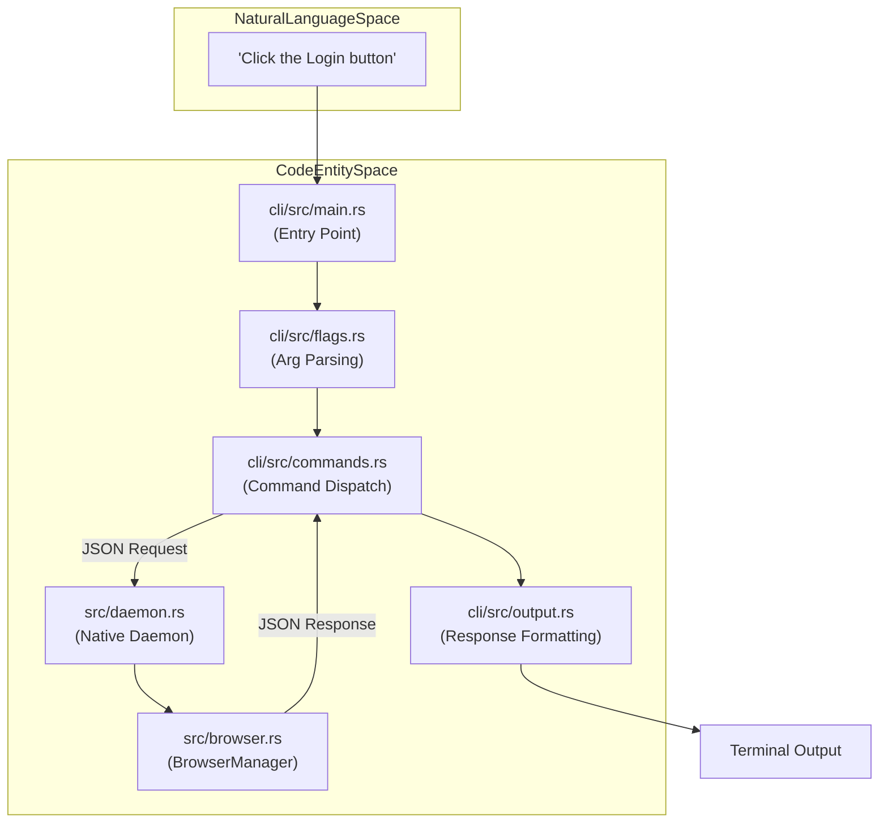
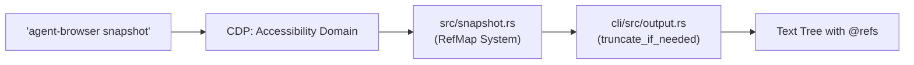

# Quick Start

<details>
<summary>Relevant source files</summary>

The following files were used as context for generating this wiki page:

- [README.md](README.md)
- [cli/src/output.rs](cli/src/output.rs)
- [docs/src/app/commands/page.mdx](docs/src/app/commands/page.mdx)
- [docs/src/app/quick-start/page.mdx](docs/src/app/quick-start/page.mdx)
- [docs/src/app/selectors/page.mdx](docs/src/app/selectors/page.mdx)
- [skills/agent-browser/SKILL.md](skills/agent-browser/SKILL.md)

</details>


This guide walks you through your first browser automation session with `agent-browser`. You will learn the core workflow: opening a page, taking a snapshot to discover elements, interacting using references (refs), and closing the browser. This workflow is specifically optimized for AI agents to reduce token usage and improve reliability.

**Scope**: This page covers basic command-line usage and the underlying implementation of the snapshot-interaction pattern.

---

## Prerequisites

Ensure `agent-browser` is installed and the browser binary is downloaded. The `install` command downloads a specific version of Chromium from "Chrome for Testing" to ensure compatibility.

```bash
npm install -g agent-browser
agent-browser install
```

On Linux systems, you may need to install additional system dependencies:
```bash
agent-browser install --with-deps
```

**Sources**: [README.md:9-16](), [README.md:57-63](), [README.md:75-77]()

---

## Core Workflow

The `agent-browser` workflow follows a pattern of discovery followed by action. Unlike traditional selector-based automation, you first capture the page state to generate ephemeral references, then use those references for deterministic interaction.

### Workflow Diagram: Natural Language to Code Execution

This diagram bridges the gap between a user's intent and the specific code entities that handle each stage of the lifecycle.

Title: Intent to Execution Flow


**Sources**: [README.md:81-91](), [cli/src/output.rs:133-172]()

---

## Step 1: Open a Page

Start by navigating to a URL. The CLI communicates with a background daemon that manages the browser lifecycle.

```bash
agent-browser open https://example.com
```

**Implementation Detail**:
The `open` command (aliased as `goto` or `navigate`) launches the browser and performs the navigation. If no URL is provided, it stays on `about:blank`. To see the browser window for debugging, use the `--headed` flag.

**Sources**: [README.md:113-114](), [docs/src/app/commands/page.mdx:6-7](), [docs/src/app/quick-start/page.mdx:47-53]()

---

## Step 2: Take a Snapshot

Capture the page's interactive elements. This generates a compact representation of the accessibility tree and assigns "refs" (like `@e1`, `@e2`) to interactive elements.

```bash
agent-browser snapshot
```

**Example Output**:
```text
- heading "Example Domain" [ref=e1] [level=1]
- link "More information..." [ref=e2]
```

The `snapshot` command is the primary tool for AI agents to "see" the page. It extracts the accessibility tree via the CDP (Chrome DevTools Protocol) Accessibility domain.

### Snapshot Data Flow

Title: Snapshot Generation Pipeline


**Key Concepts**:
- **Ref Assignment**: Refs are assigned fresh on every snapshot. They become **stale** if the page changes or navigates. [README.md:93-95]()
- **Output Truncation**: To protect LLM context windows, the CLI truncates large outputs via `truncate_if_needed` [cli/src/output.rs:36-59]() based on the `max_output` flag. [cli/src/output.rs:20-33]()
- **Content Boundaries**: For security, outputs can be wrapped in `BOUNDARY_NONCE` (CSPRNG nonces) to prevent untrusted page content from spoofing delimiters. [cli/src/output.rs:6-17](), [cli/src/output.rs:61-75]()

**Sources**: [cli/src/output.rs:6-59](), [docs/src/app/quick-start/page.mdx:11-22](), [docs/src/app/selectors/page.mdx:3-21]()

---

## Step 3: Interact with Elements

Use the refs discovered in the snapshot to perform actions. Refs are ephemeral and tied to the current page state.

```bash
agent-browser click @e2
agent-browser fill @e3 "test@example.com"
```

**Why this is better than CSS selectors**:
- **Deterministic**: The ref points to the exact element found during the snapshot. [docs/src/app/selectors/page.mdx:25]()
- **AI-friendly**: LLMs can reliably parse and use `@eN` refs rather than complex CSS paths. [docs/src/app/selectors/page.mdx:27]()
- **Fast**: Avoids expensive DOM re-queries. [docs/src/app/selectors/page.mdx:26]()

**Interaction Types**:
- `click <sel>`: Standard click. [README.md:115]()
- `fill <sel> <text>`: Clears the input and fills it. [README.md:119]()
- `type <sel> <text>`: Appends text. [README.md:118]()
- `get text <sel>`: Retrieves the text content of an element. [README.md:153]()

**Sources**: [README.md:83-88](), [docs/src/app/selectors/page.mdx:23-28]()

---

## Step 4: Close the Browser

To clean up resources and terminate the background daemon, use the `close` command.

```bash
agent-browser close
```

You can also use `close --all` to terminate all active sessions managed by the daemon.

**Sources**: [README.md:144-145](), [docs/src/app/commands/page.mdx:37-38]()

---

## Command Chaining and Persistence

For efficiency, you can chain multiple commands in a single shell invocation using `&&`. Since the daemon maintains the browser state between CLI calls, the session persists.

```bash
# Open, wait for network idle, and snapshot in one call
agent-browser open example.com && agent-browser wait --load networkidle && agent-browser snapshot
```

### Important: Waiting for Content
AI agents often fail due to interacting before a page is ready. Always use `wait` after navigation:
- `wait <selector>`: Wait for a specific element (or ref) to appear. [docs/src/app/commands/page.mdx:108]()
- `wait --load networkidle`: Wait for network activity to settle. [docs/src/app/commands/page.mdx:112]()
- `wait <ms>`: Wait for a specific duration in milliseconds. [docs/src/app/commands/page.mdx:109]()

**Sources**: [docs/src/app/commands/page.mdx:108-117](), [docs/src/app/quick-start/page.mdx:55-79]()

---

## Quick Reference Table

| Task | Command | Description |
| :--- | :--- | :--- |
| **Navigate** | `open <url>` | Launch and go to URL |
| **Snapshot** | `snapshot` | Get accessibility tree with `@refs` |
| **Click** | `click @e1` | Click element by reference |
| **Fill** | `fill @e2 "val"` | Clear and fill input |
| **Wait** | `wait --load networkidle` | Wait for page to finish loading |
| **Screenshot** | `screenshot img.png` | Capture current viewport |
| **Get Info** | `get text @e1` | Extract text from a specific ref |
| **Close** | `close` | Terminate browser session |

**Sources**: [README.md:113-163](), [docs/src/app/commands/page.mdx:1-62]()
