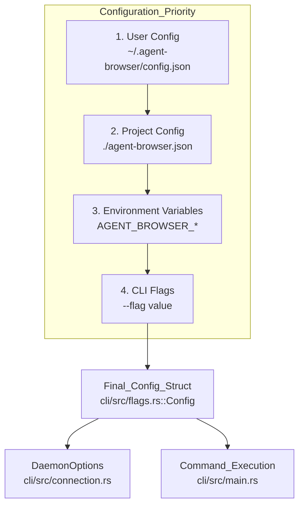
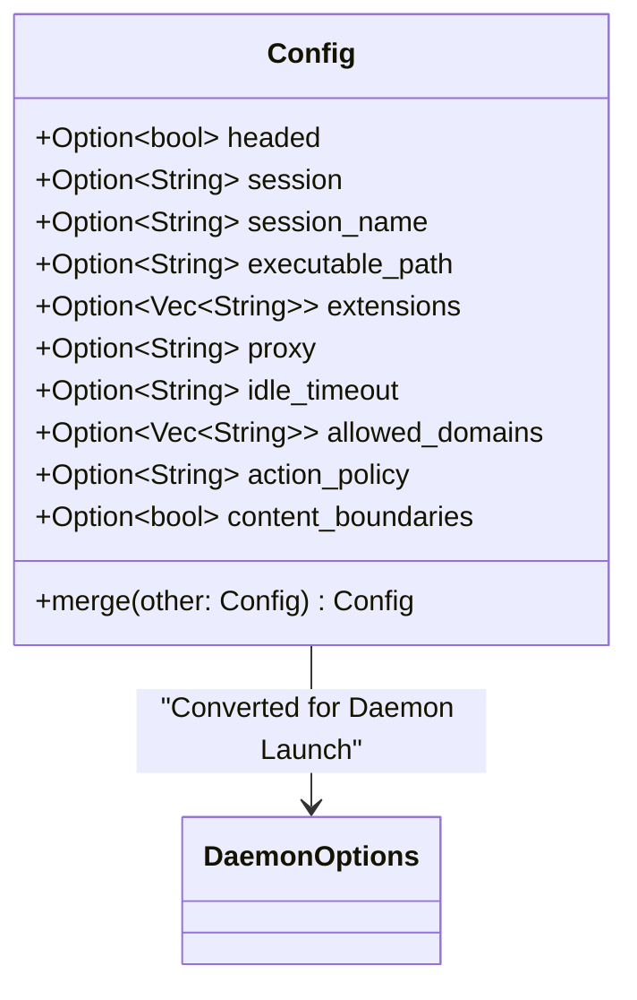
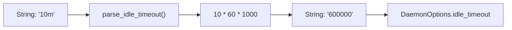
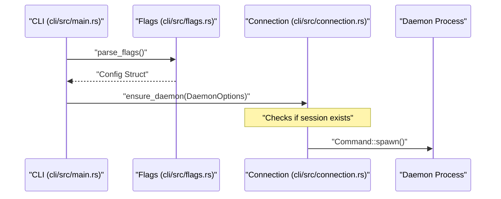

# Configuration

Relevant source files

The following files were used as context for generating this wiki page:

- [agent-browser.schema.json](agent-browser.schema.json)
- [cli/src/connection.rs](cli/src/connection.rs)
- [cli/src/flags.rs](cli/src/flags.rs)
- [cli/src/main.rs](cli/src/main.rs)
- [docs/public/schema.json](docs/public/schema.json)
- [docs/src/app/configuration/page.mdx](docs/src/app/configuration/page.mdx)

This page documents the configuration system used by `agent-browser`, including the configuration hierarchy, environment variables, and the technical implementation of the configuration loading pipeline.

## Configuration Hierarchy

`agent-browser` uses a four-tier configuration precedence model. Values from higher-priority sources override those from lower-priority sources.

Title: Configuration Precedence Flow

**Precedence Rules:**
1. **User Config**: Located at `~/.agent-browser/config.json`. Useful for machine-wide defaults like `headed: true` [docs/src/app/configuration/page.mdx:14]().
2. **Project Config**: Located at `./agent-browser.json`. Specific to the current working directory [docs/src/app/configuration/page.mdx:15]().
3. **Environment Variables**: Variables prefixed with `AGENT_BROWSER_` override file-based configurations [docs/src/app/configuration/page.mdx:16]().
4. **CLI Flags**: Explicit flags passed to the command always take the highest priority [docs/src/app/configuration/page.mdx:17]().

**Sources:** [docs/src/app/configuration/page.mdx:7-21](), [cli/src/flags.rs:7-9]()

## Technical Implementation

### Data Structures

The configuration is managed via the `Config` struct in `cli/src/flags.rs`. This struct uses `serde` for deserialization and provides a `merge` method for combining layers.

Title: Config Entity Mapping

**Sources:** [cli/src/flags.rs:53-94](), [cli/src/flags.rs:97-157]()

### Loading Pipeline

The loading process occurs in `cli/src/flags.rs` and follows these steps:

1. **Path Discovery**: The CLI checks for an explicit `--config <path>` flag or the `AGENT_BROWSER_CONFIG` environment variable [docs/src/app/configuration/page.mdx:23-28]().
2. **File Reading**: `read_config_file` uses `fs::read_to_string` and `serde_json` to parse the JSON content into a `Config` instance [cli/src/flags.rs:159-179]().
3. **Merging**: `Config::merge` implements the override logic. Most fields are replaced by the "other" (higher priority) config, but `extensions`, `init_scripts`, and `enable` are **concatenated** [cli/src/flags.rs:105-125]().
4. **Boolean Interpretation**: The CLI handles boolean flags flexibly. `env_var_is_truthy` treats "0", "false", "no", or empty strings as false [cli/src/flags.rs:183-200](). 

**Sources:** [cli/src/flags.rs:97-200](), [docs/src/app/configuration/page.mdx:152-157]()

## Configuration Options Reference

Every CLI flag can be set in the config file using its camelCase equivalent [docs/src/app/configuration/page.mdx:53-54]().

| Config Key (JSON) | CLI Flag | Type | Description |
| :--- | :--- | :--- | :--- |
| `headed` | `--headed` | boolean | Show browser window instead of running headless [agent-browser.schema.json:7-10]() |
| `session` | `--session` | string | Session identifier [agent-browser.schema.json:19-22]() |
| `sessionName` | `--session-name` | string | Auto-save/load state persistence name [agent-browser.schema.json:23-26]() |
| `executablePath` | `--executable-path` | string | Path to custom browser binary [agent-browser.schema.json:27-30]() |
| `extensions` | `--extension` | string[] | List of extension paths [agent-browser.schema.json:31-37]() |
| `proxy` | `--proxy` | string | Proxy server URL [agent-browser.schema.json:46-49]() |
| `idleTimeout` | `--idle-timeout` | string | Auto-shutdown duration (e.g., "10s", "1h") [agent-browser.schema.json:152-155]() |
| `allowedDomains` | `--allowed-domains` | string[] | Domain allowlist for security [agent-browser.schema.json:112-118]() |
| `contentBoundaries` | `--content-boundaries` | boolean | Wrap page output in safety markers [agent-browser.schema.json:103-106]() |
| `actionPolicy` | `--action-policy` | string | Path to `policy.json` [agent-browser.schema.json:119-122]() |
| `model` | `--model` | string | AI model for the `chat` command [agent-browser.schema.json:157-159]() |
| `engine` | `--engine` | string | Browser engine (`chrome`, `lightpanda`) [agent-browser.schema.json:131-136]() |

**Sources:** [agent-browser.schema.json:1-167](), [docs/src/app/configuration/page.mdx:55-101](), [cli/src/flags.rs:55-95]()

## Environment-Specific Variables

Several variables control low-level behavior and directory locations:

### Directory Management
- `AGENT_BROWSER_SOCKET_DIR`: Overrides the base directory for `.sock`, `.pid`, and `.version` files. Priority: `AGENT_BROWSER_SOCKET_DIR` > `XDG_RUNTIME_DIR` > `~/.agent-browser` > `tmpdir` [cli/src/connection.rs:91-115]().

### Security & AI Safety
- `AGENT_BROWSER_ALLOWED_DOMAINS`: Comma-separated list of domains the agent is permitted to visit [docs/src/app/configuration/page.mdx:88]().
- `AGENT_BROWSER_CONTENT_BOUNDARIES`: Enables CSPRNG nonces to wrap AI output for protection against malicious content [docs/src/app/configuration/page.mdx:86]().
- `AGENT_BROWSER_ACTION_POLICY`: Path to the action policy file [docs/src/app/configuration/page.mdx:89]().

### Runtime Behavior
- `AGENT_BROWSER_AUTO_CONNECT`: Auto-discover and connect to a running Chrome instance [docs/src/app/configuration/page.mdx:82]().
- `AGENT_BROWSER_DOWNLOAD_PATH`: Sets the default directory for browser downloads [docs/src/app/configuration/page.mdx:85]().
- `AGENT_BROWSER_COLOR_SCHEME`: Sets preferred color scheme (`dark`, `light`, `no-preference`) [docs/src/app/configuration/page.mdx:84]().

**Sources:** [cli/src/connection.rs:91-115](), [docs/src/app/configuration/page.mdx:56-101]()

## Implementation: `idle_timeout` Parsing

The `idle_timeout` configuration supports human-readable strings. The `parse_idle_timeout` function in `cli/src/flags.rs` converts these into milliseconds before they are processed [cli/src/flags.rs:13-36]().

Title: Idle Timeout Transformation

**Sources:** [cli/src/flags.rs:13-36]()

## Daemon Forwarding

When the CLI starts a new daemon, it maps the resolved configuration into the `DaemonOptions` struct. These options are then used to spawn the daemon process with the appropriate environment and arguments.

Title: Configuration to Daemon Spawning

**Sources:** [cli/src/main.rs:27-31](), [cli/src/connection.rs:27-30]()
