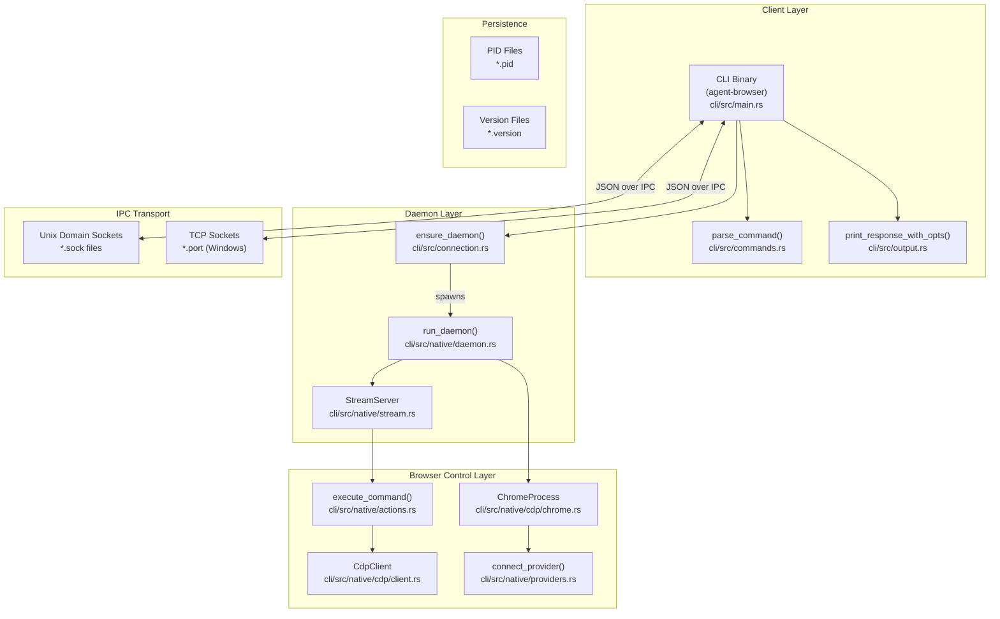
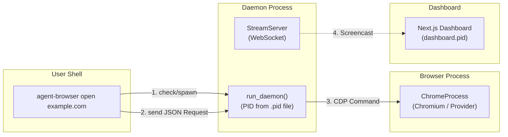

# Architecture

Relevant source files

The following files were used as context for generating this wiki page:

- [cli/src/connection.rs](cli/src/connection.rs)
- [cli/src/flags.rs](cli/src/flags.rs)
- [cli/src/main.rs](cli/src/main.rs)
- [cli/src/native/actions.rs](cli/src/native/actions.rs)
- [cli/src/native/browser.rs](cli/src/native/browser.rs)
- [cli/src/native/cdp/chrome.rs](cli/src/native/cdp/chrome.rs)
- [cli/src/native/cdp/client.rs](cli/src/native/cdp/client.rs)
- [cli/src/native/daemon.rs](cli/src/native/daemon.rs)
- [cli/src/native/e2e_tests.rs](cli/src/native/e2e_tests.rs)
- [cli/src/native/providers.rs](cli/src/native/providers.rs)

This document describes the overall system architecture of agent-browser, including its multi-layered design, client-daemon model, IPC mechanisms, and component interactions. For detailed information on specific architectural components, see:

- [System Overview](#3.1) — High-level architecture and data flow.
- [CLI Client (Rust)](#3.2) — Command-line interface implementation details.
- [Daemon Layer](#3.3) — Daemon lifecycle and process management.
- [Browser Control](#3.4) — Browser abstraction and control mechanisms.
- [Communication Protocol](#3.5) — JSON-based command protocol specification.

## Design Philosophy

Agent-browser uses a **persistent daemon architecture** to minimize browser startup overhead. The CLI client is a lightweight Rust binary that communicates with a long-running daemon process via IPC. This design enables:

- **Fast command execution**: No browser restart between commands (typical latency <100ms).
- **Session isolation**: Multiple independent browser sessions via separate daemon instances identified by session names [cli/src/main.rs:201-245]().
- **State persistence**: Automatic save/restore of cookies and storage state [cli/src/flags.rs:127-128]().
- **Resource efficiency**: Single browser instance shared across multiple CLI invocations.
- **AI-Native Security**: Content boundary markers and output truncation to protect LLMs from malicious page content [cli/src/flags.rs:82-83]().

The system is primarily implemented in Rust for performance, with an observability dashboard that can be launched as a sidecar process [cli/src/main.rs:247-252]().

Sources: [cli/src/main.rs:1-245](), [cli/src/connection.rs:1-115](), [cli/src/flags.rs:53-95]()

## Component Architecture

The system is organized into three primary layers:

**System Component Diagram**

**Key Components:**

| Component | Implementation | Purpose |
|-----------|---------------|---------|
| `agent-browser` CLI | Rust binary ([cli/src/main.rs]()) | Entry point, parses flags and commands, manages daemon lifecycle. |
| `parse_command()` | Rust ([cli/src/commands.rs:26-26]()) | Maps CLI arguments to JSON protocol actions. |
| `ensure_daemon()` | Rust ([cli/src/connection.rs:27-29]()) | Logic to find an existing daemon or spawn a new one for a session. |
| `run_daemon()` | Rust ([cli/src/native/daemon.rs:19-19]()) | Main loop for the long-running process that owns the browser. |
| `ChromeProcess` | Rust ([cli/src/native/cdp/chrome.rs:8-15]()) | Manages the OS process lifecycle of the Chromium instance. |
| `CdpClient` | Rust ([cli/src/native/cdp/client.rs:29-46]()) | Handles the WebSocket connection to the browser's CDP port. |
| `connect_provider()` | Rust ([cli/src/native/providers.rs:26-26]()) | Connects to remote browser clouds (Browserbase, etc.). |

Sources: [cli/src/main.rs:26-36](), [cli/src/connection.rs:93-124](), [cli/src/native/daemon.rs:19-150](), [cli/src/native/cdp/chrome.rs:8-61](), [cli/src/native/providers.rs:26-73]()

## Process Model

The system uses a **multi-process architecture** to ensure the browser remains responsive across multiple CLI calls:

**Process Interaction Diagram**

**Process Lifecycle:**

1. **CLI Invocation**: User runs a command. The CLI parses flags [cli/src/main.rs:31-31]() and command arguments [cli/src/main.rs:26-26]().
2. **Daemon Coordination**: The CLI checks for a `.pid` file in the socket directory via `get_pid_path` [cli/src/connection.rs:122-124](). If the process is not alive [cli/src/connection.rs:157-175](), it spawns a new daemon.
3. **Daemon Initialization**: The daemon creates sidecar files (`.pid`, `.version`, `.sock`/`.port`) [cli/src/native/daemon.rs:62-70]() and starts a `StreamServer` for real-time observation [cli/src/native/daemon.rs:102-109]().
4. **Browser Launch**: Upon the first navigation or explicit launch, the daemon spawns a `ChromeProcess` [cli/src/native/cdp/chrome.rs:8-15]() or `LightpandaProcess` [cli/src/native/browser.rs:11-11]() with specific `LaunchOptions` [cli/src/native/cdp/chrome.rs:90-116]().
5. **Cleanup**: On exit, the daemon kills the Chrome process group to prevent orphaned processes [cli/src/native/cdp/chrome.rs:18-31]().

Sources: [cli/src/main.rs:26-32](), [cli/src/connection.rs:122-175](), [cli/src/native/daemon.rs:62-145](), [cli/src/native/cdp/chrome.rs:18-31]()

## Inter-Process Communication (IPC)

Communication between the CLI and daemon uses **line-delimited JSON** over platform-specific transports:

- **Unix Platforms**: Uses Unix Domain Sockets (`.sock`) [cli/src/connection.rs:117-120]().
- **Windows**: Uses TCP sockets with a port stored in a `.port` file [cli/src/connection.rs:145-149]().
- **Protocol**: The CLI sends a `Request` struct containing an `id`, `action`, and `extra` parameters [cli/src/connection.rs:22-27](). The daemon responds with a `Response` JSON object [cli/src/connection.rs:29-36]().

Sources: [cli/src/connection.rs:20-150](), [cli/src/native/daemon.rs:68-87]()

## Configuration and Flags

The architecture supports a layered configuration approach handled by the `Config` struct [cli/src/flags.rs:53-95]().

- **Environment Variables**: Variables like `AGENT_BROWSER_SOCKET_DIR` [cli/src/connection.rs:93-100]() or `AGENT_BROWSER_DEBUG` [cli/src/native/daemon.rs:29-29]() configure the runtime environment.
- **Config Files**: Supports global `~/.agent-browser/config.json` and project-local `agent-browser.json` [cli/src/flags.rs:7-9]().
- **Cloud Providers**: The system abstracts browser backends, supporting local Chrome or cloud providers like Browserbase and Browserless via `connect_provider` [cli/src/native/providers.rs:26-73]().

Sources: [cli/src/flags.rs:7-95](), [cli/src/connection.rs:93-115](), [cli/src/native/providers.rs:26-73]()

## Security and Reliability

- **Process Isolation**: Chrome is spawned in its own process group; on Unix, `libc::kill(-pgid, libc::SIGKILL)` is used to ensure Chrome helper processes are terminated [cli/src/native/cdp/chrome.rs:24-29]().
- **Content Boundaries**: Uses CSPRNG nonces to wrap page content, preventing untrusted web content from spoofing CLI output [cli/src/flags.rs:82-82]().
- **Idle Shutdown**: The daemon supports an `idle_timeout` mechanism to auto-shutdown after a period of inactivity [cli/src/native/daemon.rs:117-120]().
- **Action Policies**: destructive actions can be gated by an `ActionPolicy` [cli/src/native/actions.rs:29-29]().

Sources: [cli/src/flags.rs:53-95](), [cli/src/native/daemon.rs:117-120](), [cli/src/native/cdp/chrome.rs:18-31]()
