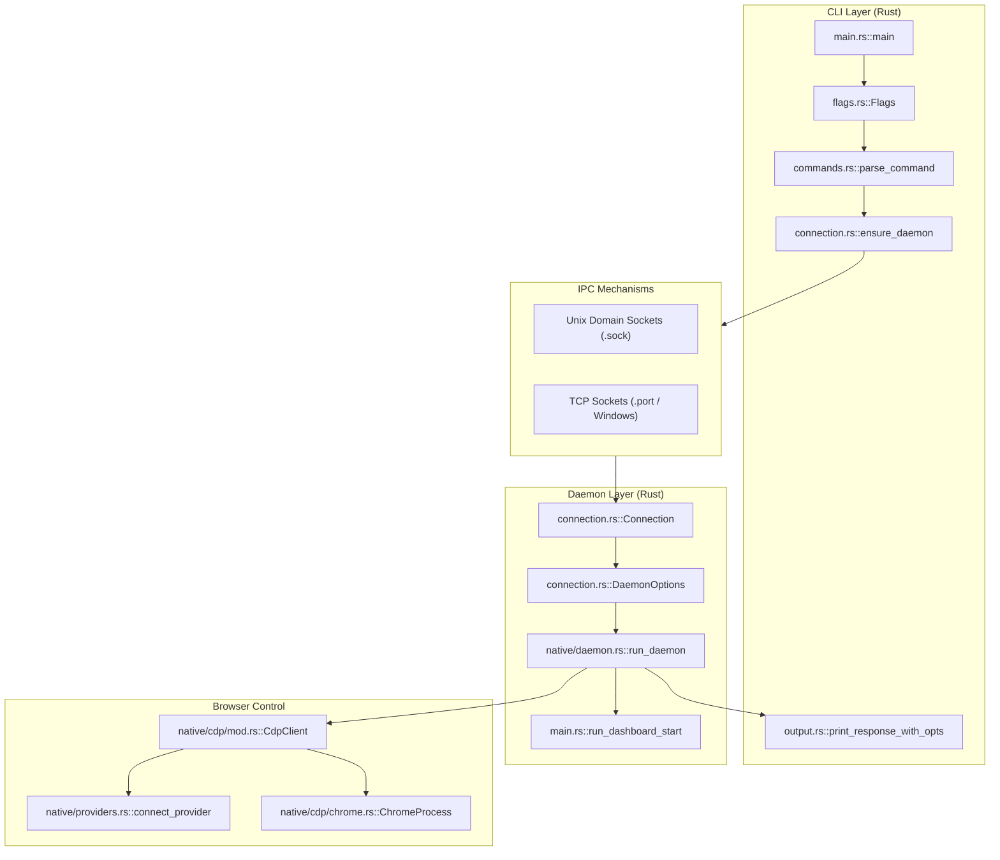
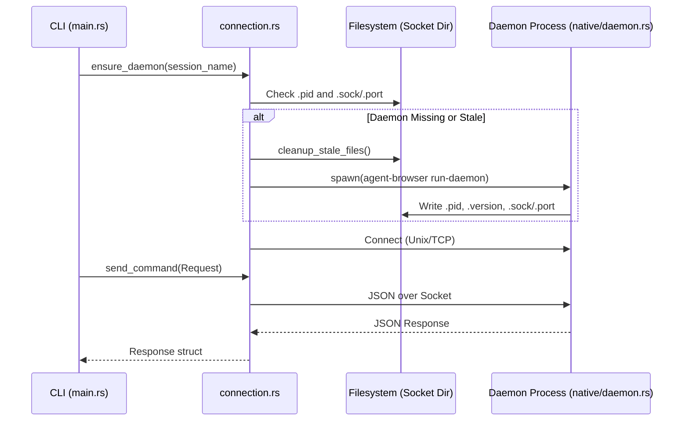

# System Overview

Relevant source files

The following files were used as context for generating this wiki page:

- [CHANGELOG.md](CHANGELOG.md)
- [cli/src/connection.rs](cli/src/connection.rs)
- [cli/src/flags.rs](cli/src/flags.rs)
- [cli/src/main.rs](cli/src/main.rs)
- [cli/src/native/mod.rs](cli/src/native/mod.rs)
- [package.json](package.json)

## Purpose and Scope

This document provides a high-level overview of the `agent-browser` system architecture, explaining how components interact to provide browser automation capabilities for AI agents. It covers the three-layer architecture (CLI, daemon, browser control), inter-process communication (IPC) mechanisms, and session management. 

`agent-browser` is built as a high-performance native Rust tool designed to be fast, secure, and compatible with AI agent workflows. It significantly reduces latency compared to Node.js-based alternatives, with warm CLI command latency cut to approximately 1ms [CHANGELOG.md:15-16]().

For detailed information about specific components:
- CLI implementation details: see [CLI Client (Rust) (3.2)]()
- Daemon implementation: see [Daemon Layer (3.3)]()
- Browser control specifics: see [Browser Control (3.4)]()
- Communication protocol details: see [Communication Protocol (3.5)]()

## Architecture Layers

`agent-browser` is structured as a client-server system with three distinct layers. The CLI acts as a lightweight frontend that communicates with a persistent background daemon via a JSON-based protocol.

### High-Level Component Interaction

The following diagram bridges the natural language command space to the code entities responsible for execution.

**Sources:**
- [cli/src/main.rs:1-36]()
- [cli/src/connection.rs:39-43]()
- [cli/src/flags.rs:53-95]()
- [cli/src/native/mod.rs:1-44]()

### Layer 1: CLI Client (Rust)

The CLI client is a native Rust binary providing the user-facing interface. It handles configuration merging from multiple sources (environment variables, config files, and CLI flags) and manages the daemon lifecycle.

| Component | File | Purpose |
|-----------|------|---------|
| Entry point | [cli/src/main.rs:1-36]() | Main entry, CLI command routing, and initialization. |
| Command parser | [cli/src/commands.rs:26-26]() | Maps CLI strings (e.g., `click @e1`) to JSON `Request` objects. |
| Flag processor | [cli/src/flags.rs:53-95]() | Implements `Config` struct and precedence logic (Env > Config > Flag). |
| IPC client | [cli/src/connection.rs:352-380]() | Manages `UnixStream` or `TcpStream` connections to the daemon. |
| Output formatter | [cli/src/output.rs:133-172]() | Formats `Response` data and enforces security boundaries. |

**Sources:**
- [cli/src/flags.rs:97-159]()
- [cli/src/connection.rs:22-27]()
- [cli/src/main.rs:26-31]()

### Layer 2: Daemon (Native Rust)

The daemon is a persistent background process that maintains the browser instance and executes commands. 

*   **Native Rust Daemon**: The system is 100% native Rust by default. The daemon is invoked via `agent-browser run-daemon` [cli/src/connection.rs:302-310]().
*   **Observability Dashboard**: The CLI can launch a dashboard process [cli/src/main.rs:251-280]() which provides a web UI for inspecting sessions, viewports, and network activity. It supports proxy origins for deployment behind reverse proxies [CHANGELOG.md:48-48]().
*   **Lifecycle Management**: The daemon tracks its own version via a `.version` file [cli/src/connection.rs:126-128]() and the CLI checks for version consistency during the connection phase [cli/src/connection.rs:223-229](). It also includes a `doctor` command for diagnosing environment and daemon health [CHANGELOG.md:69-69]().

**Sources:**
- [cli/src/connection.rs:121-125]()
- [cli/src/main.rs:251-252]()
- [cli/src/native/mod.rs:12-12]()
- [CHANGELOG.md:48-48]()

### Layer 3: Browser Control

This layer abstracts the underlying automation engine and browser instance.

- **Local Browsers**: Automatic discovery of Chrome installations and profile management [cli/src/main.rs:143-156]().
- **Cloud Providers**: Support for external browser providers (e.g., Browserbase, Browserless) via the `provider` configuration [cli/src/flags.rs:71-71]().
- **CDP Integration**: Direct communication with the browser via the Chrome DevTools Protocol (CDP), enabling low-level control over the browser process [cli/src/flags.rs:76-76]().
- **Advanced Features**: Includes first-class React DevTools integration (`react tree`, `react inspect`) and Web Vitals reporting (`vitals`) [CHANGELOG.md:42-43]().

**Sources:**
- [cli/src/main.rs:146-156]()
- [cli/src/flags.rs:53-95]()
- [CHANGELOG.md:42-43]()

## Inter-Process Communication

### Connection Lifecycle

The CLI ensures a daemon is available for the requested session before sending commands. It handles stale socket discovery by retrying once to minimize latency [CHANGELOG.md:15-16]().

**Sources:**
- [cli/src/connection.rs:131-150]()
- [cli/src/connection.rs:352-380]()
- [cli/src/connection.rs:157-175]()
- [CHANGELOG.md:15-16]()

### Transport Details

| Platform | Mechanism | Location / Discovery |
|----------|-----------|----------------------|
| **Unix** | Unix Domain Socket | `get_socket_dir()/{session}.sock` [cli/src/connection.rs:118-120]() |
| **Windows** | TCP Loopback | Port derived via `get_port_path` and local file storage [cli/src/connection.rs:146-148]() |

The socket directory priority is: `AGENT_BROWSER_SOCKET_DIR` > `XDG_RUNTIME_DIR` > `~/.agent-browser` > `tmp` [cli/src/connection.rs:93-115]().

## Session Management

### The Session Model
`agent-browser` uses a multi-session model where each session name maps to a unique daemon/browser instance.

- **Default Session**: Used if no `--session` flag is provided.
- **Named Sessions**: Managed via the `session` or `session_name` configuration [cli/src/flags.rs:59-60]().
- **Stable Tab IDs**: Tabs within a session use stable string IDs (e.g., `t1`, `t2`) that persist even if earlier tabs are closed [CHANGELOG.md:70-70]().
- **Isolation**: Each session maintains its own IPC socket, PID file, and version marker [cli/src/connection.rs:122-128]().
- **State Persistence**: Sessions can persist state (cookies and localStorage) to a file via the `state` flag [cli/src/flags.rs:66-66]() or utilize existing browser profiles [cli/src/flags.rs:65-65]().

**Sources:**
- [cli/src/flags.rs:53-95]()
- [cli/src/connection.rs:121-125]()
- [CHANGELOG.md:70-70]()

## Command Flow and Data Security

### End-to-End Command Execution
1.  **Parsing**: CLI parses input strings into command structures [cli/src/commands.rs:26-26]().
2.  **Request Generation**: Commands are converted to a JSON `Request` containing an `id`, `action`, and extra parameters [cli/src/connection.rs:22-27]().
3.  **IPC**: The `Request` is serialized and sent to the daemon over the `Connection` [cli/src/connection.rs:39-43]().
4.  **Execution**: The daemon executes the action against the browser.
5.  **Security Wrapping**: If `content_boundaries` is enabled, `output.rs` wraps page content in a cryptographically secure nonce generated via `get_boundary_nonce()` to prevent LLM prompt injection [cli/src/output.rs:11-17](), [cli/src/output.rs:61-75]().
6.  **Truncation**: Large outputs are truncated based on `max_output` settings via `truncate_if_needed` to protect LLM context windows [cli/src/output.rs:36-59]().

**Sources:**
- [cli/src/output.rs:8-17]()
- [cli/src/output.rs:61-75]()
- [cli/src/connection.rs:22-27]()
