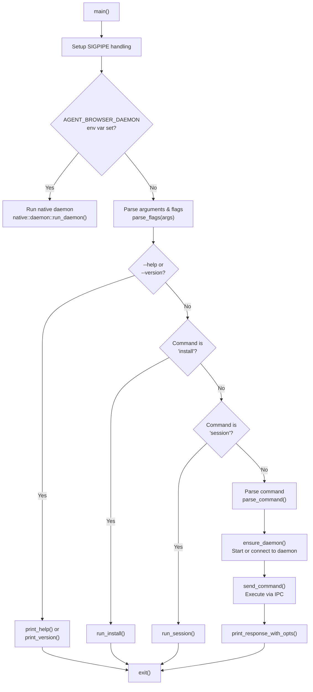
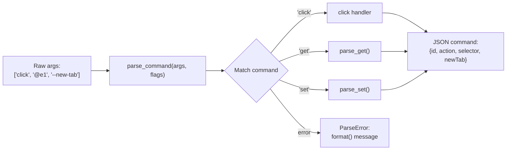

# CLI Client (Rust)

<details>
<summary>Relevant source files</summary>

The following files were used as context for generating this wiki page:

- [README.md](README.md)
- [cli/src/commands.rs](cli/src/commands.rs)
- [cli/src/connection.rs](cli/src/connection.rs)
- [cli/src/flags.rs](cli/src/flags.rs)
- [cli/src/main.rs](cli/src/main.rs)
- [cli/src/output.rs](cli/src/output.rs)

</details>


The CLI client is the primary user-facing component of agent-browser, implemented in Rust for zero-overhead execution and cross-platform distribution. It handles command-line argument parsing, configuration loading, daemon lifecycle management, and output formatting. The client communicates with the daemon layer via IPC (Unix sockets or TCP) to execute browser automation commands.

For the daemon layer architecture that the CLI communicates with, see [3.3 Daemon Layer](). For the communication protocol details, see [3.5 Communication Protocol]().

---

## Entry Point and Execution Flow

The CLI client begins execution at `main.rs`. The `main` function orchestrates several initialization steps before command execution:

**Initialization Sequence:**

1.  **Signal Handling** - Ignore `SIGPIPE` to prevent panic when output is piped to tools like `head` or `tail` [cli/src/main.rs:360-363]().
2.  **Path Translation Prevention** - On Windows, disable MSYS/Git Bash path mangling to ensure consistent URL and selector handling [cli/src/main.rs:366-370]().
3.  **Daemon Mode Detection** - If the `AGENT_BROWSER_DAEMON` environment variable is set, the process executes the native Rust daemon logic instead of the client logic [cli/src/main.rs:373-384]().
4.  **Argument Collection** - Parse command-line arguments and flags via `parse_flags` [cli/src/main.rs:386-388]().
5.  **Help/Version Handling** - Short-circuit for `--help` or `--version` flags [cli/src/main.rs:390-406]().

### CLI Execution Flow
Title: CLI Execution Flow (`main.rs`)


**Sources:** [cli/src/main.rs:358-1004](), [cli/src/flags.rs:256-587]()

---

## Command Parsing

The command parser transforms cleaned command-line arguments into structured JSON commands that conform to the daemon protocol. The parser is implemented in `commands.rs` with the main entry point being `parse_command` [cli/src/commands.rs:74-89]().

### Parse Error Types

The parser uses a typed error system `ParseError` [cli/src/commands.rs:11-31]() to provide contextual error messages:

| Error Type | Triggered When | Example |
| :--- | :--- | :--- |
| `UnknownCommand` | Command does not exist | `agent-browser foobar` |
| `UnknownSubcommand` | Subcommand invalid for command | `agent-browser auth invalid` |
| `MissingArguments` | Required arguments missing | `agent-browser click` (no selector) |
| `InvalidValue` | Argument has invalid format | `agent-browser open --headers 'bad-json'` |
| `InvalidSessionName` | Session name contains path traversal | `agent-browser --session-name ../etc` |

### Command Structure

Commands are parsed into JSON objects with a consistent structure using `gen_id()` [cli/src/commands.rs:63-72]() for request tracking. The `parse_command` function also injects `AGENT_BROWSER_DEFAULT_TIMEOUT` into `wait` commands if no explicit timeout is provided [cli/src/commands.rs:80-86]().

### Cookie Parsing
The CLI supports advanced cookie ingestion via `parse_curl_cookies` [cli/src/commands.rs:85-127](), which can auto-detect JSON arrays, cURL command dumps, or bare HTTP headers. It uses `extract_cookie_header_from_curl` [cli/src/commands.rs:129-146]() to strip line continuations and locate the header.

### Command Parsing Logic
Title: Command Parsing Pipeline (`commands.rs`)


**Sources:** [cli/src/commands.rs:11-89](), [cli/src/commands.rs:85-146]()

---

## Flag Processing and Configuration System

The flag processing system implements a multi-tier configuration precedence model. The `Flags` struct [cli/src/flags.rs:207-254]() aggregates settings from multiple sources.

### Configuration Precedence

1.  **Built-in defaults** (hardcoded in `Flags` struct).
2.  **User config file** (`~/.agent-browser/config.json`) [cli/src/flags.rs:7-8]().
3.  **Project config file** (`./agent-browser.json`) [cli/src/flags.rs:9]().
4.  **Environment variables** (`AGENT_BROWSER_*`).
5.  **Command-line flags** (`--headed`, `--json`, etc.).

### Configuration Loading

The `Config` struct [cli/src/flags.rs:53-95]() uses `serde` for deserialization. The `merge` method [cli/src/flags.rs:98-158]() defines how different configuration levels are combined. 

**Idle Timeout Parsing**: The CLI supports human-readable timeouts (e.g., "10s", "3m") which are converted to milliseconds via `parse_idle_timeout` [cli/src/flags.rs:13-36]().

### Argument Cleaning

The `clean_args` function [cli/src/flags.rs:589-659]() strips global flags from the argument vector, leaving only command-specific arguments for the parser.

**Sources:** [cli/src/flags.rs:7-158](), [cli/src/flags.rs:589-659]()

---

## Output Formatting

The output system formats daemon responses for human or machine consumption via `OutputOptions` [cli/src/output.rs:19-34]().

### Content Boundaries

Content boundaries protect AI agents from prompt injection by wrapping page content in cryptographic boundary markers. The nonce is generated once per process using a CSPRNG [cli/src/output.rs:8-17]().

**Boundary Format** [cli/src/output.rs:61-75]()
```
--- AGENT_BROWSER_PAGE_CONTENT nonce=a3f9e2... origin=https://example.com ---
<page content here>
--- END_AGENT_BROWSER_PAGE_CONTENT nonce=a3f9e2... ---
```

### Output Truncation

The `truncate_if_needed` function [cli/src/output.rs:36-59]() limits output character count to prevent token limit exhaustion in LLM contexts. It uses `char_indices()` to find the byte offset of the limit-th character to remain UTF-8 aware [cli/src/output.rs:46]().

### Response Formatting Dispatch

The `print_response_with_opts` function [cli/src/output.rs:216-335]() dispatches to specialized formatters:
*   **Storage**: Formats `localStorage` or `sessionStorage` entries via `format_storage_text` [cli/src/output.rs:84-100]().
*   **Streaming**: Formats WebSocket streaming status via `format_stream_status_text` [cli/src/output.rs:102-131]().
*   **Vitals**: Formats Core Web Vitals and performance metrics via `format_vitals_text` [cli/src/output.rs:161-214]().

**Sources:** [cli/src/output.rs:8-59](), [cli/src/output.rs:216-335]()

---

## Connection Management

The CLI coordinates daemon lifecycle through `ensure_daemon` and `send_command` in `connection.rs`.

### Socket Management

The CLI determines the base directory for IPC files via `get_socket_dir()` [cli/src/connection.rs:93-115](), prioritizing `AGENT_BROWSER_SOCKET_DIR` then `XDG_RUNTIME_DIR`.

*   **Unix**: Uses Unix domain sockets (`.sock` files) via `get_socket_path` [cli/src/connection.rs:118-120]().
*   **Windows**: Uses TCP sockets on a port derived from the session name hash [cli/src/connection.rs:147-149]().

### Daemon Lifecycle

The `cleanup_stale_files` function [cli/src/connection.rs:131-150]() removes orphaned `.pid`, `.sock`, and `.version` files. The CLI verifies if a daemon is actually running using `is_pid_alive` [cli/src/connection.rs:157-175]().

### Request/Response Protocol

Requests are serialized into a `Request` struct [cli/src/connection.rs:22-27]() and responses are deserialized into a `Response` struct [cli/src/connection.rs:29-36](). The `Connection` enum [cli/src/connection.rs:39-43]() abstracts over Unix and TCP streams to provide a unified `Read`/`Write` interface.

**Sources:** [cli/src/connection.rs:22-43](), [cli/src/connection.rs:93-120](), [cli/src/connection.rs:131-175]()
