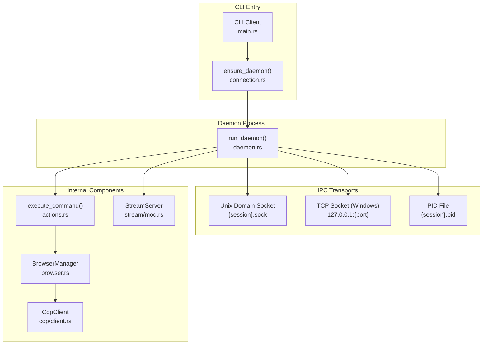
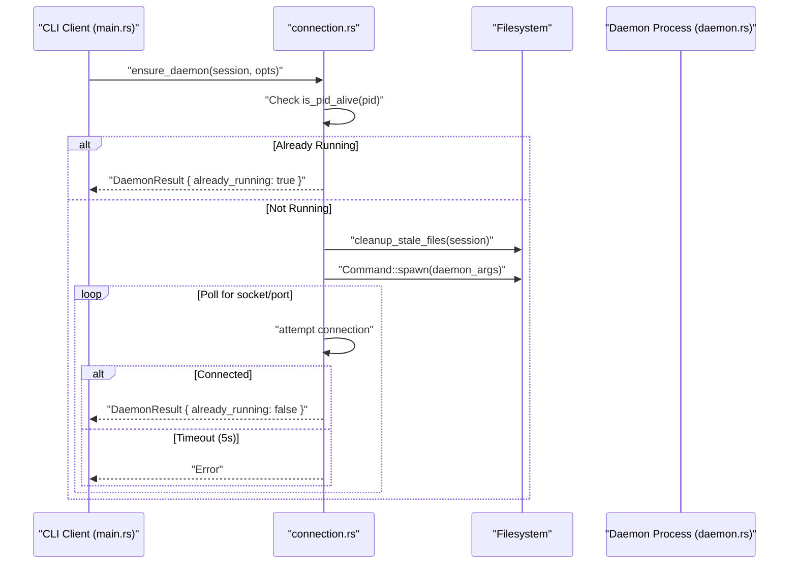

# Daemon Layer

Relevant source files

The following files were used as context for generating this wiki page:

- [cli/src/native/cdp/chrome.rs](cli/src/native/cdp/chrome.rs)
- [cli/src/native/cdp/client.rs](cli/src/native/cdp/client.rs)
- [cli/src/native/daemon.rs](cli/src/native/daemon.rs)
- [cli/src/native/providers.rs](cli/src/native/providers.rs)
- [cli/src/native/stream/cdp_loop.rs](cli/src/native/stream/cdp_loop.rs)
- [cli/src/native/stream/http.rs](cli/src/native/stream/http.rs)
- [cli/src/native/stream/mod.rs](cli/src/native/stream/mod.rs)
- [cli/src/native/stream/websocket.rs](cli/src/native/stream/websocket.rs)

The Daemon Layer implements a persistent background server process that manages browser instances, processes commands from CLI clients via IPC, and maintains session state. This architecture enables fast command execution by eliminating browser startup overhead and allows stateful browser sessions to persist between commands.

---

## Architecture Overview

The daemon layer primarily consists of a native Rust daemon using direct CDP. It provides a standardized IPC interface and command processing semantics, ensuring that browser sessions remain alive even after the CLI client exits.

**Daemon Coordination and Lifecycle**

**Sources:** [cli/src/native/daemon.rs:19-150](), [cli/src/native/cdp/client.rs:29-46](), [cli/src/native/stream/mod.rs:45-64]()

---

## Native Rust Daemon Implementation

The native daemon is the core background process. It is triggered when the binary is executed with the internal daemon flag, typically initiated by `ensure_daemon` in the CLI.

### Lifecycle Management
The daemon lifecycle is managed in `run_daemon` [cli/src/native/daemon.rs:19-150](). It performs the following steps:
1. **Log Redirection**: On Unix, if `AGENT_BROWSER_DEBUG` is set, stderr is redirected to `{session}.log` [cli/src/native/daemon.rs:29-43](). Otherwise, it is redirected to `/dev/null` to prevent crashes if the parent CLI drops the pipe [cli/src/native/daemon.rs:49-60]().
2. **PID & Versioning**: Writes its process ID to `{session}.pid` [cli/src/native/daemon.rs:62-63]() and the package version to `{session}.version` [cli/src/native/daemon.rs:65-66]().
3. **State Cleanup**: Optionally runs `state_clean` if `AGENT_BROWSER_STATE_EXPIRE_DAYS` is configured [cli/src/native/daemon.rs:88-94]().
4. **Stream Server**: Starts a `StreamServer` via `StreamServer::start_without_client` to handle WebSocket previews and dashboard data [cli/src/native/daemon.rs:102-113]().
5. **Socket Server**: Enters the main `run_socket_server` loop to handle incoming IPC commands [cli/src/native/daemon.rs:122-129]().
6. **Idle Timeout**: If `AGENT_BROWSER_IDLE_TIMEOUT_MS` is set, the daemon monitors inactivity and shuts down automatically via a `mpsc` reset channel [cli/src/native/daemon.rs:117-120](), [cli/src/native/daemon.rs:176-188]().

### StreamServer and WebSocket Protocol
The `StreamServer` [cli/src/native/stream/mod.rs:45-64]() provides a real-time observation interface for the dashboard.

- **Dual Protocol Support**: The server dispatches incoming connections between WebSocket (for streaming) and HTTP (for dashboard assets/API) in `handle_connection` [cli/src/native/stream/websocket.rs:99-147]().
- **Screencasting**: It manages the CDP screencast lifecycle via `cdp_event_loop` [cli/src/native/stream/cdp_loop.rs:14-28](). It listens for `Page.screencastFrame` events and broadcasts them to connected WebSocket clients [cli/src/native/stream/cdp_loop.rs:142-153]().
- **Status Broadcasting**: It periodically broadcasts a `status` JSON message containing the current `engine`, `connected` state, and `recording` status [cli/src/native/stream/cdp_loop.rs:88-97]().
- **Viewport Coordination**: It tracks viewport dimensions to ensure screencast frames match the browser's current state [cli/src/native/stream/mod.rs:108-121]().

**Sources:** [cli/src/native/daemon.rs:19-150](), [cli/src/native/stream/mod.rs:45-148](), [cli/src/native/stream/cdp_loop.rs:14-112](), [cli/src/native/stream/websocket.rs:99-147]()

---

## IPC Mechanisms

The daemon supports two IPC transports to facilitate communication with the CLI client.

### Unix Domain Sockets
On Unix-like systems, the daemon listens via `UnixListener` [cli/src/native/daemon.rs:160-163](). The socket directory is resolved based on environment variables or system defaults, ensuring consistent access across sessions.

### TCP Sockets (Windows)
On Windows, the daemon uses TCP on `127.0.0.1`.
- **Port Resolution**: The client resolves the port by reading the `{session}.port` file written by the daemon.
- **Cleanup**: The daemon ensures stale port files and sockets are removed upon startup [cli/src/native/daemon.rs:77-86]().

**Sources:** [cli/src/native/daemon.rs:68-86](), [cli/src/native/daemon.rs:160-163]()

---

## Process Coordination

### The `ensure_daemon` Flow
The CLI client ensures a daemon is active before sending any command.

### Chrome Process Management
The daemon directly manages the browser lifecycle through `ChromeProcess` [cli/src/native/cdp/chrome.rs:8-15]().
- **Process Group Termination**: On Unix, `ChromeProcess::kill` uses process group IDs (`pgid`) to ensure all helper processes (GPU, renderer) are terminated [cli/src/native/cdp/chrome.rs:18-31]().
- **Wait or Kill**: The daemon attempts to let Chrome exit gracefully to flush cookies before force-killing after a timeout [cli/src/native/cdp/chrome.rs:47-60]().

**Sources:** [cli/src/native/cdp/chrome.rs:8-31](), [cli/src/native/cdp/chrome.rs:47-60]()

---

## Dashboard and API Server

The daemon provides integration with the Next.js dashboard located in `packages/dashboard`.

- **Asset Serving**: The `StreamServer` serves dashboard assets embedded in the binary via `DashboardAssets` [cli/src/native/stream/http.rs:16-18]().
- **CORS Protection**: Sensitive endpoints like `/api/command` are protected by same-origin checks [cli/src/native/stream/http.rs:139-154]().
- **Frontend Interaction**: The dashboard communicates with the daemon via the `execCommand` and `killSession` utilities.
- **Session Control**: The dashboard can trigger session termination via the `/api/kill` endpoint [cli/src/native/stream/http.rs:210-215]().

**Sources:** [cli/src/native/stream/http.rs:16-18](), [cli/src/native/stream/http.rs:139-154](), [cli/src/native/stream/http.rs:210-215]()
