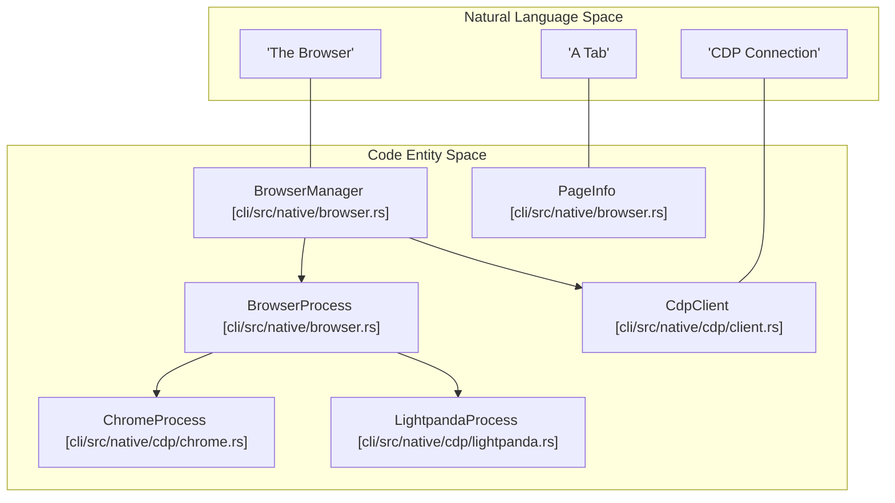
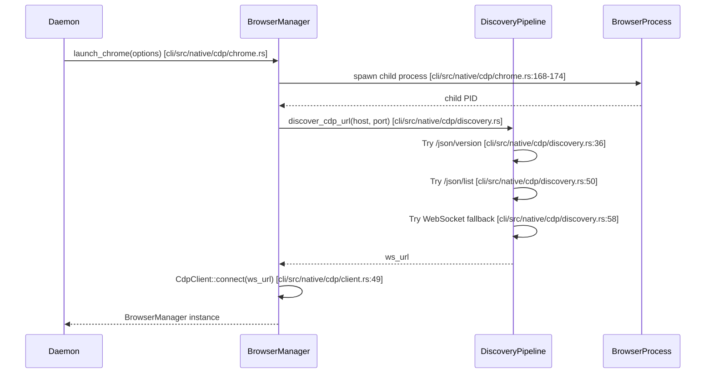

# Browser Control

Relevant source files

The following files were used as context for generating this wiki page:

- [cli/src/native/actions.rs](cli/src/native/actions.rs)
- [cli/src/native/browser.rs](cli/src/native/browser.rs)
- [cli/src/native/cdp/chrome.rs](cli/src/native/cdp/chrome.rs)
- [cli/src/native/cdp/client.rs](cli/src/native/cdp/client.rs)
- [cli/src/native/cdp/discovery.rs](cli/src/native/cdp/discovery.rs)
- [cli/src/native/cdp/lightpanda.rs](cli/src/native/cdp/lightpanda.rs)
- [cli/src/native/cdp/mod.rs](cli/src/native/cdp/mod.rs)
- [cli/src/native/daemon.rs](cli/src/native/daemon.rs)
- [cli/src/native/e2e_tests.rs](cli/src/native/e2e_tests.rs)
- [cli/src/native/providers.rs](cli/src/native/providers.rs)

This document explains the browser control layer of agent-browser, which manages browser instances, pages, contexts, and interactions. In the Rust-based native daemon, this is primarily handled by the `BrowserManager` struct and the `DaemonState` which coordinates multiple backends including Playwright-compatible CDP (Chrome/Lightpanda) and WebDriver (iOS/Safari).

For command execution and action handling that use the browser manager, see [Command Reference](cli/src/native/actions.rs). For element references and snapshots used to interact with browser content, see [Element References (Refs)](cli/src/native/element.rs) and [Snapshots](cli/src/native/snapshot.rs).

## BrowserManager Struct

The `BrowserManager` struct [cli/src/native/browser.rs:202-211]() is the central abstraction for CDP-based browser operations in the native daemon. It maintains the `CdpClient`, the underlying browser process (Chrome or Lightpanda), and tracks page state.

**Key Responsibilities:**
- **Process Management**: Launch and manage browser processes via `ChromeProcess` [cli/src/native/cdp/chrome.rs:8-15]() or `LightpandaProcess` [cli/src/native/cdp/lightpanda.rs:17-21]().
- **Communication**: Maintain the `CdpClient` for WebSocket-based communication with the browser [cli/src/native/cdp/client.rs:29-46]().
- **Page Tracking**: Track active pages and sessions via `PageInfo` [cli/src/native/browser.rs:160-173]().
- **Tab Control**: Handle browser-level navigation, tab switching, and labeling [cli/src/native/browser.rs:216-320]().
- **Teaching Errors**: Convert technical browser errors into AI-friendly, actionable descriptions [cli/src/native/browser.rs:135-157]().

**Browser Control Entity Mapping**

Sources: [cli/src/native/browser.rs:135-211](), [cli/src/native/cdp/chrome.rs:8-15](), [cli/src/native/cdp/lightpanda.rs:17-21](), [cli/src/native/cdp/client.rs:29-46]()

## Browser Launch and Lifecycle

The browser lifecycle is managed through specialized launch functions and the `BrowserProcess` enum. The system supports standard Chrome, the Lightpanda high-performance engine, and remote CDP connections.

### Launch Flow

**Launch Options** [cli/src/native/cdp/chrome.rs:90-116]():
- `headless`: Run without a GUI (uses `--headless=new` [cli/src/native/cdp/chrome.rs:180]()).
- `profile`: Path to a persistent user data directory [cli/src/native/cdp/chrome.rs:97]().
- `proxy`: Proxy server configuration including credentials [cli/src/native/cdp/chrome.rs:93-96]().
- `extensions`: List of Chrome extensions to load (requires headed mode [cli/src/native/cdp/chrome.rs:179]()).
- `args`: Raw CLI arguments passed to the browser binary [cli/src/native/cdp/chrome.rs:98]().
- `storage_state`: Load cookies/localStorage from a JSON state file [cli/src/native/cdp/chrome.rs:101]().

### Discovery Pipeline
The `discover_cdp_url` function [cli/src/native/cdp/discovery.rs:20-65]() implements a robust multi-stage discovery mechanism to find the CDP endpoint:
1. **Primary**: Fetch `/json/version` to get `webSocketDebuggerUrl` [cli/src/native/cdp/discovery.rs:36-47]().
2. **Fallback**: Fetch `/json/list` and look for the `browser` target [cli/src/native/cdp/discovery.rs:49-53]().
3. **Final Fallback**: Attempt a direct WebSocket connection to `ws://host:port/devtools/browser` (required for Chrome 136+ remote debugging) [cli/src/native/cdp/discovery.rs:58-64]().

Sources: [cli/src/native/cdp/chrome.rs:90-180](), [cli/src/native/cdp/discovery.rs:20-65](), [cli/src/native/browser.rs:8-12]()

## Browser Provider Abstraction

The system abstracts different browser backends through the `BrowserProcess` enum and the `providers.rs` module for cloud services.

### Chrome vs. Lightpanda
- **ChromeProcess** [cli/src/native/cdp/chrome.rs:8-15](): Standard Chromium-based browser. Supports full extension sets and standard CDP domains. Includes logic for cleaning up process groups on Unix to prevent orphaned helper processes [cli/src/native/cdp/chrome.rs:20-31]().
- **LightpandaProcess** [cli/src/native/cdp/lightpanda.rs:17-21](): A lightweight, high-performance browser engine. It is launched via the `serve` command [cli/src/native/cdp/lightpanda.rs:43-52]() and uses a specialized log drainer to capture startup output [cli/src/native/cdp/lightpanda.rs:197-219]().

### Cloud Providers
The system allows connecting to remote browser infrastructure through the `providers` module [cli/src/native/providers.rs:26-73](). This supports providers like Browserbase, Browserless, and Kernel.

| Provider | Protocol | Implementation Detail |
| :--- | :--- | :--- |
| **Browserbase** | CDP | Uses `BROWSERBASE_API_KEY` to create sessions via POST [cli/src/native/providers.rs:134-184](). |
| **Browserless** | CDP | Supports `BROWSERLESS_TTL` and direct stop URLs [cli/src/native/providers.rs:186-210](). |
| **Kernel** | CDP | Connects via `KERNEL_API_KEY` and custom endpoints [cli/src/native/providers.rs:52-59](). |
| **AgentCore** | CDP | Remote browser infrastructure with signed session cleanup [cli/src/native/providers.rs:60-66](). |

Sources: [cli/src/native/cdp/lightpanda.rs:149-219](), [cli/src/native/cdp/chrome.rs:20-31](), [cli/src/native/providers.rs:26-73]()

## Tab and Session Management

In the native daemon, tabs are tracked as `PageInfo` objects [cli/src/native/browser.rs:160-173]().

**Target Tracking**:
The `should_track_target` function [cli/src/native/browser.rs:99-102]() filters out internal Chrome targets (e.g., `chrome://`, `devtools://`) to ensure the AI agent only interacts with web content.

**Iframe Sessions**:
The `DrainedEvents` struct [cli/src/native/actions.rs:166-175]() tracks cross-origin iframe sessions created via `Target.attachedToTarget`. These are stored in the `DaemonState` to allow multi-frame interaction [cli/src/native/actions.rs:172]().

**Event Draining**:
During command execution, the system "drains" events like `TargetCreated`, `TargetDestroyed`, and `TargetInfoChanged` [cli/src/native/actions.rs:166-175]() to keep the internal `pages` list in sync with the actual browser state.

Sources: [cli/src/native/browser.rs:99-173](), [cli/src/native/actions.rs:166-175]()

## Security and Policy Enforcement

Browser control is gated by the `ActionPolicy` and `DomainFilter`.

1. **Domain Filtering**: The `DomainFilter` [cli/src/native/network.rs:28]() is integrated into the `DaemonState`. It intercepts network events to block navigation to disallowed domains or unauthorized protocols.
2. **Action Policies**: Before the `BrowserManager` executes a destructive action (like `browser.close` or `navigation`), the `DaemonState` checks the `ActionPolicy` [cli/src/native/actions.rs:29]().
3. **Confirmation Workflow**: If a policy returns `RequiresConfirmation`, the browser action is suspended, and a `PendingConfirmation` [cli/src/native/actions.rs:61-64]() is stored until the user approves or denies it via a `confirmationId`.

Sources: [cli/src/native/actions.rs:28-64](), [cli/src/native/network.rs:28]()
