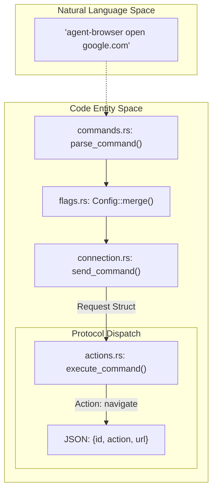
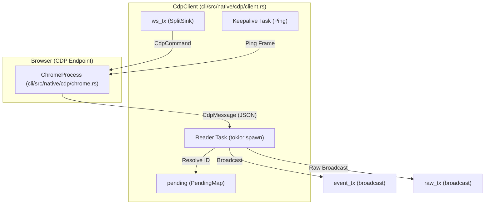

# Communication Protocol

Relevant source files

The following files were used as context for generating this wiki page:

- [cli/src/commands.rs](cli/src/commands.rs)
- [cli/src/connection.rs](cli/src/connection.rs)
- [cli/src/flags.rs](cli/src/flags.rs)
- [cli/src/main.rs](cli/src/main.rs)
- [cli/src/native/cdp/chrome.rs](cli/src/native/cdp/chrome.rs)
- [cli/src/native/cdp/client.rs](cli/src/native/cdp/client.rs)
- [cli/src/native/daemon.rs](cli/src/native/daemon.rs)
- [cli/src/native/providers.rs](cli/src/native/providers.rs)

This document describes the JSON-based communication protocol used between the CLI client and daemon process. The protocol defines the structure of commands (requests), responses, validation mechanisms, type systems, and the underlying transport infrastructure, including the `CdpClient` WebSocket implementation and browser provider integrations.

---

## Protocol Overview

The agent-browser communication protocol is a **JSON-based, newline-delimited** protocol operating over IPC channels (Unix domain sockets or TCP). Each message is a complete JSON object terminated by a newline character (`\n`).

### Key Features
- **Command dispatch**: Client sends JSON commands; daemon responds with JSON results via `execute_command`. [cli/src/native/daemon.rs:14-14](), [cli/src/native/daemon.rs:172-174]()
- **Bi-directional communication**: Full-duplex over persistent connections managed by the `CdpClient`. [cli/src/native/cdp/client.rs:86-100]()
- **Type-safe validation**: Rust-side parsing and serialization using `serde` and `serde_json`. [cli/src/connection.rs:20-36]()
- **Session isolation**: Multiple concurrent sessions via unique socket paths or deterministic ports based on session names. [cli/src/native/daemon.rs:19-71]()
- **CdpClient Integration**: Direct browser control via Chrome DevTools Protocol (CDP) over WebSockets. [cli/src/native/cdp/client.rs:29-46]()
- **Provider Support**: Extensible architecture for remote CDP sessions (Browserbase, Browserless, etc.). [cli/src/native/providers.rs:26-73]()

Sources: [cli/src/native/daemon.rs:1-174](), [cli/src/native/cdp/client.rs:1-100](), [cli/src/connection.rs:20-36](), [cli/src/native/providers.rs:26-73]()

---

## Message Structure

### Request Format
The client serializes commands into a `Request` structure containing an `action` and an `id`. [cli/src/connection.rs:20-27]()

- **`id`**: Unique request identifier, generated as a string. [cli/src/connection.rs:23-23]()
- **`action`**: The command verb (e.g., `navigate`, `click`, `screenshot`). [cli/src/connection.rs:24-24]()
- **`extra`**: Flattened `serde_json::Value` containing action-specific parameters. [cli/src/connection.rs:25-26]()

### Response Format
The daemon replies with a `Response` struct containing success status and optional data or errors. [cli/src/connection.rs:29-36]()

- **`success`**: Boolean indicating if the command executed without error. [cli/src/connection.rs:31-31]()
- **`data`**: Optional `serde_json::Value` payload containing command results. [cli/src/connection.rs:32-32]()
- **`error`**: Optional string description of the failure. [cli/src/connection.rs:33-33]()
- **`warning`**: Optional warning message, omitted if `None`. [cli/src/connection.rs:34-35]()

Sources: [cli/src/connection.rs:20-36]()

---

## Command Validation and Parsing

The CLI maps user input and flags to structured JSON commands. This involves merging global configuration with command-specific parameters.

### Validation Logic
1. **Command Mapping**: The CLI identifies the command and subcommands, returning `ParseError` for invalid inputs. [cli/src/commands.rs:9-31]()
2. **Flag Processing**: The `Config` struct manages merging hierarchy from `agent-browser.json`, environment variables, and CLI flags. [cli/src/flags.rs:53-95](), [cli/src/flags.rs:97-158]()
3. **Session Name Validation**: Session names are checked via `is_valid_session_name` to prevent path traversal. [cli/src/commands.rs:7-7](), [cli/src/commands.rs:30-30]()
4. **Proxy Parsing**: Proxies are parsed into `ParsedProxy` containing server and credential components. [cli/src/main.rs:80-141]()

### Command Mapping Diagram

The following diagram bridges the "Natural Language Space" of the CLI to the "Code Entity Space" of the protocol.

Sources: [cli/src/commands.rs:9-31](), [cli/src/flags.rs:97-158](), [cli/src/connection.rs:20-27](), [cli/src/main.rs:80-141]()

---

## Transport Layer: CdpClient Infrastructure

The `CdpClient` manages the low-level WebSocket connection to the browser's Chrome DevTools Protocol (CDP) endpoint. It handles message multiplexing, keepalives, and asynchronous response tracking.

### CdpClient Architecture

### Key Components
- **`PendingMap`**: A `HashMap<u64, oneshot::Sender<CdpMessage>>` that tracks outgoing commands. When a response with a matching ID arrives, the sender resolves the original future. [cli/src/native/cdp/client.rs:15-15](), [cli/src/native/cdp/client.rs:150-155]()
- **Reader Task**: A dedicated `tokio` task that polls the WebSocket. It handles both `Text` and `Binary` frames (required for some remote proxies like Browserless). [cli/src/native/cdp/client.rs:100-148]()
- **Keepalive**: Sends WebSocket `Ping` frames every 30 seconds (`WS_KEEPALIVE_INTERVAL_SECS`) to prevent intermediate proxies from dropping idle connections. [cli/src/native/cdp/client.rs:19-19](), [cli/src/native/cdp/client.rs:176-178]()
- **Raw Broadcast**: The `raw_tx` channel sends `RawCdpMessage` to subscribers (like the dashboard or inspect proxy) before typed parsing occurs. [cli/src/native/cdp/client.rs:24-27](), [cli/src/native/cdp/client.rs:133-141]()

Sources: [cli/src/native/cdp/client.rs:15-178](), [cli/src/native/cdp/chrome.rs:8-15]()

---

## Connection Management

The daemon operates a socket server to receive commands from the CLI or dashboard.

### Transport Selection
- **Unix**: Uses `UnixListener` connecting to `.sock` files in the directory returned by `get_socket_dir`. [cli/src/native/daemon.rs:160-163](), [cli/src/connection.rs:93-115]()
- **Windows**: Uses TCP, where the server writes a `.port` file for the client to discover the connection point. [cli/src/native/daemon.rs:68-80]()

### Daemon Lifecycle
- **PID/Version Files**: The daemon writes `.pid` and `.version` files to track the process and ensure compatibility. [cli/src/native/daemon.rs:62-66]()
- **Auto-shutdown**: The daemon can automatically exit after a period of inactivity defined by `AGENT_BROWSER_IDLE_TIMEOUT_MS`. [cli/src/native/daemon.rs:117-120]()
- **Cleanup**: Stale files are removed via `cleanup_stale_files` when a session is determined to be dead. [cli/src/connection.rs:131-150]()

### Browser Providers
The protocol supports remote CDP sessions through a provider abstraction.

| Provider | Authentication | Connection Method |
| :--- | :--- | :--- |
| Browserbase | `BROWSERBASE_API_KEY` | POST `/v1/sessions` [cli/src/native/providers.rs:134-184]() |
| Browserless | `BROWSERLESS_API_KEY` | WebSocket URL with API key [cli/src/native/providers.rs:186-207]() |
| Kernel | `KERNEL_API_KEY` | DELETE `/browsers/{id}` for cleanup [cli/src/native/providers.rs:111-125]() |

Sources: [cli/src/native/daemon.rs:62-163](), [cli/src/connection.rs:93-150](), [cli/src/native/providers.rs:111-207]()

---

## Command Identification

The protocol uses unique IDs for request/response correlation and element references.

- **Request ID Generation**: Generated using system time (microseconds) prefixed with 'r'. [cli/src/commands.rs:63-72]()
- **Cookie Parsing**: Supports JSON, cURL dump, or bare headers, converting them into a standard JSON array for the `cookies_set` action. [cli/src/commands.rs:85-127]()

Sources: [cli/src/commands.rs:63-127]()
