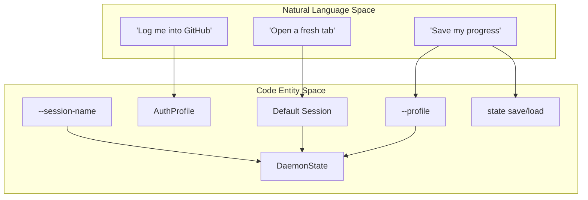
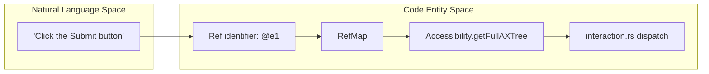

# Core Concepts

Relevant source files

The following files were used as context for generating this wiki page:

- [README.md](README.md)
- [cli/src/doctor/launch.rs](cli/src/doctor/launch.rs)
- [cli/src/native/react/mod.rs](cli/src/native/react/mod.rs)
- [cli/src/output.rs](cli/src/output.rs)
- [docs/src/app/commands/page.mdx](docs/src/app/commands/page.mdx)
- [docs/src/app/react/page.mdx](docs/src/app/react/page.mdx)
- [skill-data/core/SKILL.md](skill-data/core/SKILL.md)
- [skill-data/core/references/commands.md](skill-data/core/references/commands.md)
- [skill-data/core/references/video-recording.md](skill-data/core/references/video-recording.md)
- [skills/agent-browser/SKILL.md](skills/agent-browser/SKILL.md)

This page explains the fundamental concepts that underpin `agent-browser`'s architecture and operation. Understanding these concepts is essential for effective use of the tool, especially when building AI agents that need reliable browser automation.

For details on session types and state persistence, see [Sessions and State](#4.1).
For details on the element reference system, see [Element References (Refs)](#4.2).
For details on accessibility tree extraction and filtering, see [Snapshots](#4.3).
For details on the end-to-end execution pipeline, see [Command Execution Flow](#4.4).

---

## Sessions and State

`agent-browser` provides multiple ways to manage browser state, ranging from ephemeral one-off runs to persistent, encrypted profiles. Each session maintains its own browser instance, cookies, and storage.

### Session Persistence Models

**Sources:** [README.md:144-145](), [skill-data/core/SKILL.md:54-55](), [skill-data/core/references/commands.md:183-195]()

*   **Ephemeral Sessions**: The default mode where state is lost when the browser closes. Ideal for stateless scraping.
*   **Named Sessions**: Use `--session-name` to automatically save and restore cookies and `localStorage` to the session directory [skill-data/core/references/commands.md:183-185]().
*   **Persistent Profiles**: Use `--profile <path>` to point to a specific directory for full browser profile persistence, including IndexedDB and service workers [skill-data/core/references/commands.md:190-192]().
*   **Encrypted State**: Manual state exports via `state save` can be protected using AES-256-GCM encryption by setting `AGENT_BROWSER_ENCRYPTION_KEY` [skill-data/core/references/commands.md:196-200]().

For details, see [Sessions and State](#4.1).

---

## Element References (Refs)

Element references (refs) are stable identifiers (e.g., `@e1`, `@e2`) assigned to interactive elements during a snapshot. They solve the problem of fragile CSS selectors by providing a semantic handle that AI agents can use reliably.

### Ref Resolution Pipeline

**Sources:** [README.md:85-88](), [skills/agent-browser/SKILL.md:10-12](), [skill-data/core/SKILL.md:27-30]()

*   **Stable Identifiers**: Refs are generated during the `snapshot` command, mapping a compact ID to a specific element in the accessibility tree [skill-data/core/SKILL.md:10-12]().
*   **Context-Efficient**: Using refs in text-based accessibility trees uses ~200-400 tokens compared to thousands for raw HTML [skill-data/core/SKILL.md:11-12]().
*   **Deterministic**: A ref points to the exact element identified in the most recent snapshot, reducing ambiguity for LLMs. Note that refs become stale the moment the page changes [skill-data/core/SKILL.md:27-30]().

For details, see [Element References (Refs)](#4.2).

---

## Snapshots

Snapshots are the primary way an AI agent "sees" the web page. Instead of raw HTML, `agent-browser` generates a compact accessibility tree derived from the browser's internal accessibility implementation.

| Feature | Description | Code Reference |
| :--- | :--- | :--- |
| **AXTree Extraction** | Uses `Accessibility.getFullAXTree` via CDP. | [skills/agent-browser/SKILL.md:10-12]() |
| **Interactive Filtering** | Limits output to interactive elements via `-i` flag. | [skill-data/core/SKILL.md:61-61]() |
| **Annotation Mode** | Overlays numbered labels on a screenshot for visual grounding. | [README.md:134-134]() |
| **Compact Mode** | Removes structural noise to save tokens via `-c` flag. | [skill-data/core/SKILL.md:63-63]() |

For details, see [Snapshots](#4.3).

---

## Command Execution Flow

The journey of a command starts at the CLI, travels through a native daemon, and ends with low-level protocol messages sent to the browser.

1.  **Parsing**: The Rust CLI parses arguments into a command structure [README.md:108-148]().
2.  **Routing**: The command is sent to the native daemon, which persists between commands for performance [skill-data/core/SKILL.md:54-55]().
3.  **Execution**: The daemon dispatches the action to specialized handlers (e.g., interaction, navigation, or info retrieval).
4.  **CDP Dispatch**: Handlers communicate directly with Chrome via the Chrome DevTools Protocol (CDP) [skills/agent-browser/SKILL.md:48-48]().
5.  **Output Formatting**: Results are returned to the CLI and formatted. Page content can be wrapped in security boundaries using a CSPRNG nonce [cli/src/output.rs:8-17]().

### Security and Observability
*   **Security**: Commands are subject to domain allowlists and action policies. Output can be truncated to prevent LLM context overflow [cli/src/output.rs:36-59]().
*   **Observability**: Real-time activity can be monitored via the Observability Dashboard on port 4848 [skills/agent-browser/SKILL.md:53-55]().

For details, see [Command Execution Flow](#4.4).

**Sources:** [README.md:1-148](), [cli/src/output.rs:8-75](), [skills/agent-browser/SKILL.md:53-55]()
