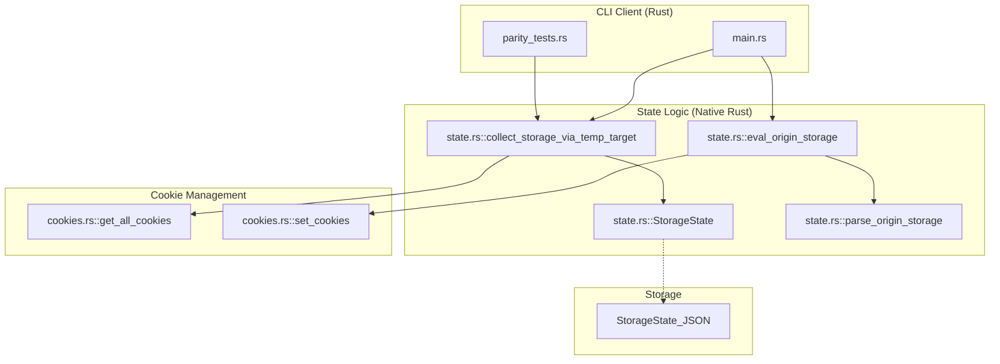
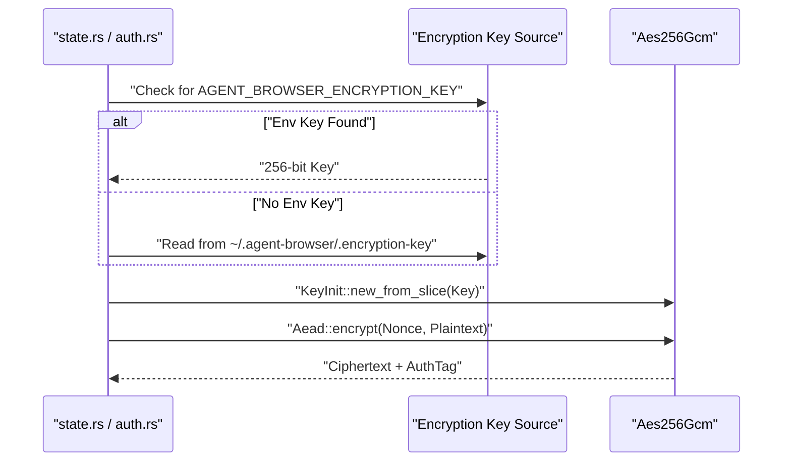

# Sessions and State

Relevant source files

The following files were used as context for generating this wiki page:

- [cli/src/native/cookies.rs](cli/src/native/cookies.rs)
- [cli/src/native/state.rs](cli/src/native/state.rs)
- [docs/src/app/diffing/page.mdx](docs/src/app/diffing/page.mdx)
- [docs/src/app/ios/page.mdx](docs/src/app/ios/page.mdx)
- [docs/src/app/sessions/page.mdx](docs/src/app/sessions/page.mdx)
- [skill-data/core/references/session-management.md](skill-data/core/references/session-management.md)

This document explains the session isolation and state persistence mechanisms in `agent-browser`, including daemon lifecycle management, state auto-save/load, and AES-256-GCM encryption.

---

## Session Types

`agent-browser` provides three session types with increasing levels of persistence:

| Session Type | Flag | Persistence | Use Case |
|--------------|------|-------------|----------|
| **Default** | _(none)_ | None | Quick one-off automation tasks |
| **Named** | `--session <name>` | Runtime only (daemon isolation) | Parallel automation without state reuse |
| **Persistent** | `--session-name <name>` | Auto-save/restore across restarts | Long-running workflows, authenticated sessions |

### Default Session
When no session flags are provided, the daemon uses the session name `"default"`. State exists only in memory during the browser lifetime and is lost when the browser closes. [skill-data/core/references/session-management.md:136-145]()

### Named Sessions
The `--session` flag isolates browser contexts by spawning separate daemon processes. Each session gets its own socket/PID file. State exists only in memory within each daemon, providing independent cookies, storage, and history. [skill-data/core/references/session-management.md:17-41](), [docs/src/app/sessions/page.mdx:3-22]()

### Persistent Sessions
The `--session-name` flag (or manual `state save`/`state load` commands) enables state save/restore. When requested, cookies, `localStorage`, and `sessionStorage` are captured and saved to a JSON file. On next launch, the state can be automatically restored to continue an authenticated session. [skill-data/core/references/session-management.md:43-60](), [docs/src/app/sessions/page.mdx:131-147]()

---

## Session Lifecycle and Code Entities

The following diagram maps the session management logic to specific functions and files within the codebase.

**Diagram: Session Lifecycle and Code Entities**

**Sources:** [cli/src/native/state.rs:17-38](), [cli/src/native/state.rs:112-141](), [skill-data/core/references/session-management.md:62-72]()

---

## State Persistence Mechanism

### Storage State Structure
The `StorageState` struct defines what is captured during a session save. It includes all cookies and per-origin storage. [cli/src/native/state.rs:17-22]()

| Component | Code Entity | Description |
|-----------|-------------|-------------|
| **Cookies** | `Vec<Cookie>` | Captured via `cookies::get_all_cookies`. [cli/src/native/cookies.rs:27-38]() |
| **Origins** | `Vec<OriginStorage>` | List of domains with associated storage. [cli/src/native/state.rs:24-31]() |
| **LocalStorage** | `Vec<StorageEntry>` | Key-value pairs extracted via JS injection. [cli/src/native/state.rs:33-38]() |
| **SessionStorage**| `Vec<StorageEntry>` | Transient storage extracted via JS injection. [cli/src/native/state.rs:35-38]() |

### Auto-Save/Load Flow
To capture state from multiple origins (including those in iframes), the system uses `collect_storage_via_temp_target`. This creates a temporary CDP target, navigates it to each discovered origin, and uses `Fetch.enable` to intercept requests—serving blank HTML to quickly extract storage without hitting real networks. [cli/src/native/state.rs:112-141](), [cli/src/native/state.rs:169-178]()

When loading state:
1. The system reads the state file (and decrypts it if encrypted). [cli/src/native/state.rs:1-5]()
2. Cookies are restored using `Network.setCookies` via `cookies::set_cookies`. [cli/src/native/cookies.rs:62-93]()
3. Storage entries are injected into their respective origins via `Runtime.evaluate` using the `eval_origin_storage` function. [cli/src/native/state.rs:88-107]()

**Sources:** [cli/src/native/state.rs:17-107](), [cli/src/native/state.rs:112-180](), [cli/src/native/cookies.rs:62-93]()

---

## Encryption and Security

### AES-256-GCM Implementation
`agent-browser` supports AES-256-GCM encryption for session state files and authentication profiles. The encryption uses the `aes_gcm` crate with `Sha256` for key derivation. [cli/src/native/state.rs:1-5]()

**Diagram: Encryption Key Resolution and Data Flow**

**Sources:** [cli/src/native/state.rs:1-8](), [docs/src/app/sessions/page.mdx:164-181](), [skill-data/core/references/session-management.md:178-187]()

---

## Session Isolation Properties

Each session, whether named or default, maintains independent instances of the following browser data:
*   **Cookies**: Managed via the `Network` CDP domain using `get_all_cookies` and `set_cookies`. [cli/src/native/cookies.rs:27-60](), [cli/src/native/cookies.rs:62-93]()
*   **Storage**: `localStorage` and `sessionStorage` are isolated per origin and session, stored in the `OriginStorage` struct. [cli/src/native/state.rs:24-38]()
*   **Network State**: Cache and sessions are not shared between different `--session` identifiers. [skill-data/core/references/session-management.md:33-41]()

## Chrome Profile Reuse
For existing login state without manual state files, the `--profile` flag allows copying a Chrome profile to a temporary directory for read-only snapshot usage. [docs/src/app/sessions/page.mdx:33-49]()

| Detail | Description |
|-----------|-------------|
| **Supported** | Chrome, Chromium, Brave |
| **Persistence** | Original profile never modified; temp copy deleted on close |
| **Content** | Cookies, localStorage, extension state |

**Sources:** [docs/src/app/sessions/page.mdx:33-62](), [cli/src/native/state.rs:17-38](), [cli/src/native/cookies.rs:27-60](), [skill-data/core/references/session-management.md:33-41](), [skill-data/core/references/session-management.md:157-186]()
