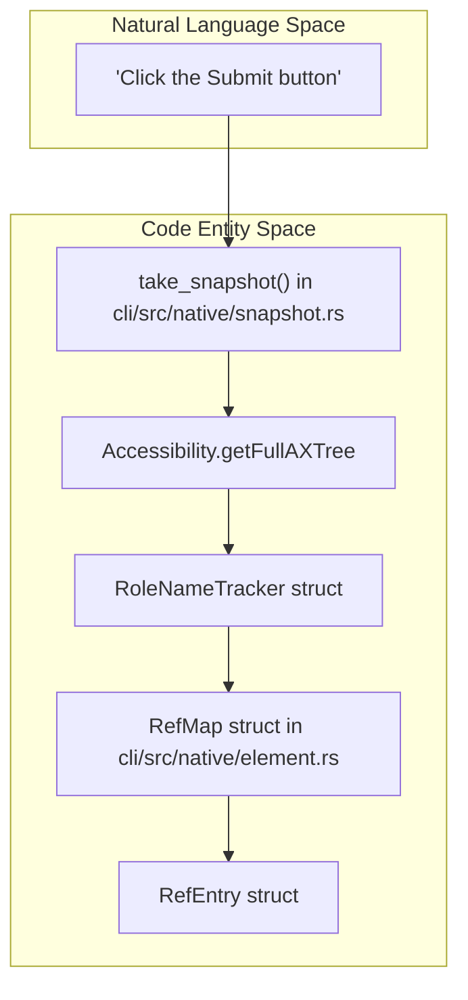
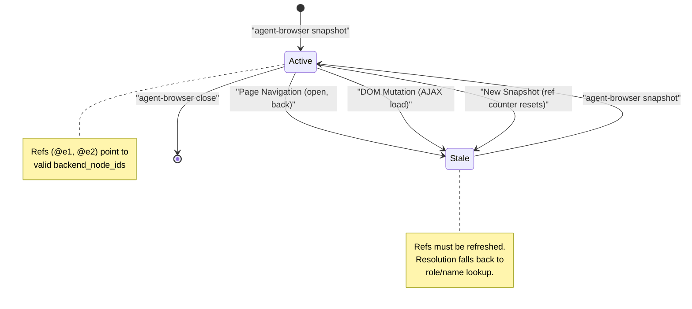
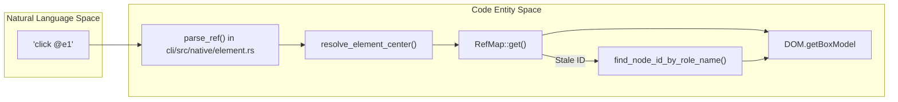

# Element References (Refs)

<details>
<summary>Relevant source files</summary>

The following files were used as context for generating this wiki page:

- [cli/src/native/actions.rs](cli/src/native/actions.rs)
- [cli/src/native/browser.rs](cli/src/native/browser.rs)
- [cli/src/native/e2e_tests.rs](cli/src/native/e2e_tests.rs)
- [cli/src/native/element.rs](cli/src/native/element.rs)
- [cli/src/native/interaction.rs](cli/src/native/interaction.rs)
- [cli/src/native/screenshot.rs](cli/src/native/screenshot.rs)
- [cli/src/native/snapshot.rs](cli/src/native/snapshot.rs)
- [skill-data/core/references/snapshot-refs.md](skill-data/core/references/snapshot-refs.md)

</details>


Element references (refs) are stable identifiers like `@e1`, `@e2`, `@e3` that point to specific elements from a snapshot. They enable deterministic element selection for AI agents by binding to the exact element visible at snapshot time, rather than re-querying the DOM with potentially ambiguous selectors.

**Scope**: This page covers the ref system's purpose, generation, lifecycle, and usage. For the snapshot command itself and filtering options, see [Snapshots (4.3)](4.3.md). For element interaction commands that use refs, see [Element Interaction (5.2)](5.2.md).

---

## What Are Refs?

Refs are short identifiers assigned to elements during snapshot generation. They follow the pattern `@e` followed by a sequential number:

```
@e1  →  first interactive element
@e2  →  second interactive element
@e3  →  third interactive element
```

Each ref maps to a specific element through a stored `RefEntry` structure [cli/src/native/element.rs:8-16]() that associates each ref ID with:

- **backend_node_id**: A unique ID provided by the Chrome DevTools Protocol (CDP) for the specific DOM node.
- **role**: ARIA role (e.g., `button`, `textbox`, `link`).
- **name**: Accessible name (e.g., `"Submit"`, `"Email"`).
- **nth**: Optional index for disambiguating duplicate role/name pairs.
- **frame_id**: The ID of the iframe containing the element, if applicable.

Example snapshot output [skill-data/core/references/snapshot-refs.md:41-61]():

```bash
@e1 [header]
  @e2 [nav]
    @e3 [a] "Home"
@e4 [button] "Sign In"
```

After taking this snapshot, you can interact with elements using their refs [skill-data/core/references/snapshot-refs.md:63-79]():

```bash
agent-browser click @e4
agent-browser fill @e3 "user@example.com"
```

**Sources**: [cli/src/native/element.rs:8-16](), [cli/src/native/element.rs:18-21](), [skill-data/core/references/snapshot-refs.md:41-79]()

---

## Why Use Refs Over CSS Selectors?

| Aspect | Refs (`@e1`) | CSS Selectors (`#submit`) |
|--------|--------------|---------------------------|
| **Deterministic** | Points to exact element from snapshot via `backend_node_id` | May match multiple elements or change |
| **Speed** | Fast path via direct CDP node resolution | Requires DOM querying and selector parsing |
| **Stability** | Fallback to role/name lookup if node is stale | Silently breaks if DOM structure changes |
| **AI-Friendly** | Compact notation reduces token usage | Agent must construct complex selectors |
| **Disambiguation** | Automatic via `nth` indices and role/name tracking | Manual `:nth-of-type()` construction |

The primary advantage is **determinism**: when an agent takes a snapshot and sees `@e2`, clicking `@e2` is guaranteed to target that specific element, even if the underlying HTML structure is complex or dynamic [skill-data/core/references/snapshot-refs.md:17-27]().

**Sources**: [skill-data/core/references/snapshot-refs.md:17-27](), [cli/src/native/element.rs:149-209]()

---

## Ref Generation Process

The generation process occurs during the `take_snapshot` function [cli/src/native/snapshot.rs:216-223](), which walks the accessibility tree provided by CDP.

### Ref Assignment Logic



**Sources**: [cli/src/native/snapshot.rs:216-230](), [cli/src/native/snapshot.rs:185-214](), [cli/src/native/element.rs:18-21]()

---

### Interactive and Content Roles

Refs are automatically assigned based on the ARIA role of the node. The system categorizes roles to determine if an element should be actionable or is just content.

- **Interactive Roles**: `button`, `link`, `textbox`, `checkbox`, `radio`, `combobox`, `listbox`, `menuitem`, `option`, `searchbox`, `slider`, `spinbutton`, `switch`, `tab`, `treeitem`, `Iframe` [cli/src/native/snapshot.rs:11-30]().
- **Content Roles**: `heading`, `cell`, `gridcell`, `columnheader`, `rowheader`, `listitem`, `article`, `region`, `main`, `navigation` [cli/src/native/snapshot.rs:32-43]().

**Sources**: [cli/src/native/snapshot.rs:11-43]()

---

### Duplicate Handling

When multiple elements have the same role and name (e.g., three "Delete" buttons), the `RoleNameTracker` [cli/src/native/snapshot.rs:185-188]() assigns `nth` indices to ensure uniqueness.

```rust
struct RoleNameTracker {
    counts: HashMap<String, usize>,
    entries: Vec<(usize, String)>,
}
```

**Example**:
1. `@e1 [button] "Delete" (nth: 0)`
2. `@e2 [button] "Delete" (nth: 1)`

This metadata is stored in the `RefMap` and used during resolution to find the correct element even if the `backend_node_id` becomes stale [cli/src/native/element.rs:31-62]().

**Sources**: [cli/src/native/snapshot.rs:198-205](), [cli/src/native/element.rs:31-62]()

---

## Ref Lifecycle and Invalidation

Refs are valid only for the current state of the page. Because they are tied to specific DOM nodes and accessibility tree positions, they are invalidated by significant page changes [skill-data/core/references/snapshot-refs.md:81-96]().



### Stale Ref Fallback
If a command is issued using a ref that has a stale `backend_node_id`, the system attempts a **fallback lookup** using the stored `role`, `name`, and `nth` index via the `find_node_id_by_role_name` function [cli/src/native/element.rs:186-195](). This makes the ref system more resilient to minor DOM updates that don't change the semantic structure of the page.

**Sources**: [cli/src/native/element.rs:149-209](), [skill-data/core/references/snapshot-refs.md:81-96]()

---

## Using Refs in Commands

### Resolution Logic

When a command like `click @e1` is executed [cli/src/native/interaction.rs:28-36](), the `resolve_element_center` [cli/src/native/element.rs:149-155]() or `resolve_element_object_id` [cli/src/native/element.rs:216-222]() functions are called to turn the ref string into a usable CDP target.



**Ref-to-CDP Resolution**

**Sources**: [cli/src/native/element.rs:124-147](), [cli/src/native/element.rs:149-209](), [cli/src/native/element.rs:216-260](), [cli/src/native/interaction.rs:28-58]()

---

## Iframe Support

Snapshots automatically detect and inline iframe content [skill-data/core/references/snapshot-refs.md:165-182](). Each `Iframe` node in the main frame is resolved, and its child accessibility tree is included directly beneath it.

- **Automatic Context**: Refs assigned to elements inside iframes carry the `frame_id` [cli/src/native/element.rs:15-16]().
- **Transparent Interaction**: When you run `click @e3` (where `@e3` is inside an iframe), the system automatically resolves the correct `effective_session_id` for that iframe [cli/src/native/element.rs:161-163]() before sending the CDP command.
- **Limitation**: Only one level of iframe nesting is expanded [skill-data/core/references/snapshot-refs.md:185]().

**Sources**: [cli/src/native/snapshot.rs:216-223](), [cli/src/native/element.rs:161-163](), [skill-data/core/references/snapshot-refs.md:165-185]()

---

## Annotated Screenshots

The `--annotate` flag for the `screenshot` command uses the ref system to draw visual labels on the page [cli/src/native/screenshot.rs:100-106]().

1. **Collect**: The system iterates through the current `RefMap` via `entries_sorted()` [cli/src/native/screenshot.rs:236]().
2. **Measure**: It calls `DOM.getBoxModel` for each ref to find its coordinates via `collect_annotations` [cli/src/native/screenshot.rs:231-255]().
3. **Inject**: A temporary HTML overlay (`__agent_browser_annotations__`) is injected into the page via `inject_annotation_overlay` [cli/src/native/screenshot.rs:127]().
4. **Capture**: The screenshot is taken with the numbered labels `[1]`, `[2]`, etc., matching `@e1`, `@e2`.
5. **Clean**: The overlay is removed immediately after via `remove_annotation_overlay` [cli/src/native/screenshot.rs:137]().

**Sources**: [cli/src/native/screenshot.rs:100-169](), [cli/src/native/screenshot.rs:11-12](), [cli/src/native/element.rs:89-104]()
