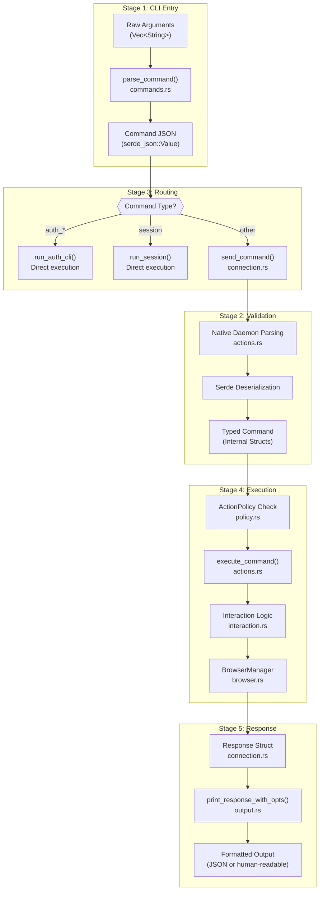
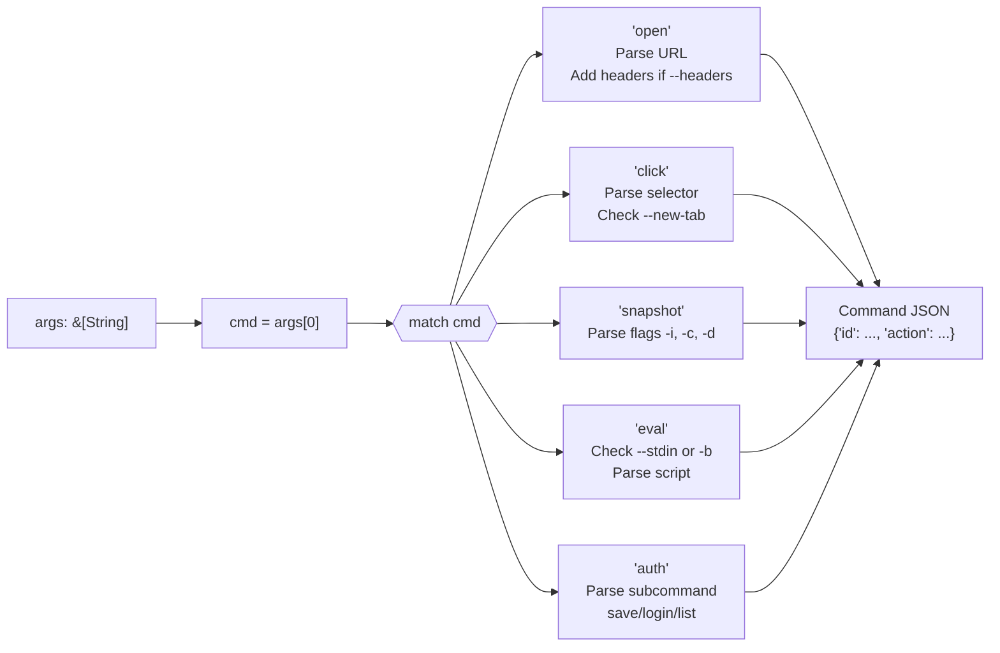
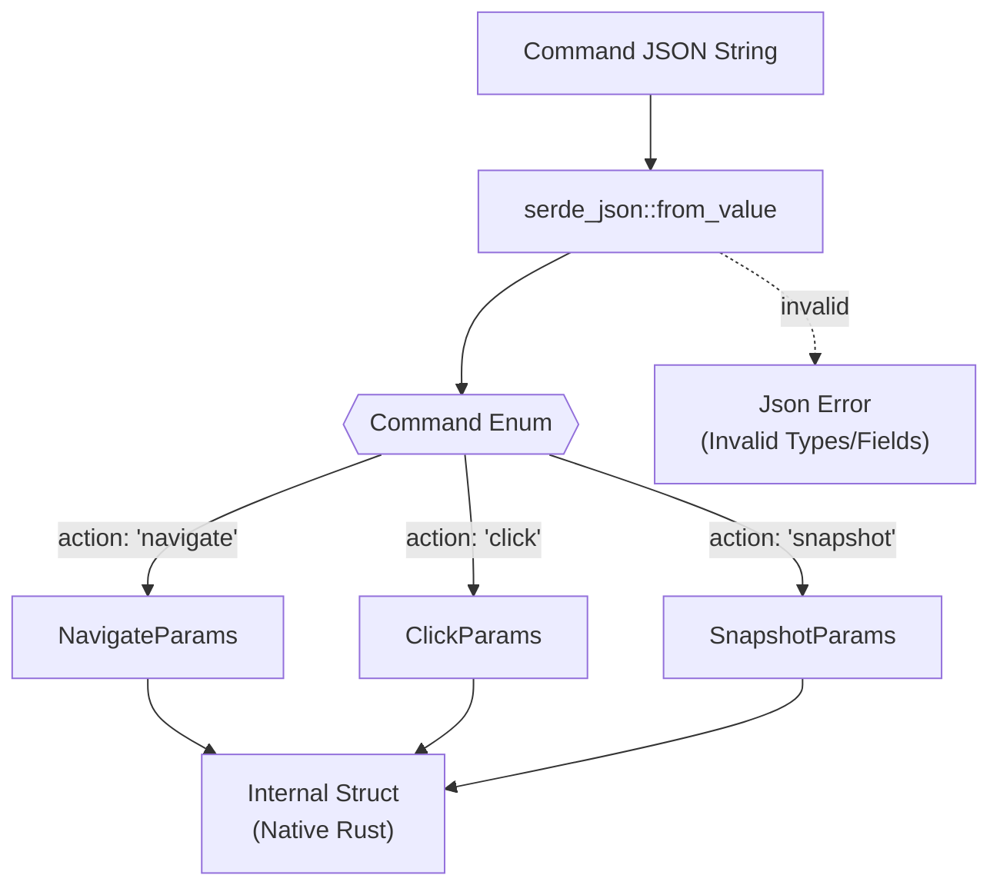
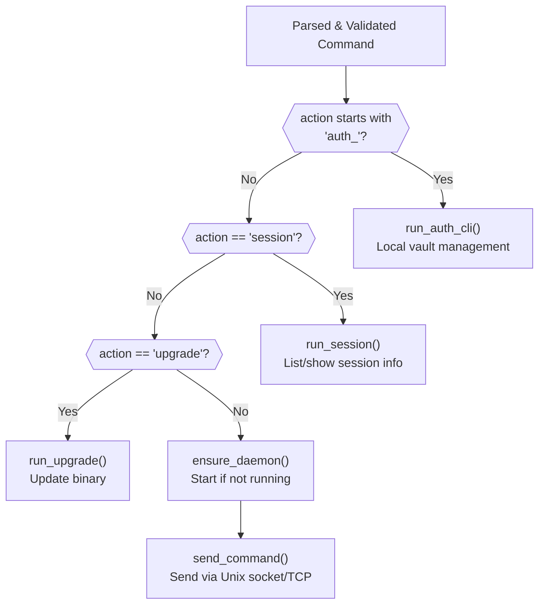
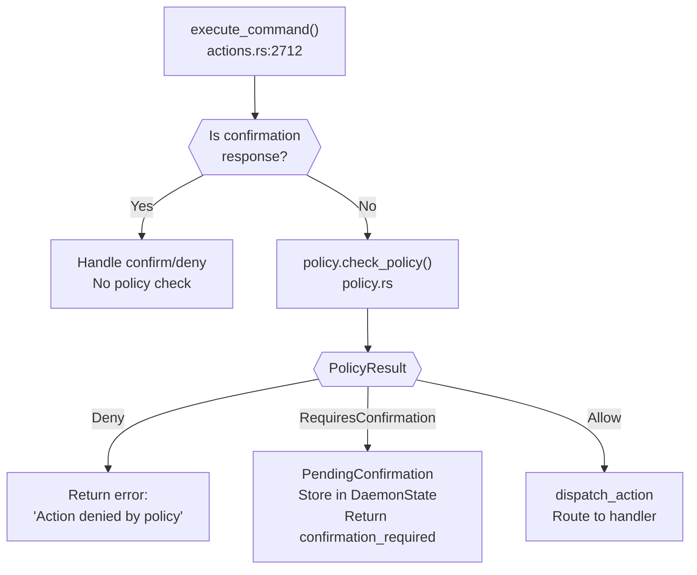
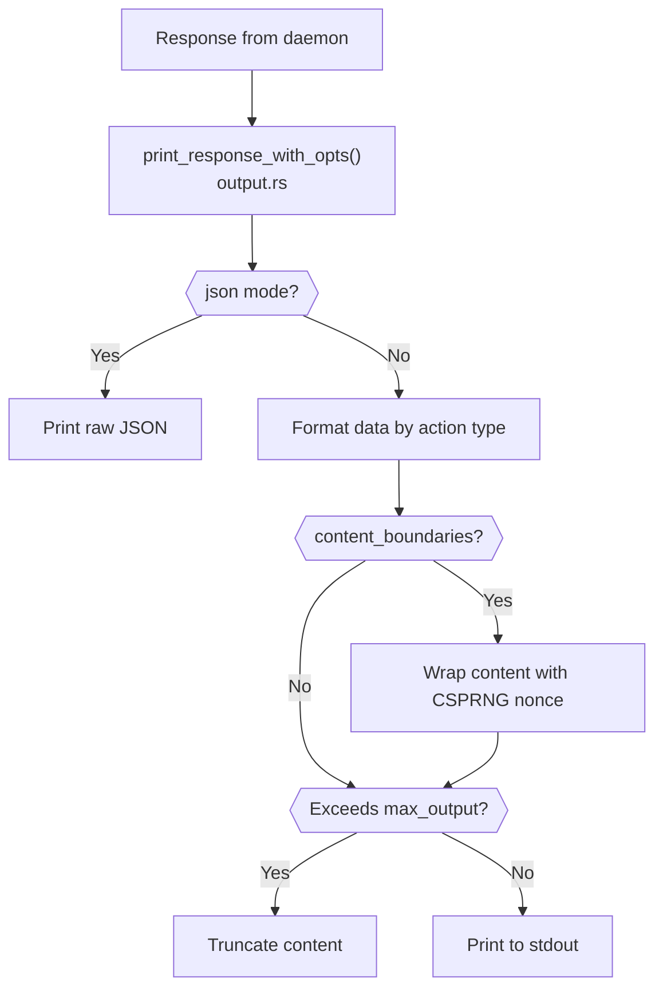
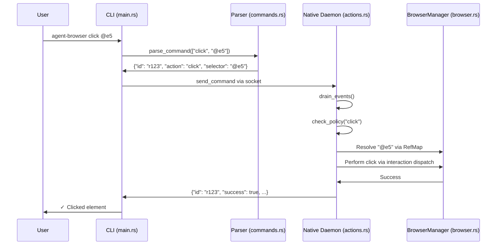

# Command Execution Flow

<details>
<summary>Relevant source files</summary>

The following files were used as context for generating this wiki page:

- [cli/src/commands.rs](cli/src/commands.rs)
- [cli/src/connection.rs](cli/src/connection.rs)
- [cli/src/flags.rs](cli/src/flags.rs)
- [cli/src/main.rs](cli/src/main.rs)
- [cli/src/native/actions.rs](cli/src/native/actions.rs)
- [cli/src/native/browser.rs](cli/src/native/browser.rs)
- [cli/src/native/e2e_tests.rs](cli/src/native/e2e_tests.rs)

</details>


## Purpose and Scope

This page traces how commands flow from CLI input through the complete execution pipeline: parsing, validation, daemon routing, policy enforcement, browser execution, and response formatting. This explains the multi-stage architecture that enables safe, validated browser automation.

For specific command syntax and parameters, see [Command Reference](). For authentication-specific command handling, see [Authentication](). For session management internals, see [Sessions and State]().

---

## Overview: Five-Stage Pipeline

Commands pass through five distinct stages from user input to final output. Each stage has specific responsibilities and can reject commands before they reach the browser.

### Pipeline Architecture Diagram



**Sources**: [cli/src/main.rs:445-580](), [cli/src/commands.rs:26-26](), [cli/src/native/actions.rs:2712-3214](), [cli/src/connection.rs:22-36]()

---

## Stage 1: CLI Entry and Parsing

### Argument Collection

The CLI entry point collects raw arguments and delegates to the parsing layer.

| Step | Function | File | Purpose |
|------|----------|------|---------|
| 1 | `main()` | [cli/src/main.rs:445-460]() | Entry point, collect args |
| 2 | `parse_flags()` | [cli/src/flags.rs:245-420]() | Extract flags from args |
| 3 | `clean_args()` | [cli/src/flags.rs:435-460]() | Remove flags, keep commands |
| 4 | `parse_command()` | [cli/src/commands.rs:74-89]() | Parse into JSON command |

### Command Parsing Logic

The `parse_command()` function delegates to `parse_command_inner()`, which contains a large match statement mapping command names to structured JSON. [cli/src/commands.rs:74-110]()



**Command JSON Structure**: Every command includes:
- `id`: Unique request ID generated via `gen_id()` [cli/src/commands.rs:63-72]()
- `action`: The action name (matches protocol schema)
- Additional fields specific to the action

**Sources**: [cli/src/commands.rs:74-763](), [cli/src/commands.rs:63-72]()

### Example: Click Command Parsing

The click command parsing demonstrates typical patterns:

[cli/src/commands.rs:158-172]()

```rust
"click" => {
    let new_tab = rest.contains(&"--new-tab");
    let sel = rest
        .iter()
        .find(|arg| **arg != "--new-tab")
        .ok_or_else(|| ParseError::MissingArguments {
            context: "click".to_string(),
            usage: "click <selector> [--new-tab]",
        })?;
    if new_tab {
        Ok(json!({ "id": id, "action": "click", "selector": sel, "newTab": true }))
    } else {
        Ok(json!({ "id": id, "action": "click", "selector": sel }))
    }
}
```

**Error Handling**: Parse errors return `ParseError` enum variants with contextual information and usage hints. [cli/src/commands.rs:9-61]()

**Sources**: [cli/src/commands.rs:9-61](), [cli/src/commands.rs:158-172]()

---

## Stage 2: Schema Validation (Native Daemon)

### Protocol Schema System

In the native Rust daemon, commands are deserialized from JSON into strongly-typed structures. The validation occurs during the `serde_json` parsing phase within the `execute_command` lifecycle.



**Sources**: [cli/src/native/actions.rs:2712-2800](), [cli/src/connection.rs:22-36]()

---

## Stage 3: Command Routing

### Routing Decision Tree

Not all commands go to the daemon. The CLI handles some commands locally for security and efficiency.



**Sources**: [cli/src/main.rs:520-580](), [cli/src/main.rs:184-228](), [cli/src/connection.rs:270-350]()

### IPC Communication

Commands routed to the daemon use Unix domain sockets (or TCP on Windows) for inter-process communication.

| Component | Function | Purpose |
|-----------|----------|---------|
| `ensure_daemon()` | [cli/src/connection.rs:270-350]() | Start daemon if not running, validate PID |
| `send_command()` | [cli/src/connection.rs:360-420]() | Send JSON command, read response |
| `get_socket_dir()` | [cli/src/connection.rs:93-115]() | Priority: ENV > XDG > Home > Tmp |

**Sources**: [cli/src/connection.rs:93-115](), [cli/src/connection.rs:360-420]()

---

## Stage 4: Policy Enforcement and Execution

### Policy Check Flow

Before executing any browser action, the daemon performs policy checks using `ActionPolicy`. This enables gating dangerous operations.



**Sources**: [cli/src/native/actions.rs:2712-2850](), [cli/src/native/policy.rs:29-29]()

### Command Execution Lifecycle

The `execute_command` function manages the full lifecycle, including event draining and state updates. [cli/src/native/actions.rs:2712-2730]()

1. **Event Draining**: `drain_events` is called to process pending CDP events (target creation, target destruction, iframe attachments, etc.) before the next command. [cli/src/native/actions.rs:166-175]()
2. **Policy Check**: Validates action against `ActionPolicy` [cli/src/native/actions.rs:29-29]().
3. **Dispatch**: Routes to specific logic (e.g., `interaction` dispatch [cli/src/native/actions.rs:27-27]()).
4. **Result Handling**: Formats `Response` struct.

**Sources**: [cli/src/native/actions.rs:2712-3214](), [cli/src/native/actions.rs:166-175](), [cli/src/native/actions.rs:29-29]()

---

## Stage 5: Response Formatting

### Response Structure

All commands return a standardized `Response` object defined in `connection.rs`:

[cli/src/connection.rs:29-36]()

```rust
pub struct Response {
    pub success: bool,
    pub data: Option<Value>,
    pub error: Option<String>,
    #[serde(skip_serializing_if = "Option::is_none")]
    pub warning: Option<String>,
}
```

### Output Formatting Pipeline

The CLI formats responses based on `OutputOptions` (JSON vs human-readable) and applies optional content boundaries and truncation.



**Sources**: [cli/src/output.rs:33-35](), [cli/src/main.rs:33-35]()

---

## Complete Flow: Click Command Example

### End-to-End Trace

Trace of `agent-browser click @e5`:



**Sources**: [cli/src/main.rs:445-580](), [cli/src/native/actions.rs:2712-3214](), [cli/src/native/browser.rs:13-13]()
