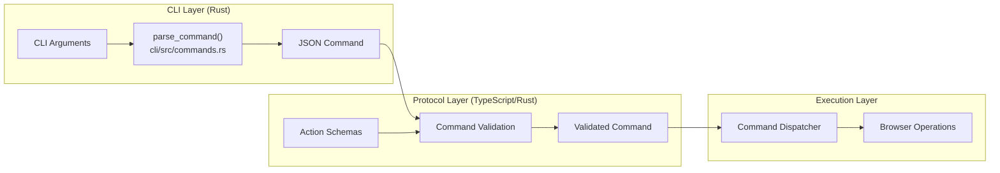
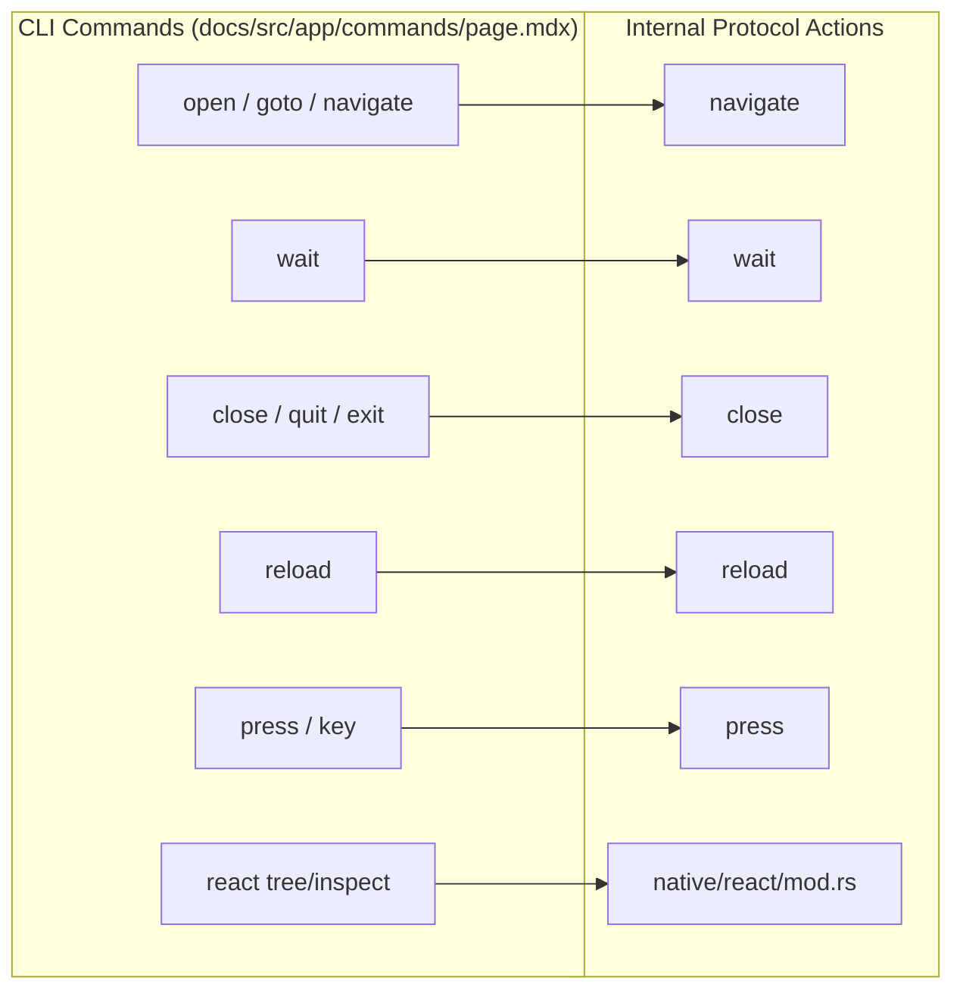
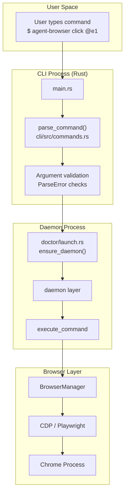

# Command Reference

<details>
<summary>Relevant source files</summary>

The following files were used as context for generating this wiki page:

- [cli/src/commands.rs](cli/src/commands.rs)
- [cli/src/doctor/launch.rs](cli/src/doctor/launch.rs)
- [cli/src/native/react/mod.rs](cli/src/native/react/mod.rs)
- [docs/src/app/commands/page.mdx](docs/src/app/commands/page.mdx)
- [docs/src/app/react/page.mdx](docs/src/app/react/page.mdx)
- [skill-data/core/SKILL.md](skill-data/core/SKILL.md)
- [skill-data/core/references/commands.md](skill-data/core/references/commands.md)
- [skill-data/core/references/video-recording.md](skill-data/core/references/video-recording.md)
- [skills/agent-browser/SKILL.md](skills/agent-browser/SKILL.md)

</details>


This page provides a comprehensive reference for all commands available in `agent-browser`. Commands are organized by functional category and documented with their syntax, parameters, and behavior.

For detailed documentation of specific command categories, see the following sections:
- **Navigation and Browser Control** ([Navigation and Browser Control](#5.1)) — Browser lifecycle, navigation, viewport, and settings.
- **Element Interaction** ([Element Interaction](#5.2)) — Clicking, typing, filling, scrolling, dragging.
- **Information Retrieval** ([Information Retrieval](#5.3)) — Getting page content, element properties, screenshots, PDFs.
- **State and Session Management** ([State and Session Management](#5.4)) — Cookies, storage, state persistence, session isolation.
- **Authentication** ([Authentication](#5.5)) — Credential vault and automated login.

For configuration options that affect command behavior, see [Configuration](#2.3). For the communication protocol between CLI and daemon, see [Communication Protocol](#3.5).

---

## Command Structure

Commands in `agent-browser` follow a consistent two-stage parsing model: CLI syntax is first parsed by the Rust client into a JSON command object, then validated against a schema by the daemon before execution.

### CLI to JSON Transformation

The CLI accepts commands in a human-readable shell syntax:

```bash
agent-browser click @e1
agent-browser fill @e2 "user@example.com"
agent-browser wait --load networkidle
```

The CLI entry point in `cli/src/main.rs` [cli/src/main.rs:1-31]() utilizes the command parsing logic defined in `cli/src/commands.rs`. The internal logic transforms these into structured JSON commands for the daemon.

```json
{"id": "r123456", "action": "click", "selector": "@e1"}
{"id": "r123457", "action": "fill", "selector": "@e2", "value": "user@example.com"}
{"id": "r123458", "action": "waitforloadstate", "state": "networkidle"}
```

Each command receives a unique `id` generated by `gen_id()` [cli/src/commands.rs:63-72]() for request/response correlation.

### JSON Protocol Schema

The daemon validates all commands against schemas. Each action has a corresponding schema that enforces parameter types and constraints.



**Diagram: Command Parsing and Validation Pipeline**

Sources: [cli/src/commands.rs:63-72](), [cli/src/main.rs:1-31]()

---

## Command Categories Overview

Commands are organized into functional categories. The following table provides a high-level map of common CLI entry points based on the core command list [docs/src/app/commands/page.mdx:3-183]().

| Category | CLI Commands | Documentation |
|----------|--------------|---------------|
| Navigation | `open`, `back`, `forward`, `reload`, `connect` | [Navigation and Browser Control](#5.1) |
| Element Interaction | `click`, `fill`, `type`, `hover`, `drag`, `select` | [Element Interaction](#5.2) |
| Keyboard Input | `press`, `keydown`, `keyup`, `keyboard type` | [Element Interaction](#5.2) |
| Scrolling | `scroll`, `scrollintoview` | [Element Interaction](#5.2) |
| Waiting | `wait` (with flags like `--load`, `--text`, `--url`) | [Element Interaction](#5.2) |
| Information | `get` (text, html, value, attr, title, url), `is` | [Information Retrieval](#5.3) |
| Capture | `screenshot`, `pdf`, `snapshot` | [Information Retrieval](#5.3) |
| Cookies/Storage | `cookies`, `storage` | [State and Session Management](#5.4) |
| Authentication | `auth`, `state save`, `state load` | [Authentication](#5.5) |
| Tabs/Windows | `tab` | [Navigation and Browser Control](#5.1) |
| Network | `network route`, `network list` | [Navigation and Browser Control](#5.1) |
| Browser Settings | `set` (viewport, device, geo, offline, headers) | [Navigation and Browser Control](#5.1) |
| Semantic Locators | `find` (role, text, label, placeholder, alt) | [Element Interaction](#5.2) |
| Specialized | `react`, `vitals`, `record` | [Information Retrieval](#5.3) |

Sources: [docs/src/app/commands/page.mdx:3-183](), [skill-data/core/references/commands.md:5-185](), [docs/src/app/react/page.mdx:18-29](), [skill-data/core/references/video-recording.md:34-46]()

---

## Command Parsing Details

### Parse Error Types

The CLI provides structured error messages for invalid commands through the `ParseError` enum [cli/src/commands.rs:10-31]():

| Error Type | Trigger |
|------------|---------|
| `UnknownCommand` | Command does not exist |
| `UnknownSubcommand` | Invalid subcommand for a valid command |
| `MissingArguments` | Required arguments missing |
| `InvalidValue` | Argument value fails validation |
| `InvalidSessionName` | Session name contains path traversal or invalid characters |

### Advanced Parsing: Cookies

The CLI includes specialized parsers for complex inputs, such as `parse_curl_cookies` [cli/src/commands.rs:85-127](), which auto-detects formats like JSON arrays, cURL dumps (e.g., copied from DevTools), or bare headers for bulk cookie imports [cli/src/commands.rs:74-84]().

Sources: [cli/src/commands.rs:10-31](), [cli/src/commands.rs:85-127]()

---

## Command Identifier Generation

Each command receives a unique identifier generated by `gen_id()` [cli/src/commands.rs:63-72](). The ID format is `r<microseconds>` where microseconds are the last 6 digits of Unix epoch time modulo 1000000. This provides request/response correlation between the CLI client and the daemon.

Sources: [cli/src/commands.rs:63-72]()

---

## Command-to-Action Mapping

The following diagram shows how user-facing commands map to internal protocol actions.



**Diagram: Command Aliases and Action Dispatch**

### Notable Patterns

**Command Aliases:** Multiple CLI commands map to the same action to provide a flexible interface for agents and humans:
- `open`, `goto`, `navigate` → `navigate` [docs/src/app/commands/page.mdx:7]()
- `close`, `quit`, `exit` → `close` [docs/src/app/commands/page.mdx:37]()
- `press`, `key` → `press` [skill-data/core/references/commands.md:59]()

**Stable Tab IDs:** Tabs use stable string IDs like `t1`, `t2` instead of positional indices to prevent errors when tabs are closed [docs/src/app/commands/page.mdx:181]().

Sources: [docs/src/app/commands/page.mdx:6-38](), [skill-data/core/references/commands.md:5-185]()

---

## Command Execution Architecture

The following diagram shows the complete flow from CLI invocation to browser execution:



**Diagram: End-to-End Command Execution Flow**

Sources: [cli/src/main.rs:1-31](), [cli/src/commands.rs:10-31](), [cli/src/doctor/launch.rs:87-101]()

---

## For More Information

- **Detailed Command Syntax**: See child pages [Navigation and Browser Control](#5.1) through [Authentication](#5.5) for complete reference documentation.
- **Configuration Options**: See [Configuration](#2.3) for flags that modify command behavior.
- **Security Controls**: See [Action Policies](#6.3) for gating destructive commands.
- **Element References**: See [Element References (Refs)](#4.2) for understanding `@e1` style selectors.
- **Skills System**: See `agent-browser skills get core` for the canonical usage guide and runtime instruction set [skills/agent-browser/SKILL.md:21]().
- **React & Vitals**: Detailed inspection of React trees and web standards [cli/src/native/react/mod.rs:1-12]().
