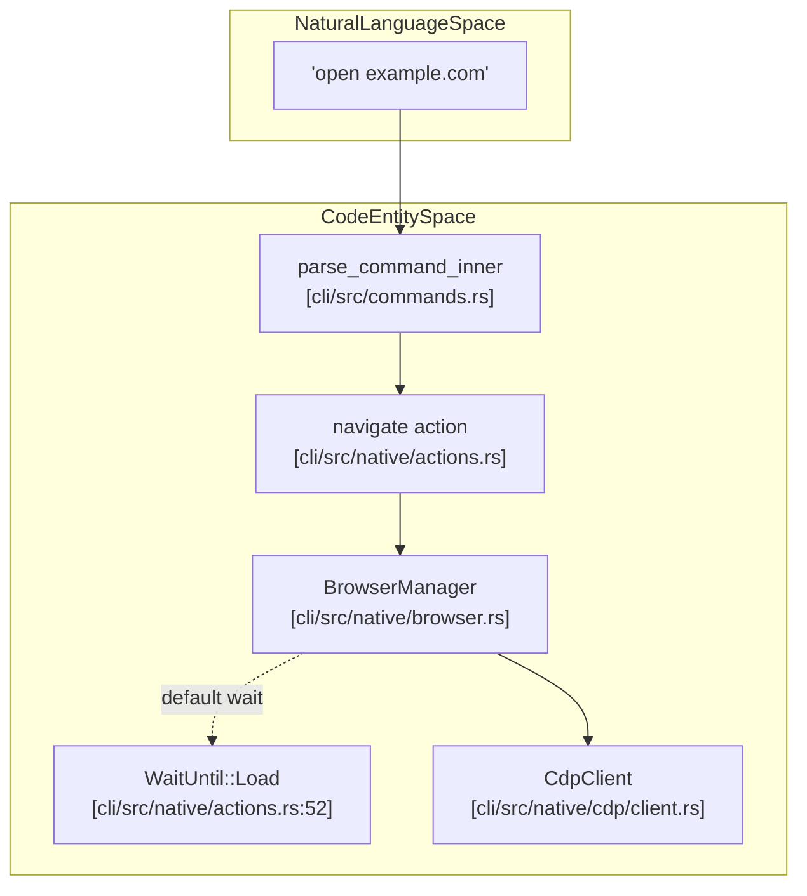
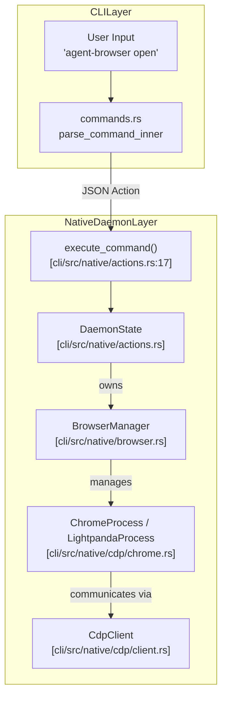

# Navigation and Browser Control

<details>
<summary>Relevant source files</summary>

The following files were used as context for generating this wiki page:

- [cli/src/commands.rs](cli/src/commands.rs)
- [cli/src/native/actions.rs](cli/src/native/actions.rs)
- [cli/src/native/browser.rs](cli/src/native/browser.rs)
- [cli/src/native/e2e_tests.rs](cli/src/native/e2e_tests.rs)

</details>


This page documents commands for controlling browser navigation, viewport settings, and browser-level configuration. These commands manage the browser lifecycle, page navigation history, and environment settings like viewport size, device emulation, and network conditions.

For element interaction commands (click, type, fill), see **Element Interaction (5.2)**. For retrieving page content and element properties, see **Information Retrieval (5.3)**. For state management and sessions, see **State and Session Management (5.4)**.

## Navigation Commands

Navigation commands control page loading and history traversal. The system supports standard HTTP/HTTPS URLs, as well as special schemes like `file://`, `data:`, `about:`, and `chrome://` for local content and browser internals.

### Navigate (open, goto)

The `open` command navigates to a URL. The CLI and daemon layers handle URL normalization and wait strategies to ensure reliable page loads.

**CLI Usage:**
```bash
agent-browser open example.com
agent-browser goto https://example.com
agent-browser navigate https://example.com --headers '{"Authorization":"Bearer token"}'
```

**Implementation Detail:**
The `AUTH_LOGIN_WAIT_UNTIL` constant defines the default wait strategy as `WaitUntil::Load` for authentication flows, as `NetworkIdle` can be unreliable in modern SPAs that maintain persistent background connections. [cli/src/native/actions.rs:52]()

**URL Normalization:**
The CLI client performs normalization before sending the action to the daemon. If no protocol is specified, it defaults to `https://`. Supported schemes include `http://`, `https://`, `about:`, `data:`, `file:`, `chrome-extension://`, and `chrome://`.

**Next.js Optimization:**
Specialized SPA navigation is handled by detecting environment-specific routers. For Next.js sites, the system attempts to trigger `window.next.router.push` to perform React Server Component (RSC) fetches before falling back to standard browser history events.

**Navigation Execution Flow:**



**Sources:**
- [cli/src/native/actions.rs:52]()
- [cli/src/native/browser.rs:8-15]()
- [cli/src/native/e2e_tests.rs:171-179]()

### History Navigation

The CLI maps these directly to their respective protocol actions within the browser backend via the `CdpClient`.

**Back:**
```bash
agent-browser back
```
Navigates to the previous page in history.

**Forward:**
```bash
agent-browser forward
```
Navigates to the next page in history.

**Reload:**
```bash
agent-browser reload
```
Reloads the current page.

## Browser Connection and Lifecycle

### CDP Connection

The `connect` command attaches to an existing browser instance via Chrome DevTools Protocol (CDP). This utilizes `auto_connect_cdp` and `discover_cdp_url` to find the debugging endpoint. [cli/src/native/browser.rs:8-10]()

**CLI Usage:**
```bash
# Connect to local Chrome with remote debugging on port 9222
agent-browser connect 9222

# Auto-discover running Chrome instance
agent-browser --auto-connect open example.com
```

### Launch Options and Validation

The `LaunchOptions` struct defines how the browser is started. To prevent invalid configurations, the system performs validation before attempting to spawn a process. [cli/src/native/actions.rs:16-17]()

**Launch Hashing:**
The system uses `launch_hash` to compute a hash of fields that require a browser relaunch (like `headless` mode, `extensions`, or `executable_path`). If these fields change between commands in a session, the existing browser process is terminated and restarted with the new configuration. [cli/src/native/actions.rs:186-200]()

**Validation Logic:**
- **Extensions/Profiles vs CDP**: Cannot use local extensions or profiles when connecting to a remote `cdp_url`. [cli/src/native/browser.rs:31-41]()
- **Lightpanda Restrictions**: Lightpanda (the high-performance headless engine) does not support extensions, profiles, headed mode, or custom Chrome arguments. [cli/src/native/browser.rs:62-89]()
- **File Access**: `allow_file_access` is restricted to Chromium-based browsers and is validated in `validate_launch_options`. [cli/src/native/browser.rs:48-57]()

**Sources:**
- [cli/src/native/actions.rs:186-200]()
- [cli/src/native/browser.rs:21-89]()

### Tab and Target Management

The system tracks browser tabs as `PageInfo` objects within the `BrowserManager`. [cli/src/native/browser.rs:160-173]()

- **Target Filtering**: Internal Chrome targets (e.g., `chrome://`, `chrome-extension://`, `devtools://`) are filtered out via `should_track_target` to prevent the AI from interacting with browser internals. [cli/src/native/browser.rs:93-102]()
- **Tab IDs**: Tabs are identified using a stable `t<N>` format (e.g., `t1`, `t2`), generated by `format_tab_id`. This disambiguates stable IDs from positional indices. [cli/src/native/browser.rs:178-180]()
- **Labels**: Users can assign unique labels to tabs (e.g., `tab new --label docs`) for easier reference in multi-tab workflows. Labels are unique within a session and persist across navigations. [cli/src/native/browser.rs:167-171]()

**Sources:**
- [cli/src/native/browser.rs:93-180]()

## Viewport and Display

Commands for modifying the physical and logical display characteristics of the browser are dispatched through the `execute_command` pipeline.

| Command | Description | Example |
| :--- | :--- | :--- |
| `set viewport` | Sets width, height, and optional device scale factor (DPR). | `set viewport 1920 1080 2` |
| `set device` | Emulates a specific device profile (e.g., iPhone, Pixel). | `set device "iPhone 14"` |
| `set media` | Emulates CSS media features like `prefers-color-scheme`. | `set media dark` |

## Browser Settings

### Network and Environment

- **Geolocation**: Sets the coordinates for the browser's location API.
- **Offline Mode**: Toggles the network availability state.
- **HTTP Headers**: Sets global extra HTTP headers for all requests.
- **Basic Auth**: Sets credentials for HTTP Basic Authentication via the `credentials` action.

## Command Execution Flow

The following diagram traces the data flow from a CLI input through the native Rust `execute_command` pipeline into the browser control logic.

**Command Execution Logic Map:**



**Sources:**
- [cli/src/native/actions.rs:17-112]()
- [cli/src/native/browser.rs:8-14]()
- [cli/src/native/e2e_tests.rs:158-212]()
