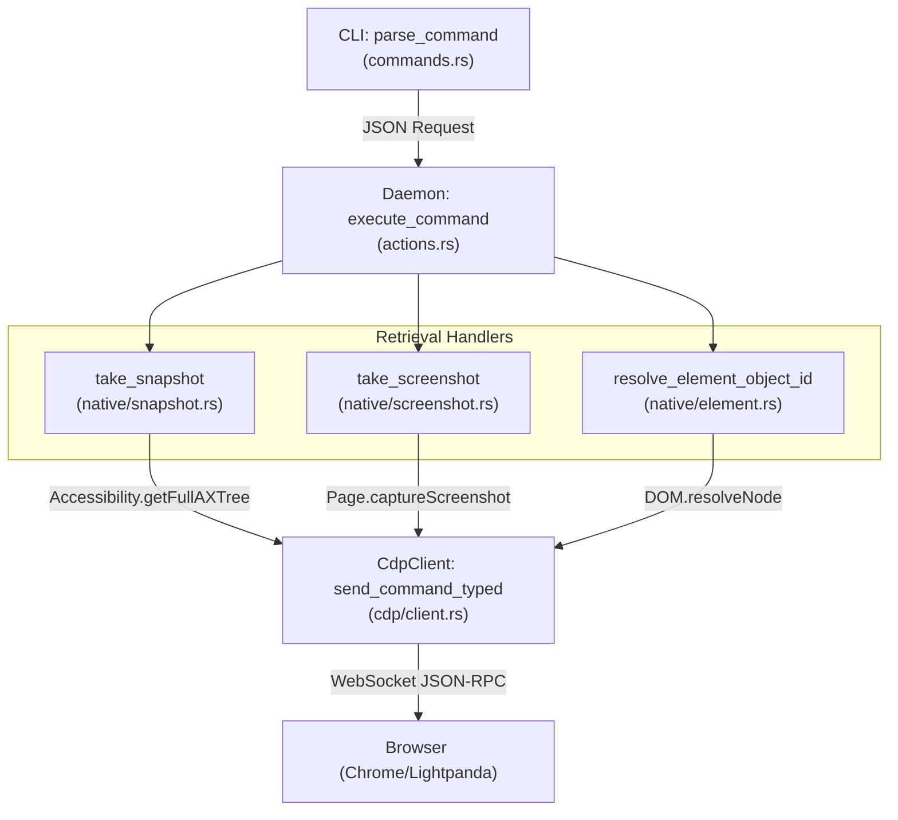
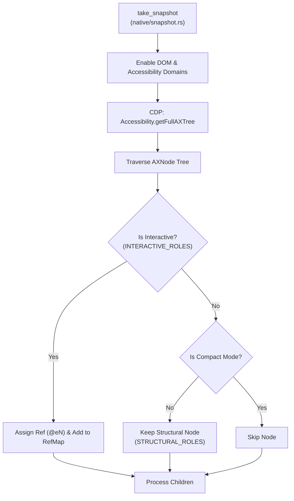

# Information Retrieval

<details>
<summary>Relevant source files</summary>

The following files were used as context for generating this wiki page:

- [cli/src/commands.rs](cli/src/commands.rs)
- [cli/src/native/element.rs](cli/src/native/element.rs)
- [cli/src/native/interaction.rs](cli/src/native/interaction.rs)
- [cli/src/native/screenshot.rs](cli/src/native/screenshot.rs)
- [cli/src/native/snapshot.rs](cli/src/native/snapshot.rs)
- [skill-data/core/templates/capture-workflow.sh](skill-data/core/templates/capture-workflow.sh)

</details>


This document covers commands for extracting information from web pages, including page content, element properties, accessibility snapshots, visual captures, and diagnostic data. These commands are essential for AI agents to observe page state and extract data without modifying it.

---

## Overview

Information retrieval commands query the browser state and DOM. In the native Rust architecture, these commands flow from the CLI through the daemon to the `CdpClient`, which communicates directly with the browser via the Chrome DevTools Protocol (CDP).

Key capabilities include:
- **Page-level**: URL, title, HTML content, and PDF generation. [cli/src/commands.rs:32-60](), [skill-data/core/templates/capture-workflow.sh:32-52]()
- **Element-level**: Text, attributes, values, bounding boxes, and computed styles. [cli/src/native/element.rs:171-202](), [cli/src/native/interaction.rs:122-144]()
- **Structured snapshots**: Compact accessibility trees with element references (refs). [cli/src/native/snapshot.rs:216-230]()
- **Visual captures**: Screenshots with optional SVG-based annotations for interactive elements. [cli/src/native/screenshot.rs:100-107]()

All information retrieval commands return JSON responses defined by the `Response` struct.

---

## Command Processing Flow (Native)

The following diagram traces how an information retrieval command moves through the system, specifically highlighting the transition from high-level CLI commands to low-level CDP calls.

**Retrieval Dispatch Pipeline**


**Sources:** [cli/src/native/snapshot.rs:224-229](), [cli/src/native/screenshot.rs:100-107](), [cli/src/native/element.rs:187-202](), [cli/src/native/interaction.rs:132-144]()

---

## Page Information Commands

### get url / get title
Returns the current URL or page title. These are basic queries that verify the agent's location.

**CLI syntax:**
```bash
agent-browser get url
agent-browser get title
```

**Implementation:** In the native daemon, these map to the current browser state or specific CDP `Runtime.evaluate` calls if the state is not already cached. [skill-data/core/templates/capture-workflow.sh:32-36]()

**Sources:** [skill-data/core/templates/capture-workflow.sh:32-36]()

---

### get text / get value / get attr
These commands retrieve specific data from elements using either CSS selectors or refs (`@e1`).

| Command | Action | Description |
|---------|--------|-------------|
| `get text <sel>` | `text` | Returns the `innerText` or `textContent`. |
| `get html <sel>` | `html` | Returns the `innerHTML`. |
| `get value <sel>` | `value` | Returns the `value` property of inputs/textareas. |
| `get attr <sel> <attr>` | `attribute` | Returns a specific HTML attribute (e.g., `href`). |

**Implementation:** The daemon uses `resolve_element_object_id` in [cli/src/native/element.rs:122-129]() (via `interaction.rs`) to find the element, then executes `Runtime.callFunctionOn` via CDP to extract the property.

**Sources:** [cli/src/native/interaction.rs:122-144](), [cli/src/native/element.rs:171-202]()

---

## Snapshots and Accessibility Tree

The `snapshot` command is the primary "vision" for text-based AI agents. It extracts a hierarchical view of the page based on the ARIA accessibility tree.

### snapshot
Generates a compact tree with stable element references (refs).

**CLI syntax:**
```bash
agent-browser snapshot -i -c -d 5
```

**Options:**
- `-i, --interactive`: Only include actionable elements (buttons, links, inputs). [cli/src/native/snapshot.rs:11-30](), [cli/src/native/snapshot.rs:80]()
- `-c, --compact`: Remove empty structural nodes like generic divs. [cli/src/native/snapshot.rs:45-66](), [cli/src/native/snapshot.rs:81]()
- `-d, --depth`: Limit how deep the tree traversal goes. [cli/src/native/snapshot.rs:82]()

**Snapshot Generation Logic**


**Sources:** [cli/src/native/snapshot.rs:11-66](), [cli/src/native/snapshot.rs:78-104](), [cli/src/native/snapshot.rs:216-230](), [cli/src/native/element.rs:18-21]()

---

## Visual Capture Commands

### screenshot
Captures the current viewport or full page.

**CLI syntax:**
```bash
agent-browser screenshot --annotate --full-page
```

**Annotated Screenshots:**
When `--annotate` is used, the system:
1. Retrieves the current `RefMap` entries using `entries_sorted()`. [cli/src/native/screenshot.rs:236-249]()
2. Injects a temporary SVG overlay into the page DOM containing numbered labels that correspond to refs via `inject_annotation_overlay`. [cli/src/native/screenshot.rs:126-131]()
3. Captures the screenshot via `Page.captureScreenshot` in `capture_screenshot_base64`. [cli/src/native/screenshot.rs:171-229]()
4. Removes the overlay via `remove_annotation_overlay` to restore page state. [cli/src/native/screenshot.rs:136-138]()

**Sources:** [cli/src/native/screenshot.rs:100-229](), [cli/src/native/element.rs:89-104]()

---

### pdf
Prints the current page to a PDF file.

**CLI syntax:**
```bash
agent-browser pdf output.pdf
```

**Implementation:** Uses the CDP command `Page.printToPDF` to generate a document representation of the current page. [skill-data/core/templates/capture-workflow.sh:50-52]()

**Sources:** [skill-data/core/templates/capture-workflow.sh:50-52]()

---

## Output Formatting and Security

The CLI handles the presentation of retrieved information, applying security filters and limits before printing to stdout.

### Content Boundaries
To prevent "Prompt Injection" where a malicious webpage might try to terminate the agent's output and inject its own commands, `agent-browser` can wrap retrieved content in random nonces.

**Implementation:**
The system generates a unique ID for command tracking. [cli/src/commands.rs:63-72](). If content boundaries are enabled, the output is wrapped with CSPRNG-generated nonces to demarcate untrusted page content.

### Output Truncation
To avoid overwhelming LLM context windows, the system clips strings that exceed the configured maximum output limit.

**Sources:** [cli/src/commands.rs:63-72](), [cli/src/commands.rs:85-107]()
