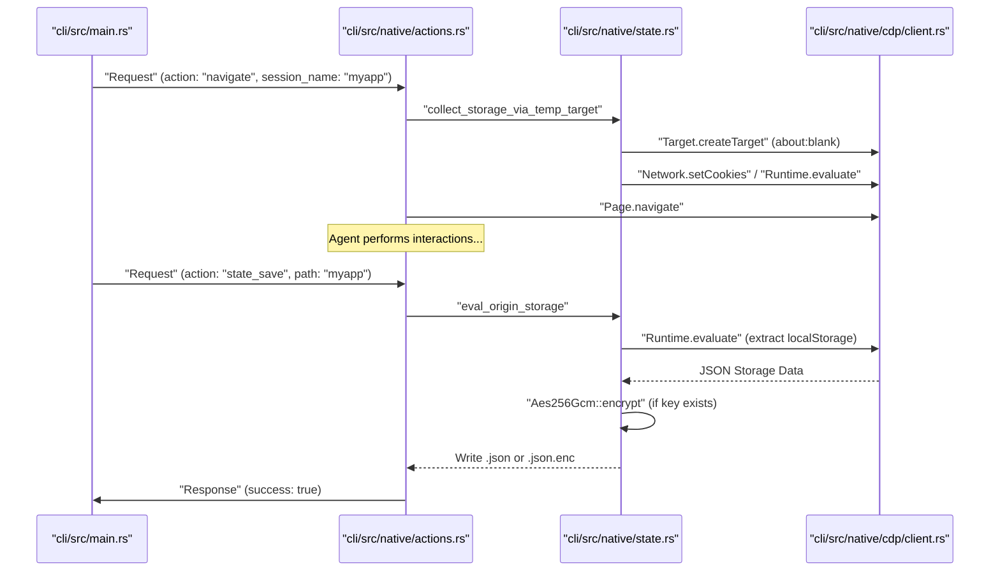
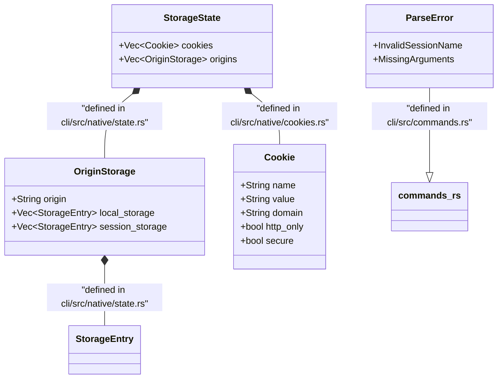

# State and Session Management

Relevant source files

The following files were used as context for generating this wiki page:

- [cli/src/commands.rs](cli/src/commands.rs)
- [cli/src/native/cookies.rs](cli/src/native/cookies.rs)
- [cli/src/native/state.rs](cli/src/native/state.rs)
- [skill-data/core/templates/authenticated-session.sh](skill-data/core/templates/authenticated-session.sh)

This page documents the implementation and usage of browser state management, persistent sessions, cookies, and web storage (localStorage/sessionStorage). These features enable AI agents to maintain context across restarts, reuse authentication tokens, and manipulate browser data directly via the native Rust daemon.

## Session Types and Persistence

The `agent-browser` supports three primary session modes, determined by CLI flags and managed by the `DaemonState` in the native Rust implementation.

| Session Mode | CLI Flag | Persistence | Implementation Detail |
|--------------|----------|-------------|-----------------------|
| **Default** | (none) | In-memory | Temporary context; lost when the daemon process exits. |
| **Named** | `--session <id>` | In-memory | Isolated context identified by `<id>`; allows parallel agents to run without cross-talk. |
| **Persistent** | `--session-name <name>` | Disk-backed | Auto-saves/loads state from `~/.agent-browser/sessions/` using the specified name. |

**Sources:** [cli/src/commands.rs:11-31](), [cli/src/commands.rs:7-7]()

### Session Lifecycle Diagram

This diagram traces how a session is initialized and persisted within the command lifecycle in the native daemon.

**Sources:** [cli/src/native/state.rs:88-107](), [cli/src/native/state.rs:112-141](), [cli/src/native/state.rs:1-5]()

## State File Management

State files capture the complete storage state of a browser context, including cookies, `localStorage`, and `sessionStorage`.

### state_save and state_load

The `state_save` implementation in `cli/src/native/state.rs` handles data extraction via the Chrome DevTools Protocol (CDP). It uses `eval_origin_storage` to collect data for the current origin and can use a temporary target (`collect_storage_via_temp_target`) to crawl other known origins without making real network requests by intercepting fetches with blank HTML.

**Data Flow for state_save:**
1. **Cookies:** Fetched via `get_all_cookies` using the `Network.getAllCookies` CDP command in `cli/src/native/cookies.rs`.
2. **Storage:** Extracted using `eval_origin_storage` which calls `Runtime.evaluate` with a script that returns `localStorage` and `sessionStorage` entries.
3. **Serialization:** Data is structured into the `StorageState` struct defined in `cli/src/native/state.rs`.
4. **Encryption:** If an encryption key is present, the JSON is encrypted using AES-256-GCM.

**Sources:** [cli/src/native/state.rs:19-38](), [cli/src/native/state.rs:88-107](), [cli/src/native/state.rs:112-141](), [cli/src/native/cookies.rs:27-38]()

### Encryption at Rest

State files and authentication profiles are protected using industrial-grade encryption when configured.

- **Mechanism:** AES-256-GCM (Authenticated Encryption with Associated Data).
- **Implementation:** Uses the `aes_gcm` crate for encryption and `sha2` for key derivation.
- **Key Source:** The system looks for the `AGENT_BROWSER_ENCRYPTION_KEY` environment variable.

**Sources:** [cli/src/native/state.rs:1-5]()

## Storage and Cookie Commands

Direct manipulation of browser data is provided through specific actions defined in the protocol and handled by the native daemon.

### Cookie Management
The `cli/src/native/cookies.rs` file provides helper functions for managing cookies via CDP:
- `get_cookies`: Retrieves cookies filtered by specific URLs.
- `set_cookies`: Sets cookie attributes. It automatically fills the `url` field if only a domain is provided and `current_url` is available.
- `clear_cookies`: Removes all cookies using `Network.clearBrowserCookies`.

The CLI also supports parsing cookies from various formats (JSON array, cURL dump, or bare header) via `parse_curl_cookies` in `cli/src/commands.rs`.

**Sources:** [cli/src/native/cookies.rs:40-60](), [cli/src/native/cookies.rs:62-93](), [cli/src/native/cookies.rs:95-100](), [cli/src/commands.rs:85-127]()

### Web Storage Management
The `StorageState` and `OriginStorage` structs facilitate the transfer of `localStorage` and `sessionStorage`.

| Struct | Purpose | File |
|---------|----------------|----------------------|
| `StorageState` | Container for all cookies and origin-specific storage. | [cli/src/native/state.rs:19-22]() |
| `OriginStorage` | Maps a specific origin to its `localStorage` and `sessionStorage` entries. | [cli/src/native/state.rs:26-31]() |
| `StorageEntry` | A simple key-value pair for storage items. | [cli/src/native/state.rs:35-38]() |

**Sources:** [cli/src/native/state.rs:19-38]()

## Implementation Entities

The following diagram maps logical state concepts to specific Rust structs and files.

**Sources:** [cli/src/native/state.rs:19-38](), [cli/src/native/cookies.rs:8-25](), [cli/src/commands.rs:11-31]()

## Batch Command Execution

To minimize IPC (Inter-Process Communication) overhead between the Rust CLI and the background daemon, `agent-browser` supports command batching. The CLI uses `gen_id` to generate unique request IDs for tracking these commands.

**Sources:** [cli/src/commands.rs:63-72]()

## Security and Validation

### Session Name Validation
To prevent path traversal and shell injection, session names are strictly validated. The `ParseError::InvalidSessionName` variant is used when a name contains invalid characters or path traversal sequences.

- **Validation Logic:** Handled via `is_valid_session_name` and formatted by `session_name_error`.
- **Rejection:** Any string attempting path traversal or containing invalid characters is rejected.

**Sources:** [cli/src/commands.rs:29-31](), [cli/src/commands.rs:58-60](), [cli/src/commands.rs:7]()

### Authenticated Sessions
A common workflow involves logging in once and saving the state for reuse. The `authenticated-session.sh` template demonstrates this pattern:
1. Perform login interactions (Discovery mode to find refs, then Login mode).
2. Save state: `agent-browser state save "$STATE_FILE"`.
3. Reuse state: `agent-browser --state "$STATE_FILE" open "$LOGIN_URL"`.

**Sources:** [skill-data/core/templates/authenticated-session.sh:35-52](), [skill-data/core/templates/authenticated-session.sh:101-106]()
