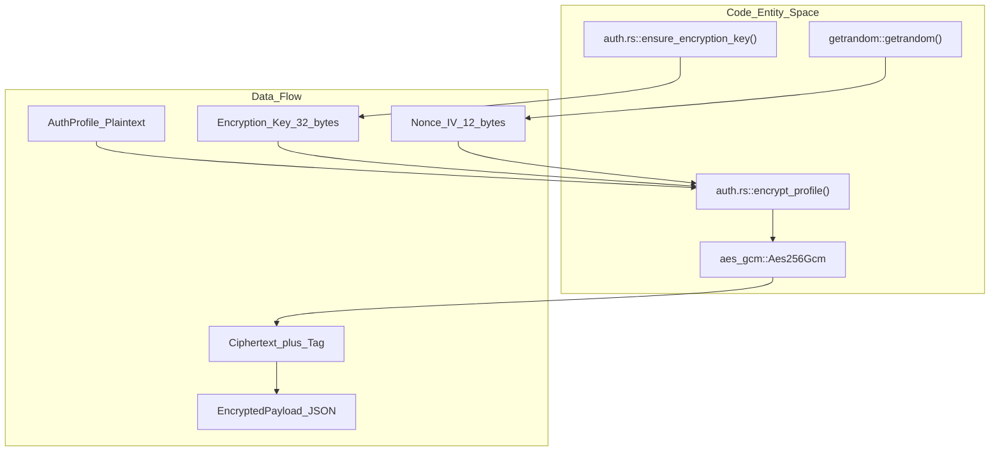
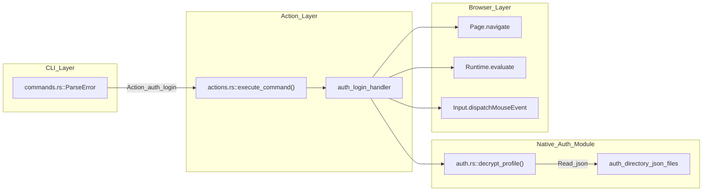

# Authentication

Relevant source files

The following files were used as context for generating this wiki page:

- [cli/src/commands.rs](cli/src/commands.rs)
- [cli/src/native/auth.rs](cli/src/native/auth.rs)
- [cli/src/native/cdp/types.rs](cli/src/native/cdp/types.rs)
- [cli/src/native/network.rs](cli/src/native/network.rs)
- [cli/src/native/parity_tests.rs](cli/src/native/parity_tests.rs)
- [cli/src/native/recording.rs](cli/src/native/recording.rs)

This page documents the authentication vault system: saving credentials, automated login, auth profiles, and encrypted credential storage. The authentication vault is designed for AI agents that need to authenticate to websites without exposing passwords in command output or logs.

For information about session persistence (cookies, localStorage) after authentication, see [4.1 Sessions and State](). For security policies that control authentication actions, see [6.3 Action Policies]().

---

## Overview

The authentication vault provides secure, encrypted storage for login credentials referenced by profile name. Credentials are encrypted at rest using AES-256-GCM. The system ensures that passwords never appear in command output, daemon IPC channels, or logs.

**Key Features:**
- **Named Profiles**: Store multiple credentials under human-readable names via the `AuthProfile` struct [cli/src/native/auth.rs:11-26]().
- **Automatic Encryption**: All credentials encrypted with AES-256-GCM before writing to disk [cli/src/native/auth.rs:152-182]().
- **Safe Input**: Command parsing supports standard input for sensitive data to prevent password exposure in shell history [cli/src/commands.rs:11-31]().
- **Automated Login**: `auth_login` command navigates to the login page, fills credentials, and submits the form [cli/src/native/parity_tests.rs:178]().
- **Custom Selectors**: Support for non-standard login forms via optional `username_selector`, `password_selector`, and `submit_selector` fields [cli/src/native/auth.rs:17-21]().

**Storage Location:** `~/.agent-browser/auth/` [cli/src/native/auth.rs:45-51]().

**Encryption Key:** Auto-generated at `~/.agent-browser/.encryption-key` or set via `AGENT_BROWSER_ENCRYPTION_KEY` environment variable (64-character hex string) [cli/src/native/auth.rs:57-70]().

Sources: [cli/src/native/auth.rs:11-26](), [cli/src/native/auth.rs:45-51](), [cli/src/native/auth.rs:152-182](), [cli/src/native/parity_tests.rs:178](), [cli/src/commands.rs:11-31](), [cli/src/native/auth.rs:57-70]()

---

## Data Structures

The core of the authentication system is the `AuthProfile` struct, which defines how credentials and form selectors are stored.

### The AuthProfile Struct
The `AuthProfile` struct (also aliased as `Credential`) stores all data necessary to perform an automated login.

| Field | Type | Description |
|-------|------|-------------|
| `name` | `String` | Unique identifier for the profile. |
| `url` | `String` | The target login page URL. |
| `username` | `String` | The login identifier. |
| `password` | `String` | The secret credential (encrypted at rest). |
| `username_selector`| `Option<String>` | Optional CSS selector for the username input. |
| `password_selector`| `Option<String>` | Optional CSS selector for the password input. |
| `submit_selector` | `Option<String>` | Optional CSS selector for the submit button. |
| `created_at` | `Option<String>` | ISO timestamp of profile creation. |
| `last_login_at` | `Option<String>` | ISO timestamp of the last successful login. |

Sources: [cli/src/native/auth.rs:11-26](), [cli/src/native/auth.rs:29-30]()

---

## Encryption Implementation

The system uses AES-256-GCM for authenticated encryption. The implementation ensures that even if the storage files are compromised, the credentials remain secure without the master key.

### Key Management Logic
The `get_encryption_key` function attempts to retrieve a 256-bit key from the environment variable `AGENT_BROWSER_ENCRYPTION_KEY` or a local file `~/.agent-browser/.encryption-key` [cli/src/native/auth.rs:85-112](). If neither exists, `ensure_encryption_key` generates a new 32-byte key using `getrandom` and saves it with restricted permissions (0o600 for the key file) [cli/src/native/auth.rs:115-149]().

### Encryption Flow
When saving a profile via `encrypt_profile`, the system:
1. Generates a random 12-byte initialization vector (IV/Nonce) [cli/src/native/auth.rs:160-161]().
2. Encrypts the serialized `AuthProfile` JSON using `Aes256Gcm` [cli/src/native/auth.rs:154-158]().
3. Appends a 16-byte authentication tag to the ciphertext [cli/src/native/auth.rs:168-170]().
4. Encodes the IV, Tag, and Ciphertext into a Base64-encoded JSON envelope defined by `EncryptedPayload` [cli/src/native/auth.rs:172-178](), [cli/src/native/auth.rs:185-195]().

**Encryption Data Flow**

Sources: [cli/src/native/auth.rs:152-182](), [cli/src/native/auth.rs:115-149](), [cli/src/native/auth.rs:185-195]()

---

## Command Processing

Authentication commands are parsed in `cli/src/commands.rs` and dispatched to the appropriate handlers in the native daemon via the `execute_command` pipeline [cli/src/native/parity_tests.rs:10]().

### Saving Credentials (`auth_save`)
The `auth_save` command constructs an `AuthProfile`. The command parsing logic ensures that mandatory fields like `name`, `url`, `username`, and `password` are present [cli/src/native/parity_tests.rs:245-250]().

### Login Automation (`auth_login`)
The `auth_login` action is a high-level command handled by the daemon. It performs the following sequence:
1. **Navigate**: Goes to the URL defined in the `AuthProfile` [cli/src/native/parity_tests.rs:202-204]().
2. **Identify**: Locates the username and password fields using provided selectors or heuristics [cli/src/native/parity_tests.rs:208-216]().
3. **Interact**: Fills the credentials and submits the form [cli/src/native/parity_tests.rs:208-216]().

**Auth Command Lifecycle**

Sources: [cli/src/commands.rs:11-31](), [cli/src/native/parity_tests.rs:176-181](), [cli/src/native/auth.rs:197-220](), [cli/src/native/parity_tests.rs:10]()

---

## Profile Management

Users can manage the lifecycle of their authentication vault through several actions defined in the protocol:

| Action | Purpose | Implementation Detail |
|---------|--------|-----------------------|
| `auth_list` | List profile names | Scans the `auth/` directory for `.json` files [cli/src/native/auth.rs:53-55](). |
| `auth_show` | Display metadata | Decrypts and displays profile info (excluding password) [cli/src/native/auth.rs:11-26](). |
| `auth_delete` | Remove a profile | Deletes the specific `.json` file from the `auth/` directory [cli/src/native/auth.rs:53-55](). |

### Profile Name Validation
Profile names are strictly validated to prevent path traversal or shell injection. The `validate_profile_name` function ensures names are non-empty and consist only of alphanumeric characters, underscores, or hyphens [cli/src/native/auth.rs:31-43]().

Sources: [cli/src/native/auth.rs:31-43](), [cli/src/native/auth.rs:53-55](), [cli/src/native/parity_tests.rs:177-181]()

---

## Integration with State Management

Authentication is often the first step in a larger workflow. Once `auth_login` succeeds, the resulting session (cookies and localStorage) can be captured using `state_save` [cli/src/native/parity_tests.rs:85-91]().

The state management system collects cookies and origin-specific storage after a successful login. If `AGENT_BROWSER_ENCRYPTION_KEY` is configured, these state files are protected at rest using the same AES-256-GCM mechanism, ensuring that session tokens acquired during the authentication flow remain secure [cli/src/native/auth.rs:85-93]().

Sources: [cli/src/native/parity_tests.rs:85-91](), [cli/src/native/auth.rs:85-93]()
