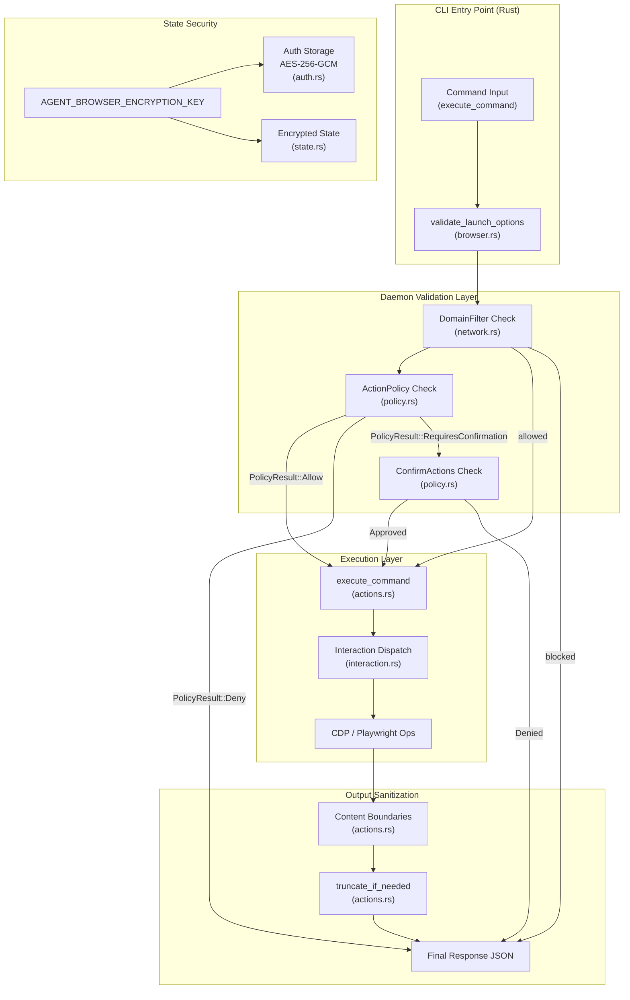

# Security

Relevant source files

The following files were used as context for generating this wiki page:

- [cli/src/native/actions.rs](cli/src/native/actions.rs)
- [cli/src/native/browser.rs](cli/src/native/browser.rs)
- [cli/src/native/e2e_tests.rs](cli/src/native/e2e_tests.rs)
- [docs/src/app/security/page.mdx](docs/src/app/security/page.mdx)
- [skill-data/core/references/trust-boundaries.md](skill-data/core/references/trust-boundaries.md)

## Purpose and Scope

This document provides an overview of agent-browser's security architecture, designed to protect both the host system and AI agents from malicious content and unintended actions. The security model implements defense-in-depth with multiple layers of protection that can be enabled independently or combined for production AI agent deployments.

For detailed information on specific security mechanisms, see:
- [Security Overview](#6.1) — Detailed threat scenarios and defense-in-depth approach.
- [Domain Allowlists](#6.2) — Navigation and resource filtering via `DomainFilter` and `FetchHandler`.
- [Action Policies](#6.3) — Gating destructive operations using `policy.json` and `PolicyResult`.
- [Content Boundaries and Output Limits](#6.4) — LLM safety features including CSPRNG nonces and output truncation.

For authentication and credential management, see [Authentication](#5.5).

---

## Security Model Overview

agent-browser is designed for AI agent deployments where:
1. **Untrusted websites** may inject malicious content into snapshots or page text (Prompt Injection) [docs/src/app/security/page.mdx:12-12]().
2. **AI agents** may be tricked into executing destructive actions (Unauthorized Execution) [docs/src/app/security/page.mdx:14-14]().
3. **Credentials** must be protected from LLM exposure via the `AuthVault` and `AuthProfile` [docs/src/app/security/page.mdx:11-11]().
4. **Output size** must be controlled to prevent context flooding via truncation [docs/src/app/security/page.mdx:15-15]().

All security features are **opt-in by default** [docs/src/app/security/page.mdx:5-5](). Without configuration, agent-browser imposes no restrictions on navigation, actions, or output.

**Sources:** [docs/src/app/security/page.mdx:1-24](), [skill-data/core/references/trust-boundaries.md:8-27]()

---

## Security Architecture

The following diagram maps the flow from a CLI command to execution, highlighting the security gates and the relationship between Natural Language concepts and Code Entities.

### Command Execution Security Flow

**Sources:** [cli/src/native/actions.rs:17-42](), [cli/src/native/browser.rs:21-59](), [docs/src/app/security/page.mdx:7-16]()

---

## Security Layers

### Input & Action Security

*   **Domain Allowlist:** Restricts the browser to specific domains using the `DomainFilter` struct [cli/src/native/network.rs:28-28](). It blocks both top-level navigation and sub-resource requests (XHR, Fetch, WebSockets) via `AGENT_BROWSER_ALLOWED_DOMAINS` [docs/src/app/security/page.mdx:103-109]().
*   **Action Policy:** Gates commands into categories (e.g., `click`, `type`, `eval`). The policy system uses `ActionPolicy` to load configurations and returns a `PolicyResult` (Allow, Deny, or RequiresConfirmation) [cli/src/native/actions.rs:29-29]().
*   **Confirmation Workflow:** High-risk actions can be gated via `ConfirmActions`. These require explicit approval (via a `confirmationId`) and auto-deny after 60 seconds [docs/src/app/security/page.mdx:22-23]().

### Output & Content Security

*   **Content Boundaries:** Page-sourced data is wrapped in structural markers with a CSPRNG nonce when enabled via `AGENT_BROWSER_CONTENT_BOUNDARIES` [docs/src/app/security/page.mdx:67-85](). This allows the agent orchestrator to distinguish between trusted tool output and untrusted page content.
*   **Output Truncation:** Large page outputs are capped via `truncate_if_needed` logic to prevent context flooding in the LLM's context window [docs/src/app/security/page.mdx:15-15]().

### Credential & State Security

*   **Auth Vault:** Credentials stored in `~/.agent-browser/auth/` are encrypted with AES-256-GCM. The `auth_login` command handles form filling locally so secrets are never exposed to the LLM [cli/src/native/actions.rs:44-52](), [docs/src/app/security/page.mdx:63-65]().
*   **Encrypted Sessions:** Session states (cookies/localStorage) can be encrypted on disk when `AGENT_BROWSER_ENCRYPTION_KEY` is provided [docs/src/app/security/page.mdx:63-63]().

---

## Code Entity Mapping

The following table maps security concepts to their implementation entities in the codebase.

| Security Feature | Code Entity / Struct | File Path |
| :--- | :--- | :--- |
| **Domain Filtering** | `DomainFilter` | [cli/src/native/network.rs:28-28]() |
| **Action Policy** | `ActionPolicy`, `PolicyResult` | [cli/src/native/actions.rs:29-29]() |
| **Launch Validation** | `validate_launch_options` | [cli/src/native/browser.rs:21-21]() |
| **Auth Storage** | `auth_save`, `auth_login` | [cli/src/native/actions.rs:14-14]() |
| **Content Boundaries** | `AGENT_BROWSER_CONTENT_BOUNDARIES` | [docs/src/app/security/page.mdx:84-84]() |

---

## Configuration Summary

Security can be configured via Environment Variables or CLI flags.

| Env Variable | Purpose |
| :--- | :--- |
| `AGENT_BROWSER_ALLOWED_DOMAINS` | Comma-separated list of allowed hostnames/wildcards [docs/src/app/security/page.mdx:104-107](). |
| `AGENT_BROWSER_ACTION_POLICY` | Path to a `policy.json` file for gating actions [docs/src/app/security/page.mdx:14-14](). |
| `AGENT_BROWSER_CONTENT_BOUNDARIES` | Set to `1` to enable CSPRNG nonce wrapping [docs/src/app/security/page.mdx:84-85](). |
| `AGENT_BROWSER_ENCRYPTION_KEY` | 32-byte hex key for AES-256-GCM encryption [docs/src/app/security/page.mdx:63-63](). |

**Sources:** [docs/src/app/security/page.mdx:67-120]()

---

## Known Limitations

*   **WebSocket Blocking:** Best-effort via constructor patching. Can be bypassed if `eval` is allowed [docs/src/app/security/page.mdx:19-19]().
*   **Remote Connections:** If connecting to an existing browser via CDP, content loaded *before* the filter is attached may not be blocked retroactively [docs/src/app/security/page.mdx:20-20]().
*   **Confirmation Timeout:** Pending actions automatically deny after 60 seconds [docs/src/app/security/page.mdx:22-22]().
*   **Non-TTY Contexts:** Actions requiring confirmation are auto-denied if stdin is not a terminal [docs/src/app/security/page.mdx:23-23]().

**Sources:** [docs/src/app/security/page.mdx:17-23]()
