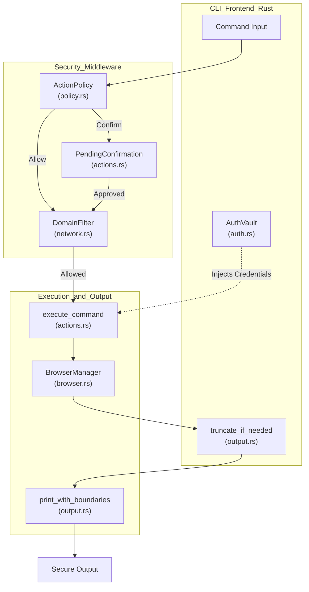
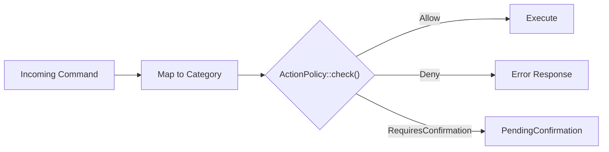
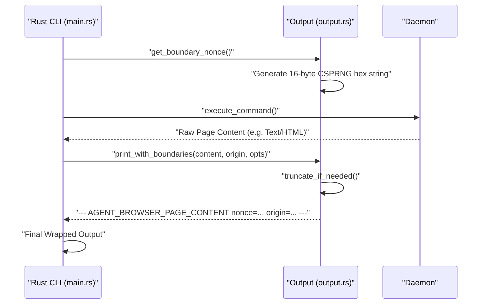

# Security Overview

Relevant source files

The following files were used as context for generating this wiki page:

- [README.md](README.md)
- [cli/src/output.rs](cli/src/output.rs)
- [docs/src/app/security/page.mdx](docs/src/app/security/page.mdx)
- [skill-data/core/references/trust-boundaries.md](skill-data/core/references/trust-boundaries.md)

This document provides a technical overview of the security architecture for `agent-browser`. Designed for AI agent deployments, the system implements a defense-in-depth model to protect against malicious page content, unauthorized actions, and credential exposure.

---

## Threat Model

The security features are designed to mitigate specific risks inherent in LLM-driven browser automation:

| Threat | Description | Mitigation Mechanism |
|--------|-------------|----------------------|
| **Credential Exposure** | Passwords being leaked into LLM context or shell history. | [Authentication Vault](#authentication-vault) with AES-256-GCM encryption. |
| **Prompt Injection** | Malicious pages embedding text to manipulate the agent's instructions. | [Content Boundary Markers](#content-boundary-markers) (CSPRNG nonces). |
| **Data Exfiltration** | Compromised agents navigating to attacker domains to send data. | [Domain Allowlist](#domain-allowlist) and sub-resource blocking via `DomainFilter`. |
| **Destructive Actions** | Agents performing dangerous operations (e.g., `eval`, `download`). | [Action Policies](#action-policy-enforcement) and confirmation gating. |
| **Context Flooding** | Massive page outputs overwhelming the LLM context window. | Output truncation via `truncate_if_needed`. |

**Sources:** [docs/src/app/security/page.mdx:7-23](), [cli/src/output.rs:36-59]()

---

## Defense-in-Depth Architecture

The following diagram traces the flow of a command from the CLI through security filters to the browser execution layer, highlighting key code entities.

### System Security Flow

**Sources:** [cli/src/output.rs:61-75](), [docs/src/app/security/page.mdx:67-97](), [README.md:146-147]()

---

## Input Security: Action Policy Enforcement

Action policies gate operations based on risk categories. These are evaluated against a `policy.json` file. The system supports results such as `Allow`, `Deny`, or `RequiresConfirmation`.

| Category | Example Commands | Risk Level |
|----------|------------------|------------|
| `navigate` | `open`, `back`, `reload` | Medium |
| `read` | `snapshot`, `get text`, `screenshot` | Low |
| `interact` | `click`, `fill`, `type`, `hover` | Medium |
| `eval` | `eval` | High |
| `download` | `pdf` | High |

### Action Policy Logic

**Sources:** [docs/src/app/security/page.mdx:14-15](), [README.md:113-144]()

---

## Domain Allowlist

The domain allowlist restricts the browser's reach. It is enforced via the `AGENT_BROWSER_ALLOWED_DOMAINS` environment variable or the `--allowed-domains` flag.

- **Navigation Blocking:** Prevents the browser from navigating to non-allowed origins.
- **Sub-resource Blocking:** Intercepts and aborts requests for scripts, images, and XHR/fetch calls to external domains [docs/src/app/security/page.mdx:109-109]().
- **WebSocket/EventSource:** Constructors are patched via an init script to block unauthorized connections. This is a best-effort defense that works alongside `eval` blocking [docs/src/app/security/page.mdx:111-111]().

**Sources:** [docs/src/app/security/page.mdx:99-112]()

---

## Content Boundary Markers

To prevent an LLM from confusing page content with system instructions, `agent-browser` wraps page-sourced data in structural markers using a per-process CSPRNG nonce. This nonce is generated using the `getrandom` crate via the `get_boundary_nonce` function in `cli/src/output.rs`.

### Content Wrapping Implementation

**Sources:** [cli/src/output.rs:6-17](), [cli/src/output.rs:61-75](), [docs/src/app/security/page.mdx:67-85]()

---

## Authentication Vault

The authentication vault provides a secure way to manage credentials. Profiles are stored in `~/.agent-browser/auth/` and are encrypted using **AES-256-GCM**.

### Security Properties:
- **Encryption at Rest:** Uses `AGENT_BROWSER_ENCRYPTION_KEY`. If unset, a key is auto-generated in `~/.agent-browser/.encryption-key` on first use [docs/src/app/security/page.mdx:63-63]().
- **Permission Enforcement:** On Unix, files and directories are restricted via `chmod 600` and `chmod 700`. On Windows, `icacls` is used to limit access to the current user [docs/src/app/security/page.mdx:65-65]().
- **Credential Isolation:** Credentials are used to fill forms via CDP; they are never returned to the LLM context [docs/src/app/security/page.mdx:11-11]().
- **Secure Input:** Supports `--password-stdin` to prevent secrets from appearing in process listings or shell history [docs/src/app/security/page.mdx:31-32]().

**Sources:** [docs/src/app/security/page.mdx:25-65]()

---

## Security Configuration Reference

| Feature | Flag / Env Var | Implementation File |
|---------|----------------|---------------------|
| **Domain Filter** | `AGENT_BROWSER_ALLOWED_DOMAINS` | [docs/src/app/security/page.mdx:104-106]() |
| **Output Limits** | `--max-output <chars>` | [cli/src/output.rs:19-34]() |
| **Boundaries** | `AGENT_BROWSER_CONTENT_BOUNDARIES` | [cli/src/output.rs:61-75]() |
| **Auth Vault** | `agent-browser auth` | [README.md:185-186]() |

**Sources:** [docs/src/app/security/page.mdx:113-121](), [cli/src/output.rs:19-34]()
