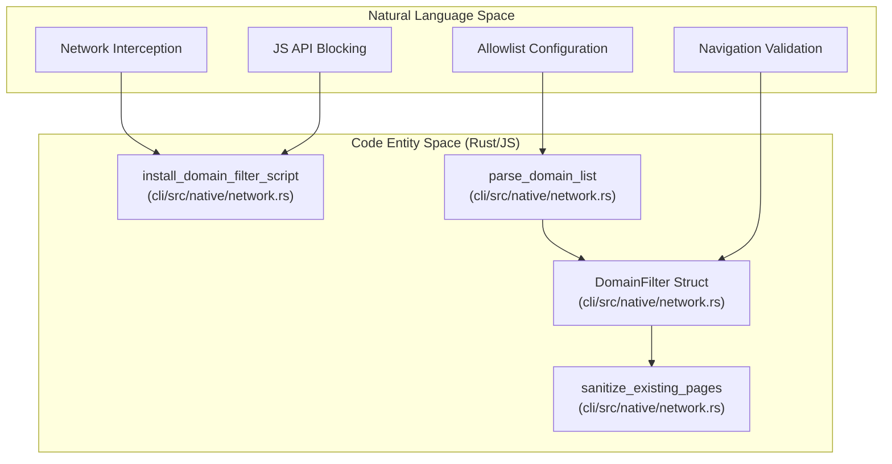
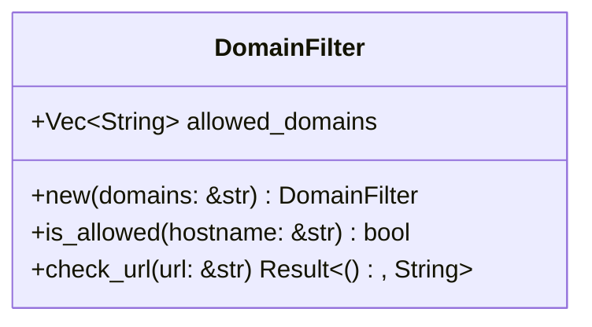
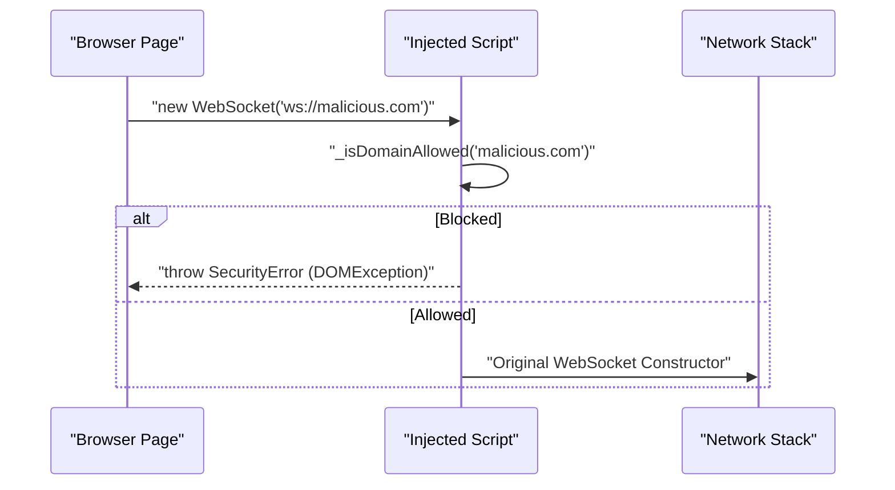

# Domain Allowlists

Relevant source files

The following files were used as context for generating this wiki page:

- [cli/src/native/actions.rs](cli/src/native/actions.rs)
- [cli/src/native/auth.rs](cli/src/native/auth.rs)
- [cli/src/native/browser.rs](cli/src/native/browser.rs)
- [cli/src/native/cdp/types.rs](cli/src/native/cdp/types.rs)
- [cli/src/native/e2e_tests.rs](cli/src/native/e2e_tests.rs)
- [cli/src/native/network.rs](cli/src/native/network.rs)
- [cli/src/native/parity_tests.rs](cli/src/native/parity_tests.rs)
- [cli/src/native/recording.rs](cli/src/native/recording.rs)
- [docs/src/app/security/page.mdx](docs/src/app/security/page.mdx)

## Purpose and Scope

This page documents the domain allowlist security feature, which restricts browser navigation and network requests to a predefined set of trusted domains. This feature is designed to prevent AI agents from being steered toward malicious websites through prompt injection or automated redirects. In the native Rust implementation, this is managed by the `DomainFilter` struct [cli/src/native/network.rs:80-82]() and integrated into the system's network control logic.

For information about other security features, see [Security Overview](6.1), [Action Policies](6.3), and [Content Boundaries](6.4).

---

## System Overview

Domain allowlists provide network-level access control by filtering navigation and sub-resource requests. When configured via the `AGENT_BROWSER_ALLOWED_DOMAINS` environment variable or the `--allowed-domains` CLI flag, the system blocks any attempt to navigate to or load resources from domains not explicitly permitted.

### Natural Language to Code Entity Mapping

The following diagram maps high-level security concepts to the specific Rust entities in the codebase.

**Sources:** [cli/src/native/network.rs:80-82](), [cli/src/native/network.rs:128-134](), [cli/src/native/network.rs:161-165]()

---

## Configuration

Domain allowlists are configured by parsing input strings into a `DomainFilter` object [cli/src/native/network.rs:128-134]().

| Source | Priority | Format | Example |
|--------|----------|--------|---------|
| CLI Flag | High | `--allowed-domains <list>` | `--allowed-domains "google.com,*.github.com"` |
| Env Var | Medium | `AGENT_BROWSER_ALLOWED_DOMAINS` | `export AGENT_BROWSER_ALLOWED_DOMAINS="example.com"` |
| Config | Low | `allowedDomains` in JSON | `"allowedDomains": ["site.com"]` |

The `parse_domain_list` function splits the input by commas and converts entries to lowercase for case-insensitive matching [cli/src/native/network.rs:128-134]().

**Sources:** [cli/src/native/network.rs:128-134](), [docs/src/app/security/page.mdx:103-107]()

---

## The DomainFilter Struct

The core logic for matching hostnames resides in the `DomainFilter` struct [cli/src/native/network.rs:80-82]().

### Wildcard Matching Rules
The `is_allowed` method implements the following logic [cli/src/native/network.rs:92-107]():
1. **Exact Match:** If the pattern matches the hostname exactly (e.g., `example.com`).
2. **Wildcard Match:** Patterns starting with `*.` (e.g., `*.example.com`) match:
    - The bare domain (`example.com`).
    - Any subdomain (`api.example.com`, `assets.v1.example.com`).
3. **Case Insensitivity:** All hostnames are converted to lowercase before comparison.

**Sources:** [cli/src/native/network.rs:79-107](), [cli/src/native/network.rs:109-126]()

---

## Enforcement Mechanisms

The system employs a multi-layered defense strategy to block unauthorized traffic.

### 1. Navigation Guard
Before executing a navigation command, the system validates the target URL. If the URL's host is not allowed according to `DomainFilter::check_url`, the command returns an error immediately [cli/src/native/network.rs:109-126](). This prevents the browser from initiating the connection.

### 2. JavaScript API Patching
To block requests that might bypass standard network routing (like WebSockets or EventSource), the `install_domain_filter_script` function injects a script into every new document via the CDP `Page.addScriptToEvaluateOnNewDocument` method [cli/src/native/network.rs:161-165]().

This script overrides [cli/src/native/network.rs:171-216]():
- `window.WebSocket`
- `window.EventSource`
- `navigator.sendBeacon`

**Sources:** [cli/src/native/network.rs:161-216](), [docs/src/app/security/page.mdx:109-111]()

### 3. Sanitization of Existing Pages
When connecting to a pre-existing browser session (e.g., via `auto-connect` or a cloud provider), the `sanitize_existing_pages` function iterates through all open targets [cli/src/native/network.rs:136-140](). Any page currently on a disallowed domain is forcibly navigated to `about:blank` [cli/src/native/network.rs:148-154]().

**Sources:** [cli/src/native/network.rs:136-159]()

---

## Technical Limitations

While robust, the domain allowlist has specific boundaries [docs/src/app/security/page.mdx:17-23]():
- **Best-effort JS Blocking:** If the `eval` action category is permitted in the [Action Policy](6.3), a malicious page could theoretically use `eval` to restore original browser constructors and bypass the WebSocket/EventSource filter [docs/src/app/security/page.mdx:19-19]().
- **Remote Timing:** In cloud provider scenarios, a small window exists between connection and sanitization where a page might already be loaded [docs/src/app/security/page.mdx:20-21]().
- **Non-HTTP Schemes:** Sub-resources using `data:` URIs or `blob:` schemes are generally allowed as they do not involve external network requests [docs/src/app/security/page.mdx:109-110]().
- **CDN Requirements:** Most modern websites load assets from CDNs. Users must explicitly include these (e.g., `*.gstatic.com`, `*.cloudfront.net`) in their allowlist to avoid broken page layouts [docs/src/app/security/page.mdx:121-125]().

**Sources:** [docs/src/app/security/page.mdx:17-23](), [docs/src/app/security/page.mdx:121-125]()

---

## Implementation Details

| Function | File | Description |
|----------|------|-------------|
| `is_allowed` | [cli/src/native/network.rs:92]() | Logic for suffix and exact matching. |
| `check_url` | [cli/src/native/network.rs:109]() | Validates a URL string and returns a Result. |
| `sanitize_existing_pages` | [cli/src/native/network.rs:136]() | Forces disallowed pages to `about:blank`. |
| `install_domain_filter_script` | [cli/src/native/network.rs:161]() | Injects JS overrides for WebSockets/Beacons. |
| `parse_domain_list` | [cli/src/native/network.rs:128]() | Parses comma-separated strings into a `DomainFilter`. |

**Sources:** [cli/src/native/network.rs:92-126](), [cli/src/native/network.rs:128-134](), [cli/src/native/network.rs:136-216]()
