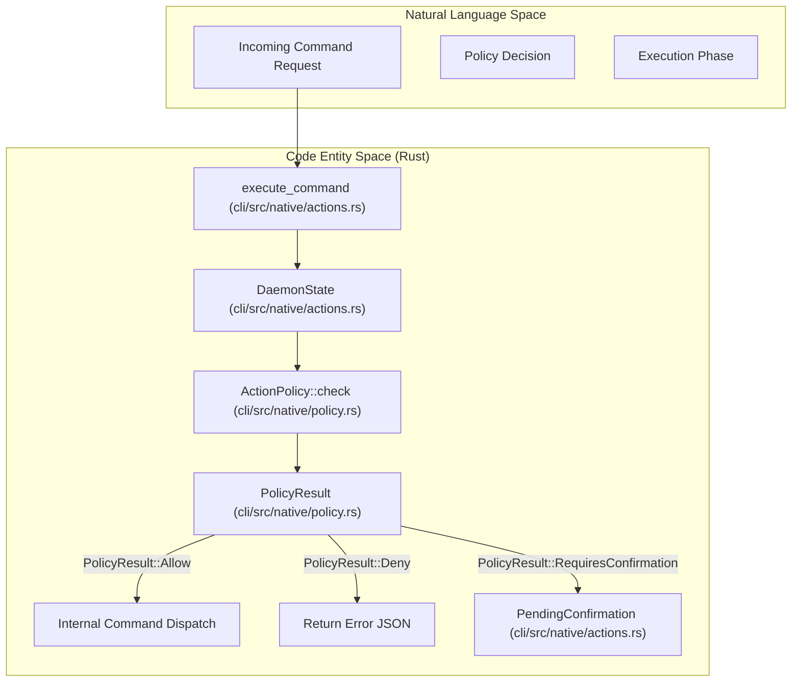
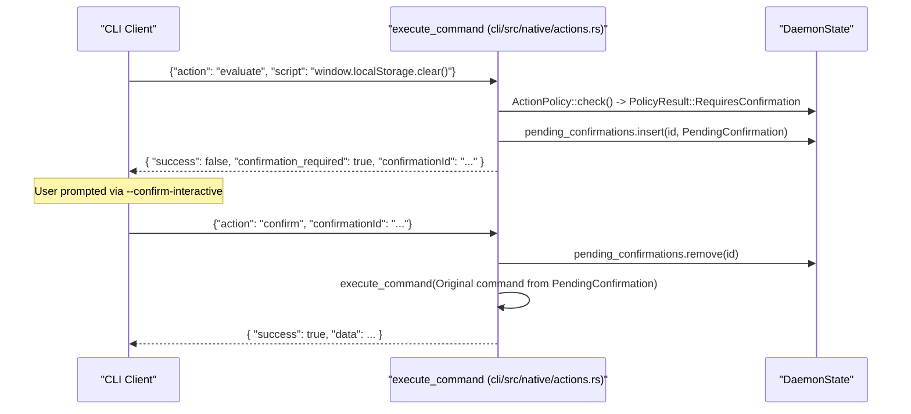

# Action Policies

<details>
<summary>Relevant source files</summary>

The following files were used as context for generating this wiki page:

- [cli/src/native/actions.rs](cli/src/native/actions.rs)
- [cli/src/native/browser.rs](cli/src/native/browser.rs)
- [cli/src/native/e2e_tests.rs](cli/src/native/e2e_tests.rs)
- [cli/src/native/policy.rs](cli/src/native/policy.rs)
- [cli/src/test_utils.rs](cli/src/test_utils.rs)
- [docs/src/app/security/page.mdx](docs/src/app/security/page.mdx)

</details>


Action policies provide declarative security controls for gating browser actions based on risk categories. This system is designed for AI agent deployments where untrusted LLMs control browser automation, enabling operators to restrict destructive operations (code evaluation, file downloads, data deletion) while permitting safe actions (navigation, inspection, screenshots).

For domain-based navigation restrictions, see [Domain Allowlists](6.2). For output sanitization and LLM prompt injection defense, see [Content Boundaries and Output Limits](6.4).

---

## Purpose and Threat Model

Action policies address scenarios where an AI agent may attempt harmful operations:

*   **Code execution**: `eval` commands running malicious JavaScript via the CDP `Runtime.evaluate` domain.
*   **Data exfiltration**: Downloading sensitive files or transmitting session cookies.
*   **Destructive mutations**: Clearing storage, deleting data, or submitting unauthorized forms.
*   **Resource abuse**: Opening excessive tabs or making unbounded network requests.

The policy engine categorizes all browser commands by risk level and applies allow/deny/confirm rules before execution. This prevents the daemon from executing dangerous commands without explicit approval, even if the LLM generates a valid command payload.

**Sources**: [cli/src/native/policy.rs:7-16](), [cli/src/native/policy.rs:84-121](), [docs/src/app/security/page.mdx:14-15]()

---

## Policy File Format

Policies are defined in JSON files represented by the `ActionPolicy` struct. The format supports explicit lists and a fallback default.

```json
{
  "default": "deny",
  "allow": ["navigate", "snapshot", "click", "scroll", "wait", "get"],
  "deny": ["eval", "download", "storage_clear", "cookies_clear"],
  "confirm": ["submit"]
}
```

### Fields

| Field | Type | Description |
|-------|------|-------------|
| `default` | `Option<String>` | Fallback policy: `"allow"`, `"deny"`, or `"confirm"`. |
| `allow` | `Option<Vec<String>>` | Action categories that execute immediately. |
| `deny` | `Option<Vec<String>>` | Action categories that return an immediate error. |
| `confirm` | `Option<Vec<String>>` | Action categories requiring manual approval. |

The `default` field applies to any action not explicitly listed. Setting `default: "deny"` with an explicit `allow` list creates a strict allowlist-only policy.

**Sources**: [cli/src/native/policy.rs:19-31](), [cli/src/native/policy.rs:84-121]()

---

## Policy Enforcement Flow

The `DaemonState` holds the active `ActionPolicy`. When a command is processed via `execute_command`, the system checks the policy before execution.

### Logic Space to Code Entity Space: Enforcement


**Sources**: [cli/src/native/actions.rs:17-18](), [cli/src/native/policy.rs:84-121](), [cli/src/native/actions.rs:61-64]()

---

## Enforcement Modes

The `PolicyResult` enum defines three outcomes for any given action check:

### PolicyResult::Allow
Actions execute immediately without user interaction. This is the default behavior when no policy is provided.

### PolicyResult::Deny
Actions are blocked at the daemon level. The daemon returns a JSON response with `"success": false` and an error message indicating the policy violation.

### PolicyResult::RequiresConfirmation
Actions require explicit approval. The daemon stores the command in a `PendingConfirmation` struct and returns a `confirmation_required` payload.

**Sources**: [cli/src/native/policy.rs:8-16](), [cli/src/native/actions.rs:61-64]()

---

## Confirmation Workflow

The confirmation system uses a `confirmationId` to link an approval to a suspended command. The daemon tracks these in `DaemonState.pending_confirmations`.

### Confirmation Sequence


**Sources**: [cli/src/native/actions.rs:61-64](), [cli/src/native/policy.rs:14-15](), [cli/src/native/actions.rs:17-18]()

---

## Configuration

### Environment Variables
- `AGENT_BROWSER_ACTION_POLICY`: Path to the `policy.json` file. [cli/src/native/policy.rs:77-79]()
- `AGENT_BROWSER_POLICY`: Alias for `AGENT_BROWSER_ACTION_POLICY` for backwards compatibility. [cli/src/native/policy.rs:78-79]()
- `AGENT_BROWSER_CONFIRM_ACTIONS`: Comma-separated list of categories to always confirm, parsed by `ConfirmActions::from_env`. [cli/src/native/policy.rs:40-55]()

### Implementation Components
- `ConfirmActions`: A struct containing a `HashSet<String>` of action categories extracted from environment variables. [cli/src/native/policy.rs:35-37]()
- `ActionPolicy::load`: Reads and parses the policy file into the `ActionPolicy` struct. [cli/src/native/policy.rs:64-72]()

**Sources**: [cli/src/native/policy.rs:35-60](), [cli/src/native/policy.rs:74-81]()

---

## Implementation Details

### The Policy Decision Logic
The `check` method in `cli/src/native/policy.rs` determines the fate of an action by checking explicit lists. `Deny` always takes precedence over `Confirm`, and `Confirm` takes precedence over `Allow`.

```rust
pub fn check(&self, action: &str) -> PolicyResult {
    if let Some(deny) = &self.deny {
        if deny.iter().any(|a| a == action) {
            return PolicyResult::Deny(format!("Action '{}' is denied by policy", action));
        }
    }

    if let Some(confirm) = &self.confirm {
        if confirm.iter().any(|a| a == action) {
            return PolicyResult::RequiresConfirmation;
        }
    }
    // ... logic for allow and default
}
```

**Sources**: [cli/src/native/policy.rs:84-121]()

### Reloading Policies
The `ActionPolicy::reload` function allows the daemon to refresh security rules from disk without a restart. It re-reads the JSON file from the original `path` and updates the policy struct in-place.

**Sources**: [cli/src/native/policy.rs:124-132]()

---

## Security Considerations

1.  **Strict Defaulting**: By setting `default: "deny"`, an operator can ensure only a minimal set of safe actions (like `snapshot` and `get`) are available to the agent. [cli/src/native/policy.rs:99-110]()
2.  **Precedence**: The engine is hardcoded to prioritize `deny` lists over `allow` lists to prevent accidental exposure when an action is accidentally included in both. [cli/src/native/policy.rs:164-168]()
3.  **Default Deny Fallback**: If an `allow` list is provided but an action is not in it, the system defaults to `Deny` unless `default` is explicitly set to `allow`. [cli/src/native/policy.rs:97-110]()
4.  **Confirmation Timeout**: Pending confirmations automatically deny after 60 seconds to prevent resource exhaustion and hanging processes. [docs/src/app/security/page.mdx:22-23]()

**Sources**: [cli/src/native/policy.rs:84-121](), [cli/src/native/policy.rs:164-168](), [docs/src/app/security/page.mdx:22-23]()
