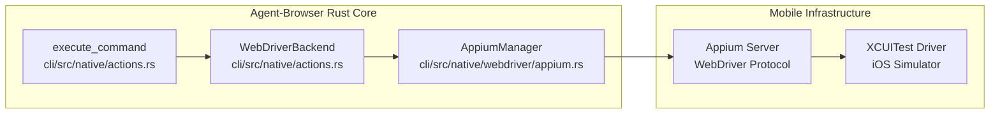

# Advanced Topics

Relevant source files

The following files were used as context for generating this wiki page:

- [CHANGELOG.md](CHANGELOG.md)
- [cli/src/native/actions.rs](cli/src/native/actions.rs)
- [cli/src/native/browser.rs](cli/src/native/browser.rs)
- [cli/src/native/cdp/chrome.rs](cli/src/native/cdp/chrome.rs)
- [cli/src/native/cdp/client.rs](cli/src/native/cdp/client.rs)
- [cli/src/native/daemon.rs](cli/src/native/daemon.rs)
- [cli/src/native/e2e_tests.rs](cli/src/native/e2e_tests.rs)
- [cli/src/native/providers.rs](cli/src/native/providers.rs)
- [package.json](package.json)

This page covers specialized features and deployment scenarios for power users. These include the native Rust daemon, cloud browser provider integrations, iOS automation capabilities, network monitoring, the observability dashboard, and visual diffing.

For basic configuration and usage, see [Configuration](#2.3). For security features, see [Security](#6).

---

## Native Daemon Mode

The native daemon is a pure Rust implementation that communicates directly with browsers via the Chrome DevTools Protocol (CDP). It offers significant performance benefits, typically consuming ~7MB of RAM compared to ~140MB for the Node.js daemon [package.json:23-25](). The daemon lifecycle is managed in `run_daemon`, which handles socket management, process coordination, and session cleanup [cli/src/native/daemon.rs:19-150]().

### Architecture Comparison

```mermaid
graph TB
    subgraph "Legacy / Node.js Mode"
        CLI1["CLI Binary<br/>cli/src/main.rs"]
        DAEMON1["Node.js Daemon<br/>src/daemon.ts"]
        PW["Playwright API<br/>playwright-core"]
        BROWSER1["Chrome/Firefox/WebKit"]
        
        CLI1 -->|IPC| DAEMON1
        DAEMON1 -->|Playwright| PW
        PW --> BROWSER1
    end
    
    subgraph "Native Mode (agent-browser daemon)"
        CLI2["CLI Binary<br/>cli/src/main.rs"]
        DAEMON2["run_daemon<br/>cli/src/native/daemon.rs"]
        CDP["CdpClient<br/>cli/src/native/cdp/client.rs"]
        BROWSER2["ChromeProcess<br/>cli/src/native/cdp/chrome.rs"]
        
        CLI2 -->|IPC| DAEMON2
        DAEMON2 -->|Direct CDP| CDP
        CDP --> BROWSER2
    end
```

**Sources:** [cli/src/native/daemon.rs:19-150](), [cli/src/native/cdp/client.rs:29-46](), [cli/src/native/cdp/chrome.rs:8-15]()

For details, see [Native Daemon Mode](#7.1).

---

## Cloud Browser Providers

Cloud browser providers offer remote infrastructure for serverless or containerized deployments. Integration is handled via `connect_provider` in the `providers.rs` module, which abstracts the connection logic for multiple vendors [cli/src/native/providers.rs:26-73]().

### Provider Integration

| Provider | Code Reference | Integration Type |
|----------|----------------|------------------|
| **Browserbase** | `connect_browserbase` | REST API + WSS [cli/src/native/providers.rs:134-184]() |
| **Browserless** | `connect_browserless` | WSS Direct + API [cli/src/native/providers.rs:186-210]() |
| **Kernel** | `connect_kernel` | Cloud Infrastructure [cli/src/native/providers.rs:52-59]() |
| **Browser-Use** | `connect_browser_use` | WSS Connection [cli/src/native/providers.rs:44-51]() |
| **AgentCore** | `connect_agentcore` | Vercel Internal [cli/src/native/providers.rs:60-67]() |

**Sources:** [cli/src/native/providers.rs:1-132](), [cli/src/native/actions.rs:30-30]()

For details, see [Cloud Browser Providers](#7.2).

---

## iOS Automation

The iOS provider enables automation of Mobile Safari in iOS Simulators using Appium and the `AppiumManager` [cli/src/native/actions.rs:39-39](). It utilizes `WebDriverBackend` for commands that are distinct from standard CDP mouse events, supporting mobile-specific gestures [cli/src/native/actions.rs:40-41]().

### iOS Control Flow

**Sources:** [cli/src/native/actions.rs:39-42](), [cli/src/native/browser.rs:142-145]()

For details, see [iOS Automation](#7.3).

---

## Network Control and Recording

Advanced network features include request interception (`RouteEntry`), HAR 1.2 generation (`HarEntry`), and live screencasting via the `StreamServer` [cli/src/native/actions.rs:67-110](). The `EventTracker` orchestrates request tracking and response metadata capture [cli/src/native/actions.rs:28-28]().

### Network & Media Entities

| Component | Code Entity | Role |
|-----------|-------------|------|
| **Streaming** | `StreamServer` | Broadcasts viewport frames via WebSocket [cli/src/native/actions.rs:37-37]() |
| **Recording** | `RecordingState` | Manages video recording lifecycle [cli/src/native/actions.rs:32-32]() |
| **Tracking** | `EventTracker` | Orchestrates network events and HAR generation [cli/src/native/actions.rs:28-28]() |
| **Filtering** | `DomainFilter` | Enforces network allowlists [cli/src/native/actions.rs:28-28]() |
| **Routing** | `RouteEntry` | Configures interception and mocking [cli/src/native/actions.rs:95-103]() |

**Sources:** [cli/src/native/actions.rs:28-38](), [cli/src/native/actions.rs:67-110](), [CHANGELOG.md:46-46]()

For details, see [Network Control and Recording](#7.4).

---

## Observability Dashboard

The dashboard is a Next.js web UI located in `packages/dashboard` [package.json:31-31](). It is integrated into the CLI to provide visual oversight of AI agent activity. It supports same-origin proxying for deployment behind reverse proxies [CHANGELOG.md:48-48]().

**Key Features:**
- **Live Viewport:** Real-time screencasting via the `StreamServer` [cli/src/native/daemon.rs:102-113]().
- **Activity Feed:** Structured logs of command execution [CHANGELOG.md:71-71]().
- **React Inspection:** Integration with React DevTools for component tree visibility [CHANGELOG.md:42-42]().

**Sources:** [package.json:31-31](), [CHANGELOG.md:42-48](), [cli/src/native/daemon.rs:96-113]()

For details, see [Observability Dashboard](#7.5).

---

## Diffing and Visual Regression

The diff subsystem provides tools for comparing page states, useful for testing and verifying AI agent actions. It includes text-based accessibility tree diffs and pixel-based mismatch detection [cli/src/native/actions.rs:24-24]().

### Diff Methods

| Command | Comparison Type | Implementation Note |
|---------|-----------------|---------------------|
| `diff snapshot` | Semantic/Textual (Aria Tree) | Uses `similar` crate for text diffs [cli/src/native/actions.rs:24-24]() |
| `diff screenshot` | Visual (Pixel Mismatch) | Supports threshold-based detection [cli/src/native/actions.rs:33-33]() |
| `diff url` | Live Comparison | Compares two live URLs in real-time [cli/src/native/actions.rs:24-24]() |

**Sources:** [cli/src/native/actions.rs:24-24](), [cli/src/native/actions.rs:33-34]()

For details, see [Diffing and Visual Regression](#7.6).
