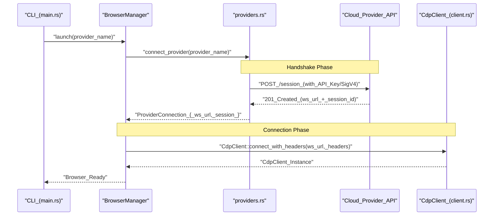

# Cloud Browser Providers

<details>
<summary>Relevant source files</summary>

The following files were used as context for generating this wiki page:

- [cli/src/native/cdp/chrome.rs](cli/src/native/cdp/chrome.rs)
- [cli/src/native/cdp/client.rs](cli/src/native/cdp/client.rs)
- [cli/src/native/daemon.rs](cli/src/native/daemon.rs)
- [cli/src/native/providers.rs](cli/src/native/providers.rs)
- [docs/src/app/providers/browser-use/layout.tsx](docs/src/app/providers/browser-use/layout.tsx)
- [docs/src/app/providers/browser-use/page.mdx](docs/src/app/providers/browser-use/page.mdx)
- [docs/src/app/providers/browserbase/layout.tsx](docs/src/app/providers/browserbase/layout.tsx)
- [docs/src/app/providers/browserbase/page.mdx](docs/src/app/providers/browserbase/page.mdx)
- [docs/src/app/providers/browserless/layout.tsx](docs/src/app/providers/browserless/layout.tsx)
- [docs/src/app/providers/browserless/page.mdx](docs/src/app/providers/browserless/page.mdx)
- [docs/src/app/providers/kernel/layout.tsx](docs/src/app/providers/kernel/layout.tsx)
- [docs/src/app/providers/kernel/page.mdx](docs/src/app/providers/kernel/page.mdx)

</details>


This page documents the integration with cloud browser services that provide remote browser infrastructure via the Chrome DevTools Protocol (CDP). Cloud providers enable browser automation without managing local browser installations, offering features like managed sessions, stealth mode, and persistent profiles.

The primary implementation for these providers resides in the native Rust daemon at [cli/src/native/providers.rs:1-4](), which handles the REST API handshakes required to obtain CDP WebSocket URLs.

## Overview

`agent-browser` supports five major cloud browser providers. Each provider is identified by a name passed to the `connect_provider` function or via CLI flags.

| Provider | Flag Value | Required Environment Variables | Key Features |
|----------|-----------|----------------------|--------------|
| **AgentCore** | `agentcore` | `AWS_ACCESS_KEY_ID`, `AWS_SECRET_ACCESS_KEY` | AWS Bedrock managed browsers, SigV4 auth. |
| **Browserbase** | `browserbase` | `BROWSERBASE_API_KEY` | Session-based infrastructure, simple setup. |
| **Browserless** | `browserless` | `BROWSERLESS_API_KEY` | High-performance sessions, stealth mode, custom TTL. |
| **Kernel** | `kernel` | `KERNEL_API_KEY` | Stealth mode, persistent profiles, configurable endpoints. |
| **Browser Use** | `browseruse` | `BROWSER_USE_API_KEY` | Managed cloud sessions for AI agents. |

**Sources:** [cli/src/native/providers.rs:3-67](), [docs/src/app/providers/browserbase/page.mdx:1-25](), [docs/src/app/providers/browser-use/page.mdx:1-25](), [docs/src/app/providers/browserless/page.mdx:1-40](), [docs/src/app/providers/kernel/page.mdx:1-42]()

## Architecture

The integration follows a two-step connection pattern:
1. **Handshake**: The daemon performs a REST API call to the provider to request a new browser session.
2. **CDP Connection**: The provider returns a CDP WebSocket URL, which the `BrowserManager` uses to establish a direct control link.

### Provider Connection Logic

The entry point for all provider logic is `connect_provider` in [cli/src/native/providers.rs:26-73](). This function dispatches to specific internal functions based on the provider name.

```mermaid
graph TD
    subgraph "Native_Daemon_Rust"
        CMD["connect_provider(provider_name)"]
        AC["connect_agentcore()"]
        BB["connect_browserbase()"]
        BL["connect_browserless()"]
        BU["connect_browser_use()"]
        KN["connect_kernel()"]
    end

    subgraph "Cloud_APIs"
        AC_API["bedrock-agent-runtime_AWS"]
        BB_API["api.browserbase.com"]
        BL_API["browserless.io/session"]
        BU_API["api.browser-use.com"]
        KN_API["api.onkernel.com"]
    end

    CMD -->| "agentcore" | AC
    CMD -->| "browserbase" | BB
    CMD -->| "browserless" | BL
    CMD -->| "browser-use" | BU
    CMD -->| "kernel" | KN

    AC -->| "SigV4_Signed_Request" | AC_API
    BB -->| "POST_/v1/sessions" | BB_API
    BL -->| "POST_/session" | BL_API
    BU -->| "POST_/api/v2/browsers" | BU_API
    KN -->| "POST_/browsers" | KN_API

    AC_API -.->| "webSocketUrl" | AC
    BB_API -.->| "connectUrl" | BB
    BL_API -.->| "connect_URL" | BL
    BU_API -.->| "ws_endpoint" | BU
    KN_API -.->| "connectUrl" | KN

    AC & BB & BL & BU & KN --> RET["ProviderConnection_{_ws_url,_session_}"]
```

**Sources:** [cli/src/native/providers.rs:26-73](), [cli/src/native/providers.rs:134-184](), [cli/src/native/providers.rs:186-210]()

### Session Management and Cleanup

To prevent orphaned sessions and unnecessary billing, the system tracks active provider sessions using the `ProviderSession` struct [cli/src/native/providers.rs:11-14]().

If a CDP connection fails or the browser is closed, `close_provider_session` is called [cli/src/native/providers.rs:76-132](). This function performs the provider-specific termination request:
- **Browserbase**: `POST` to `/v1/sessions/{id}` with `REQUEST_RELEASE` [cli/src/native/providers.rs:81-90]().
- **Browser Use**: `PATCH` to `/api/v2/browsers/{id}` with `stop` action [cli/src/native/providers.rs:95-104]().
- **Kernel**: `DELETE` request to the session endpoint [cli/src/native/providers.rs:112-124]().
- **Browserless**: `DELETE` request to the session-specific stop URL [cli/src/native/providers.rs:107-110]().
- **AgentCore**: Handled via signed `DELETE` request [cli/src/native/providers.rs:126-129]().

The daemon also ensures that provider metadata files (e.g., `.provider`, `.engine`) are cleaned up on shutdown [cli/src/native/daemon.rs:82-87](), [cli/src/native/daemon.rs:141-144]().

**Sources:** [cli/src/native/providers.rs:76-132](), [cli/src/native/daemon.rs:82-144]()

## Provider Configurations

### AgentCore (AWS Bedrock)
AgentCore provides cloud browser sessions with SigV4 authentication. It is ideal for AWS-native deployments.
- **Cleanup**: Handled via a specialized `close_agentcore_session` call [cli/src/native/providers.rs:126-129]().

### Browserbase
Browserbase is configured primarily via an API key.
- **Environment Variable**: `BROWSERBASE_API_KEY` [cli/src/native/providers.rs:135]()
- **Endpoint**: `https://api.browserbase.com/v1/sessions` [cli/src/native/providers.rs:140]()
- **Response Mapping**: Extracts `connectUrl` and session `id` [cli/src/native/providers.rs:165-175]().

### Browserless
Browserless offers extensive configuration through environment variables, including TTL and stealth settings.
- **Required**: `BROWSERLESS_API_KEY` [cli/src/native/providers.rs:187]()
- **Optional Configs**:
    - `BROWSERLESS_API_URL`: Custom region or self-hosted endpoint (Default: `https://production-sfo.browserless.io`) [cli/src/native/providers.rs:190-191]()
    - `BROWSERLESS_BROWSER_TYPE`: `chromium` or `chrome` [cli/src/native/providers.rs:192-193]()
    - `BROWSERLESS_TTL`: Session duration in ms [cli/src/native/providers.rs:204-206]().

### Kernel
Kernel supports persistent browser profiles, allowing cookies and logins to persist across different sessions.
- **Required**: `KERNEL_API_KEY` [cli/src/native/providers.rs:112]()
- **Endpoint**: Configurable via `KERNEL_ENDPOINT`, defaults to `https://api.onkernel.com` [cli/src/native/providers.rs:113-114]().

### Browser Use
Browser Use is a cloud browser infrastructure for AI agents.
- **Required**: `BROWSER_USE_API_KEY` [cli/src/native/providers.rs:94]()
- **Endpoint**: `https://api.browser-use.com/api/v2/browsers` [cli/src/native/providers.rs:96-98]().

## Data Flow: CLI to Cloud

The following diagram traces the flow from a CLI command to the actual remote browser connection using the native Rust implementation.



**Sources:** [cli/src/native/providers.rs:26-73](), [cli/src/native/providers.rs:17-22](), [cli/src/native/cdp/client.rs:53-83]()

## Error Handling

The provider system includes robust error handling for common failure modes:
1. **Missing Keys**: If a provider is selected but its corresponding environment variable is missing, `connect_provider` returns an `Err` immediately [cli/src/native/providers.rs:135-136]().
2. **API Errors**: If the provider API returns a non-success status code, the response body is captured and returned as a descriptive error message [cli/src/native/providers.rs:154-160]().
3. **Invalid Responses**: If the API returns malformed JSON or is missing the required connection URL, the connection fails with a diagnostic message [cli/src/native/providers.rs:171-175]().
4. **Daemon Crash Prevention**: Stderr is redirected to `/dev/null` on Unix to prevent the daemon from crashing if a cloud provider writes to stderr after the parent CLI has closed its end of the pipe [cli/src/native/daemon.rs:45-59]().

**Sources:** [cli/src/native/providers.rs:154-175](), [cli/src/native/providers.rs:187-200](), [cli/src/native/daemon.rs:45-59]()
