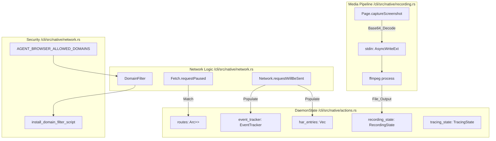
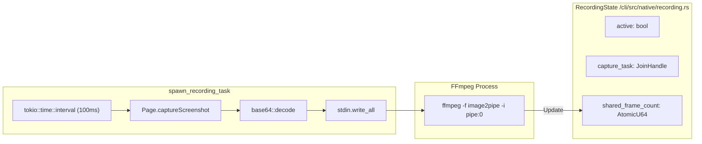
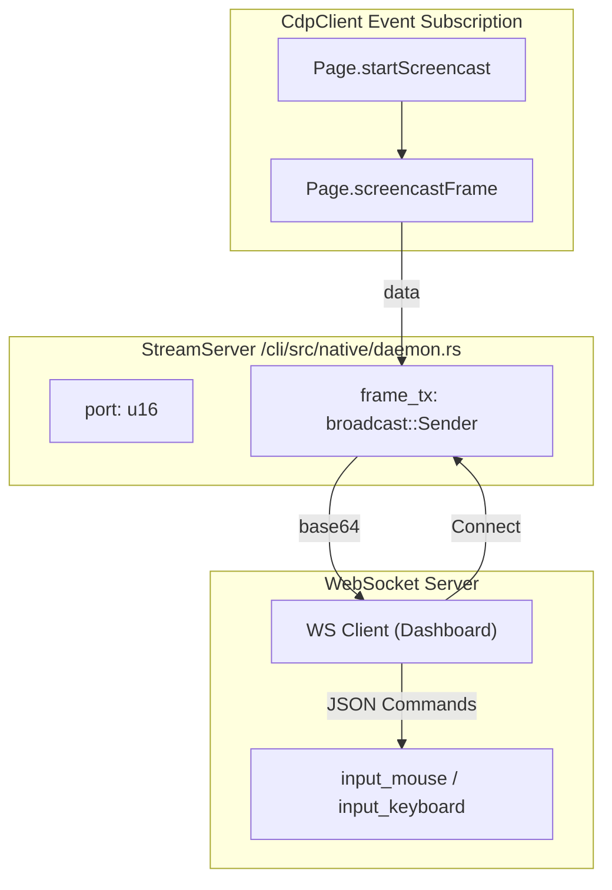

# Network Control and Recording

<details>
<summary>Relevant source files</summary>

The following files were used as context for generating this wiki page:

- [cli/src/native/auth.rs](cli/src/native/auth.rs)
- [cli/src/native/cdp/types.rs](cli/src/native/cdp/types.rs)
- [cli/src/native/network.rs](cli/src/native/network.rs)
- [cli/src/native/parity_tests.rs](cli/src/native/parity_tests.rs)
- [cli/src/native/recording.rs](cli/src/native/recording.rs)
- [docs/src/app/network/page.mdx](docs/src/app/network/page.mdx)
- [docs/src/app/recording/page.mdx](docs/src/app/recording/page.mdx)

</details>


This page documents the network monitoring, interception, and recording capabilities of agent-browser. These features enable capturing network traffic, modifying requests/responses, recording browser activity as video or frame streams, and profiling performance.

The implementation spans both the TypeScript high-level API and the native Rust daemon's direct CDP integration.

---

## Overview

Network control and recording features provide several capabilities:

| Feature | Purpose | Output Format | Implementation Entity |
|---------|---------|---------------|-----------------------|
| **Request Tracking** | Monitor all HTTP requests | `TrackedRequest[]` | `EventTracker` [cli/src/native/actions.rs:108-125]() |
| **Route Interception** | Mock or modify requests/responses | N/A (runtime) | `RouteEntry` [cli/src/native/actions.rs:94-98]() |
| **HAR Recording** | Capture network traffic for replay | `.har` 1.2 file | `HarEntry` [cli/src/native/actions.rs:66-92]() |
| **Screencast** | Real-time frame streaming | base64 MJPEG | `StreamServer` [cli/src/native/daemon.rs:250-280]() |
| **Video Recording** | Record session to video | `.webm` / `.mp4` | `RecordingState` [cli/src/native/recording.rs:15-35]() |
| **Profiling** | Capture CDP performance data | `.json` (Trace) | `TracingState` [cli/src/native/actions.rs:169-200]() |

Sources: [cli/src/native/actions.rs:66-125](), [cli/src/native/recording.rs:15-35](), [cli/src/native/parity_tests.rs:168-174]()

---

## System Architecture

The following diagram illustrates how network and recording entities in the code interact with the underlying browser protocol (CDP) and external processes like FFmpeg.

Title: Network and Recording Code Entity Map


**Implementation Details:**
The `DaemonState` struct in the native Rust implementation manages the lifecycle of network interception and media capture. Security is enforced via `DomainFilter`, which intercepts both CDP-level navigation and injects scripts to block WebSockets and EventSources [cli/src/native/network.rs:161-214]().

Sources: [cli/src/native/actions.rs:169-200](), [cli/src/native/network.rs:80-126](), [cli/src/native/recording.rs:125-156]()

---

## Request Tracking

Request tracking captures metadata about all HTTP requests made by the page. In the native daemon, this is handled by the `EventTracker` and stored in `tracked_requests`.

### Tracked Data Structure
The `TrackedRequest` struct captures:
- `url`, `method`, `headers` [cli/src/native/actions.rs:109-111]()
- `resource_type` and `requestId` [cli/src/native/actions.rs:114-115]()
- `post_data` (if available) [cli/src/native/actions.rs:117-118]()
- `status` and `response_headers` (populated on completion) [cli/src/native/actions.rs:120-122]()

### CLI Usage
```bash
# List tracked requests
agent-browser network requests

# Clear tracked requests
agent-browser network requests --clear
```

Sources: [cli/src/native/actions.rs:108-125](), [cli/src/native/parity_tests.rs:174-175](), [docs/src/app/network/page.mdx:33-41]()

---

## Route Interception

Route interception allows modifying or mocking requests using the `Fetch` CDP domain.

### Route Entry
Routes are defined by a `RouteEntry` which contains a URL pattern and an optional `RouteResponse` [cli/src/native/actions.rs:94-98]().
A `RouteResponse` can specify:
- `status` (HTTP code) [cli/src/native/actions.rs:101]()
- `body` (Mocked content) [cli/src/native/actions.rs:102]()
- `headers` [cli/src/native/actions.rs:104]()

### Implementation Logic
When a request is paused via `Fetch.requestPaused`, the daemon checks the `routes` vector. If a match is found:
1. If `abort` is true, the request is failed.
2. If a `response` is provided, `Fetch.fulfillRequest` is called with the mock data.
3. Otherwise, `Fetch.continueRequest` is called.

Sources: [cli/src/native/actions.rs:94-106](), [cli/src/native/parity_tests.rs:172-173](), [docs/src/app/network/page.mdx:9-14]()

---

## HAR 1.2 Recording

The daemon implements native HAR generation by subscribing to `Network` domain events and populating `HarEntry` objects.

### Data Capture
The `HarEntry` struct stores high-precision timing using CDP `wallTime` [cli/src/native/actions.rs:69](). It normalizes protocols (e.g., "h2" to "HTTP/2.0") [cli/src/native/actions.rs:80-81]() and calculates body sizes from `Network.loadingFinished` [cli/src/native/actions.rs:85-86]().

### Export
When `har_stop` is called, the accumulated `har_entries` are serialized into the HAR 1.2 JSON format.

Sources: [cli/src/native/actions.rs:66-92](), [cli/src/native/parity_tests.rs:170-171](), [docs/src/app/network/page.mdx:61-67]()

---

## Video Recording

Video recording in the native daemon is implemented by piping screenshots to an external `ffmpeg` process.

Title: Video Recording Pipeline and State


### Recording Task
The `spawn_recording_task` function manages the lifecycle:
1. Spawns `ffmpeg` with `image2pipe` input [cli/src/native/recording.rs:82-121]().
2. Sets a capture interval (default 100ms / 10 FPS) [cli/src/native/recording.rs:12-13]().
3. Repeatedly calls `Page.captureScreenshot` via CDP [cli/src/native/recording.rs:164-166]().
4. Writes base64-decoded bytes directly to `ffmpeg` stdin [cli/src/native/recording.rs:186-188]().

### FFmpeg Configuration
The command is built to support both `.webm` (using `libvpx`) and `.mp4` (using `libx264`) [cli/src/native/recording.rs:107-111](). It uses the `yuv420p` pixel format for broad compatibility [cli/src/native/recording.rs:113]().

Sources: [cli/src/native/recording.rs:82-121](), [cli/src/native/recording.rs:125-209](), [docs/src/app/recording/page.mdx:7-14]()

---

## Screencasting via StreamServer

The `StreamServer` provides real-time browser viewport streaming via WebSockets, primarily used by the observability dashboard.

Title: StreamServer Data Flow


### StreamServer Lifecycle
- **Start**: Binds to a port and initializes broadcast channels for frame distribution.
- **CDP Loop**: The server triggers `Page.startScreencast` via the `CdpClient`.
- **Input Injection**: The server handles incoming WebSocket messages for interaction (mouse/keyboard), relaying them to the browser via CDP [cli/src/native/parity_tests.rs:186-194]().

Sources: [cli/src/native/parity_tests.rs:143-144](), [cli/src/native/parity_tests.rs:186-194]()

---

## Profiling and Tracing

Performance profiling uses the `Tracing` CDP domain to collect trace events in JSON format, compatible with Chrome DevTools and Perfetto.

### Tracing State
The `TracingState` manages the collection of trace chunks. It is toggled via `trace_start` and `trace_stop` commands [cli/src/native/parity_tests.rs:92-93]().

### Profiler
Specific V8 profiling (CPU/Heap) is handled via `profiler_start` and `profiler_stop` [cli/src/native/parity_tests.rs:94-95](). These commands interact with the `Runtime` and `Profiler` CDP domains to generate profile trees.

Sources: [cli/src/native/parity_tests.rs:92-95](), [cli/src/native/actions.rs:169-200]()

---

## Network Utilities

The `network.rs` module provides helper functions for common network state modifications:

| Function | CDP Method | Description |
|----------|------------|-------------|
| `set_extra_headers` | `Network.setExtraHTTPHeaders` | Sets global headers for the session [cli/src/native/network.rs:6-26](). |
| `set_offline` | `Network.emulateNetworkConditions` | Toggles offline mode [cli/src/native/network.rs:28-46](). |
| `set_content` | `Page.setDocumentContent` | Directly sets the HTML of a frame [cli/src/native/network.rs:48-73](). |

### Domain Filtering
The `DomainFilter` struct implements wildcard matching (e.g., `*.example.com`) [cli/src/native/network.rs:98-102](). It is enforced by:
1. Checking URLs during `Page.navigate` [cli/src/native/network.rs:109-125]().
2. Sanitizing existing pages if they fall outside the allowlist [cli/src/native/network.rs:136-159]().
3. Injecting a security script that overrides `window.WebSocket`, `window.EventSource`, and `navigator.sendBeacon` [cli/src/native/network.rs:172-214]().

Sources: [cli/src/native/network.rs:6-73](), [cli/src/native/network.rs:80-134](), [cli/src/native/network.rs:161-217]()
