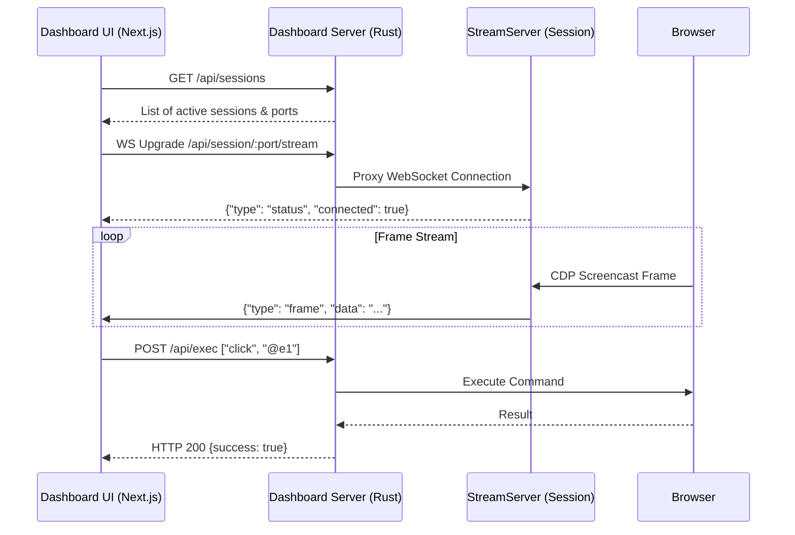

# Observability Dashboard

<details>
<summary>Relevant source files</summary>

The following files were used as context for generating this wiki page:

- [AGENTS.md](AGENTS.md)
- [cli/src/native/stream/dashboard.rs](cli/src/native/stream/dashboard.rs)
- [docs/src/app/dashboard/page.mdx](docs/src/app/dashboard/page.mdx)
- [packages/dashboard/package.json](packages/dashboard/package.json)
- [packages/dashboard/src/components/session-tree.tsx](packages/dashboard/src/components/session-tree.tsx)
- [packages/dashboard/src/components/viewport.tsx](packages/dashboard/src/components/viewport.tsx)
- [packages/dashboard/src/lib/dashboard-routes.ts](packages/dashboard/src/lib/dashboard-routes.ts)
- [packages/dashboard/src/store/sessions.ts](packages/dashboard/src/store/sessions.ts)
- [packages/dashboard/src/store/stream.ts](packages/dashboard/src/store/stream.ts)
- [packages/dashboard/src/types.ts](packages/dashboard/src/types.ts)

</details>


The Observability Dashboard is a Next.js-based web interface designed to provide real-time visibility into the browser automation process. It allows developers and AI agents to monitor session state, view live screencasts, inspect network activity, and debug element interactions through a unified UI.

## Architecture and Data Flow

The dashboard is a single-page application (SPA) built with Next.js and exported as static assets (`output: 'export'`) [packages/dashboard/package.json:7-7](). These assets are bundled directly into the Rust CLI binary using the `rust-embed` crate [docs/src/app/dashboard/page.mdx:125-126]().

The dashboard server handles incoming connections by serving embedded files over HTTP and upgrading WebSocket requests to a `StreamServer` protocol [cli/src/native/stream/dashboard.rs:107-116](). It acts as a proxy, allowing the frontend to communicate with multiple isolated browser sessions through a single same-origin interface by mapping routes to internal session ports [cli/src/native/stream/dashboard.rs:13-19]().

### System Component Mapping

The following diagram maps the logical dashboard features to their implementing entities in the codebase.

**Dashboard Entity Mapping**

```mermaid
graph TD
    subgraph "Frontend_packages_dashboard"
        ["Next.js Web UI"]
        ST["SessionTree (session-tree.tsx)"]
        VP["Viewport (viewport.tsx)"]
        AF["Activity Feed"]
        Store["Jotai Store (sessions.ts)"]
    end

    subgraph "Daemon_StreamServer_cli_src_native_stream"
        SS["StreamServer (mod.rs)"]
        WS["WebSocket Handler (websocket.rs)"]
        HTTP["HTTP Handler (http.rs)"]
        CHAT["Chat Proxy (chat.rs)"]
        DASH["Dashboard Server (dashboard.rs)"]
    end

    ["Next.js Web UI"] -- "HTTP GET /" --> HTTP
    ["Next.js Web UI"] -- "WS Upgrade /api/session/:port/stream" --> DASH
    DASH -- "Proxy WS" --> WS
    WS -- "Broadcast" --> SS
    ["Next.js Web UI"] -- "POST /api/chat" --> CHAT
    Store -- "GET /api/sessions" --> DASH
```
Sources: [cli/src/native/stream/dashboard.rs:13-19](), [packages/dashboard/src/store/sessions.ts:44-63](), [packages/dashboard/src/components/viewport.tsx:124-135](), [docs/src/app/dashboard/page.mdx:119-126]()

## Stream Protocol and Message Types

The dashboard utilizes a specialized WebSocket protocol for real-time observability. Data is synchronized via the `useStreamSync` hook in the frontend [packages/dashboard/src/store/stream.ts:76-98]().

| Message Type | Direction | Purpose |
| :--- | :--- | :--- |
| `frame` | Server -> Client | Broadcasts base64 JPEG data and viewport metadata [packages/dashboard/src/types.ts:1-13]() |
| `status` | Server -> Client | Reports browser connection, screencast state, and engine type [packages/dashboard/src/types.ts:15-23]() |
| `command` | Server -> Client | Sent when a command begins executing (e.g., `click`) [packages/dashboard/src/types.ts:25-31]() |
| `result` | Server -> Client | Sent when a command finishes, including success status and duration [packages/dashboard/src/types.ts:33-41]() |
| `console` | Server -> Client | Proxies browser console logs with level and text [packages/dashboard/src/types.ts:43-48]() |
| `tabs` | Server -> Client | Synchronizes the list of open tabs and their metadata [packages/dashboard/src/types.ts:80-84]() |
| `url` | Server -> Client | Updates the active URL in the dashboard address bar [packages/dashboard/src/types.ts:50-54]() |
| `page_error`| Server -> Client | Reports uncaught JavaScript exceptions from the page [packages/dashboard/src/types.ts:56-62]() |

Sources: [packages/dashboard/src/types.ts:1-95](), [packages/dashboard/src/store/stream.ts:151-219](), [docs/src/app/dashboard/page.mdx:65-115]()

## Key Dashboard Features

### 1. Viewport and Screencasting
The `Viewport` component renders real-time JPEG frames to an HTML5 canvas [packages/dashboard/src/components/viewport.tsx:137-143]().
*   **Interaction**: The component captures mouse events (click, move, wheel) and keyboard events, converting them into CDP-compatible input messages sent via `sendInputAtom` over the WebSocket [packages/dashboard/src/components/viewport.tsx:48-80](), [packages/dashboard/src/components/viewport.tsx:135-135]().
*   **Control**: Users can trigger navigation, device emulation (e.g., iPhone 15), and color scheme toggles directly from the viewport toolbar [packages/dashboard/src/components/viewport.tsx:90-102](), [packages/dashboard/src/components/viewport.tsx:192-211]().

### 2. Session Tree and Management
The `SessionTree` provides a hierarchical view of all active browser sessions and their tabs [packages/dashboard/src/components/session-tree.tsx:179-207]().
*   **Discovery**: The `useSessionsSync` hook polls the `/api/sessions` endpoint to maintain an accurate list of local and remote sessions [packages/dashboard/src/store/sessions.ts:213-230]().
*   **Actions**: Supports creating new sessions with specific engines (Chrome, Lightpanda) or cloud providers (Browserbase, AgentCore, etc.), as well as closing or killing existing sessions [packages/dashboard/src/store/sessions.ts:86-109](), [packages/dashboard/src/store/sessions.ts:132-150]().

### 3. AI Chat Panel
An integrated AI chat allows users to interact with the browser session using natural language [docs/src/app/dashboard/page.mdx:127-130]().
*   **Proxying**: The Rust server proxies chat requests to the Vercel AI Gateway [cli/src/native/stream/dashboard.rs:9-9]().
*   **Integration**: The dashboard uses `@ai-sdk/react` to handle message streaming and state [packages/dashboard/package.json:11-13]().

### 4. Activity and Console Panels
*   **Activity Feed**: Displays a chronological stream of `command` and `result` events, allowing users to inspect the parameters and output of every agent action [packages/dashboard/src/store/stream.ts:168-173]().
*   **Console Panel**: Aggregates `console` and `page_error` messages from the browser's JavaScript environment, filtered by severity [packages/dashboard/src/store/stream.ts:175-187]().

## Connection and Interaction Flow

**Dashboard Communication Sequence**


Sources: [cli/src/native/stream/dashboard.rs:197-220](), [packages/dashboard/src/store/sessions.ts:101-106](), [packages/dashboard/src/store/stream.ts:123-130](), [docs/src/app/dashboard/page.mdx:125-126]()

## Technical Implementation Details

*   **Same-Origin Proxy**: The dashboard server validates that WebSocket and HTTP requests originate from the same host to prevent cross-site hijacking [cli/src/native/stream/dashboard.rs:179-194]().
*   **Route Handling**: The Rust server parses session proxy routes of the form `/api/session/<port>/<endpoint>` to route traffic to the correct local session [cli/src/native/stream/dashboard.rs:197-222]().
*   **State Management**: Uses `jotai` for atomic state management, with `sessionsAtom` merging polled, pending, and closing session states [packages/dashboard/src/store/sessions.ts:44-63]().
*   **Environment Configuration**: The dashboard and chat features respect `AI_GATEWAY_API_KEY`, `AI_GATEWAY_URL`, and `AI_GATEWAY_MODEL` [docs/src/app/dashboard/page.mdx:131-145]().

Sources: [cli/src/native/stream/dashboard.rs:13-50](), [packages/dashboard/src/store/sessions.ts:30-40](), [docs/src/app/dashboard/page.mdx:18-32]()
