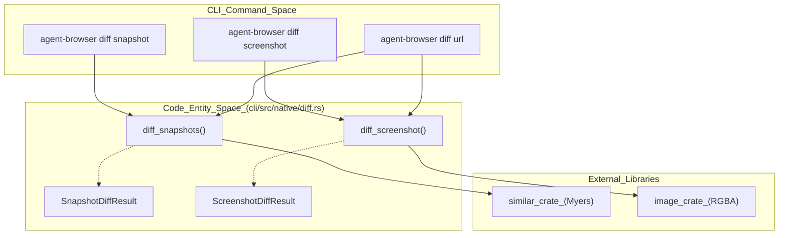
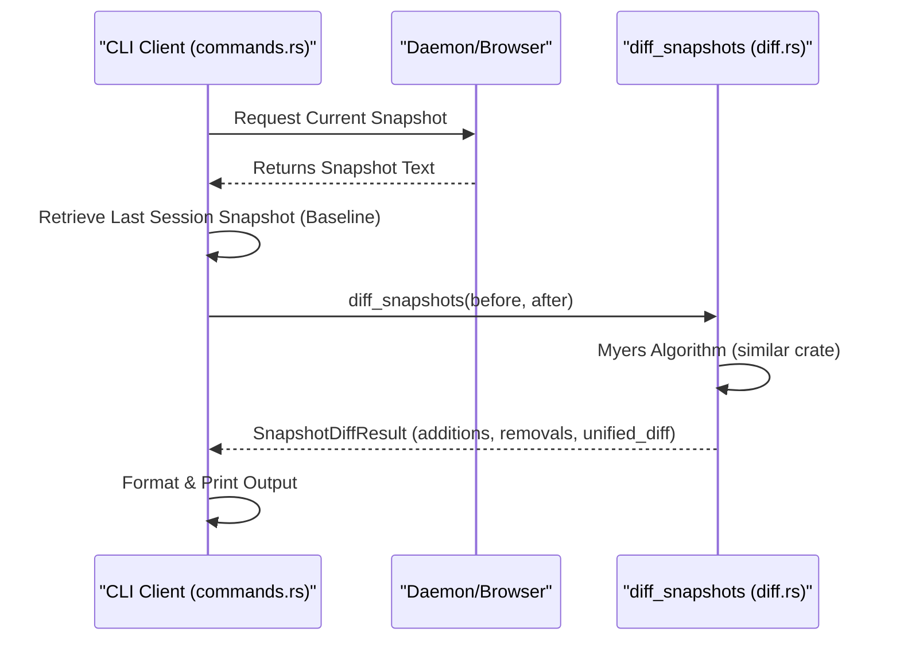

# Diffing and Visual Regression

<details>
<summary>Relevant source files</summary>

The following files were used as context for generating this wiki page:

- [cli/src/native/diff.rs](cli/src/native/diff.rs)
- [cli/src/native/element.rs](cli/src/native/element.rs)
- [cli/src/native/interaction.rs](cli/src/native/interaction.rs)
- [cli/src/native/screenshot.rs](cli/src/native/screenshot.rs)
- [cli/src/native/snapshot.rs](cli/src/native/snapshot.rs)
- [docs/src/app/diffing/page.mdx](docs/src/app/diffing/page.mdx)
- [docs/src/app/ios/page.mdx](docs/src/app/ios/page.mdx)
- [docs/src/app/sessions/page.mdx](docs/src/app/sessions/page.mdx)

</details>


The diffing subsystem in `agent-browser` provides tools for comparing page states across time or across different URLs. It supports structural comparison via accessibility tree snapshots, visual comparison via pixel-level screenshot matching, and sequential navigation for environment parity checks.

## Overview of Diff Mechanisms

The system implements three primary diffing strategies:

1.  **Snapshot Diffing**: Text-based comparison of the accessibility tree using the Myers diff algorithm. This is the primary method used by AI agents to verify if an interaction (like a click or form fill) resulted in the expected DOM/accessibility state change [docs/src/app/diffing/page.mdx:23-38]().
2.  **Screenshot Diffing**: Pixel-by-pixel comparison of PNG buffers with a configurable color distance threshold [cli/src/native/diff.rs:21-25]().
3.  **URL Diffing**: A high-level orchestration that navigates to two distinct URLs in sequence to perform both snapshot and optional screenshot comparisons [docs/src/app/diffing/page.mdx:100-115]().

### Component Architecture: Diff Subsystem

The following diagram illustrates how the CLI commands map to the underlying Rust implementation in the native diff module.

**Diff Entity Mapping**

Sources: [cli/src/native/diff.rs:1-148](), [docs/src/app/diffing/page.mdx:9-21]()

---

## Snapshot Diffing

Snapshot diffing operates on the text representation of the accessibility tree. By default, `diff snapshot` compares the current page state against the most recent snapshot stored in the active session [docs/src/app/diffing/page.mdx:28-32]().

### Implementation Details
The core logic resides in `diff_snapshots` [cli/src/native/diff.rs:103](). It utilizes the `similar` crate to generate a unified diff [cli/src/native/diff.rs:103-119]().

*   **Fast Path**: If the `before` and `after` strings are identical, the function returns immediately without invoking the diff engine, avoiding overhead in retry/loop workloads [cli/src/native/diff.rs:108-117]().
*   **Algorithm**: Uses `TextDiff::from_lines` to iterate through changes and categorize them into `Insert`, `Delete`, or `Equal` [cli/src/native/diff.rs:119-131]().
*   **Output**: Produces a `SnapshotDiffResult` containing a unified diff string with a context radius of 3 lines [cli/src/native/diff.rs:135-147]().

### Data Flow: Snapshot Diff

Sources: [cli/src/native/diff.rs:103-148](), [docs/src/app/diffing/page.mdx:23-38]()

---

## Visual Regression (Screenshot Diffing)

Screenshot diffing performs a pixel-level comparison between a baseline image and the current viewport (or a specific element) [docs/src/app/diffing/page.mdx:64-77]().

### Pixel Comparison Logic
The function `diff_screenshot` processes two image buffers [cli/src/native/diff.rs:21-25]():

1.  **Dimension Validation**: If widths or heights differ, it returns a `ScreenshotDiffResult` with `dimension_mismatch` populated and 100% mismatch [cli/src/native/diff.rs:34-46]().
2.  **Color Distance**: For each pixel, it calculates the Euclidean distance between RGBA values [cli/src/native/diff.rs:57-63]().
3.  **Thresholding**: A pixel is marked as "different" if the distance exceeds `max_color_distance`, calculated as `threshold * 255.0 * sqrt(3)` [cli/src/native/diff.rs:51-65]().
4.  **Diff Image Generation**: 
    *   **Changed Pixels**: Highlighted in bright red `[255, 0, 0, 255]` [cli/src/native/diff.rs:67]().
    *   **Unchanged Pixels**: Dimmed to 30% of their original grayscale value to provide context [cli/src/native/diff.rs:69-71]().

### Screenshot Diff Parameters
| Parameter | Type | Description |
| :--- | :--- | :--- |
| `baseline` | `&[u8]` | The reference image bytes (PNG/JPEG) [cli/src/native/diff.rs:22]() |
| `current` | `&[u8]` | The current page/element screenshot bytes [cli/src/native/diff.rs:23]() |
| `threshold` | `f64` | Tolerance for color distance (0.0 to 1.0). Default: 0.1 [cli/src/native/diff.rs:24](), [docs/src/app/diffing/page.mdx:88]() |

Sources: [cli/src/native/diff.rs:21-100](), [docs/src/app/diffing/page.mdx:81-92]()

---

## URL Diffing

The `diff url <url1> <url2>` command compares two different live pages by navigating to each in sequence [docs/src/app/diffing/page.mdx:100-115]():

1.  **Navigate to URL 1**: Capture the baseline snapshot (and screenshot if `--screenshot` is provided).
2.  **Navigate to URL 2**: Capture the current snapshot (and screenshot).
3.  **Execute Diff**: Run `diff_snapshots` and/or `diff_screenshot` on the collected data.

This command is used for verifying environment parity (e.g., staging vs production) [docs/src/app/diffing/page.mdx:169-175]().

### Command Options
*   `--screenshot`: Performs visual pixel comparison [docs/src/app/diffing/page.mdx:126]().
*   `--wait-until`: Navigation wait strategy (`load`, `domcontentloaded`, `networkidle`) [docs/src/app/diffing/page.mdx:128]().
*   `--selector`: Scopes snapshots and screenshots to a specific element [docs/src/app/diffing/page.mdx:129]().

Sources: [docs/src/app/diffing/page.mdx:100-133]()

---

## Technical Summary of Diff Results

The native module returns structured data for both types of diffs.

### Result Structures
[cli/src/native/diff.rs:4-19]()
```rust
pub struct ScreenshotDiffResult {
    pub total_pixels: u64,
    pub different_pixels: u64,
    pub mismatch_percentage: f64,
    pub matched: bool,
    pub diff_image: Option<Vec<u8>>,
    pub dimension_mismatch: Option<Value>,
}

pub struct SnapshotDiffResult {
    pub diff: String, // Unified diff text
    pub additions: usize,
    pub removals: usize,
    pub unchanged: usize,
    pub changed: bool,
}
```

### Legacy Compatibility
For consumers expecting JSON output, `diff_text` provides a wrapper returning a `serde_json::Value` with boolean flags and change counts [cli/src/native/diff.rs:151-161]().

Sources: [cli/src/native/diff.rs:4-19](), [cli/src/native/diff.rs:151-161]()
