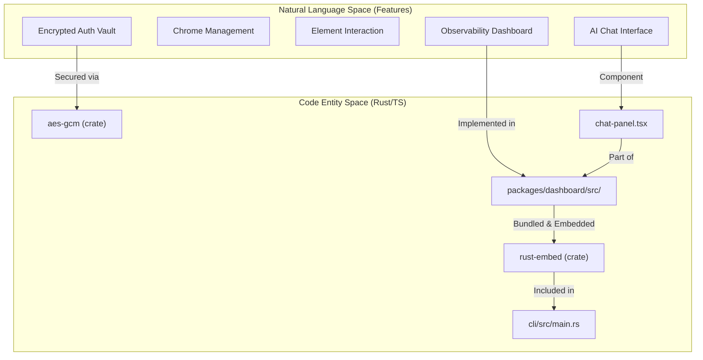
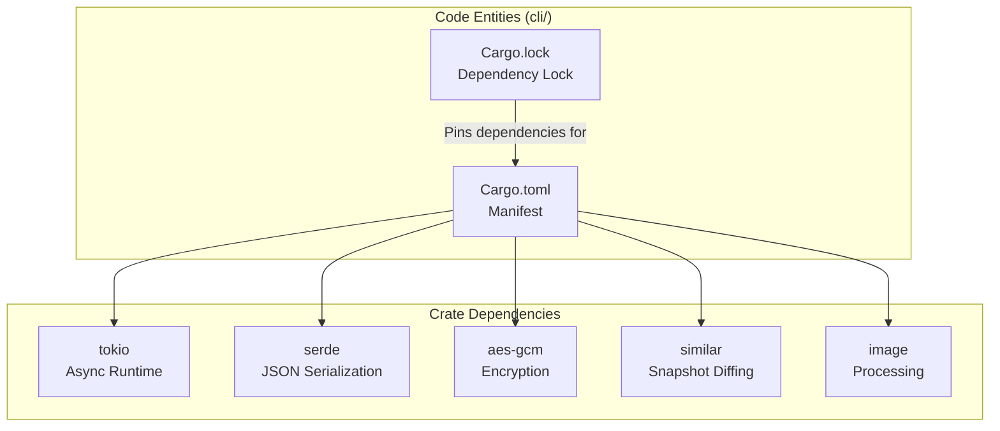

# Development

<details>
<summary>Relevant source files</summary>

The following files were used as context for generating this wiki page:

- [.github/workflows/ci.yml](.github/workflows/ci.yml)
- [.github/workflows/release.yml](.github/workflows/release.yml)
- [.husky/pre-commit](.husky/pre-commit)
- [.node-version](.node-version)
- [docker/Dockerfile.build](docker/Dockerfile.build)
- [docker/docker-compose.yml](docker/docker-compose.yml)
- [docs/src/app/installation/page.mdx](docs/src/app/installation/page.mdx)
- [packages/dashboard/src/components/chat-panel.tsx](packages/dashboard/src/components/chat-panel.tsx)
- [pnpm-workspace.yaml](pnpm-workspace.yaml)
- [scripts/build-all-platforms.sh](scripts/build-all-platforms.sh)
- [scripts/check-version-sync.js](scripts/check-version-sync.js)
- [scripts/sync-version.js](scripts/sync-version.js)

</details>


This section provides guidance for developers contributing to `agent-browser` or seeking to understand its internals. It covers the development environment setup, build processes, testing workflows, and key architectural decisions that impact development work.

For detailed information about specific subsystems:
- **Build System**: Details on TypeScript compilation, Rust cross-compilation via `cargo-zigbuild`, and binary packaging. See [Build System](#8.1).
- **CI/CD Pipeline**: Documentation on GitHub Actions workflows (`ci.yml`, `release.yml`), version synchronization, and release processes. See [CI/CD Pipeline](#8.2).
- **Project Structure**: Overview of repository organization including `cli/`, `packages/dashboard/`, and the relationship between TypeScript and Rust codebases. See [Project Structure](#8.3).
- **Testing and Benchmarks**: Documentation on the testing infrastructure including `e2e_tests.rs` and performance suites. See [Testing and Benchmarks](#8.4).
- **Examples and Integrations**: Documentation on the Next.js demo and integration patterns for web applications. See [Examples and Integrations](#8.5).

## Prerequisites

Development requires the following tools installed on your system:

| Tool | Purpose | Minimum Version |
|------|---------|-----------------|
| **Node.js** | Dashboard compilation and scripting | 24.x |
| **pnpm** | Package management | 11.x |
| **Rust** | CLI binary compilation | 1.88+ |
| **cargo** | Rust build system | (bundled with Rust) |
| **ziglang** | Cross-platform compilation | 0.13.0 (for zigbuild) |

**Sources:** [.node-version:1](), [docs/src/app/installation/page.mdx:46-46](), [docker/Dockerfile.build:2-25](), [.github/workflows/release.yml:155-155]()

## Quick Start for Development

### Initial Setup

Clone the repository and install dependencies:

```bash
git clone https://github.com/vercel-labs/agent-browser.git
cd agent-browser
pnpm install
```

The project uses a **pnpm workspace** to manage the root, dashboard, and documentation packages [pnpm-workspace.yaml:1-4]().

### Building from Source

```bash
# Build dashboard (required for embedding in binary)
pnpm --filter dashboard build

# Build native Rust CLI for current platform
cd cli && cargo build --release
```

**Sources:** [docs/src/app/installation/page.mdx:48-58](), [.github/workflows/release.yml:130-131](), [pnpm-workspace.yaml:1-4]()

## Development Workflow

The development cycle is validated by a multi-stage CI pipeline. The observability dashboard is a Next.js application that is built and then embedded directly into the Rust binary to provide a zero-dependency distribution [cli/Cargo.toml:37](), [packages/dashboard/src/components/chat-panel.tsx:1-5]().

### Code-to-Binary Relationship



**Sources:** [cli/Cargo.toml:27-37](), [packages/dashboard/src/components/chat-panel.tsx:1-15](), [docs/src/app/installation/page.mdx:98-100]()

## Technology Stack

### Rust CLI and Native Daemon
The core logic is implemented in Rust for performance and small footprint. The CLI uses `tokio` for its async runtime and `serde` for protocol serialization [cli/Cargo.toml:13-20]().



**Sources:** [cli/Cargo.toml:13-37](), [docs/src/app/installation/page.mdx:12-13]()

## Build System Overview

### Multi-Platform Distribution
`agent-browser` distributes native binaries for multiple platform/architecture combinations via GitHub Actions, including support for `musl` targets for Docker environments and Windows via `mingw-w64` [.github/workflows/release.yml:71-116]().

| Platform | Target Triple | Binary Name |
|----------|---------------|-------------|
| Linux x64 | `x86_64-unknown-linux-gnu` | `agent-browser-linux-x64` |
| Linux ARM64 | `aarch64-unknown-linux-gnu` | `agent-browser-linux-arm64` |
| Linux musl x64 | `x86_64-unknown-linux-musl` | `agent-browser-linux-musl-x64` |
| Windows x64 | `x86_64-pc-windows-gnu` | `agent-browser-win32-x64.exe` |
| macOS ARM64 | `aarch64-apple-darwin` | `agent-browser-darwin-arm64` |

**Sources:** [.github/workflows/release.yml:71-116](), [.github/workflows/ci.yml:191-207](), [scripts/build-all-platforms.sh:60-79]()

### Installation and Diagnostics
The CLI includes an `install` command to download "Chrome for Testing" directly [docs/src/app/installation/page.mdx:9](). For development and troubleshooting, the `doctor` command provides one-shot diagnosis of environment, configurations, and connectivity, with an optional `--fix` flag to repair common issues [docs/src/app/installation/page.mdx:82-87]().

## Testing Strategy

### Test Suites
- **Rust Unit & Integration Tests**: Fast tests running via `cargo test` [.github/workflows/ci.yml:49-51]().
- **End-to-End Tests**: Native E2E tests that launch real Chrome instances and exercise the daemon lifecycle (open, snapshot, close). These run in CI with `--test-threads=1` to prevent port conflicts [.github/workflows/ci.yml:106-132]().
- **Cross-Platform Validation**: Specific workflows for Windows integration to ensure binary compatibility and daemon liveness on non-Unix systems [.github/workflows/ci.yml:133-189]().

**Sources:** [.github/workflows/ci.yml:49-51](), [.github/workflows/ci.yml:130-132](), [.github/workflows/ci.yml:173-188]()

## Version Management

Version synchronization is critical because the project spans multiple ecosystems (npm/Node.js and Cargo/Rust).

### Synchronization Flow
1. **Source of Truth**: The root `package.json` version field [scripts/sync-version.js:17-21]().
2. **Sync Script**: `scripts/sync-version.js` propagates this version to `cli/Cargo.toml` and `packages/dashboard/package.json` [scripts/sync-version.js:25-57]().
3. **Pre-commit Automation**: A husky hook runs the sync script and adds the updated Cargo files to the commit [.husky/pre-commit:1-2]().
4. **CI Enforcement**: `scripts/check-version-sync.js` validates that all versions match, failing the build if drift is detected [scripts/check-version-sync.js:34-49](), [.github/workflows/ci.yml:11-24]().

**Sources:** [scripts/sync-version.js:1-81](), [scripts/check-version-sync.js:1-52](), [.husky/pre-commit:1-3](), [.github/workflows/ci.yml:11-24]()
