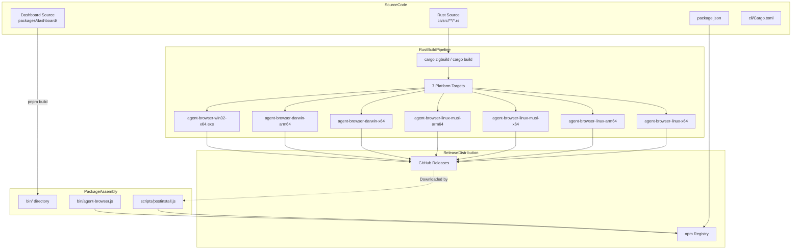
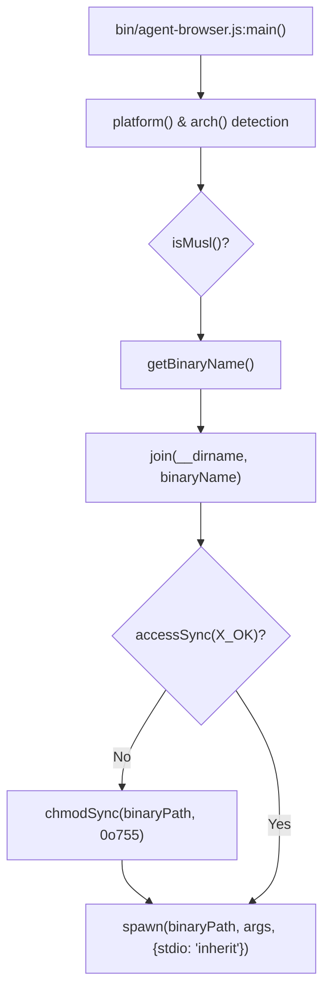

# Build System

Relevant source files

The following files were used as context for generating this wiki page:

- [.gitignore](.gitignore)
- [bin/agent-browser.js](bin/agent-browser.js)
- [cli/build.rs](cli/build.rs)
- [cli/src/upgrade.rs](cli/src/upgrade.rs)
- [docker/Dockerfile.build](docker/Dockerfile.build)
- [docker/docker-compose.yml](docker/docker-compose.yml)
- [pnpm-lock.yaml](pnpm-lock.yaml)
- [scripts/build-all-platforms.sh](scripts/build-all-platforms.sh)
- [scripts/postinstall.js](scripts/postinstall.js)

This document describes the build system for `agent-browser`, which manages a dual-language codebase consisting of a Rust-based CLI and a TypeScript-based dashboard. It details the compilation pipelines, the cross-compilation strategy for multi-platform distribution, and the automated installation logic.

---

## Overview

The build system handles two distinct compilation pipelines packaged into a single npm distribution:

1.  **Rust Pipeline**: Compiles the high-performance CLI and native daemon using Cargo. It supports cross-compilation for 7 target platforms using `cargo-zigbuild` or native toolchains. [scripts/build-all-platforms.sh:60-80](), [docker/docker-compose.yml:17-39]()
2.  **TypeScript Pipeline**: Compiles the Next.js-based dashboard located in `packages/dashboard`. [cli/build.rs:9-19]()
3.  **Distribution**: Combines these artifacts into an npm package where a `postinstall.js` script handles the retrieval of platform-specific native binaries from GitHub Releases. [scripts/postinstall.js:1-10]()

**Sources:** [scripts/postinstall.js:1-10](), [scripts/build-all-platforms.sh:1-86](), [docker/docker-compose.yml:1-164]()

---

## Build Pipeline Architecture

The following diagram illustrates the flow from source code to multi-platform distribution, highlighting the integration between Rust compilation and Node.js packaging.

### Build and Distribution Flow

**Sources:** [scripts/postinstall.js:34-49](), [bin/agent-browser.js:31-66](), [scripts/build-all-platforms.sh:60-80]()

---

## Rust Cross-Compilation

The core CLI is written in Rust and must be available as a native binary for various operating systems and architectures.

### Target Platforms
The system targets 7 primary configurations to ensure compatibility across cloud environments (including Alpine/musl), developer workstations, and Windows. [scripts/build-all-platforms.sh:60-80]()

| Platform | Target Triple | Binary Name |
| :--- | :--- | :--- |
| Linux x64 | `x86_64-unknown-linux-gnu` | `agent-browser-linux-x64` |
| Linux ARM64 | `aarch64-unknown-linux-gnu` | `agent-browser-linux-arm64` |
| Linux musl x64 | `x86_64-unknown-linux-musl` | `agent-browser-linux-musl-x64` |
| Linux musl ARM64 | `aarch64-unknown-linux-musl` | `agent-browser-linux-musl-arm64` |
| macOS x64 | `x86_64-apple-darwin` | `agent-browser-darwin-x64` |
| macOS ARM64 | `aarch64-apple-darwin` | `agent-browser-darwin-arm64` |
| Windows x64 | `x86_64-pc-windows-gnu` | `agent-browser-win32-x64.exe` |

**Sources:** [scripts/build-all-platforms.sh:60-80](), [bin/agent-browser.js:31-66]()

### Build Process and Tools
The project uses `cargo-zigbuild` and specialized linkers to handle cross-platform requirements:
*   **Dockerized Build**: The `build-all-platforms.sh` script uses a `agent-browser-builder` Docker image to run `cargo zigbuild` for all targets. [scripts/build-all-platforms.sh:24-57]()
*   **CDP Protocol Generation**: A custom `cli/build.rs` script generates Rust types from Chrome DevTools Protocol JSON files (`browser_protocol.json`, `js_protocol.json`) during the build. [cli/build.rs:21-88]()
*   **Dashboard Embedding**: The `ensure_dashboard_dir` function in `build.rs` ensures a placeholder `index.html` exists in `packages/dashboard/out` if the dashboard hasn't been built yet, preventing `rust-embed` from failing. [cli/build.rs:9-19]()
*   **Target Normalization**: The `docker-compose.yml` includes logic to map various target strings to specific glibc versions (e.g., `.2.28`) to ensure compatibility with older Linux distributions. [docker/docker-compose.yml:87-149]()

**Sources:** [scripts/build-all-platforms.sh:1-86](), [cli/build.rs:1-88](), [docker/docker-compose.yml:1-164]()

---

## Binary Distribution Mechanism

`agent-browser` uses a hybrid distribution model where the npm package triggers a download of the correct native binary for the user's system.

### Post-Installation Logic (`postinstall.js`)
When a user runs `npm install agent-browser`, the `postinstall.js` script executes:
1.  **Platform Detection**: It identifies the OS, architecture, and whether the system uses `musl` libc via `isMusl()`. [scripts/postinstall.js:24-36]()
2.  **Download**: It constructs a `DOWNLOAD_URL` pointing to the GitHub Release asset (e.g., `v0.25.4/agent-browser-linux-x64`) and pipes the response to `bin/`. [scripts/postinstall.js:47-81]()
3.  **Permissions**: It applies `chmodSync(binaryPath, 0o755)` on Unix-like systems to ensure the binary is executable. [scripts/postinstall.js:137-140]()
4.  **Install Method Marker**: It writes a `.install-method` file (e.g., "pnpm", "npm") derived from `npm_config_user_agent` so the `run_upgrade` function in `cli/src/upgrade.rs` knows which package manager to use. [scripts/postinstall.js:91-106](), [cli/src/upgrade.rs:35-44]()
5.  **Chrome Detection**: It attempts to find a system installation of Chrome/Chromium via `findSystemChrome()` to notify the user if a manual installation via `agent-browser install` is required. [scripts/postinstall.js:160-215]()

**Sources:** [scripts/postinstall.js:1-158](), [scripts/postinstall.js:160-215](), [cli/src/upgrade.rs:35-44]()

---

## Runtime Binary Selection

If the native binary is not globally patched, the `bin/agent-browser.js` Node.js wrapper acts as a fallback entry point.

### Binary Selection Logic

The `getBinaryName` function in `bin/agent-browser.js` maps Node.js environment variables to the project's binary naming convention (e.g., `agent-browser-darwin-arm64`). [bin/agent-browser.js:31-66]()

**Sources:** [bin/agent-browser.js:11-118]()

---

## Version Synchronization and Upgrades

The build system relies on parity between various configuration files to ensure valid distribution and runtime behavior.

*   **Version Check**: The CI pipeline and developers use scripts to verify that `package.json`, `cli/Cargo.toml`, and `packages/dashboard/package.json` are perfectly in sync.
*   **CLI Upgrades**: The `cli/src/upgrade.rs` module handles the `agent-browser upgrade` command. It detects the `InstallMethod` (e.g., `Npm`, `Pnpm`, `Homebrew`, `Cargo`) by reading the `.install-method` marker or probing the environment. [cli/src/upgrade.rs:8-16](), [cli/src/upgrade.rs:46-121]()
*   **Automated Commands**: Based on the detected method, it runs the appropriate shell command (e.g., `npm install -g agent-browser@latest`) to update the package. [cli/src/upgrade.rs:142-185]()

**Sources:** [cli/src/upgrade.rs:1-240](), [scripts/postinstall.js:91-106]()
