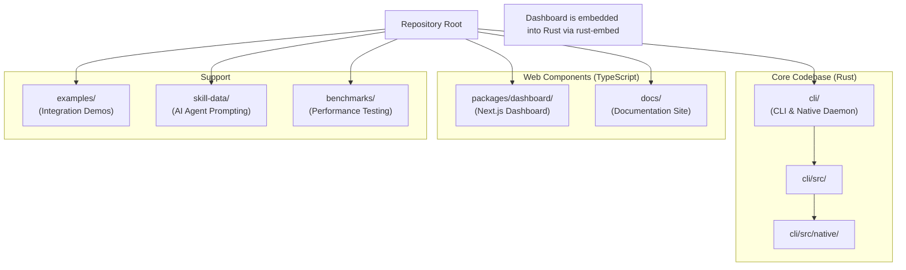
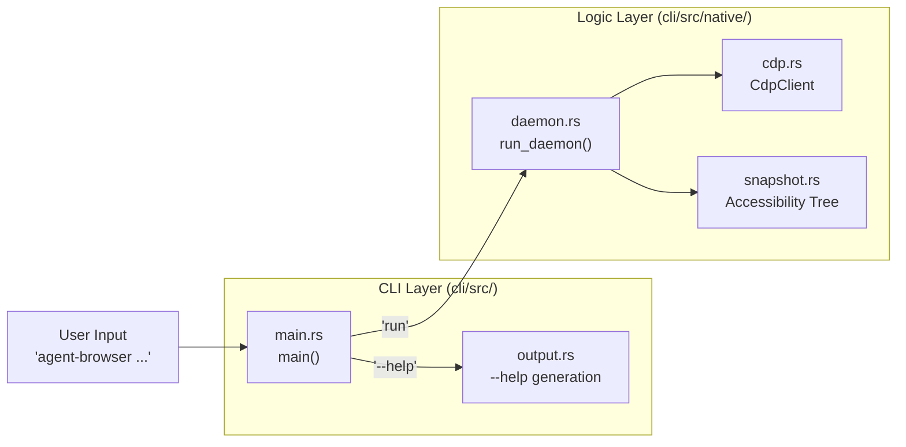
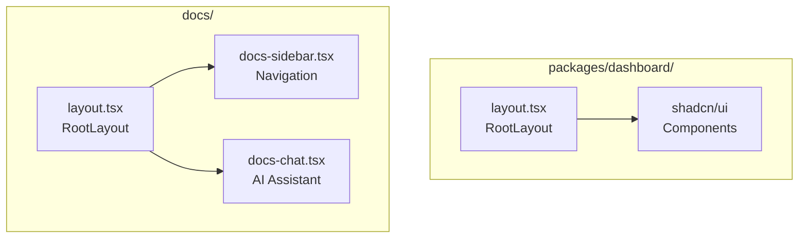

# Project Structure

Relevant source files

The following files were used as context for generating this wiki page:

- [AGENTS.md](AGENTS.md)
- [cli/Cargo.lock](cli/Cargo.lock)
- [cli/Cargo.toml](cli/Cargo.toml)
- [docs/package.json](docs/package.json)
- [docs/pnpm-lock.yaml](docs/pnpm-lock.yaml)
- [docs/src/app/layout.tsx](docs/src/app/layout.tsx)
- [packages/dashboard/package.json](packages/dashboard/package.json)

This document provides a technical overview of the `agent-browser` repository organization, explaining the relationship between the TypeScript and Rust codebases, key directories, and the distribution mechanisms for the CLI and its embedded components.

---

## Repository Layout

The `agent-browser` repository is a hybrid monorepo managed with `pnpm` workspaces [docs/pnpm-lock.yaml:7-9](). The core logic is implemented in Rust for high performance and low memory footprint, while the observability dashboard and documentation are built with TypeScript and Next.js.

Title: Repository Directory Map

**Sources:** [cli/Cargo.toml:1-38](), [docs/package.json:1-49](), [AGENTS.md:90-93]()

---

## Key Directories

### Rust CLI and Daemon (`cli/`)

The `cli/` directory contains the primary Rust implementation. It uses `serde` for JSON protocol handling and `tokio` for asynchronous I/O and process management [cli/Cargo.toml:14-19]().

| Directory/File | Purpose |
|:---|:---|
| `cli/src/` | Source code for CLI entry point and command parsing. |
| `cli/src/native/` | Core browser automation logic (daemon, actions, browser, CDP client, snapshot, state) [AGENTS.md:91-92](). |
| `cli/Cargo.toml` | Defines Rust dependencies including `aes-gcm` for state encryption and `tokio-tungstenite` for WebSocket communication [cli/Cargo.toml:20-27](). |
| `cli/Cargo.lock` | Locked dependency tree for reproducible builds [cli/Cargo.lock:47-77](). |

**Sources:** [cli/Cargo.toml:1-38](), [cli/Cargo.lock:47-77](), [AGENTS.md:90-93]()

### Dashboard and Docs (`packages/dashboard/`, `docs/`)

The repository includes two major web applications:

*   **Dashboard**: Located in `packages/dashboard/`, this Next.js app provides a live view of browser sessions [packages/dashboard/package.json:1-38](). It uses `shadcn/ui` components and `jotai` for state management [packages/dashboard/package.json:17-25]().
*   **Docs**: Located in `docs/`, this powers the technical documentation site using Next.js and MDX [docs/package.json:11-16](). It includes features like `DocsChat`, `SpeedInsights`, and `Analytics` [docs/src/app/layout.tsx:10-13]().

**Sources:** [packages/dashboard/package.json:1-38](), [docs/package.json:1-49](), [docs/src/app/layout.tsx:1-94]()

### Support and Testing

*   **`skill-data/`**: Contains core "skills" for AI agents, specifically `skill-data/core/SKILL.md` for workflow instructions [AGENTS.md:22-22]().
*   **`benchmarks/`**: Performance testing suite for evaluating the Rust daemon [AGENTS.md:110-116]().
*   **`examples/`**: Integration demos showing how to embed `agent-browser` into other applications.

---

## Code Entity Mapping

### CLI Command Execution Flow

This diagram bridges the user's natural language input to the internal Rust execution flow and core logic entities.

Title: Natural Language to Code Entity Flow

**Sources:** [cli/Cargo.toml:1-12](), [AGENTS.md:20-20](), [AGENTS.md:90-93]()

### Dashboard and Documentation Architecture

The dashboard and documentation share a similar Next.js foundation but serve different roles in the ecosystem.

Title: Web Application Structure

**Sources:** [docs/src/app/layout.tsx:1-15](), [packages/dashboard/package.json:25-25]()

---

## Technical Specifications

### Dependency Profile

The project minimizes overhead by using high-performance Rust crates:

| Category | Crate / Tool | Role |
|:---|:---|:---|
| **Async Runtime** | `tokio` | Multi-threaded executor for IPC and browser control [cli/Cargo.toml:19-19](). |
| **Serialization** | `serde_json` | Handles the JSON-based command protocol [cli/Cargo.toml:15-15](). |
| **Security** | `aes-gcm` | AES-256-GCM encryption for the authentication vault [cli/Cargo.toml:27-27](). |
| **Diffing** | `similar` | Text-based accessibility tree diffing [cli/Cargo.toml:30-30](). |
| **Embedded UI** | `rust-embed` | Bundles dashboard assets into the Rust binary [cli/Cargo.toml:37-37](). |
| **Web UI** | `next` | React framework for dashboard and docs [docs/package.json:27-27](). |

**Sources:** [cli/Cargo.toml:13-37](), [docs/package.json:27-31]()
