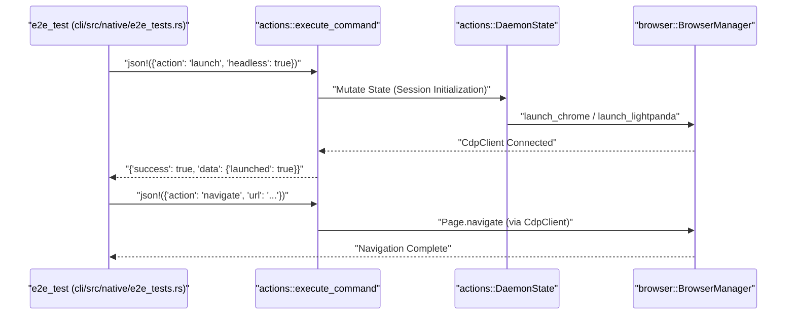
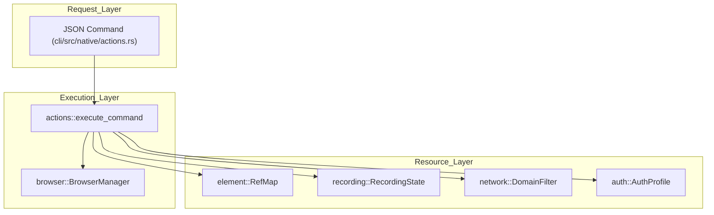

# Testing and Benchmarks

Relevant source files

The following files were used as context for generating this wiki page:

- [benchmarks/.env.example](benchmarks/.env.example)
- [benchmarks/.gitignore](benchmarks/.gitignore)
- [benchmarks/README.md](benchmarks/README.md)
- [benchmarks/bench.ts](benchmarks/bench.ts)
- [benchmarks/package.json](benchmarks/package.json)
- [benchmarks/pnpm-lock.yaml](benchmarks/pnpm-lock.yaml)
- [benchmarks/scenarios.ts](benchmarks/scenarios.ts)
- [cli/src/native/actions.rs](cli/src/native/actions.rs)
- [cli/src/native/auth.rs](cli/src/native/auth.rs)
- [cli/src/native/browser.rs](cli/src/native/browser.rs)
- [cli/src/native/cdp/types.rs](cli/src/native/cdp/types.rs)
- [cli/src/native/e2e_tests.rs](cli/src/native/e2e_tests.rs)
- [cli/src/native/network.rs](cli/src/native/network.rs)
- [cli/src/native/parity_tests.rs](cli/src/native/parity_tests.rs)
- [cli/src/native/recording.rs](cli/src/native/recording.rs)
- [evals/.env.example](evals/.env.example)
- [evals/.gitignore](evals/.gitignore)
- [evals/README.md](evals/README.md)
- [evals/bun.lock](evals/bun.lock)

This page documents the testing infrastructure and performance benchmarking suite for `agent-browser`. The codebase employs a multi-layered testing strategy encompassing unit tests, integration tests, and full end-to-end (E2E) suites across both Rust and TypeScript implementations. Additionally, a dedicated benchmark suite compares the resource efficiency of the native Rust daemon against the Node.js implementation within Vercel Sandbox microVMs.

## Testing Infrastructure Overview

The testing environment is split between the Rust-based native daemon and the TypeScript-based CLI/client components.

| Test Suite | Location | Technology | Purpose |
|:---|:---|:---|:---|
| **Native E2E** | `cli/src/native/e2e_tests.rs` | Rust (`tokio::test`) | Full command pipeline validation with real Chromium/Lightpanda instances. |
| **Parity Tests** | `cli/src/native/parity_tests.rs` | Rust | Ensuring functional equivalence between Node.js and Rust implementations across 100+ actions. |
| **Doctor Integration**| `cli/tests/doctor_cli.rs` | Rust | Integration tests for the `doctor` command using a throwaway environment. |
| **Skills Evals** | `evals/` | Bun / TS | LLM-based evaluation of skill loading, selection, and command usage. |
| **Benchmarks** | `benchmarks/` | Node.js / Vercel Sandbox | Performance and memory footprint comparison in microVM environments. |

Sources: [cli/src/native/e2e_tests.rs:1-8](), [cli/src/native/parity_tests.rs:1-6](), [evals/README.md:1-4]()

## Native E2E Testing Pipeline

The native E2E tests exercise the full `execute_command` [cli/src/native/e2e_tests.rs:17-17]() lifecycle. These tests are marked with `#[ignore]` [cli/src/native/e2e_tests.rs:4-5]() by default to prevent execution in environments without a browser installed. They must be run serially using `--test-threads=1` to avoid contention for the browser instance [cli/src/native/e2e_tests.rs:7-8]().

**Key Components:**
*   **`DaemonState`**: Manages the lifecycle of the browser process and session state during the test [cli/src/native/e2e_tests.rs:50-50]().
*   **`execute_command`**: The primary entry point for routing JSON commands to the browser via CDP [cli/src/native/e2e_tests.rs:52-61]().
*   **Test Fixtures**: Local HTML files (e.g., `drag_probe.html`, `upload_probe.html`) are encoded as Base64 data URLs to provide reproducible DOM environments [cli/src/native/e2e_tests.rs:32-47]().
*   **Engine Testing**: Specific tests for `Lightpanda` ensure the experimental engine can launch and navigate [cli/src/native/e2e_tests.rs:216-226]().

### E2E Command Execution Flow
The following diagram illustrates how a test case interacts with the system entities.

**E2E Command Execution Flow**

Sources: [cli/src/native/e2e_tests.rs:158-212](), [cli/src/native/browser.rs:8-11](), [cli/src/native/actions.rs:183-200]()

## Parity and Compatibility Testing

The parity suite [cli/src/native/parity_tests.rs:1-6]() ensures that the Rust implementation correctly handles every action supported by the legacy Node.js daemon. It verifies 100+ documented actions [cli/src/native/parity_tests.rs:45-195]().

### Credential and Auth Validation
A critical part of parity is the authentication and encryption system. Tests verify:
*   **Encryption Key Management**: The `TestKeyGuard` ensures `AGENT_BROWSER_ENCRYPTION_KEY` is handled safely during tests [cli/src/native/parity_tests.rs:14-42]().
*   **Credential Storage**: Verifies actions like `credentials_set`, `auth_save`, and `auth_login` work with the `AuthProfile` struct [cli/src/native/auth.rs:11-26]().
*   **Selector Logic**: The `auth_login` command's use of `WaitUntil::Load` [cli/src/native/actions.rs:52-52]() and polling for form selectors with a 100ms interval [cli/src/native/actions.rs:55-55]().
*   **Preferred Selectors**: Logic prioritizing targeted username selectors for 5 seconds [cli/src/native/actions.rs:57-59]().

### Action Handling Architecture

Sources: [cli/src/native/actions.rs:25-32](), [cli/src/native/browser.rs:159-173](), [cli/src/native/auth.rs:11-26](), [cli/src/native/network.rs:80-82]()

## LLM-Based Evaluations (Evals)

The `evals/` suite uses `bun` to run automated quality checks on the AI's ability to use the tool.

*   **Categories**: Tests cover `skill-loading` (ensuring agents run `agent-browser skills get` first), `skill-selection`, and `command-usage` [evals/README.md:72-84]().
*   **Mechanism**: Injects `SKILL.md` as context and calls provider CLIs (Claude or Codex) to verify correct command production [evals/README.md:85-92]().
*   **Judge**: Includes an optional LLM judge (Claude Opus) to score the quality of the agent's responses on a 1-5 scale [evals/README.md:89-92]().

Sources: [evals/README.md:1-49](), [evals/README.md:69-69]()

## Performance Benchmarks

The `benchmarks/` suite quantifies the resource efficiency of the native Rust daemon, particularly within Vercel Sandbox microVMs [benchmarks/README.md:1-3]().

### Scenarios and Methodology
Scenarios defined in `benchmarks/scenarios.ts` include:
*   **`navigate`**: Basic page load round-trip.
*   **`snapshot`**: Accessibility tree generation and RefMap population.
*   **`agent-loop`**: A typical cycle of `snapshot -> interaction -> snapshot`.
*   **`full-workflow`**: A sequence including navigation, injection, and screenshot.

### Key Performance Indicators (KPIs)
*   **Daemon RSS**: The Rust daemon targets ~7 MB of RAM, compared to ~140 MB for the Node.js version [benchmarks/README.md:70-75]().
*   **Cold Start**: Measures time from daemon spawn to first command execution.
*   **Distribution Size**: Compares binary footprint and browser dependency overhead.

Sources: [benchmarks/README.md:1-3](), [benchmarks/README.md:70-77]()
