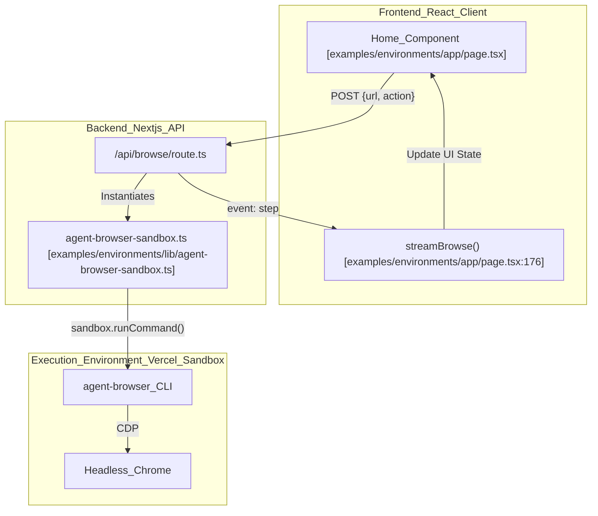
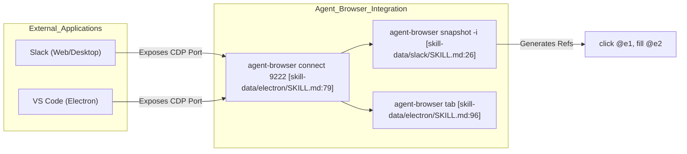

# Examples and Integrations

Relevant source files

The following files were used as context for generating this wiki page:

- [docs/src/app/next/page.mdx](docs/src/app/next/page.mdx)
- [examples/environments/.gitignore](examples/environments/.gitignore)
- [examples/environments/README.md](examples/environments/README.md)
- [examples/environments/app/page.tsx](examples/environments/app/page.tsx)
- [examples/environments/next.config.ts](examples/environments/next.config.ts)
- [skill-data/electron/SKILL.md](skill-data/electron/SKILL.md)
- [skill-data/slack/SKILL.md](skill-data/slack/SKILL.md)
- [skill-data/slack/references/slack-tasks.md](skill-data/slack/references/slack-tasks.md)
- [skill-data/slack/templates/slack-report-template.md](skill-data/slack/templates/slack-report-template.md)
- [skill-data/vercel-sandbox/SKILL.md](skill-data/vercel-sandbox/SKILL.md)

The `agent-browser` codebase provides a comprehensive suite of examples and integration patterns, primarily focused on running browser automation within ephemeral, high-performance environments like **Vercel Sandbox** and automating complex third-party applications like **Slack** or **Electron** apps. These examples demonstrate how to bridge the gap between a web application's backend and the `agent-browser` CLI to perform tasks like screenshotting, accessibility tree extraction, and multi-step interaction.

## Vercel Sandbox Integration

The primary integration pattern for `agent-browser` in serverless environments is via the **Vercel Sandbox**. This allows running a full Linux microVM on demand to execute `agent-browser` and headless Chrome without the constraints of Lambda binary size limits or complex Chromium bundling [docs/src/app/next/page.mdx:3-5]().

### Implementation Pattern: `withBrowser`

To manage the lifecycle of the sandbox and the browser, the integration uses a higher-order function pattern. This ensures that the sandbox is provisioned, dependencies are checked, and the VM is stopped after execution [docs/src/app/next/page.mdx:49-76](), [skill-data/vercel-sandbox/SKILL.md:47-75]().

**Data Flow: Sandbox Execution**

1.  **Provisioning**: The system checks for an `AGENT_BROWSER_SNAPSHOT_ID`. If present, it boots a pre-configured VM image via `Sandbox.create` with a `snapshot` source [docs/src/app/next/page.mdx:54-59](). If not, it creates a fresh `node24` runtime [docs/src/app/next/page.mdx:60]().
2.  **Dependency Injection**: On fresh sandboxes, the system must install `CHROMIUM_SYSTEM_DEPS` (e.g., `nss`, `libxkbcommon`, `gtk3`) via `dnf` before `agent-browser` can launch Chrome [docs/src/app/next/page.mdx:26-32](), [docs/src/app/next/page.mdx:63-66]().
3.  **Command Execution**: Commands are sent to the sandbox via `sandbox.runCommand("agent-browser", [...])` [docs/src/app/next/page.mdx:80-82]().
4.  **Cleanup**: The sandbox is explicitly stopped in a `finally` block to release resources [docs/src/app/next/page.mdx:71-75]().

### Sandbox Snapshots for Performance

A **Sandbox Snapshot** is a saved VM image containing the OS, system libraries, `agent-browser` binary, and Chromium [docs/src/app/next/page.mdx:112-116]().
*   **Cold Start (No Snapshot)**: ~30 seconds to install `dnf` packages and npm modules [examples/environments/README.md:23-25]().
*   **Warm Start (With Snapshot)**: Sub-second startup by booting directly from the saved image [docs/src/app/next/page.mdx:115-116]().
*   **Creation**: Snapshots are created using a helper script `scripts/create-snapshot.ts` which automates the `dnf install` and `npm install -g agent-browser` steps before saving the state [docs/src/app/next/page.mdx:125-133](), [skill-data/vercel-sandbox/SKILL.md:189-198]().

Sources: [docs/src/app/next/page.mdx:1-120](), [examples/environments/README.md:1-32](), [skill-data/vercel-sandbox/SKILL.md:166-198]()

## Demo Application: `examples/environments`

The `examples/environments` directory contains a production-grade Next.js application that demonstrates real-time browser automation with streaming feedback.

### Architecture and Data Flow

The demo app uses **Server-Sent Events (SSE)** to stream the progress of the browser agent from the Vercel Sandbox back to the React frontend [examples/environments/README.md:9-10]().

#### System Entity Mapping
The following diagram maps the high-level demo concepts to specific code entities and routes.

**Diagram: Demo Application Interaction Flow**

Sources: [examples/environments/app/page.tsx:176-229](), [examples/environments/README.md:47-62]()

### Key Integration Functions

The integration provides specific wrappers for common AI agent tasks:

| Task | Implementation Detail | Code Reference |
| :--- | :--- | :--- |
| **Screenshot** | Executes `screenshot --json`, retrieves path, and converts to Base64 via `base64 -w 0` | [docs/src/app/next/page.mdx:78-92](), [skill-data/vercel-sandbox/SKILL.md:83-103]() |
| **Accessibility Snapshot** | Executes `snapshot -i -c` to get an interactive, cleaned accessibility tree | [docs/src/app/next/page.mdx:94-106](), [skill-data/vercel-sandbox/SKILL.md:109-127]() |
| **Multi-Step Form** | Chains `open`, `snapshot`, `fill`, and `click` within a single `withBrowser` session | [skill-data/vercel-sandbox/SKILL.md:135-163]() |
| **Scheduled Monitoring** | Uses Vercel Cron Jobs to trigger `withBrowser` for recurring tasks | [docs/src/app/next/page.mdx:162-178]() |

### UI Implementation: Progress Streaming

The frontend uses a `streamBrowse` function that parses an SSE stream [examples/environments/app/page.tsx:176-229](). It looks for two types of events:
1.  `event: step`: Contains `StepInfo` (step name, status, elapsed time) to update the `StepIndicator` component [examples/environments/app/page.tsx:118-148](), [examples/environments/app/page.tsx:217-219]().
2.  `event: result`: Contains the final `BrowseResult` (screenshot or snapshot data) [examples/environments/app/page.tsx:219-221]().

Sources: [examples/environments/app/page.tsx:64-76](), [examples/environments/app/page.tsx:176-229]()

## Application Integrations

### Slack Automation
`agent-browser` can automate Slack by connecting to an existing session on port `9222` or opening `app.slack.com` [skill-data/slack/SKILL.md:13-21]().
*   **Task Patterns**: Includes specific workflows for checking unreads [skill-data/slack/references/slack-tasks.md:5-38](), finding channels [skill-data/slack/references/slack-tasks.md:46-81](), and searching messages [skill-data/slack/references/slack-tasks.md:84-128]().
*   **Data Extraction**: Uses `snapshot --json` to parse the sidebar tree and message blocks [skill-data/slack/references/slack-tasks.md:191-204]().
*   **Reporting**: Provides a `slack-report-template.md` for structured analysis of workspace activity [skill-data/slack/templates/slack-report-template.md:1-164]().

### Electron Desktop Apps
Since Electron apps are built on Chromium, they can be automated via the `--remote-debugging-port` flag [skill-data/electron/SKILL.md:32-34]().
*   **Connectivity**: Use `agent-browser connect <port>` to attach to running apps like VS Code, Discord, or Figma [skill-data/electron/SKILL.md:36-56]().
*   **Target Management**: The `agent-browser tab` command allows switching between the main window and embedded `<webview>` elements [skill-data/electron/SKILL.md:92-128]().

**Diagram: Application Automation Entity Mapping**

Sources: [skill-data/slack/SKILL.md:1-228](), [skill-data/electron/SKILL.md:1-237]()

## Integration Patterns

### Scheduled Workflows (Cron)
`agent-browser` can be integrated into Vercel Cron Jobs for recurring monitoring tasks. The pattern involves wrapping the logic in a Route Handler (e.g., `app/api/cron/monitor/route.ts`) that triggers the `withBrowser` utility [docs/src/app/next/page.mdx:162-178]().

### Authentication in Integrations
When running in Vercel, the Sandbox SDK uses OIDC for automatic authentication. For local development or external integrations, three environment variables are required [docs/src/app/next/page.mdx:143-152](), [examples/environments/README.md:36-41]():
*   `VERCEL_TOKEN`: Personal access token.
*   `VERCEL_TEAM_ID`: Target team.
*   `VERCEL_PROJECT_ID`: Target project.

Sources: [docs/src/app/next/page.mdx:138-156](), [examples/environments/README.md:34-46]()
