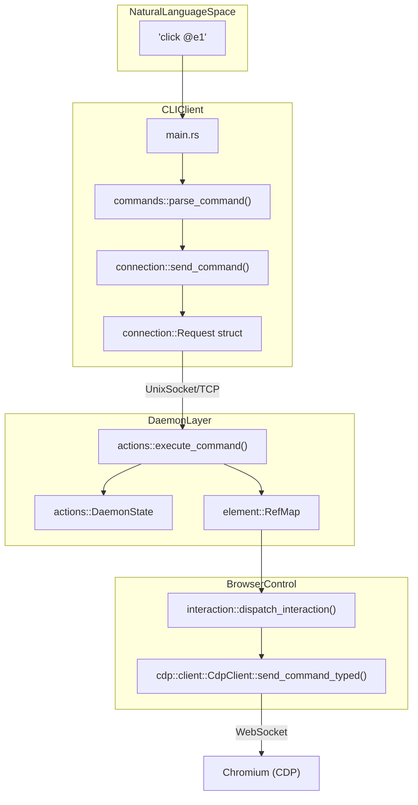
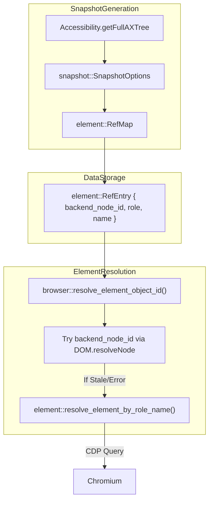

# Glossary

Relevant source files

The following files were used as context for generating this wiki page:

- [CHANGELOG.md](CHANGELOG.md)
- [README.md](README.md)
- [cli/src/connection.rs](cli/src/connection.rs)
- [cli/src/flags.rs](cli/src/flags.rs)
- [cli/src/main.rs](cli/src/main.rs)
- [cli/src/native/actions.rs](cli/src/native/actions.rs)
- [cli/src/native/browser.rs](cli/src/native/browser.rs)
- [cli/src/native/cdp/chrome.rs](cli/src/native/cdp/chrome.rs)
- [cli/src/native/cdp/client.rs](cli/src/native/cdp/client.rs)
- [cli/src/native/daemon.rs](cli/src/native/daemon.rs)
- [cli/src/native/e2e_tests.rs](cli/src/native/e2e_tests.rs)
- [cli/src/native/providers.rs](cli/src/native/providers.rs)
- [cli/src/output.rs](cli/src/output.rs)
- [docs/src/app/commands/page.mdx](docs/src/app/commands/page.mdx)
- [package.json](package.json)
- [skills/agent-browser/SKILL.md](skills/agent-browser/SKILL.md)

This glossary defines technical terms, jargon, and domain-specific concepts used within the `agent-browser` codebase. It provides a mapping between high-level concepts and the underlying Rust implementation.

## Core Domain Terms

### Session
A **Session** represents an isolated browser context. It manages its own cookies, localStorage, and browser metadata. Sessions can be ephemeral (default) or persistent.
*   **Implementation**: Managed within `DaemonState` [cli/src/native/actions.rs:17-18]().
*   **Persistent Sessions**: Triggered by the `--session-name` flag, which auto-saves/restores state to the local filesystem via `state_save` and `state_load` actions [cli/src/native/actions.rs:35-36]().
*   **Data Flow**: When a command is received, the `DaemonState` identifies the active session and routes CDP commands to the appropriate `CdpClient` [cli/src/native/actions.rs:17-18]().
*   **Stable Tab IDs**: Within a session, tabs are assigned stable identifiers like `t1`, `t2` that do not change when other tabs are closed [cli/src/native/browser.rs:178-180]().

### Ref (Element Reference)
A **Ref** is a stable, short-form identifier (e.g., `@e1`, `@e2`) used by AI agents to interact with elements without needing complex CSS or XPath selectors.
*   **Lifecycle**: Generated during a `snapshot` command [cli/src/native/snapshot.rs:34]().
*   **Mapping**: Stored in a `RefMap` which maps the ID to a `RefEntry` containing the `backend_node_id`, role, and accessible name [cli/src/native/element.rs:25]().
*   **Stale Ref Fallback**: If a `backend_node_id` becomes stale (e.g., after a DOM mutation), the system attempts to re-resolve the element using its cached role and name via `resolve_element_object_id` [cli/src/native/browser.rs:13]().

### Snapshot
A **Snapshot** is a serialized representation of the page's accessibility tree. It is the primary way AI agents "see" the page.
*   **Extraction**: Uses the CDP `Accessibility.getFullAXTree` command via `SnapshotOptions` [cli/src/native/snapshot.rs:34]().
*   **Filtering**: The system filters the raw tree to include only "interactive" or "content" roles to reduce LLM token usage.
*   **Enhanced Metadata**: Can include bounding boxes or annotations using the `--annotate` flag [cli/src/native/snapshot.rs:34]().

### Daemon
The **Daemon** is a long-running background process (implemented in Rust) that maintains the browser instance and manages IPC (Inter-Process Communication) via Unix sockets or TCP.
*   **Lifecycle**: Started automatically by `ensure_daemon` on the first command if not already running [cli/src/main.rs:27-30](). It uses `.pid` and `.sock` files in the socket directory to track liveness [cli/src/connection.rs:118-128]().
*   **State**: Held in `DaemonState`, which tracks the `BrowserManager`, `RefMap`, and active network/tracing states [cli/src/native/actions.rs:17-18]().

---

## Technical Architecture Diagrams

### From Natural Language to Code Entities (Interaction Flow)
The following diagram bridges the gap between a user command and the internal Rust structures that handle it.

**Sources**: [cli/src/main.rs:26-31](), [cli/src/connection.rs:22-27](), [cli/src/native/actions.rs:17-42](), [cli/src/native/cdp/client.rs:9-20]()

### Snapshot and Ref Resolution System
This diagram shows how the system translates a visual element into a stable Reference.

**Sources**: [cli/src/native/snapshot.rs:34](), [cli/src/native/element.rs:13-25](), [cli/src/native/browser.rs:13-14]()

---

## Glossary Table

| Term | Definition | Relevant Code |
| :--- | :--- | :--- |
| **CDP** | Chrome DevTools Protocol. The primary protocol used to control Chromium. | `cli/src/native/cdp/` |
| **CdpClient** | The Rust struct responsible for managing the WebSocket connection to the browser and dispatching commands. | `CdpClient` [cli/src/native/cdp/client.rs:9]() |
| **RefMap** | A collection of element references generated during a snapshot. | `RefMap` [cli/src/native/element.rs:25]() |
| **BackendNodeId** | An identifier provided by Chromium for a DOM node that is stable across some mutations but can become stale. | [cli/src/native/element.rs:13]() |
| **DomainFilter** | A security mechanism that allows/blocks navigation based on an allowlist. | `DomainFilter` [cli/src/native/network.rs:28]() |
| **ActionPolicy** | A configuration-driven system that determines if a specific action (like `click`) is permitted or requires confirmation. | `ActionPolicy` [cli/src/native/policy.rs:29]() |
| **HarEntry** | Metadata for a single network request/response, used to export HAR 1.2 files. | `HarEntry` [cli/src/native/actions.rs:67-93]() |
| **StreamServer** | A WebSocket server within the daemon that streams screencasts and browser events to the dashboard. | `StreamServer` [cli/src/native/stream.rs:37]() |
| **Boundary Nonce** | A CSPRNG-generated token used to wrap untrusted page content in CLI output to prevent LLM prompt injection. | `get_boundary_nonce` [cli/src/output.rs:11-17]() |
| **ChromeProcess** | Wrapper for the spawned Chromium child process, managing its lifecycle and process group. | `ChromeProcess` [cli/src/native/cdp/chrome.rs:8]() |
| **WaitUntil** | Strategy for determining when a page navigation is complete (e.g., `Load`, `NetworkIdle`). | `WaitUntil` [cli/src/native/browser.rs:15]() |
| **TabRef** | A reference to a browser tab, either by stable ID (e.g., `t1`) or user-assigned label. | `TabRef` [cli/src/native/browser.rs:185-188]() |
| **LaunchOptions** | Configuration struct for browser startup parameters (headless, proxy, user-data-dir, etc.). | `LaunchOptions` [cli/src/native/cdp/chrome.rs:90-113]() |
| **Auth Vault** | AES-256-GCM encrypted storage for user credentials, used by `auth_login`. | [cli/src/native/auth.rs:14]() |
| **Skill** | A packaged set of instructions and metadata (YAML + Markdown) that teaches an AI agent how to perform specific tasks. | [cli/src/skills.rs:10]() |

## Abbreviation Key
*   **AX**: Accessibility (as in AXTree).
*   **CDP**: Chrome DevTools Protocol.
*   **IPC**: Inter-Process Communication.
*   **SPA**: Single Page Application (relevant for `pushstate` and `auth_login` wait strategies [cli/src/native/actions.rs:52](), [CHANGELOG.md:44]()).
*   **CSPRNG**: Cryptographically Secure Pseudo-Random Number Generator (used for output boundaries [cli/src/output.rs:8-10]()).
*   **LCP/CLS/TTFB**: Core Web Vitals metrics reported by the `vitals` command [CHANGELOG.md:43]().

**Sources**:
- Definitions: [cli/src/native/actions.rs:61-200](), [cli/src/native/element.rs:1-25](), [cli/src/native/snapshot.rs:1-35](), [cli/src/output.rs:1-35](), [cli/src/connection.rs:1-180]()
- Implementation details: [cli/src/native/interaction.rs:1-20](), [cli/src/native/cdp/chrome.rs:1-113](), [cli/src/native/browser.rs:1-190](), [CHANGELOG.md:3-80]()
