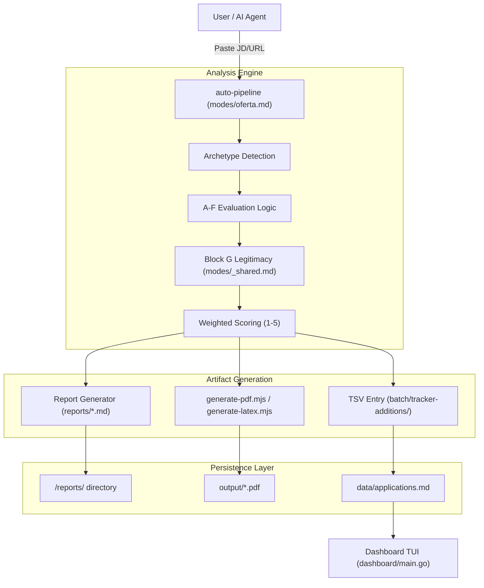
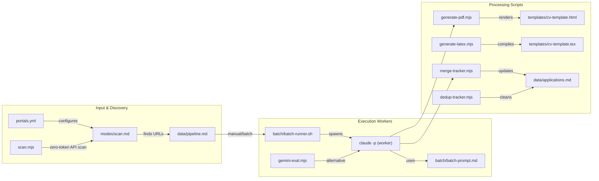

# Career-Ops Overview

Relevant source files

The following files were used as context for generating this wiki page:

- [.release-please-manifest.json](.release-please-manifest.json)
- [AGENTS.md](AGENTS.md)
- [CHANGELOG.md](CHANGELOG.md)
- [CLAUDE.md](CLAUDE.md)
- [README.es.md](README.es.md)
- [README.md](README.md)
- [modes/tr/README.md](modes/tr/README.md)
- [modes/tr/_shared.md](modes/tr/_shared.md)
- [modes/tr/basvuru.md](modes/tr/basvuru.md)
- [modes/tr/is-ilani.md](modes/tr/is-ilani.md)
- [modes/tr/pipeline.md](modes/tr/pipeline.md)
- [package.json](package.json)

Career-Ops is an AI-powered job search command center built on top of **Claude Code** and other AI coding CLIs. It transforms the manual, often overwhelming process of job hunting into a structured, automated pipeline. The system is designed for high-quality, targeted applications rather than "spray-and-pray" volume, using a sophisticated A-G scoring logic to ensure a genuine match between the candidate and the role.

The project was originally developed to manage a high-scale search involving 740+ evaluations and 100+ tailored CVs [README.md:41-44](), [AGENTS.md:3-5]().

## Core Philosophy: Quality via Automation

The system operates on three primary pillars:
1.  **Deep Evaluation**: Every job description (JD) is analyzed across 10 weighted dimensions to produce a score from 1.0 to 5.0, plus a qualitative legitimacy assessment (Block G) [README.md:48-58](), [modes/tr/_shared.md:26-47]().
2.  **Tailored Artifacts**: Instead of a generic resume, the system generates ATS-optimized PDFs or LaTeX documents customized specifically for the target JD using a keyword-injection engine [README.md:71-74](), [package.json:11-11]().
3.  **Data Integrity**: A flat-file "database" (`data/applications.md`) serves as the single source of truth, maintained by a suite of Node.js scripts to ensure consistency, deduplication, and status normalization [package.json:7-10](), [AGENTS.md:50-56]().

Sources: [README.md:48-64](), [AGENTS.md:3-11](), [package.json:5-19]()

## System Topology

The following diagram illustrates how a user interaction (pasting a URL) flows through the subsystems to produce structured data and documents.

### High-Level Data Flow (Natural Language to Code Space)

Sources: [README.md:128-144](), [AGENTS.md:72-115](), [modes/tr/is-ilani.md:12-150]()

## Subsystem Interaction (Code Entity Space)

This diagram maps the logical functions to the specific files and scripts that execute them within the codebase.

### Code Entity Map

Sources: [package.json:5-19](), [AGENTS.md:49-70](), [README.md:116-127]()

## Major Subsystems

### 1. AI Agent Modes (`/modes`)
The intelligence of the system is contained in Markdown "skill" files. These files define how the AI behaves when specific commands are invoked.
*   **Evaluation**: `oferta.md` (or `is-ilani.md` in TR) handles single analysis, including the 7-block A-G structure [modes/tr/is-ilani.md:1-150]().
*   **Discovery**: `scan.md` and `scan.mjs` find new roles based on `portals.yml` [AGENTS.md:56-67]().
*   **Action**: `apply.md` (form filling assistant) and `contacto.md` (LinkedIn outreach) handle external steps [modes/tr/basvuru.md:1-21]().
*   **Context**: `_shared.md` contains the core archetypes and scoring weights, while `_profile.md` holds user-specific customizations to prevent overwrite during updates [AGENTS.md:11-23]().

### 2. Batch Processing (`/batch`)
For high-volume processing, the system uses an orchestrator/worker architecture. `batch-runner.sh` manages multiple `claude -p` instances, each running the `batch-prompt.md` logic to evaluate dozens of offers in parallel and generate reports/PDFs automatically [AGENTS.md:59-60](), [CHANGELOG.md:43-43]().

### 3. Generation Engine
The system supports two output paths for CVs:
*   **HTML/PDF**: `generate-pdf.mjs` uses Playwright to render `templates/cv-template.html` [package.json:11-11]().
*   **LaTeX**: `generate-latex.mjs` uses `pdflatex` or `tectonic` to compile `templates/cv-template.tex` [CHANGELOG.md:51-52]().
The choice is controlled by `cv.output_format` [CHANGELOG.md:57-57]().

### 4. Data Management & TUI
The `data/` directory stores the pipeline state. Because this is a flat-file system, integrity scripts like `merge-tracker.mjs`, `dedup-tracker.mjs`, and `normalize-statuses.mjs` are used to maintain the `applications.md` database [package.json:7-10](). The **Dashboard TUI**, written in Go, provides a terminal interface for filtering and sorting this data [README.md:77-77]().

### 5. Interview Intelligence (`/interview-prep`)
This subsystem accumulates STAR+Reflection stories in `story-bank.md` across multiple evaluations [AGENTS.md:62-62](). The `deep.md` mode generates company-specific intelligence reports for interview preparation [AGENTS.md:63-63]().

## Child Pages

For detailed technical documentation on specific components, see the following pages:

*   **[Getting Started & Setup](#1.1)**: Installation (Node, Go, Playwright) and the initial onboarding flow (CV and Profile setup).
*   **[Configuration Reference](#1.2)**: Detailed breakdown of `profile.yml`, `portals.yml`, and the `DATA_CONTRACT.md` boundary.
*   **[Examples & Sample Files](#1.3)**: Walkthrough of sample CVs, evaluations, and proof point formats.

Sources: [README.md:81-114](), [AGENTS.md:72-134](), [CHANGELOG.md:1-57]()
