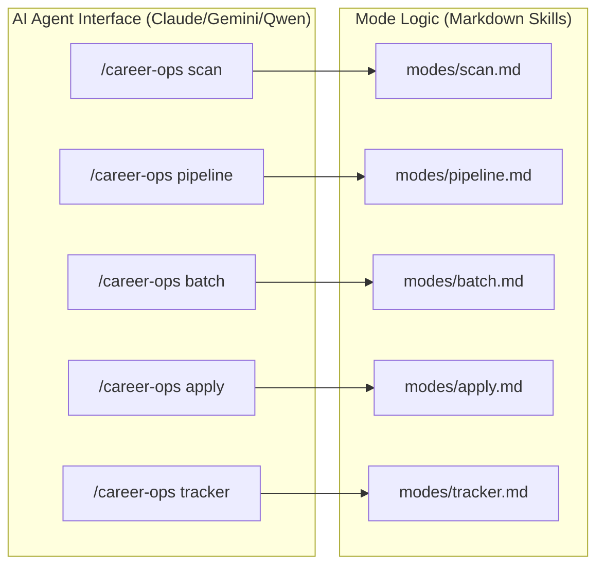

# Getting Started & Setup

<details>
<summary>Relevant source files</summary>

The following files were used as context for generating this wiki page:

- [.envrc](.envrc)
- [.github/PULL_REQUEST_TEMPLATE.md](.github/PULL_REQUEST_TEMPLATE.md)
- [.github/SECURITY.md](.github/SECURITY.md)
- [.gitignore](.gitignore)
- [CONTRIBUTING.md](CONTRIBUTING.md)
- [LEGAL_DISCLAIMER.md](LEGAL_DISCLAIMER.md)
- [README.es.md](README.es.md)
- [README.md](README.md)
- [TRADEMARK.md](TRADEMARK.md)
- [doctor.mjs](doctor.mjs)
- [flake.lock](flake.lock)
- [flake.nix](flake.nix)

</details>


This page provides a comprehensive technical guide for initializing the `career-ops` pipeline. It covers dependency management, configuration of personal identity files, and the validation suite used to ensure the AI agent has a consistent "source of truth" for evaluations.

## System Prerequisites

Before installation, ensure the following environments are available:

*   **Claude Code / Gemini CLI / OpenCode**: The core execution engine. `career-ops` is built as a suite of specialized prompts and scripts that extend these AI agents [README.md:16-19](), [README.md:116-118]().
*   **Node.js (v18+)**: Required for running utility scripts (merging, deduping, verifying) and the PDF generation engine [doctor.mjs:21-31]().
*   **Playwright**: Used by `generate-pdf.mjs` and the `apply` mode to interact with web browsers [README.md:87-87](), [doctor.mjs:44-63]().
*   **Go (v1.22+)**: Required for building and running the Terminal User Interface (TUI) dashboard [README.md:21-21](), [CONTRIBUTING.md:65-67]().

Sources: [README.md:16-22](), [doctor.mjs:21-63](), [CONTRIBUTING.md:65-67]()

## Installation Workflow

The setup follows a 6-step process to transition from a clean clone to a functional AI job-search agent.

### 1. Clone and Dependency Resolution
The project uses `npm` for managing Node.js dependencies and `npx` for Playwright's browser binaries.

```bash
git clone https://github.com/santifer/career-ops.git
cd career-ops && npm install
npx playwright install chromium
```
Sources: [README.md:83-87](), [doctor.mjs:33-63]()

### 2. Environment Validation
The `doctor.mjs` script automates the verification of the local environment.

```bash
npm run doctor
```
Sources: [README.md:90-90](), [doctor.mjs:1-10]()

### 3. Identity Configuration
The system relies on `config/profile.yml` to define candidate identity, target roles, and compensation. This file is excluded from git via `.gitignore` to protect PII [README.md:92-93](), [.gitignore:24-24]().

```bash
cp config/profile.example.yml config/profile.yml
```
Sources: [README.md:93-93](), [doctor.mjs:79-91]()

### 4. Establishing the Source of Truth
`cv.md` serves as the primary context for all AI evaluations and PDF generation. It must be created in the project root [README.md:96-97]().

```bash
# Create cv.md in the project root with your CV in markdown
```
Sources: [README.md:97-97](), [doctor.mjs:65-77]()

### 5. Portal Scanner Setup
To use the `/career-ops scan` command, you must configure `portals.yml`. This file defines the keywords used to filter job titles and the specific companies to track [README.md:94-94]().

```bash
cp templates/portals.example.yml portals.yml
```
Sources: [README.md:94-94](), [doctor.mjs:93-105]()

### 6. Personalization
Once configured, the user should ask the AI agent (e.g., Claude Code) to adapt the system by reading the newly created files [README.md:99-106]().

## Data Flow & Entity Mapping

The following diagram illustrates how configuration files and scripts interact to prepare the system for its first evaluation.

### Setup Data Flow: From Config to Execution
```mermaid
graph TD
    subgraph "Natural Language Space (Input)"
        CV["cv.md (Source of Truth)"]
        Profile["config/profile.yml (Identity)"]
        Portals["portals.yml (Search Filters)"]
    end

    subgraph "Code Entity Space (Validation & Execution)"
        Doctor["doctor.mjs"]
        SyncCheck["cv-sync-check.mjs"]
        UpdateSys["update-system.mjs"]
        ClaudeCode["Claude Code Agent"]
    end

    CV --> Doctor
    Profile --> Doctor
    Portals --> ClaudeCode
    
    Doctor -- "Validates Prereqs" --> SyncCheck
    SyncCheck -- "Validates Required Fields" --> Profile
    SyncCheck -- "Checks Content Length" --> CV
    
    UpdateSys -- "Enforces" --> DataContract["DATA_CONTRACT.md"]
    DataContract -- "Protects" --> CV
    DataContract -- "Protects" --> Profile
end
```
Sources: [doctor.mjs:152-194](), [README.md:100-110](), [CONTRIBUTING.md:58-67]()

## Health Checks & System Maintenance

`career-ops` includes a specialized validation suite to ensure environment readiness and data integrity.

### Setup Validation (doctor.mjs)
The `npm run doctor` command executes `doctor.mjs`, which provides a pass/fail checklist for:
*   Node.js version compatibility [doctor.mjs:21-31]().
*   Presence of `node_modules` and Playwright Chromium binaries [doctor.mjs:33-63]().
*   Existence of required user files (`cv.md`, `config/profile.yml`, `portals.yml`) [doctor.mjs:65-105]().
*   Readiness of data directories (`data/`, `output/`, `reports/`) [doctor.mjs:135-150]().

### Auto-Update System (update-system.mjs)
To keep system logic current while protecting user data, `update-system.mjs` enforces the boundary defined in `DATA_CONTRACT.md`. It supports `check`, `apply`, `rollback`, and `dismiss` commands to manage updates safely without overwriting personal configurations like `cv.md` or `profile.yml`.

### Execution Table
| Command | Script | Purpose |
| :--- | :--- | :--- |
| `npm run doctor` | `doctor.mjs` | Full environment prerequisite check [doctor.mjs:4-6]() |
| `node cv-sync-check.mjs` | `cv-sync-check.mjs` | Validates CV and Profile consistency [CONTRIBUTING.md:62-62]() |
| `node verify-pipeline.mjs` | `verify-pipeline.mjs` | Health check for the application data layer [CONTRIBUTING.md:61-61]() |
| `node update-system.mjs` | `update-system.mjs` | Managed system updates following the Data Contract |

Sources: [doctor.mjs:152-182](), [CONTRIBUTING.md:58-67](), [.gitignore:27-28]()

## Slash Commands Overview

Once setup is verified, the system is controlled via `/career-ops` commands within the AI agent interface.

### Command Mapping to Code Entities

Sources: [README.es.md:111-124](), [CONTRIBUTING.md:36-40]()

### Command Reference
*   **Evaluate Offer**: Triggered by pasting a URL or JD text. Executes the full evaluation pipeline [README.es.md:115-115]().
*   **`/career-ops scan`**: Uses `portals.yml` to discover new job postings [README.es.md:116-116]().
*   **`/career-ops pipeline`**: Processes URLs queued in `data/pipeline.md` [README.es.md:121-121]().
*   **`/career-ops pdf`**: Generates an ATS-optimized CV [README.es.md:117-117]().
*   **`/career-ops batch`**: Orchestrates high-volume evaluations [README.es.md:118-118]().
*   **`/career-ops tracker`**: Views and manages application statuses [README.es.md:119-119]().
*   **`/career-ops apply`**: Launches the AI-powered form-filling assistant [README.es.md:120-120]().

Sources: [README.es.md:111-124](), [README.md:68-80]()
