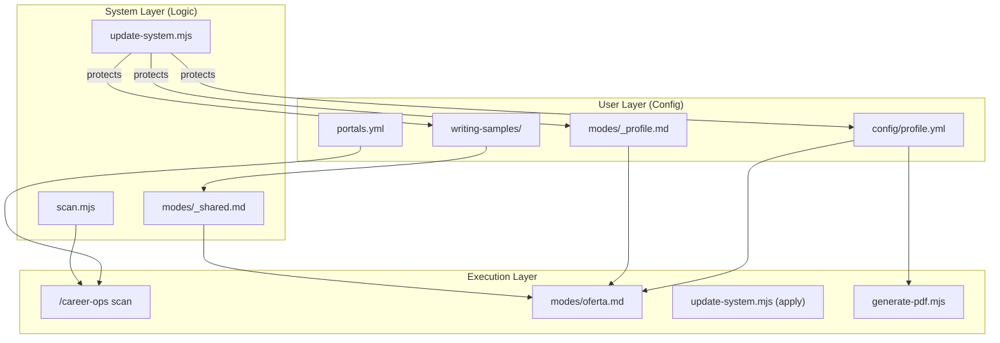
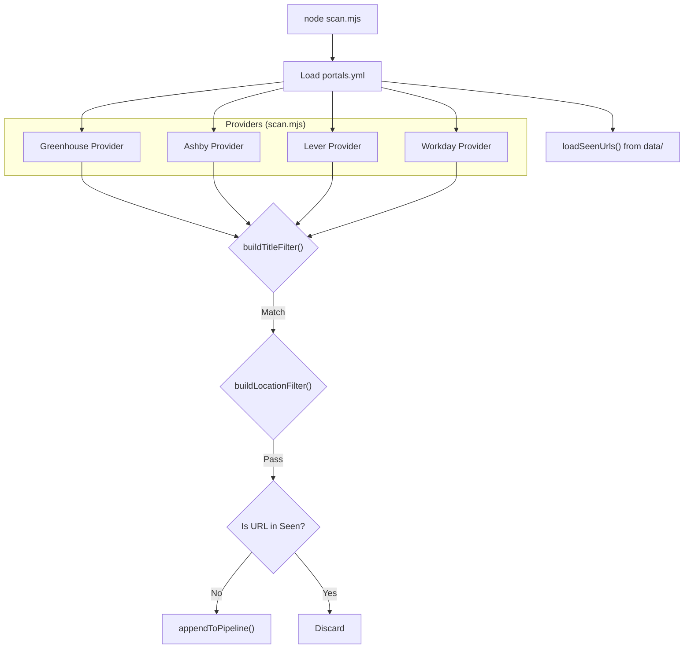
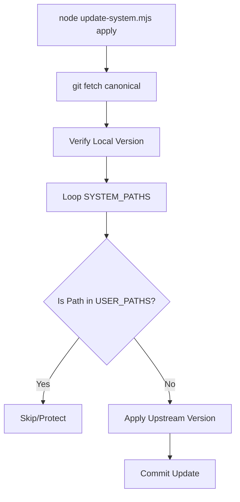

# Configuration Reference

Relevant source files

The following files were used as context for generating this wiki page:

- [DATA_CONTRACT.md](DATA_CONTRACT.md)
- [config/profile.example.yml](config/profile.example.yml)
- [docs/CUSTOMIZATION.md](docs/CUSTOMIZATION.md)
- [modes/_shared.md](modes/_shared.md)
- [modes/auto-pipeline.md](modes/auto-pipeline.md)
- [modes/pdf.md](modes/pdf.md)
- [modes/scan.md](modes/scan.md)
- [scan.mjs](scan.mjs)
- [templates/cv-template.html](templates/cv-template.html)
- [templates/portals.example.yml](templates/portals.example.yml)
- [update-system.mjs](update-system.mjs)
- [writing-samples/README.md](writing-samples/README.md)

This page provides a detailed technical reference for the configuration layer of Career-Ops. The system uses a "Configuration-as-Data" approach where YAML files define the candidate's identity, search parameters for discovery agents, and the state machine for the application pipeline.

## System Configuration Flow

The configuration files act as the primary context providers for the AI agents (`modes/`) and the data validation rules for the processing scripts. The architecture enforces a strict boundary between the **System Layer** (logic and templates) and the **User Layer** (personal data and customizations) to ensure safe updates.

### Configuration Ingestion Map
The following diagram illustrates how configuration files are ingested by different system components and how they relate to code entities.

**Configuration Ingestion Map**

Sources: [DATA_CONTRACT.md:5-24](), [update-system.mjs:31-105](), [modes/_shared.md:11-24](), [scan.mjs:37-43]()

---

## 1. Candidate Profile (`config/profile.yml`)

The `config/profile.yml` file is the "Single Source of Truth" for the candidate's professional identity. It is utilized by the `oferta`, `auto-pipeline`, and `pdf` modes to score job matches and generate tailored CVs.

### Key Schema Entities

| Section | Code Impact | Description |
|:---|:---|:---|
| `candidate` | `modes/pdf.md` | Personal contact details (Name, LinkedIn, Portfolio) injected into `templates/cv-template.html` [modes/pdf.md:66-79](). |
| `target_roles` | `modes/oferta.md` | Defines "North Star" roles used to calculate "North Star alignment" score [modes/_shared.md:34](). |
| `narrative` | `modes/pdf.md` | Provides the `exit_story` used to rewrite the Professional Summary [modes/pdf.md:13](). |
| `compensation` | `modes/oferta.md` | Sets `target_range` and `minimum` for Block D (Comp Research) [config/profile.example.yml:55-59](). |
| `cv.output_format` | `modes/auto-pipeline.md` | Routes the generation pipeline to either `modes/pdf.md` (HTML) or `modes/latex.md` [modes/auto-pipeline.md:30-33](). |

### Implementation Detail: The User Layer
As defined in `DATA_CONTRACT.md`, `config/profile.yml` is a core part of the **User Layer** [DATA_CONTRACT.md:12](). The `update-system.mjs` script explicitly includes this path in the `USER_PATHS` array [update-system.mjs:95]() to ensure that update operations never overwrite personal identity data.

Sources: [docs/CUSTOMIZATION.md:3-13](), [update-system.mjs:92-105](), [DATA_CONTRACT.md:5-15](), [modes/pdf.md:64-94]()

---

## 2. Portal Scanner Configuration (`portals.yml`)

The `portals.yml` file (copied from `templates/portals.example.yml`) configures the discovery engine.

### Discovery Strategies
The system uses two distinct scanner implementations:
1.  **Zero-Token Scanner (`scan.mjs`)**: A high-speed Node.js script that queries public APIs (Greenhouse, Ashby, Lever, Workday) without consuming AI tokens [scan.mjs:3-20]().
2.  **Agentic Scanner (`modes/scan.md`)**: A Playwright-based strategy used by the AI agent for deep discovery on complex SPAs or when APIs are unavailable [modes/scan.md:26-49]().

### Filtering Logic
Both implementations share the filtering logic defined in `portals.yml`:
*   **Title Filter**: Uses `positive` and `negative` keywords to determine relevance [scan.mjs:106-116]().
*   **Location Filter**: A tiered logic where `block` keywords take precedence over `allow` keywords [scan.mjs:127-139]().

**Scanner Logic Flow**

Sources: [templates/portals.example.yml:1-58](), [scan.mjs:106-188](), [modes/scan.md:26-68]()

---

## 3. Global Context and Rules (`modes/_shared.md`)

`modes/_shared.md` acts as the system-level configuration for AI behavior. It defines the scoring rubric, archetype detection rules, and writing style calibration.

### Scoring System
The evaluation engine uses a standardized 1-5 scale across 6 dimensions (A-F), with a qualitative "Posting Legitimacy" check (Block G) [modes/_shared.md:29-54]().

### Archetype Detection
The system maps job descriptions to specific archetypes (e.g., `AI Platform`, `Agentic / Automation`) to adapt the framing of the CV and cover letter [modes/_shared.md:74-87]().

### Writing Style Calibration
The system can ingest user-provided samples from the `writing-samples/` directory to mirror the candidate's voice [modes/_shared.md:138-144]().
*   **Source**: Files in `writing-samples/` (excluding `README.md`) [modes/_shared.md:141]().
*   **Persistence**: Once calibrated, the style is cached in `modes/_profile.md` to avoid redundant scans [modes/_shared.md:140]().

Sources: [modes/_shared.md:1-144](), [writing-samples/README.md:1-22]()

---

## 4. System vs. User Layer (`DATA_CONTRACT.md`)

The `DATA_CONTRACT.md` file defines the technical boundary for the `update-system.mjs` script, which enforces a strict separation of concerns.

*   **System Layer**: Contains logic (`*.mjs`), AI instructions (`modes/`), templates (`templates/`), and dashboard code (`dashboard/`). These are safe to auto-update [DATA_CONTRACT.md:26-66]().
*   **User Layer**: Contains personal data like `cv.md`, `config/profile.yml`, and tracking data in `data/`. These are never modified by the system [DATA_CONTRACT.md:5-25]().

**Update Safety Mechanism**

Sources: [DATA_CONTRACT.md:1-72](), [update-system.mjs:31-105](), [update-system.mjs:156-242]()
