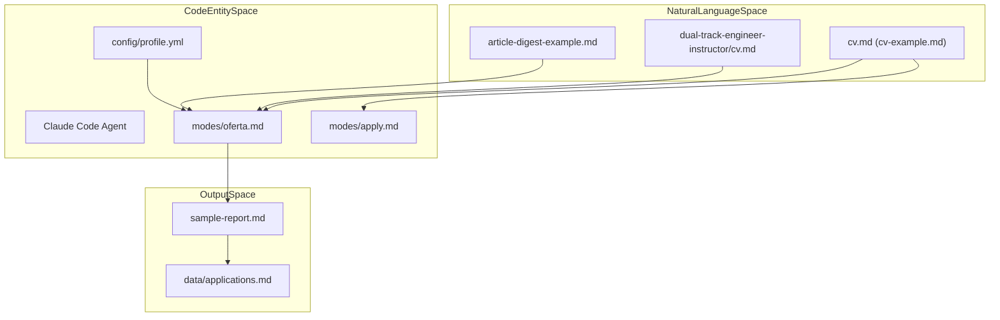
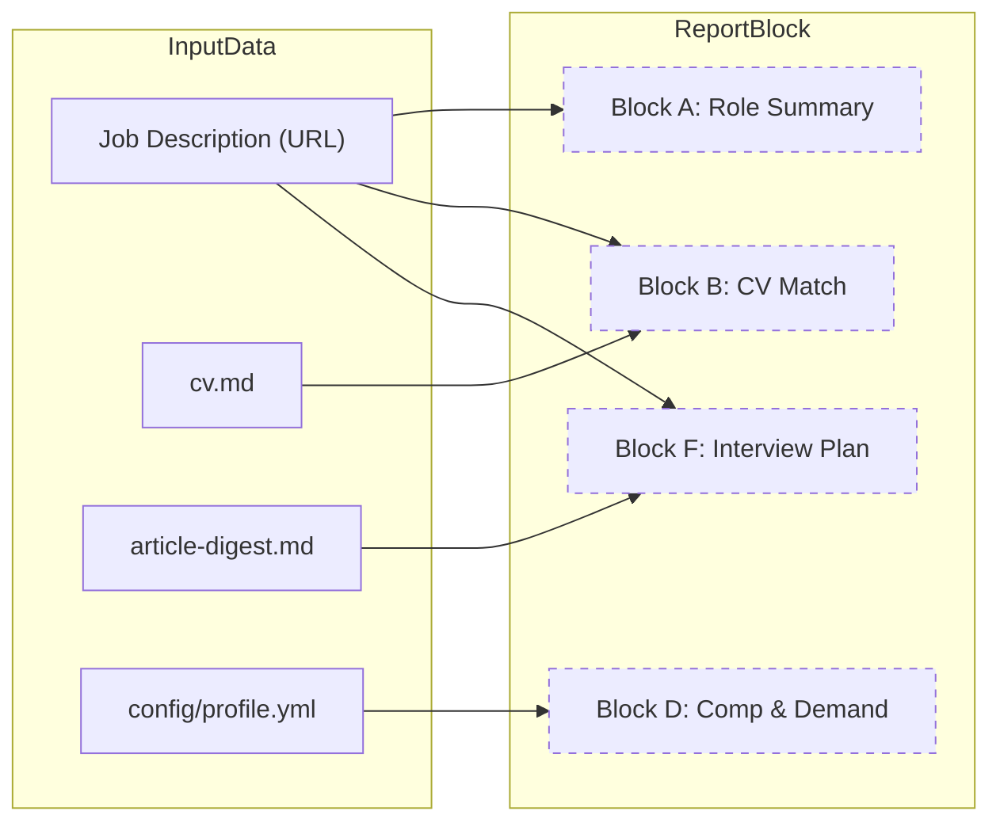

# Examples & Sample Files

Relevant source files

The following files were used as context for generating this wiki page:

- [examples/article-digest-example.md](examples/article-digest-example.md)
- [examples/cv-example.md](examples/cv-example.md)
- [examples/dual-track-engineer-instructor/README.md](examples/dual-track-engineer-instructor/README.md)
- [examples/dual-track-engineer-instructor/cv.md](examples/dual-track-engineer-instructor/cv.md)
- [examples/dual-track-engineer-instructor/profile.yml](examples/dual-track-engineer-instructor/profile.yml)
- [examples/sample-report.md](examples/sample-report.md)

This page provides a technical walkthrough of the reference files located in the `examples/` directory. These files serve as the structural blueprints for the Career-Ops system, defining the expected schema for candidate data, project evidence, and the final evaluation output generated by the AI agents.

## 1. Overview of the Examples Directory

The `examples/` directory contains files that demonstrate the data flow from raw candidate information to a structured evaluation report. It includes both single-track and dual-track career examples.

| File | Role | Format | Usage |
|:---|:---|:---|:---|
| `cv-example.md` | Source of Truth | Markdown | Input for `oferta` and `apply` modes [examples/cv-example.md:1-49](). |
| `article-digest-example.md` | Evidence Bank | Markdown | Contextual "Proof Points" for deep evaluations [examples/article-digest-example.md:1-41](). |
| `sample-report.md` | Output Schema | Markdown | The canonical A-F evaluation structure [examples/sample-report.md:1-76](). |
| `dual-track-engineer-instructor/` | Advanced Config | Directory | Reference for candidates with two primary archetypes [examples/dual-track-engineer-instructor/README.md:1-22](). |

### Data Flow Architecture
The following diagram illustrates how these example files relate to the core system entities and processing modes.

**Diagram: Example File Integration**

Sources: [examples/cv-example.md:1-49](), [examples/article-digest-example.md:1-41](), [examples/sample-report.md:1-76](), [examples/dual-track-engineer-instructor/README.md:1-22]()

---

## 2. CV Structure (`cv-example.md` & `cv.md`)

The system uses Markdown-based CVs as the primary context for matching skills against Job Descriptions (JDs).

### Key Components
*   **Header Metadata:** Contains contact information and social links used by the `apply` mode to fill web forms [examples/cv-example.md:1-8]().
*   **Professional Summary:** A high-level narrative that the `oferta` mode uses to determine the "Candidate's natural level" [examples/cv-example.md:9-11]().
*   **Work Experience:** Bulleted lists of achievements. The system parses these to find specific "Source" citations for the CV Match block [examples/cv-example.md:13-32]().
*   **Dual-Track Variant:** For candidates with hybrid roles (e.g., Engineer + Instructor), the `cv.md` in `examples/dual-track-engineer-instructor/` demonstrates a "Layered" approach, naming both tracks in the summary and mixing bullets within roles [examples/dual-track-engineer-instructor/cv.md:1-11](), [examples/dual-track-engineer-instructor/README.md:51-57]().

Sources: [examples/cv-example.md:1-49](), [examples/dual-track-engineer-instructor/cv.md:1-81]()

---

## 3. Article Digest & Proof Points (`article-digest-example.md`)

The `article-digest-example.md` serves as a "Story Bank" or "Evidence Bank." While `cv.md` is optimized for brevity, the digest provides the "Proof Points" required for Block F (Interview Plan) of the evaluation.

### Implementation Detail: The "Hero Metrics" Pattern
Each project in the digest follows a specific pattern:
1.  **Hero Metrics:** Quantifiable impact (e.g., "99.7% precision", "$2M/year saved") [examples/article-digest-example.md:9]().
2.  **Architecture:** Technical stack and data flow (e.g., "Kafka Streams → XGBoost") [examples/article-digest-example.md:11]().
3.  **Key Decisions:** Trade-off analysis (e.g., "streaming over batch") [examples/article-digest-example.md:13-16]().
4.  **Proof Points:** External validation (GitHub stars, conference talks) [examples/article-digest-example.md:18-22]().

The `oferta` mode pulls from this file to generate STAR (Situation, Task, Action, Result) stories in the final report [examples/sample-report.md:64-68]().

Sources: [examples/article-digest-example.md:1-41](), [examples/sample-report.md:64-68]()

---

## 4. The A-F Evaluation Report (`sample-report.md`)

The `sample-report.md` is a representative output of the `oferta` or `auto-pipeline` modes. It demonstrates the 6-block evaluation structure used to score a job opportunity.

### Block-by-Block Technical Breakdown

| Block | Title | Code Entity / Purpose |
|:---|:---|:---|
| **A** | **Role Summary** | Extracts Archetype, Seniority, and "TL;DR" from JD [examples/sample-report.md:11-21](). |
| **B** | **CV Match** | A mapping table between JD requirements and `cv.md` line items [examples/sample-report.md:23-31](). |
| **C** | **Level & Strategy** | Compares "Detected level" vs "Natural level" to create a "Sell Plan" [examples/sample-report.md:39-45](). |
| **D** | **Comp & Demand** | Market research data points (e.g., Levels.fyi ranges) [examples/sample-report.md:46-52](). |
| **E** | **Personalization** | Proposed edits to the CV to maximize ATS and recruiter match [examples/sample-report.md:54-61](). |
| **F** | **Interview Plan** | STAR stories mapped to JD requirements [examples/sample-report.md:62-70](). |

### System Name Mapping
The following diagram maps the logical sections of the report to the data sources and processing logic.

**Diagram: Report Data Mapping**

Sources: [examples/sample-report.md:1-76](), [examples/cv-example.md:1-49](), [examples/article-digest-example.md:1-41](), [examples/dual-track-engineer-instructor/profile.yml:91-109]()

---

## 5. Dual-Track Configuration (`profile.yml`)

The `examples/dual-track-engineer-instructor/profile.yml` demonstrates how to configure the system for candidates pursuing multiple career paths simultaneously.

*   **Archetypes:** Defines multiple `fit: primary` entries. The evaluator (`oferta` mode) picks the one closest to the JD [examples/dual-track-engineer-instructor/profile.yml:22-39]().
*   **Alternate Ranges:** Provides distinct compensation targets for different tracks (e.g., "teaching" vs "engineering") via the `alternate_ranges` block [examples/dual-track-engineer-instructor/profile.yml:98-108]().
*   **Narrative:** A combined headline and exit story that bridges the two tracks into a single value proposition [examples/dual-track-engineer-instructor/profile.yml:56-60]().

### Handling Objections
The dual-track example includes a `README.md` that serves as a playbook for handling interview objections triggered by a hybrid CV, such as concerns over being overqualified or "why not just pick one?" [examples/dual-track-engineer-instructor/README.md:66-87]().

Sources: [examples/dual-track-engineer-instructor/profile.yml:1-116](), [examples/dual-track-engineer-instructor/README.md:1-107]()
