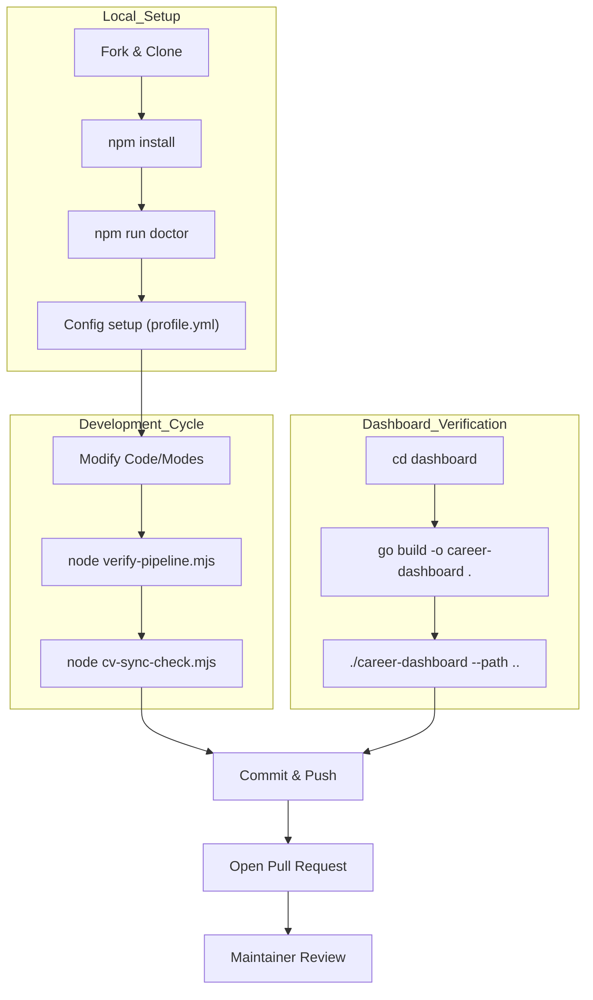
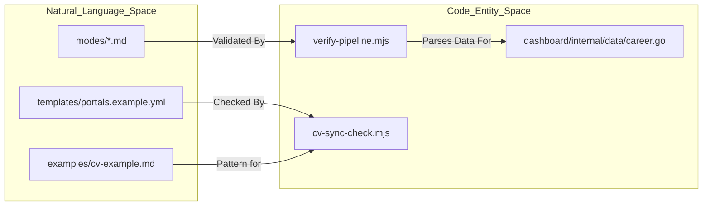

# Contributing & Community

Relevant source files

The following files were used as context for generating this wiki page:

- [.github/FUNDING.yml](.github/FUNDING.yml)
- [.github/ISSUE_TEMPLATE/bug_report.yml](.github/ISSUE_TEMPLATE/bug_report.yml)
- [.github/ISSUE_TEMPLATE/config.yml](.github/ISSUE_TEMPLATE/config.yml)
- [.github/ISSUE_TEMPLATE/feature_request.yml](.github/ISSUE_TEMPLATE/feature_request.yml)
- [.github/ISSUE_TEMPLATE/i-got-hired.yml](.github/ISSUE_TEMPLATE/i-got-hired.yml)
- [CITATION.cff](CITATION.cff)
- [CODE_OF_CONDUCT.md](CODE_OF_CONDUCT.md)
- [CONTRIBUTING.md](CONTRIBUTING.md)
- [CONTRIBUTORS.md](CONTRIBUTORS.md)
- [GOVERNANCE.md](GOVERNANCE.md)
- [LEGAL_DISCLAIMER.md](LEGAL_DISCLAIMER.md)
- [SECURITY.md](SECURITY.md)
- [SUPPORT.md](SUPPORT.md)
- [TRADEMARK.md](TRADEMARK.md)

This page outlines the protocols and technical workflows for contributing to the Career-Ops ecosystem. It covers the standard fork/PR process, development environment verification, governance models, and specific areas where community contributions are prioritized.

## Contribution Workflow

Career-Ops follows a standard GitHub flow. Contributors are encouraged to use AI-assisted engineering tools like `claude code` for development, as the project's prompt engineering and script structure are optimized for these environments [CONTRIBUTING.md:1-3]().

### Standard PR Process
1.  **Open an Issue**: Before coding, discuss the change in an issue to align with project architecture [CONTRIBUTING.md:7-9]().
2.  **Fork**: Create a personal fork of the repository [CONTRIBUTING.md:20]().
3.  **Branch**: Create a feature branch (e.g., `feature/my-feature`) [CONTRIBUTING.md:21]().
4.  **Develop**: Implement changes following the project's minimal and simple philosophy [CONTRIBUTING.md:15]().
5.  **Verify**: Test changes with a fresh clone and run the full test suite [CONTRIBUTING.md:23]().
6.  **Submit**: Open a Pull Request referencing the original issue [CONTRIBUTING.md:25]().

### Development Health Checks
Before submitting a PR, contributors must ensure all local validations pass. The `package.json` defines several scripts for this purpose.

*   `npm run doctor`: Validates the local environment setup [CONTRIBUTING.md:60]().
*   `node verify-pipeline.mjs`: Checks the health and schema integrity of the application tracker [CONTRIBUTING.md:61]().
*   `node cv-sync-check.mjs`: Ensures configuration files match the CV structure [CONTRIBUTING.md:62]().
*   `go build`: Required if modifying the TUI in the `dashboard/` directory [CONTRIBUTING.md:65]().

### Contribution Lifecycle Diagram

The following diagram illustrates the transition from local environment setup to the upstream PR review.

**Code Contribution Flow**

Sources: [CONTRIBUTING.md:17-25](), [CONTRIBUTING.md:58-67]()

---

## Targeted Contribution Areas

The project prioritizes contributions that enhance the tool's utility without compromising the "human-in-the-loop" philosophy.

### Good First Contributions
These tasks are ideal for newcomers and help broaden the project's reach:
*   **Portal Expansion**: Adding target companies to `templates/portals.example.yml` [CONTRIBUTING.md:30]().
*   **Localization**: Translating skill modes (found in `modes/`) into new languages [CONTRIBUTING.md:31]().
*   **Documentation**: Improving guides or adding industry-specific advice [CONTRIBUTING.md:32]().
*   **Examples**: Adding fictional `cv.md` samples for various roles to the `examples/` folder [CONTRIBUTING.md:33]().

### Advanced Contributions
Larger architectural changes involve the core logic and TUI:
*   **Evaluation Logic**: Refining scoring dimensions or archetype detection in the Markdown modes [CONTRIBUTING.md:37]().
*   **Dashboard Features**: Enhancing the Go-based TUI in `dashboard/` [CONTRIBUTING.md:38]().
*   **Utility Scripts**: Improving the `.mjs` tools for data merging, deduplication, or PDF generation [CONTRIBUTING.md:40]().

### Unacceptable Contributions
To maintain ethical and legal standards, the project rejects PRs that:
*   Scrape platforms prohibiting automated access (e.g., LinkedIn) [CONTRIBUTING.md:51]().
*   Enable auto-submission of applications without human review [CONTRIBUTING.md:52]().
*   Include real personal data (PII) [CONTRIBUTING.md:54]().

Sources: [CONTRIBUTING.md:27-41](), [CONTRIBUTING.md:49-55]()

---

## Technical Guidelines & Governance

### Data Contract & Privacy
The system enforces a strict boundary between the "System Layer" (code, modes, templates) and the "User Layer" (personal data).
*   **User Files**: Files like `cv.md`, `profile.yml`, and `applications.md` are gitignored and must never be committed [CONTRIBUTING.md:47]().
*   **Acceptable Use**: Users are responsible for verifying all AI-generated content and complying with third-party Terms of Service [LEGAL_DISCLAIMER.md:22-34]().

### Contributor Ladder
Career-Ops uses a **Benevolent Dictator for Life (BDFL)** model with a clear path for advancement [GOVERNANCE.md:3-5]().

| Role | Requirement | Responsibilities |
| :--- | :--- | :--- |
| **Participant** | Everyone starts here | Open issues, help in Discord, report bugs [GOVERNANCE.md:20-27](). |
| **Contributor** | 2+ merged PRs | Listed in release notes, weighted input in discussions [GOVERNANCE.md:30-34](). |
| **Triager** | Sustained contribution | Label issues, close duplicates, request PR changes [GOVERNANCE.md:36-43](). |
| **Reviewer** | 5+ quality PRs | Approve PRs, participate in architectural discussions [GOVERNANCE.md:45-51](). |
| **Maintainer** | 6+ months alignment | Merge PRs, release versions, governance decisions [GOVERNANCE.md:53-60](). |

### Trademark Policy
The "career-ops" name is a trademark. While the code is MIT, the brand is stewarded to prevent confusion [TRADEMARK.md:7-13]().
*   **Permitted**: "Based on career-ops", "Fork of career-ops" [TRADEMARK.md:32-33]().
*   **Restricted**: Commercial product names like "career-ops Cloud" or "Official career-ops" require written permission [TRADEMARK.md:48-55]().

**System Entity Mapping**

Sources: [GOVERNANCE.md:1-72](), [CONTRIBUTING.md:58-67](), [TRADEMARK.md:1-25]()

---

## Community Resources

### Issue Templates & Support
*   **Bug Reports**: Structured to capture OS, Node version, and `npm run doctor` output [.github/ISSUE_TEMPLATE/bug_report.yml:38-53]().
*   **Feature Requests**: Categorized by area (Evaluation, PDF, Dashboard, etc.) [.github/ISSUE_TEMPLATE/feature_request.yml:33-47]().
*   **I Got Hired!**: A template for users to share success stories and the features that helped them land a role [.github/ISSUE_TEMPLATE/i-got-hired.yml:1-66]().
*   **Security**: Vulnerabilities should be emailed to `hi@santifer.io` rather than opened as public issues [SECURITY.md:5-7]().

### Legal & Ethics
All contributors must adhere to the **Code of Conduct** [CODE_OF_CONDUCT.md:3-7]() and the **Legal Disclaimer**, which emphasizes that `career-ops` is a local execution tool, not a hosted service [LEGAL_DISCLAIMER.md:3-8]().

### Funding
The project accepts community support through GitHub Sponsors via the maintainer profile [.github/FUNDING.yml:1-2]().

Sources: [.github/ISSUE_TEMPLATE/bug_report.yml:1-54](), [.github/ISSUE_TEMPLATE/feature_request.yml:1-48](), [.github/ISSUE_TEMPLATE/i-got-hired.yml:1-66](), [SECURITY.md:1-14](), [CODE_OF_CONDUCT.md:1-44](), [LEGAL_DISCLAIMER.md:1-85]()
