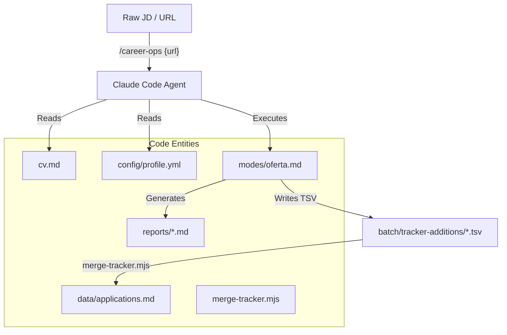
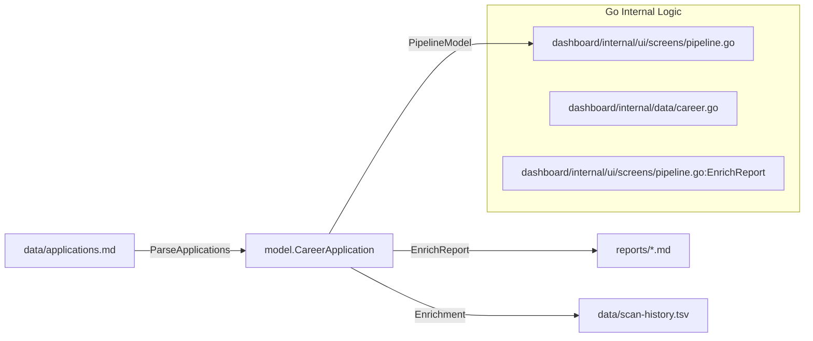

# Glossary

Relevant source files

The following files were used as context for generating this wiki page:

- [AGENTS.md](AGENTS.md)
- [DATA_CONTRACT.md](DATA_CONTRACT.md)
- [README.es.md](README.es.md)
- [README.md](README.md)
- [config/profile.example.yml](config/profile.example.yml)
- [dashboard/internal/data/career.go](dashboard/internal/data/career.go)
- [dashboard/internal/data/career_test.go](dashboard/internal/data/career_test.go)
- [dashboard/internal/ui/screens/pipeline.go](dashboard/internal/ui/screens/pipeline.go)
- [dashboard/internal/ui/screens/pipeline_test.go](dashboard/internal/ui/screens/pipeline_test.go)
- [dedup-tracker.mjs](dedup-tracker.mjs)
- [merge-tracker.mjs](merge-tracker.mjs)
- [modes/_shared.md](modes/_shared.md)
- [modes/auto-pipeline.md](modes/auto-pipeline.md)
- [modes/pdf.md](modes/pdf.md)
- [modes/scan.md](modes/scan.md)
- [modes/tr/README.md](modes/tr/README.md)
- [modes/tr/_shared.md](modes/tr/_shared.md)
- [modes/tr/basvuru.md](modes/tr/basvuru.md)
- [modes/tr/is-ilani.md](modes/tr/is-ilani.md)
- [modes/tr/pipeline.md](modes/tr/pipeline.md)
- [normalize-statuses.mjs](normalize-statuses.mjs)
- [scan.mjs](scan.mjs)
- [templates/cv-template.html](templates/cv-template.html)
- [templates/portals.example.yml](templates/portals.example.yml)
- [templates/states.yml](templates/states.yml)
- [update-system.mjs](update-system.mjs)
- [verify-pipeline.mjs](verify-pipeline.mjs)
- [writing-samples/README.md](writing-samples/README.md)

This page provides a technical reference for domain-specific terms, abbreviations, and architectural concepts used within the `career-ops` codebase. It serves as an onboarding map for engineers to locate specific logic and data structures.

## Core System Concepts

### Archetype
A classification system used to categorize job offers into one of several predefined career profiles (e.g., AI Platform/LLMOps, Agentic/Automation, Technical AI PM, Solutions Architect). This classification influences the scoring weights, CV tailoring strategy, and interview story selection.
*   **Implementation**: Defined in `modes/_shared.md` and detected during the initial phase of an evaluation.
*   **Data Flow**: Detected during the first step of an evaluation to load specific proof points from `_profile.md`.
*   **Sources**: [modes/_shared.md:74-88](), [modes/oferta.md:5-10]()

### A-F Evaluation
The standardized 6-block reporting structure generated by the AI for every job description.
*   **Block A**: Role Summary (Metadata, TL;DR, Remote status, Legitimacy tier).
*   **Block B**: CV Match (Requirement mapping and gap mitigation).
*   **Block C**: Level Strategy (Seniority positioning and archetype fit).
*   **Block D**: Comp & Demand (Market research and salary targets).
*   **Block E**: Personalization Plan (Specific CV/LinkedIn edits and keyword injection).
*   **Block F**: Interview Prep (STAR+R stories and technical challenges).
*   **Sources**: [modes/oferta.md:12-88](), [README.md:68-72](), [modes/_shared.md:27-46]()

### STAR+R
An extension of the STAR (Situation, Task, Action, Result) interview technique that adds **Reflection**. The system uses this to signal seniority by extracting lessons learned, architectural trade-offs, or impact analysis from past experiences.
*   **Sources**: [modes/oferta.md:67-75](), [README.md:72-72](), [modes/_shared.md:65-66]()

---

## Data Entities & Files

| Term | File Path | Description |
| :--- | :--- | :--- |
| **Application Tracker** | `data/applications.md` | The flat-file Markdown database containing the history of all evaluations and their statuses. |
| **Story Bank** | `interview-prep/story-bank.md` | A persistent repository of STAR+R stories that accumulates new entries during every high-score evaluation. |
| **Scan History** | `data/scan-history.tsv` | A deduplication log used by the portal scanner to avoid re-processing the same job URLs. |
| **Profile Config** | `config/profile.yml` | User-specific identity data (name, target roles, salary range) used to hydrate prompts. |
| **Portals Config** | `portals.yml` | Configuration for the scanner, including 3-level discovery strategies (Playwright, API, WebSearch). |
| **Data Contract** | `DATA_CONTRACT.md` | Specification separating the "System Layer" (updatable) from the "User Layer" (protected). |

**Sources**: [DATA_CONTRACT.md:5-24](), [README.md:151-164](), [update-system.mjs:92-105]()

---

## Technical Workflows

### 1. Evaluation Pipeline
The transition from a raw Job Description (JD) to a structured report and tracker entry.

**Natural Language to Code Entity Space: Evaluation**

**Sources**: [modes/oferta.md:92-158](), [README.md:102-120](), [modes/_shared.md:115-116](), [merge-tracker.mjs:1-15]()

### 2. Data Integrity & Maintenance
Scripts used to keep the `applications.md` file consistent, deduplicated, and synchronized with batch results.

*   **Merge**: `merge-tracker.mjs` ingests TSV files from `batch/tracker-additions/` and handles fuzzy role matching to prevent duplicates. [merge-tracker.mjs:1-15]()
*   **Dedup**: `dedup-tracker.mjs` removes redundant entries by grouping by normalized company name and keeping the highest score. It also handles status promotion (e.g., keeping "Applied" over "Evaluated"). [merge-tracker.mjs:130-151]()
*   **Normalize**: `normalize-statuses.mjs` ensures all application states match the canonical IDs, strips markdown bolding, and moves notes. [merge-tracker.mjs:39-68]()
*   **Verify**: `verify-pipeline.mjs` runs a health check on the entire pipeline (broken links, non-canonical states, formatting errors). [update-system.mjs:59-60]()

---

## Dashboard Terms (Go TUI)

### PipelineModel
The primary data structure in the Go dashboard (`dashboard/internal/ui/screens/pipeline.go`) that manages the state of the TUI, including filtering, sorting, and lazy-loading of report summaries.
*   **Sources**: [dashboard/internal/ui/screens/pipeline.go:102-121]()

### Report Enrichment
The process of lazy-loading metadata (Archetype, TL;DR, Remote, Comp) from Markdown reports into the Go TUI's cache to provide instant previews without re-parsing files on every scroll.
*   **Sources**: [dashboard/internal/ui/screens/pipeline.go:166-173]()

**Natural Language to Code Entity Space: Dashboard Data Flow**

**Sources**: [dashboard/internal/ui/screens/pipeline.go:124-139](), [dashboard/internal/ui/screens/pipeline.go:166-173](), [dashboard/internal/ui/screens/pipeline_test.go:26-51]()

---

## Canonical Application States

The system enforces a strict state machine for applications to ensure consistency between the Node.js scripts and the Go Dashboard.

| State ID | Label | Description |
| :--- | :--- | :--- |
| `evaluated` | Evaluated | Initial state after AI analysis. |
| `applied` | Applied | Application submitted to company. |
| `responded` | Responded | Recruiter or automated response received. |
| `interview` | Interview | Active interview stages. |
| `offer` | Offer | Financial offer received. |
| `rejected` | Rejected | Terminal state (Company side). |
| `discarded` | Discarded | Terminal state (Candidate side). |
| `skip` | SKIP | Filtered out by candidate or AI. |

**Sources**: [merge-tracker.mjs:37-37](), [dashboard/internal/ui/screens/pipeline.go:96-99](), [templates/states.yml:1-10]()
