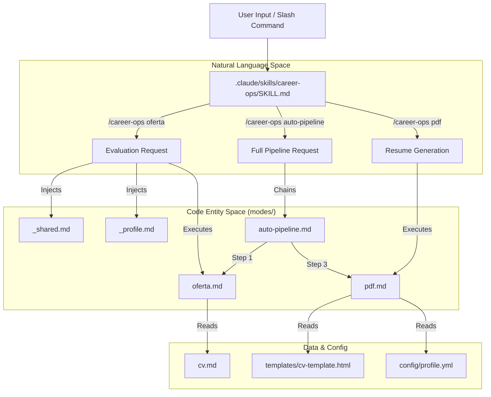
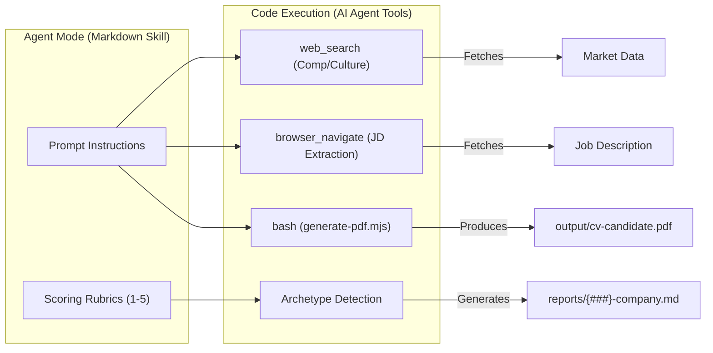

# AI Agent Modes

Relevant source files

The following files were used as context for generating this wiki page:

- [AGENTS.md](AGENTS.md)
- [config/profile.example.yml](config/profile.example.yml)
- [interview-prep/story-bank.md](interview-prep/story-bank.md)
- [modes/_shared.md](modes/_shared.md)
- [modes/auto-pipeline.md](modes/auto-pipeline.md)
- [modes/oferta.md](modes/oferta.md)
- [modes/pdf.md](modes/pdf.md)
- [modes/tr/README.md](modes/tr/README.md)
- [modes/tr/_shared.md](modes/tr/_shared.md)
- [modes/tr/basvuru.md](modes/tr/basvuru.md)
- [modes/tr/is-ilani.md](modes/tr/is-ilani.md)
- [modes/tr/pipeline.md](modes/tr/pipeline.md)
- [templates/cv-template.html](templates/cv-template.html)

The `career-ops` system is driven by a collection of "Skill Modes" defined as Markdown files in the `modes/` directory. These files serve as the "brain" for the AI agent, providing specific instructions, evaluation rubrics, and behavioral guidelines for every sub-command in the `/career-ops` suite [AGENTS.md:45-48]().

By separating logic into these Markdown skills, the system allows for deep customization of the agent's behavior—from how it scores a job match to how it drafts LinkedIn outreach—without changing the underlying execution engine.

### The Skill Architecture

When a user invokes a command (e.g., `/career-ops scan`), the agent router identifies the requested mode and loads the corresponding context. The architecture follows a "Shared + Specific" pattern to maintain consistency while allowing for task-specific flexibility.

1.  **Shared Context (`_shared.md`)**: Injected into most modes to provide the "Source of Truth" regarding system rules, scoring logic, and tool configuration [modes/_shared.md:1-10]().
2.  **User Profile (`_profile.md`)**: A user-layer file (copied from `modes/_profile.template.md` during onboarding) that overrides defaults in `_shared.md` with personal archetypes, narrative, and negotiation scripts [AGENTS.md:78-81](), [modes/_shared.md:18-23]().
3.  **Mode-Specific Logic**: The individual `.md` file for the command (e.g., `oferta.md`, `pdf.md`) which contains the specific prompt engineering for that task.

**Sources:** [AGENTS.md:11-23](), [modes/_shared.md:1-24]()

---

### The Shared Context Layer (`_shared.md`)

The `modes/_shared.md` file is the foundational layer for the agent's reasoning. It ensures that whether the agent is evaluating a job or drafting a message, it maintains a consistent "North Star."

*   **Archetype Detection**: Defines specific roles (e.g., "AI Platform / LLMOps", "Agentic / Automation", "Technical AI PM") and the key signals the agent should look for in a Job Description (JD) [modes/_shared.md:74-86]().
*   **Scoring System**: Establishes the 6-block (A-F) evaluation rubric, measuring CV Match, North Star alignment, Compensation, Cultural signals, and Red flags [modes/_shared.md:26-38]().
*   **Source of Truth**: Enforces a strict rule that the agent must read `cv.md`, `config/profile.yml`, and `article-digest.md` at evaluation time rather than relying on hardcoded metrics [modes/_shared.md:11-22]().
*   **Posting Legitimacy (Block G)**: Provides a framework for assessing if a job is real or a "ghost job" based on posting age, tech specificity, and recent layoff news [modes/_shared.md:46-67]().

**Sources:** [modes/_shared.md:1-115]()

---

### Mode Groups

The various modes are categorized by their role in the job search lifecycle. Detailed technical documentation for each group is available in the child pages linked below.

#### [2.1 Evaluation Modes (oferta, ofertas, auto-pipeline)](#)
These modes handle the ingestion and analysis of Job Descriptions. They use a standardized 6-block (A-F) evaluation structure and include a "Block G" for assessing posting legitimacy [modes/oferta.md:1-4](). `auto-pipeline.md` defines the sequence for full automatic processing from URL to PDF [modes/auto-pipeline.md:1-4]().
*   **Key Entities**: `modes/oferta.md`, `modes/auto-pipeline.md`, `reports/`.
*   For details, see [Evaluation Modes (oferta, ofertas, auto-pipeline)](#2.1).

#### [2.2 Discovery & Pipeline Modes (scan, pipeline)](#)
Focused on finding new opportunities. The `scan` mode hits ATS APIs directly via `scan.mjs` [AGENTS.md:67-67](), while `pipeline` processes URLs queued in `data/pipeline.md` [modes/tr/pipeline.md:1-3]().
*   **Key Entities**: `scan.mjs`, `portals.yml`, `data/pipeline.md`, `data/scan-history.tsv`.
*   For details, see [Discovery & Pipeline Modes (scan, pipeline)](#2.2).

#### [2.3 Application & Outreach Modes (apply, contacto, tracker, followup)](#)
Assists with the active phase of the search. Includes `apply` (or `basvuru.md` in Turkish) for live form-filling [modes/tr/basvuru.md:1-3](), and `pdf.md` for generating ATS-optimized resumes using `generate-pdf.mjs` [modes/pdf.md:1-22]().
*   **Key Entities**: `modes/pdf.md`, `generate-pdf.mjs`, `data/applications.md`, `followup-cadence.mjs`.
*   For details, see [Application & Outreach Modes (apply, contacto, tracker, followup)](#2.3).

#### [2.4 Career Development Modes (deep, training, project, patterns)](#)
Supporting modes for long-term growth. `deep` performs research for interview intelligence, while `analyze-patterns.mjs` processes rejection data to identify tech stack gaps [AGENTS.md:64-65]().
*   **Key Entities**: `interview-prep/story-bank.md`, `analyze-patterns.mjs`, `followup-cadence.mjs`.
*   For details, see [Career Development Modes (deep, training, project, patterns)](#2.4).

#### [2.5 Internationalization (i18n Modes)](#)
Localized subdirectories (e.g., `modes/tr/`, `modes/ja/`) that adapt evaluation and application logic for specific regional markets, legal frameworks (e.g., SGK, TÜFE in Turkey), and languages [modes/tr/README.md:1-15]().
*   For details, see [Internationalization (i18n Modes)](#2.5).

---

### Agent Mode Flow

The following diagrams illustrate how the system bridges Natural Language requests to the specific Code Entities (Markdown skills) and tools that govern the agent's behavior.

**System Mode Routing & Context Bridge**

**Sources:** [modes/_shared.md:11-23](), [modes/auto-pipeline.md:1-35](), [modes/pdf.md:1-22]()

**Agent Interaction & Tool Usage**

**Sources:** [modes/_shared.md:118-129](), [modes/pdf.md:19-22](), [modes/oferta.md:149-153]()

**Sources:** [AGENTS.md:1-81](), [modes/_shared.md:1-115](), [modes/pdf.md:1-94](), [modes/auto-pipeline.md:1-76]()
