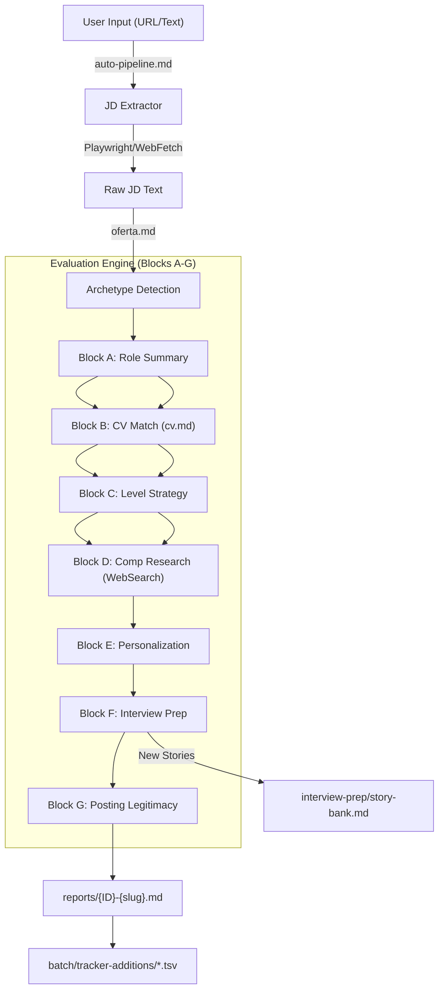
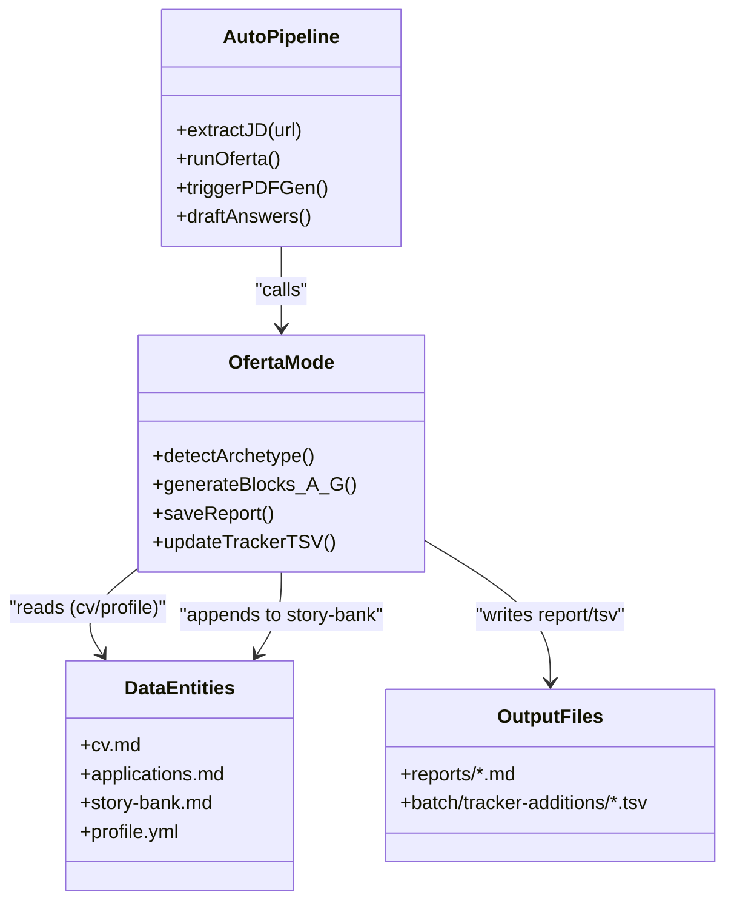

# Evaluation Modes (oferta, ofertas, auto-pipeline)

Relevant source files

The following files were used as context for generating this wiki page:

- [.env.example](.env.example)
- [config/profile.example.yml](config/profile.example.yml)
- [gemini-eval.mjs](gemini-eval.mjs)
- [interview-prep/story-bank.md](interview-prep/story-bank.md)
- [modes/_shared.md](modes/_shared.md)
- [modes/auto-pipeline.md](modes/auto-pipeline.md)
- [modes/oferta.md](modes/oferta.md)
- [modes/ofertas.md](modes/ofertas.md)
- [modes/pdf.md](modes/pdf.md)
- [templates/cv-template.html](templates/cv-template.html)

This page provides a technical deep dive into the core evaluation engine of `career-ops`. These modes transform raw job descriptions (JDs) into structured, actionable intelligence by mapping them against the candidate's profile, calculating strategic alignment, and preparing interview collateral.

## The Evaluation Workflow

The evaluation process is designed to be deterministic and comprehensive, moving from initial ingestion to long-term tracking. The system supports single-offer deep dives (`oferta`), comparative analysis (`ofertas`), and a fully automated end-to-end execution (`auto-pipeline`).

### Data Flow Overview

The following diagram illustrates how a Job Description is processed through the system entities, moving from raw input to structured reports and long-term storage.

**Diagram: JD Ingestion to Report Generation**

**Sources:** [modes/oferta.md:3-90](), [modes/auto-pipeline.md:3-23](), [modes/oferta.md:141-158](), [modes/_shared.md:115-115]()

---

## 1. Core Evaluation: `modo: oferta`

The `oferta` mode is the atomic unit of evaluation. It follows a strict 7-block structure (A-G) to ensure no strategic dimension is overlooked.

### Step 0: Archetype Detection
Before the evaluation begins, the agent classifies the role into one of the canonical archetypes defined in `_shared.md`. This classification acts as a "strategy filter" that changes how subsequent blocks are prioritized.
*   **AI Platform / LLMOps:** Focuses on observability, reliability, and pipelines [modes/_shared.md:80-80]().
*   **Agentic / Automation:** Prioritizes orchestration, HITL, and multi-agent systems [modes/_shared.md:81-81]().
*   **Technical AI PM:** Prioritizes product discovery, roadmaps, and metrics [modes/oferta.md:30-30]().
*   **AI Solutions Architect:** Focuses on system design and enterprise integrations [modes/oferta.md:29-29]().
*   **AI Forward Deployed:** Prioritizes delivery speed and client-facing prototyping [modes/oferta.md:28-28]().
*   **AI Transformation:** Focuses on change management and organizational adoption [modes/oferta.md:33-33]().

**Sources:** [modes/oferta.md:5-10](), [modes/_shared.md:74-87]()

### The 7-Block Structure

| Block | Name | Technical Implementation |
| :--- | :--- | :--- |
| **A** | **Role Summary** | Extracts metadata (Seniority, Remote, Team size) and a 1-sentence TL;DR [modes/oferta.md:12-21](). |
| **B** | **CV Match** | Maps JD requirements to exact lines in `cv.md`. Identifies **Gaps** with mitigation plans [modes/oferta.md:23-40](). |
| **C** | **Level Strategy** | JD level vs. natural level. "Sell Senior without Lying" scripts and "Downlevel" negotiation plans [modes/oferta.md:41-46](). |
| **D** | **Comp & Demand** | Executes `WebSearch` (Glassdoor, Levels.fyi) to find real-time salary data and demand trends [modes/oferta.md:47-54](). |
| **E** | **Personalization** | Top 5 changes for CV and LinkedIn to maximize match for the specific archetype [modes/oferta.md:56-64](). |
| **F** | **Interview Prep** | Generates 6-10 **STAR+R** stories. The **R (Reflection)** signals seniority [modes/oferta.md:65-87](). |
| **G** | **Posting Legitimacy** | Qualitative assessment of "Ghost Job" signals (Freshness, JD quality, Layoff news) [modes/oferta.md:88-143](). |

**Sources:** [modes/oferta.md:12-143](), [modes/_shared.md:28-71]()

---

## 2. Automation: `modo: auto-pipeline`

The `auto-pipeline` mode chains the evaluation with utility scripts to provide a zero-touch experience from URL to PDF.

### JD Extraction Strategy
When a URL is provided, the system follows a prioritized extraction hierarchy:
1.  **Playwright (`browser_navigate` + `browser_snapshot`):** Used for SPAs like Lever, Greenhouse, or Workday [modes/auto-pipeline.md:11-11]().
2.  **WebFetch:** Fallback for static HTML pages [modes/auto-pipeline.md:12-12]().
3.  **WebSearch:** Last resort to find the JD on secondary indexers [modes/auto-pipeline.md:13-13]().

### Post-Evaluation Automation
If the calculated score is **>= 4.5**, the pipeline triggers an additional step: **Draft Application Answers**.
*   It generates answers based on a "I'm choosing you" tone: confident, selective, and specific [modes/auto-pipeline.md:53-61]().
*   It uses a specific framework for common questions (Why this role? Why this company?) [modes/auto-pipeline.md:62-68]().
*   It saves these drafts in Section H of the report [modes/auto-pipeline.md:41-41]().

**Sources:** [modes/auto-pipeline.md:5-17](), [modes/auto-pipeline.md:35-68]()

---

## 3. Comparative Analysis: `modo: ofertas`

This mode handles multi-offer scenarios using a weighted scoring matrix across 10 dimensions to help candidates prioritize applications.

| Dimension | Weight | Key Metric |
| :--- | :--- | :--- |
| North Star Alignment | 25% | Alignment with target archetypes in `config/profile.yml` [modes/ofertas.md:7-7](). |
| CV Match | 15% | Percentage of requirements met (90%+ = 5) [modes/ofertas.md:8-8](). |
| Level (Senior+) | 15% | Staff+ (5) down to Junior (1) [modes/ofertas.md:9-9](). |
| Estimated Comp | 10% | Salary vs. market quartile [modes/ofertas.md:10-10](). |
| Remote Quality | 5% | Full remote async (5) vs Onsite (1) [modes/ofertas.md:12-12](). |

**Sources:** [modes/ofertas.md:3-19]()

---

## 4. Technical Persistence & State

After evaluation, the system ensures data integrity by updating primary files and registers.

### Logic Flow: Entity Association
This diagram shows how the system names in the Markdown modes map to the file structure and data entities.

**Diagram: System Entity Mapping**

**Sources:** [modes/oferta.md:147-158](), [modes/auto-pipeline.md:19-76](), [modes/_shared.md:11-22](), [modes/_shared.md:115-115]()

### Implementation Details
*   **Story Bank Integration:** Block F checks `interview-prep/story-bank.md`. If a story is new, it is appended to the bank to build a reusable repository [modes/oferta.md:74-75](), [interview-prep/story-bank.md:1-12]().
*   **Tracker Safety:** Agents NEVER edit `applications.md` directly. They write TSV files to `batch/tracker-additions/` for later merging by `merge-tracker.mjs` [modes/_shared.md:115-115]().
*   **Gemini Alternative:** For users without Claude access, `gemini-eval.mjs` provides a free-tier alternative that replicates the `oferta` logic by reading `modes/oferta.md` and `modes/_shared.md` [gemini-eval.mjs:3-8](), [gemini-eval.mjs:188-192]().

**Sources:** [modes/oferta.md:74-75](), [modes/_shared.md:115-115](), [interview-prep/story-bank.md:1-12](), [gemini-eval.mjs:3-17]()
