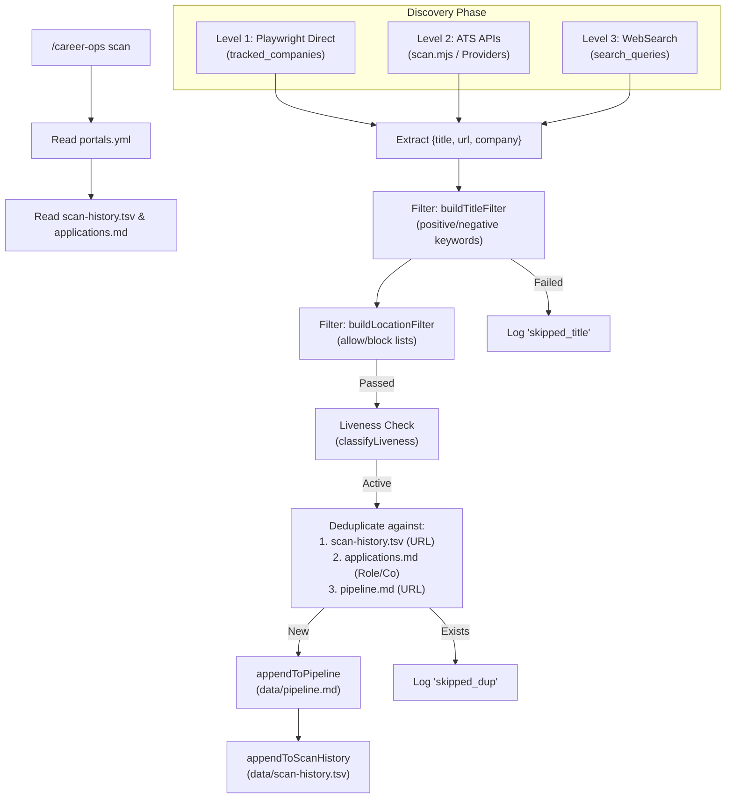
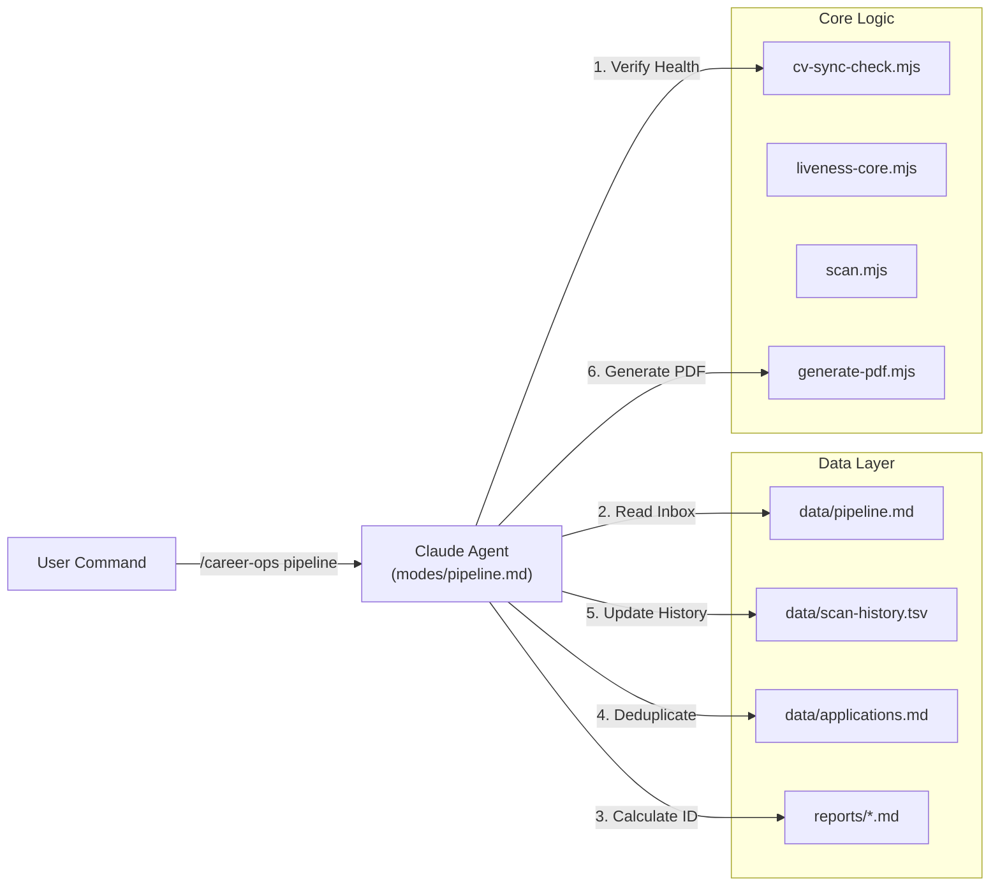

# Discovery & Pipeline Modes (scan, pipeline)

Relevant source files

The following files were used as context for generating this wiki page:

- [check-liveness.mjs](check-liveness.mjs)
- [docs/SETUP.md](docs/SETUP.md)
- [liveness-core.mjs](liveness-core.mjs)
- [modes/apply.md](modes/apply.md)
- [modes/batch.md](modes/batch.md)
- [modes/pipeline.md](modes/pipeline.md)
- [modes/scan.md](modes/scan.md)
- [modes/tracker.md](modes/tracker.md)
- [providers/_http.mjs](providers/_http.mjs)
- [providers/_types.js](providers/_types.js)
- [providers/ashby.mjs](providers/ashby.mjs)
- [providers/greenhouse.mjs](providers/greenhouse.mjs)
- [providers/lever.mjs](providers/lever.mjs)
- [scan.mjs](scan.mjs)
- [templates/portals.example.yml](templates/portals.example.yml)
- [test-all.mjs](test-all.mjs)

This page covers the discovery and ingestion engine of `career-ops`. It details how the system identifies new job opportunities via the portal scanner and how it processes queued URLs through the pipeline inbox.

## 1. Portal Scanner (scan mode)

The `scan` mode is responsible for discovering new job postings across various platforms and adding them to the evaluation queue. It implements a multi-tiered discovery strategy to balance speed, reliability, and breadth. While the logic is defined in `modes/scan.md`, the high-performance implementation for API-based discovery is handled by `scan.mjs` [scan.mjs:3-10]().

### 1.1 Discovery Strategy (3 Levels)

The scanner operates on three levels of depth, executing them additively and deduplicating the results.

| Level | Method | Primary Tool | Description |
| :--- | :--- | :--- | :--- |
| **Level 1** | **Direct Navigation** | Playwright | Navigates to `careers_url` for companies in `tracked_companies`. Most reliable for SPAs (Ashby, Lever, Workday) [modes/scan.md:28-36](). |
| **Level 2** | **ATS APIs / Feeds** | `scan.mjs` / Plugins | Queries structured APIs (Greenhouse, Ashby, Lever, Workday, BambooHR). Faster and zero-token [modes/scan.md:38-57](), [scan.mjs:3-20](). |
| **Level 3** | **WebSearch Queries** | WebSearch | Uses `site:` filters across job boards to discover roles in companies not yet tracked [modes/scan.md:58-65](). |

### 1.2 Scan Workflow and Data Flow

The scanner follows a strict sequence to ensure data integrity and avoid redundant evaluations.

**Sources:** [modes/scan.md:69-114](), [scan.mjs:106-116](), [scan.mjs:127-139](), [scan.mjs:143-172](), [liveness-core.mjs:49-78]()

### 1.3 Configuration (portals.yml)

The scanner behavior is governed by `portals.yml`. Key components include:
*   **`tracked_companies`**: A list of specific organizations to monitor. Each entry should ideally have a `careers_url` [templates/portals.example.yml:9-13]().
*   **`provider`**: Optional field to force the use of specific API parsers (e.g., `greenhouse`, `ashby`, `lever`) [scan.mjs:85-90](), [providers/_types.js:35-35]().
*   **`title_filter`**: Contains `positive` (required), `negative` (forbidden), and `seniority_boost` (priority) keywords [templates/portals.example.yml:60-134]().
*   **`location_filter`**: Optional block to `allow` or `block` specific geographies [templates/portals.example.yml:37-54]().
*   **`search_queries`**: Broad queries using `site:ashbyhq.com`, `site:greenhouse.io`, etc. [templates/portals.example.yml:140-212]().

### 1.4 Liveness Verification

The system performs a liveness check to ensure job postings are still active before processing. This is critical for WebSearch results which may be stale [modes/scan.md:115-117]().

*   **Active**: Visible apply controls (e.g., "Apply", "Bewerben", "Postuler") and sufficient content length [liveness-core.mjs:28-37](), [liveness-core.mjs:64-66]().
*   **Expired**: Matches patterns like "job no longer available" or "applications have closed" [liveness-core.mjs:1-17]().
*   **Uncertain**: Content is present but no clear apply button is found [liveness-core.mjs:77-77]().

**Sources:** [liveness-core.mjs:1-79](), [check-liveness.mjs:21-69]()

---

## 2. Pipeline Inbox (pipeline mode)

The `pipeline` mode acts as a "Second Brain" inbox. It processes URLs accumulated in `data/pipeline.md`, typically populated by the `scan` mode or manually by the user [modes/pipeline.md:1-3]().

### 2.1 Processing Logic

When `/career-ops pipeline` is executed, the agent performs the following steps:

1.  **Sync Check**: Runs `node cv-sync-check.mjs` to ensure the CV and profile are up to date [modes/pipeline.md:53-57]().
2.  **Queue Parsing**: Reads `data/pipeline.md` and identifies items marked as `[ ]` in the "Pending" section [modes/pipeline.md:7-7]().
3.  **Sequential Numbering**: Calculates the next `REPORT_NUM` by scanning the `reports/` directory for the highest existing prefix [modes/pipeline.md:45-49]().
4.  **JD Extraction**: Uses a tiered approach for fetching Job Descriptions:
    *   **Playwright**: `browser_navigate` + `browser_snapshot` (supports SPAs) [modes/pipeline.md:36-36]().
    *   **Local Files**: If a URL has a `local:` prefix, it reads from the local filesystem (e.g., `local:jds/pm-role.md`) [modes/pipeline.md:43-43]().
5.  **Execution**: Runs the full `auto-pipeline` (Evaluation A-F → Report .md → PDF → Tracker) [modes/pipeline.md:12-12]().
6.  **State Transition**: Moves the item from "Pending" to "Processed", appending metadata like Score and PDF status [modes/pipeline.md:13-13]().

### 2.2 System Interaction Diagram

This diagram maps the natural language commands to the underlying file structures and script entities.

**Sources:** [modes/pipeline.md:5-14](), [scan.mjs:143-172](), [scan.mjs:192-210](), [test-all.mjs:63-83]()

### 2.3 File Format: pipeline.md

The `data/pipeline.md` file uses standard Markdown task lists to track state.

| Marker | Meaning | Action |
| :--- | :--- | :--- |
| `[ ]` | Pending | To be processed in the next run [modes/pipeline.md:7-7](). |
| `[x]` | Processed | Completed; includes Report ID, Company, Role, and Score [modes/pipeline.md:30-31](). |
| `[!]` | Error | Failed (e.g., login required or 404); requires manual intervention [modes/pipeline.md:27-27](). |

**Sources:** [modes/pipeline.md:21-32]()
